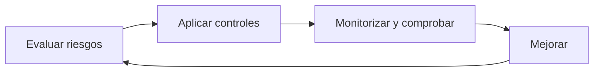
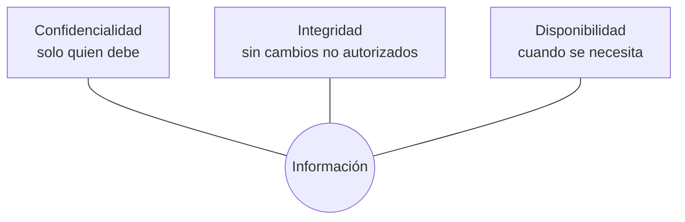
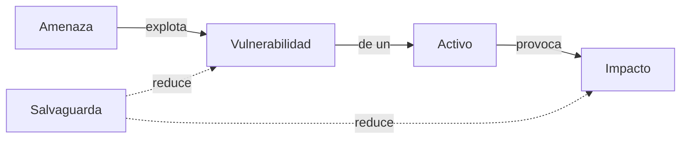
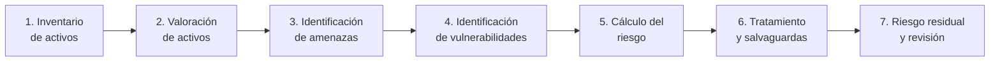
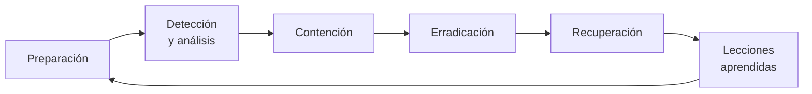
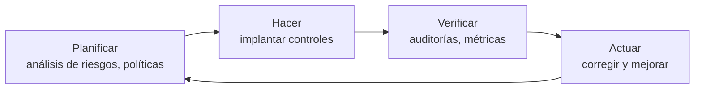

# UD01 · Introducción a la seguridad informática, gestión de riesgos y marco legal

Conceptos fundamentales para comprender, analizar y gestionar la seguridad de los sistemas de información: principios, activos, amenazas, vulnerabilidades, riesgos, autenticación, incidentes, análisis forense y marco legal.



| Bloque | Horas |
|---|--:|
| Teoría (este documento) | 7 h |
| [Prácticas](/ud01/ud01-practicas/) | 5 h |
| Evaluación | 2 h |
| **Total** | **14 h** |

## 1. Introducción

La información es uno de los activos más valiosos de cualquier organización. Una clínica veterinaria guarda los historiales de sus clientes; una tienda en línea, los pedidos y los datos de pago; un instituto, las calificaciones del alumnado. Todos dependen de ordenadores, servidores, redes y servicios en Internet para trabajar.

Cuando algo falla, las consecuencias pueden ser graves:

| Incidente | Consecuencia directa | Consecuencia indirecta |
| --- | --- | --- |
| Un disco del servidor se avería y no hay copia | Pérdida de datos | Horas de trabajo perdidas, clientes insatisfechos |
| Un empleado abre un adjunto con *ransomware* | Ficheros cifrados, servicio parado | Pérdida económica, posible sanción por la AEPD |
| Se filtra la base de datos de clientes | Datos personales expuestos | Daño reputacional, obligación legal de notificar |
| Un ataque DDoS tumba la web en Black Friday | Ventas perdidas | Los clientes se van a la competencia |

La **seguridad informática** es el conjunto de técnicas, procedimientos, herramientas y medidas organizativas destinadas a proteger los sistemas de información frente a amenazas, de forma que la información siga siendo **confidencial**, **íntegra** y **disponible**.

Hay dos ideas que acompañarán todo el módulo:

1. **La seguridad absoluta no existe.** Todo sistema tiene software con errores, personas que se equivocan y proveedores que fallan. El objetivo es reducir el riesgo hasta un nivel **aceptable** y con un coste **proporcionado**.
2. **La seguridad es un proceso, no un producto.** Instalar un antivirus o un cortafuegos no hace segura una organización. Se necesita un ciclo continuo de *evaluar → proteger → comprobar → mejorar*.




*Figura 1. La seguridad protege información, sistemas, redes y personas mediante controles coordinados.*

## 2. Objetivos

Al finalizar esta unidad serás capaz de:

- Explicar los principios de la seguridad de la información (CIA, autenticidad, trazabilidad y no repudio) con ejemplos reales.
- Diferenciar **activo**, **amenaza**, **vulnerabilidad**, **riesgo**, **impacto** y **salvaguarda**.
- Distinguir la seguridad **física** de la **lógica**, y la **activa** de la **pasiva**.
- Clasificar vulnerabilidades por su tipología y su origen, e interpretar identificadores **CVE** y puntuaciones **CVSS**.
- Reconocer los ataques más habituales: *malware*, ingeniería social, *phishing*, fuerza bruta y denegación de servicio.
- Diseñar una **política de contraseñas** actual y valorar los sistemas **biométricos** y la **autenticación multifactor**.
- Realizar un **análisis de riesgos** básico.
- Identificar las **fases de gestión de un incidente** y del **análisis forense**.
- Conocer la **legislación** y las **normas** sobre seguridad y protección de datos aplicables en España.

---

<!-- enr:u1a -->

*Figura 1.1. Los tres pilares de la seguridad de la información. Cada medida de seguridad protege, sobre todo, uno de ellos.*

> [!TIP]
> **Truco para recordarlo:** ante cualquier incidente pregúntate «¿qué ha fallado: que alguien *lo ha visto* (C), que alguien *lo ha cambiado* (I) o que *ya no se puede usar* (D)?». Un mismo incidente puede afectar a varios a la vez.

## 3. Seguridad informática y seguridad de la información

Aunque a menudo se usan como sinónimos, conviene distinguirlos:

| Concepto | Qué protege | Ejemplo |
| --- | --- | --- |
| **Seguridad informática** | Los sistemas: equipos, redes, software, servicios | Configurar un cortafuegos en el servidor web |
| **Seguridad de la información** | La información, **en cualquier formato** | Destruir con trituradora los contratos en papel |
| **Ciberseguridad** | Sistemas e información frente a amenazas que llegan a través del ciberespacio | Detectar un ataque de fuerza bruta contra el servicio SSH |

La información puede estar en muchos estados y en todos ellos debe protegerse:

| Estado | Ejemplo | Medida típica |
| --- | --- | --- |
| **En reposo** (*at rest*) | Base de datos en un disco, copia de seguridad en un NAS | Cifrado de disco, permisos, copias |
| **En tránsito** (*in transit*) | Formulario web enviado al servidor | TLS/HTTPS, VPN |
| **En uso** (*in use*) | Datos cargados en la memoria RAM mientras se procesan | Control de procesos, aislamiento, mínimo privilegio |

---

## 4. Principios de la seguridad


*Figura 2. La protección debe abarcar la infraestructura, los servicios y la información que alojan.*

Los tres principios clásicos forman la **tríada CIA** (*Confidentiality, Integrity, Availability*). A ellos se añaden otros tres que se usan mucho en la práctica y en el Esquema Nacional de Seguridad: **autenticidad**, **trazabilidad** y **no repudio**.



### 4.1. Confidencialidad

La **confidencialidad** garantiza que la información solo pueda ser consultada por las personas, procesos o sistemas **autorizados**.

**Ejemplo.** Las nóminas deben poder verlas el personal de Recursos Humanos, pero no el de mantenimiento.

En Linux, el mecanismo más básico de confidencialidad son los **permisos** de los ficheros. Observa este ejemplo:

```bash
# Creamos un fichero con datos de nóminas
echo "Ana García;2.150 €" > nominas.csv

# Vemos sus permisos actuales
ls -l nominas.csv
# -rw-r--r-- 1 ana ana 21 oct  6 10:00 nominas.csv
#  ^^^ ^^^ ^^^
#  |   |   └── otros usuarios: pueden LEER  -> ¡problema de confidencialidad!
#  |   └────── grupo: puede leer
#  └────────── propietario: lee y escribe

# Dejamos el fichero accesible solo para su propietario
chmod 600 nominas.csv
ls -l nominas.csv
# -rw------- 1 ana ana 21 oct  6 10:00 nominas.csv
```

- `ls -l` muestra el listado largo, con los permisos en la primera columna.
- `chmod 600` asigna lectura y escritura (6 = 4 + 2) al propietario y ningún permiso (0) al grupo ni a otros.

Otras medidas de confidencialidad: cifrado (UD03), control de acceso, autenticación multifactor, segmentación de red (UD06), clasificación de la información y acuerdos de confidencialidad con el personal.

### 4.2. Integridad

La **integridad** garantiza que la información no ha sido **modificada** de forma no autorizada (ni por un atacante ni por un error) y, si lo ha sido, que podemos **detectarlo**.

**Ejemplo.** En una base de datos aparece `Saldo = 1.500 €`. Un atacante no debe poder cambiarlo a `Saldo = 15.000 €` sin que el sistema lo detecte.

La herramienta básica para comprobar la integridad es una **función hash**, que se estudia en profundidad en la UD03. Un hash es una «huella digital» del fichero: si cambia un solo bit del contenido, la huella cambia completamente.

```bash
# Creamos el fichero original y calculamos su huella SHA-256
echo "Saldo = 1.500 €" > cuenta.txt
sha256sum cuenta.txt > cuenta.sha256
cat cuenta.sha256
# 5f1c...e8a2  cuenta.txt

# Comprobación: el fichero no ha cambiado
sha256sum -c cuenta.sha256
# cuenta.txt: La suma coincide

# Un «atacante» añade un cero
sed -i 's/1.500/15.000/' cuenta.txt

# Volvemos a comprobar
sha256sum -c cuenta.sha256
# cuenta.txt: FALLÓ
# sha256sum: AVISO: 1 suma de verificación calculada NO coincide
```

- `sha256sum` calcula la huella SHA-256 del fichero.
- La opción `-c` (*check*) lee un fichero de huellas y comprueba si coinciden con el contenido actual.

> [!NOTE]
> El hash **detecta** la modificación, pero no la **impide**. Para impedirla se combinan permisos, control de acceso y registros de auditoría. Para saber además **quién** generó la huella se usa la firma digital (UD03).

Otras medidas de integridad: firmas digitales, control de versiones (Git), sistemas de detección de cambios en ficheros (AIDE, Wazuh), transacciones en bases de datos, RAID con comprobación de paridad.

### 4.3. Disponibilidad

La **disponibilidad** garantiza que los usuarios autorizados pueden acceder a la información y a los servicios **cuando los necesitan**.

Un servidor apagado es muy confidencial (nadie puede leer sus datos)… pero completamente inútil. La disponibilidad es el principio que se trabaja en la UD02 (seguridad pasiva) y en la UD05 (alta disponibilidad).

Un administrador comprueba la disponibilidad de un servicio con órdenes como estas:

```bash
# ¿Cuánto tiempo lleva el sistema encendido y cuál es su carga?
uptime
#  10:15:02 up 41 days,  3:12,  2 users,  load average: 0,08, 0,05, 0,01

# ¿Está activo el servidor web?
systemctl status nginx --no-pager
# ● nginx.service - A high performance web server
#      Active: active (running) since ...

# ¿Responde por la red?
curl -I http://localhost
# HTTP/1.1 200 OK
```

- `uptime` muestra el tiempo que lleva encendido el equipo y la carga media de los últimos 1, 5 y 15 minutos.
- `systemctl status` consulta el estado de un servicio gestionado por **systemd**, el gestor de servicios de la mayoría de distribuciones Linux actuales.
- `curl -I` hace una petición HTTP y muestra solo las cabeceras de la respuesta; `200 OK` indica que el servicio responde.

Medidas de disponibilidad: copias de seguridad, RAID, SAI, redundancia de servidores y enlaces, balanceadores de carga, monitorización y planes de recuperación.

### 4.4. Autenticidad

La **autenticidad** asegura que una entidad (persona, equipo, programa) **es quien dice ser**, y que la información procede de quien dice proceder.

| Se autentica… | Ejemplo |
| --- | --- |
| Una persona | Usuario + contraseña + código del móvil |
| Un servidor | Certificado TLS de `www.agenciatributaria.gob.es` |
| Un equipo | Certificado de máquina en una red con 802.1X |
| Un software | Paquete `.deb` o `.rpm` firmado por la distribución |

No hay que confundir **autenticación** (comprobar la identidad) con **autorización** (decidir qué puede hacer esa identidad). Primero me autentico como `ana`; después el sistema me autoriza a leer `nominas.csv` porque soy su propietaria.

### 4.5. Trazabilidad

La **trazabilidad** permite saber **quién** hizo **qué**, **cuándo** y **desde dónde**. Se consigue con registros (*logs*) fiables, sincronizados en hora y protegidos frente a manipulación.

En Linux, el diario de systemd (**journald**) registra, por ejemplo, todas las órdenes ejecutadas con `sudo`:

```bash
# Mostrar los últimos 5 usos de sudo
sudo journalctl _COMM=sudo -n 5 --no-pager
# oct 06 10:20:11 srv01 sudo[2210]: ana : TTY=pts/0 ; PWD=/home/ana ;
#     USER=root ; COMMAND=/usr/bin/systemctl restart nginx

# Últimos inicios de sesión en el sistema
last -n 5
# ana   pts/0   192.168.100.15  Mon Oct  6 10:18   still logged in
```

- `journalctl` consulta el diario del sistema. El filtro `_COMM=sudo` muestra solo los mensajes generados por el programa `sudo`; `-n 5` limita la salida a las cinco últimas entradas.
- `last` lista los inicios de sesión registrados en `/var/log/wtmp`.

> [!IMPORTANT]
> Sin una hora correcta los registros pierden valor: no se pueden correlacionar eventos de varios equipos. Todos los servidores deben sincronizar su reloj con NTP (`timedatectl` muestra el estado de la sincronización).

### 4.6. No repudio

El **no repudio** impide que alguien pueda **negar** haber realizado una acción. Hay dos variantes:

- **No repudio en origen**: el emisor no puede negar haber enviado un mensaje (por ejemplo, una factura electrónica firmada).
- **No repudio en destino**: el receptor no puede negar haberlo recibido (por ejemplo, un acuse de recibo firmado, como en las notificaciones electrónicas de la Administración).

La tecnología que lo hace posible es la **firma digital** basada en criptografía asimétrica (UD03).

<!-- enr:u1b -->
> [!WARNING]
> **Error muy habitual en los exámenes:** confundir **integridad** con **confidencialidad**. Cifrar un fichero protege la confidencialidad, pero **no impide** que alguien lo borre o lo modifique. Para detectar modificaciones se usan *hashes* y firmas (UD03).

{}
**1.** Un empleado envía por error una nómina a otra persona. ¿Qué principio se ha violado?
**2.** Un ransomware cifra el servidor de ficheros y nadie puede trabajar. ¿Y ahora?
**3.** Un atacante cambia el IBAN de una factura en la base de datos. ¿Y aquí?

**Respuestas:** 1 → confidencialidad. 2 → disponibilidad (y también integridad, porque los ficheros han sido alterados). 3 → integridad.
{}

### 4.7. Ejercicio: identifica el principio

Indica qué principio se ve comprometido en cada caso.

1. Un alumno consigue la contraseña del profesor y consulta las notas.
2. Un virus modifica el fichero `/etc/hosts` para redirigir el tráfico del banco.
3. El servidor de correo se queda sin espacio en disco y deja de recibir mensajes.
4. Un empleado niega haber enviado un correo con información confidencial y no hay forma de demostrar lo contrario.
5. El servidor no guarda registros de quién borró un directorio compartido.

{}
1. Confidencialidad (y autenticidad, porque se suplanta una identidad).
2. Integridad.
3. Disponibilidad.
4. No repudio.
5. Trazabilidad.
{}

---

## 5. Activos, amenazas, vulnerabilidades y riesgos


*Figura 3. El análisis de riesgos permite priorizar la protección de los activos más importantes.*

Estos conceptos son el vocabulario básico del análisis de riesgos. Es fundamental no confundirlos.

| Concepto | Definición | Ejemplo |
| --- | --- | --- |
| **Activo** | Cualquier elemento con valor para la organización | Servidor de base de datos de clientes |
| **Amenaza** | Evento o agente que puede causar daño | Ciberdelincuente que busca robar datos |
| **Vulnerabilidad** | Debilidad que puede ser aprovechada por una amenaza | MariaDB accesible desde Internet con contraseña débil |
| **Exploit** | Técnica o programa que aprovecha una vulnerabilidad concreta | Script que prueba miles de contraseñas |
| **Ataque** | Intento deliberado de materializar una amenaza | Ejecución del script contra el puerto 3306 |
| **Incidente** | Evento que compromete realmente la seguridad | Se accede a la base de datos y se copian los datos |
| **Impacto** | Daño producido por el incidente | 10 000 registros personales filtrados, multa, reputación |
| **Riesgo** | Probabilidad de que una amenaza explote una vulnerabilidad combinada con su impacto | Alto |
| **Salvaguarda o control** | Medida que reduce el riesgo | Cerrar el puerto, contraseña robusta, cortafuegos |



### 5.1. Activos

Un **activo** es cualquier recurso que tiene valor para la organización. La metodología **MAGERIT** (la metodología oficial de análisis de riesgos de la Administración española) los clasifica así:

| Tipo de activo (MAGERIT) | Ejemplos |
| --- | --- |
| Información / datos | Base de datos de clientes, historiales, código fuente |
| Servicios | Web corporativa, correo, ERP |
| Software | Sistema operativo, aplicación de facturación |
| Hardware | Servidores, portátiles, routers, cortafuegos |
| Redes de comunicaciones | Red local, enlace a Internet, Wi-Fi |
| Soportes de información | Discos, cintas, memorias USB, papel |
| Equipamiento auxiliar | SAI, climatización, armarios rack |
| Instalaciones | CPD, oficinas |
| Personas | Administradores, usuarios, proveedores |

No todos los activos valen lo mismo. Para cada uno se valora qué pasaría si perdiese cada propiedad (las **dimensiones** de seguridad: C, I, D, autenticidad y trazabilidad).

**Ejemplo de valoración (escala 0-10):**

| Activo | C | I | D | Comentario |
| --- | :-: | :-: | :-: | --- |
| Base de datos de clientes | 9 | 9 | 7 | Datos personales: la filtración es lo más grave |
| Web corporativa informativa | 2 | 6 | 5 | Es pública; preocupa que la desfiguren |
| Tienda en línea | 8 | 9 | 10 | Si se cae, no hay ventas |
| Impresora de la recepción | 3 | 2 | 3 | Bajo valor, salvo documentos impresos |

### 5.2. Amenazas

Una **amenaza** es cualquier circunstancia o agente con capacidad de causar daño. Se clasifican según su origen:

| Origen | Ejemplos |
| --- | --- |
| **Naturales** | Inundación, incendio forestal, terremoto, tormenta eléctrica |
| **Del entorno / industriales** | Corte eléctrico, fallo de climatización, avería de hardware |
| **Humanas accidentales** | Borrado por error, configuración incorrecta, pérdida de un portátil |
| **Humanas intencionadas** | *Malware*, robo, sabotaje, ataques de red, fraude, empleado descontento |

También se distinguen **amenazas internas** (personal, proveedores con acceso) y **externas**. Las internas son especialmente peligrosas porque el atacante ya tiene acceso y conoce la organización.

### 5.3. Vulnerabilidades

Una **vulnerabilidad** es una debilidad técnica, física, organizativa o humana que puede ser aprovechada. Por sí sola no causa daño, pero abre una puerta.

```text
Servidor Linux
   └── SSH accesible desde Internet (puerto 22)
          └── Usuario "admin" con contraseña "admin123"   ← VULNERABILIDAD
                 └── Bot que prueba contraseñas            ← AMENAZA
                        └── Acceso como "admin"            ← INCIDENTE
```

#### 5.3.1. Clasificación por tipología

| Tipo | Descripción | Ejemplo | Medida principal |
| --- | --- | --- | --- |
| **Software** | Errores de diseño o programación | Inyección SQL en un formulario; OpenSSH vulnerable | Actualizaciones, desarrollo seguro |
| **Configuración** | Ajustes inseguros | Credenciales por defecto, puerto de administración abierto | *Hardening*, revisión periódica |
| **Física** | Protección física insuficiente | CPD sin cerradura, portátil sin cifrar | Control de acceso físico, cifrado |
| **Red** | Protocolos o diseño de red débiles | Wi-Fi con WEP, Telnet, red plana sin segmentar | Protocolos seguros, VLAN, cortafuegos |
| **Hardware / firmware** | Fallos en componentes | Spectre/Meltdown, BIOS desactualizada | Microcódigo y firmware actualizados |
| **Humana / organizativa** | Falta de formación o procedimientos | Usuario que reutiliza contraseñas; no hay procedimiento de bajas | Formación, políticas, MFA |

#### 5.3.2. Clasificación por origen

| Origen | Cuándo aparece | Ejemplo |
| --- | --- | --- |
| **De diseño** (inherente) | En el diseño del protocolo o la aplicación | Telnet transmite las contraseñas en claro por diseño |
| **De implementación** | Al programar | Desbordamiento de búfer en una librería |
| **De configuración / uso** (introducida) | Al instalar, configurar u operar | Carpeta compartida con permiso de escritura para «Todos» |
| **De terceros / cadena de suministro** | En dependencias, proveedores o servicios externos | La puerta trasera introducida en la librería `xz` (CVE-2024-3094) |

Según su estado de conocimiento:

- **Vulnerabilidad conocida con parche**: hay que aplicarlo (la mayoría de incidentes reales se deben a parches no aplicados).
- **Vulnerabilidad conocida sin parche**: se aplican **controles compensatorios** (desactivar el servicio, filtrar el acceso, vigilar).
- **Día cero (*zero-day*)**: aún no conocida públicamente o sin solución del fabricante.

#### 5.3.3. CVE, CWE y CVSS

Para hablar con precisión de las vulnerabilidades se usan estándares públicos:

| Estándar | Qué es | Ejemplo |
| --- | --- | --- |
| **CVE** (*Common Vulnerabilities and Exposures*) | Identificador único de una vulnerabilidad concreta | `CVE-2024-6387` («regreSSHion», ejecución remota de código en OpenSSH) |
| **CWE** (*Common Weakness Enumeration*) | Catálogo de **tipos** de debilidad | `CWE-89`: inyección SQL; `CWE-798`: credenciales embebidas en el código |
| **CVSS** (*Common Vulnerability Scoring System*) | Puntuación de gravedad de 0 a 10. La versión actual es la **4.0** | 9,8 → crítica |
| **EPSS** | Probabilidad estimada de que una vulnerabilidad sea explotada en los próximos 30 días | 0,94 → muy probable |
| **KEV** (catálogo de CISA) | Lista de vulnerabilidades que **se están explotando** en la realidad | Prioridad máxima de parcheo |

Escala cualitativa de CVSS:

| Puntuación | Gravedad |
| --- | --- |
| 0,0 | Ninguna |
| 0,1 - 3,9 | Baja |
| 4,0 - 6,9 | Media |
| 7,0 - 8,9 | Alta |
| 9,0 - 10,0 | Crítica |

**Ejemplo práctico: consultar una CVE desde la terminal.** La base de datos NVD del NIST ofrece una API pública. El siguiente comando descarga la información de la CVE de la puerta trasera de `xz` y extrae su descripción y puntuación con `jq` (un procesador de JSON):

```bash
# Instalar jq si no está disponible
sudo apt install -y jq curl      # Debian/Ubuntu
# sudo dnf install -y jq curl    # AlmaLinux/Rocky

curl -s "https://services.nvd.nist.gov/rest/json/cves/2.0?cveId=CVE-2024-3094" \
  | jq -r '.vulnerabilities[0].cve |
           .id,
           .descriptions[0].value,
           (.metrics.cvssMetricV31[0].cvssData | "\(.baseScore) \(.baseSeverity)")'
# CVE-2024-3094
# Malicious code was discovered in the upstream tarballs of xz, starting with version 5.6.0...
# 10 CRITICAL
```

Y para saber si **nuestro** sistema está afectado, comprobamos la versión instalada:

```bash
# Debian/Ubuntu
dpkg -l | grep -E '^ii\s+(xz-utils|liblzma5)'
# AlmaLinux/Rocky
rpm -q xz xz-libs
```

Las versiones afectadas eran la 5.6.0 y la 5.6.1. Si la versión instalada es otra, el sistema no está afectado por esta CVE.

> [!TIP]
> La prioridad real de una vulnerabilidad no depende solo del CVSS: una CVE crítica en un equipo aislado del laboratorio puede esperar; una CVE media en un servidor expuesto a Internet y presente en el catálogo KEV debe corregirse ya.

### 5.4. Riesgo

El **riesgo** es la estimación del daño que puede producirse. Se calcula combinando la **probabilidad** de que ocurra un incidente con el **impacto** que tendría:

```text
Riesgo = Probabilidad × Impacto
```

Usando una escala de 1 (bajo) a 3 (alto), se construye una **matriz de riesgos**:

| Probabilidad ↓ / Impacto → | Bajo (1) | Medio (2) | Alto (3) |
| --- | :-: | :-: | :-: |
| **Alta (3)** | 3 Medio | 6 Alto | 9 Crítico |
| **Media (2)** | 2 Bajo | 4 Medio | 6 Alto |
| **Baja (1)** | 1 Bajo | 2 Bajo | 3 Medio |

**Ejemplo** para una pequeña tienda en línea:

| Amenaza sobre el activo | Probabilidad | Impacto | Riesgo |
| --- | :-: | :-: | :-: |
| Fallo del disco del servidor (sin RAID) | 2 | 3 | 6 Alto |
| *Phishing* al personal de administración | 3 | 3 | 9 Crítico |
| Robo de un portátil sin cifrar | 2 | 3 | 6 Alto |
| Incendio en la oficina | 1 | 3 | 3 Medio |
| Caída de la impresora | 2 | 1 | 2 Bajo |

Se distingue entre:

- **Riesgo inherente** (o potencial): el que existe **antes** de aplicar salvaguardas.
- **Riesgo residual**: el que queda **después** de aplicarlas. Nunca es cero.

#### 5.4.1. Tratamiento del riesgo

Una vez valorado, cada riesgo se trata con una de estas cuatro estrategias:

| Estrategia | Significado | Ejemplo |
| --- | --- | --- |
| **Mitigar / reducir** | Aplicar controles | Instalar RAID 1 y hacer copias diarias |
| **Transferir / compartir** | Trasladar parte del riesgo a un tercero | Contratar un ciberseguro o un hosting gestionado |
| **Aceptar / asumir** | Asumirlo de forma consciente y documentada | La caída de la impresora no justifica una segunda impresora |
| **Evitar / eliminar** | Eliminar la actividad que lo origina | Dejar de almacenar datos de tarjetas y usar una pasarela de pago |

#### 5.4.2. Ejemplo: matriz de riesgos automatizada

Este pequeño script en Python calcula y ordena los riesgos a partir de un fichero CSV. Es una forma sencilla de mantener el análisis actualizado.

Fichero `riesgos.csv`:

```text
activo,amenaza,probabilidad,impacto
Servidor web,Fallo de disco,2,3
Correo,Phishing,3,3
Portátil comercial,Robo,2,3
Oficina,Incendio,1,3
Impresora,Avería,2,1
```

Script `matriz_riesgos.py`:

```python
#!/usr/bin/env python3
"""Calcula el nivel de riesgo (probabilidad x impacto) y lo ordena de mayor a menor."""
import csv

NIVELES = {range(1, 3): "Bajo", range(3, 5): "Medio", range(5, 7): "Alto", range(7, 10): "Crítico"}

def nivel(valor: int) -> str:
    for rango, texto in NIVELES.items():
        if valor in rango:
            return texto
    return "Desconocido"

with open("riesgos.csv", newline="", encoding="utf-8") as f:
    filas = list(csv.DictReader(f))

for fila in filas:
    fila["riesgo"] = int(fila["probabilidad"]) * int(fila["impacto"])

for fila in sorted(filas, key=lambda r: r["riesgo"], reverse=True):
    print(f'{fila["riesgo"]:>2} {nivel(fila["riesgo"]):<8} {fila["activo"]:<20} {fila["amenaza"]}')
```

Ejecución:

```bash
python3 matriz_riesgos.py
#  9 Crítico  Correo               Phishing
#  6 Alto     Servidor web         Fallo de disco
#  6 Alto     Portátil comercial   Robo
#  3 Medio    Oficina              Incendio
#  2 Bajo     Impresora            Avería
```

### 5.5. Metodologías de análisis de riesgos

| Metodología / norma | Ámbito | Aportación |
| --- | --- | --- |
| **MAGERIT v3** | Administración pública española (CCN/MINHAP) | Catálogo de activos, amenazas y salvaguardas; herramienta **PILAR** |
| **ISO 31000** | Cualquier organización | Principios generales de gestión del riesgo |
| **ISO/IEC 27005** | Seguridad de la información | Gestión del riesgo dentro de un SGSI ISO 27001 |
| **NIST SP 800-30** | Estados Unidos, uso internacional | Guía de evaluación de riesgos |

Las fases generales de un análisis de riesgos son:



### 5.6. Ejercicio: clasifica los conceptos

Una academia tiene un servidor Windows con las notas del alumnado. El servidor tiene el escritorio remoto (RDP) abierto a Internet y la cuenta `Administrador` usa la contraseña `Academia2024`. Un grupo criminal está lanzando campañas de *ransomware* contra centros educativos.

Identifica: activo, amenaza, vulnerabilidad(es), posible incidente, impacto y dos salvaguardas.

{}
- **Activo**: servidor con las notas (y la propia información de las notas).
- **Amenaza**: grupo criminal de *ransomware*.
- **Vulnerabilidades**: RDP expuesto a Internet; contraseña débil y predecible; cuenta con nombre conocido (`Administrador`).
- **Incidente**: acceso por RDP con la contraseña adivinada y cifrado de los datos.
- **Impacto**: pérdida de disponibilidad de las notas, posible filtración (confidencialidad), sanción RGPD, daño reputacional.
- **Salvaguardas**: cerrar RDP a Internet y acceder por VPN con MFA; contraseña robusta y renombrar/deshabilitar la cuenta por defecto; copias de seguridad desconectadas (regla 3-2-1-1-0).
{}

---

## 6. Tipos de seguridad

### 6.1. Seguridad física y seguridad lógica

| | Seguridad **física** | Seguridad **lógica** |
| --- | --- | --- |
| Qué protege | El hardware, las instalaciones y los soportes | El software, los datos y el acceso a ellos |
| Frente a qué | Robo, incendio, inundación, cortes eléctricos, acceso físico no autorizado | *Malware*, accesos no autorizados, errores de software, ataques de red |
| Ejemplos | Cerraduras, tarjetas de acceso, cámaras, SAI, extinción por gas, climatización, ubicación del CPD | Usuarios y contraseñas, permisos, cortafuegos, antivirus, cifrado, copias de seguridad, actualizaciones |

Una idea clave: **quien tiene acceso físico a un equipo, puede llegar a controlarlo**. Arrancando desde un USB, por ejemplo, se puede leer un disco sin cifrar sin conocer ninguna contraseña. Por eso la seguridad física y la lógica se complementan (cifrado de disco, contraseña de UEFI, arranque seguro).

### 6.2. Seguridad activa y seguridad pasiva

| | Seguridad **activa** | Seguridad **pasiva** |
| --- | --- | --- |
| Objetivo | **Prevenir y detectar** incidentes | **Minimizar las consecuencias** cuando ya han ocurrido |
| Cuándo actúa | Antes y durante | Después |
| Ejemplos | Contraseñas, cortafuegos, antivirus, IDS/IPS, cifrado, actualizaciones, formación | Copias de seguridad, RAID, SAI, redundancia, plan de recuperación |
| Unidades del módulo | UD03, UD04, UD06, UD07 | UD02, UD05 |

### 6.3. Medidas físicas, técnicas y organizativas

El RGPD y el ENS hablan de **medidas técnicas y organizativas**. Una defensa eficaz combina tres tipos de control:

| Tipo de control | Ejemplos |
| --- | --- |
| **Físico** | Control de acceso al CPD, armarios cerrados, destructora de papel |
| **Técnico (lógico)** | Cortafuegos, MFA, cifrado, copias, registros |
| **Organizativo (administrativo)** | Políticas, procedimientos de altas/bajas, formación, contratos de confidencialidad, clasificación de la información |

### 6.4. Defensa en profundidad

Ninguna medida es perfecta. La **defensa en profundidad** consiste en superponer varias capas de protección, de forma que si una falla, la siguiente detenga o detecte el ataque.

```text
┌──────────────────────────────────────────────────────── Políticas y formación
│ ┌────────────────────────────────────────────────────── Seguridad física
│ │ ┌──────────────────────────────────────────────────── Perímetro (cortafuegos, proxy) — UD07
│ │ │ ┌────────────────────────────────────────────────── Red interna (VLAN, IDS, VPN) — UD06
│ │ │ │ ┌──────────────────────────────────────────────── Host (hardening, antimalware) — UD04
│ │ │ │ │ ┌────────────────────────────────────────────── Aplicación (validación, WAF)
│ │ │ │ │ │ ┌──────────────────────────────────────────── Datos (cifrado, copias) — UD02, UD03
│ │ │ │ │ │ │                  ACTIVO
```

<!-- enr:u1c -->

*Figura 1.2. Defensa en profundidad: el atacante debe superar varias capas, y cada capa detecta o frena lo que la anterior no ha parado.*

> [!IMPORTANT]
> Ninguna medida es infalible. Por eso la seguridad se diseña **por capas**: si falla el cortafuegos, el antimalware del host y los permisos de ficheros siguen protegiendo el dato.

### 6.5. Ejercicio: clasifica las medidas

Clasifica cada medida como **física o lógica** y como **activa o pasiva**: RAID 1, cortafuegos, SAI, antivirus, copia de seguridad, lector de tarjetas en la puerta del CPD, IDS, cifrado de disco, extintor de gas, actualización del sistema operativo.

{}
| Medida | Física / lógica | Activa / pasiva |
| --- | --- | --- |
| RAID 1 | Física (hardware de almacenamiento) / lógica si es RAID software | Pasiva |
| Cortafuegos | Lógica | Activa |
| SAI | Física | Pasiva |
| Antivirus | Lógica | Activa |
| Copia de seguridad | Lógica | Pasiva |
| Lector de tarjetas | Física | Activa |
| IDS | Lógica | Activa (detecta) |
| Cifrado de disco | Lógica | Activa |
| Extintor de gas | Física | Pasiva |
| Actualización del SO | Lógica | Activa |

Algunas medidas admiten matices (por ejemplo, el RAID se considera seguridad física cuando es una controladora hardware). Lo importante es justificar la respuesta.
{}

---

## 7. Amenazas y ataques más habituales


*Figura 4. La protección frente a amenazas combina controles técnicos, actualización y vigilancia.*

### 7.1. Anatomía de un ataque

Los ataques dirigidos suelen seguir una secuencia de fases. El modelo **Cyber Kill Chain** de Lockheed Martin es una forma sencilla de explicarlo; el marco **MITRE ATT&CK** detalla cientos de técnicas concretas organizadas en tácticas.

| Fase | Qué hace el atacante | Ejemplo | Cómo se defiende |
| --- | --- | --- | --- |
| 1. Reconocimiento | Recopila información | Busca empleados en LinkedIn, escanea puertos | Minimizar la información pública, detectar escaneos |
| 2. Preparación (*weaponization*) | Prepara el arma | Documento con macro maliciosa | Inteligencia de amenazas |
| 3. Entrega | Hace llegar el arma | Correo de *phishing* | Filtro de correo, formación |
| 4. Explotación | Aprovecha una vulnerabilidad | La macro se ejecuta | Bloqueo de macros, parches |
| 5. Instalación | Se instala de forma persistente | Crea una tarea programada | EDR, control de aplicaciones |
| 6. Mando y control (C2) | Conecta con su servidor | Tráfico HTTPS a un dominio extraño | Proxy, filtrado DNS, IDS |
| 7. Acciones sobre objetivos | Cumple su objetivo | Roba datos y cifra servidores | Segmentación, copias, DLP |

Romper **cualquier** eslabón de la cadena detiene el ataque. Esta idea justifica la defensa en profundidad.

### 7.2. Tipos de ataque según su efecto

Una clasificación clásica, útil para relacionar ataques con los principios de seguridad:

| Tipo | Qué hace | Principio afectado | Ejemplo |
| --- | --- | --- | --- |
| **Interrupción** | Inutiliza un recurso | Disponibilidad | DDoS, borrar un fichero |
| **Interceptación** | Accede a información sin autorización | Confidencialidad | Captura de tráfico (*sniffing*) |
| **Modificación** | Altera información | Integridad | Cambiar el importe de una transferencia |
| **Fabricación** | Crea información falsa | Autenticidad | Correo con remitente suplantado |

### 7.3. Malware

**Malware** (*malicious software*) es cualquier software diseñado para dañar, espiar o tomar el control de un sistema sin el consentimiento del usuario.

| Tipo | Característica principal | Ejemplo de comportamiento |
| --- | --- | --- |
| **Virus** | Se adjunta a otros ficheros y necesita que se ejecuten | Infecta ejecutables o documentos |
| **Gusano** (*worm*) | Se propaga solo por la red aprovechando vulnerabilidades | WannaCry (2017) usó una vulnerabilidad de SMBv1 |
| **Troyano** | Aparenta ser legítimo, pero incluye funciones maliciosas | «Crack» de un programa que abre una puerta trasera |
| **Puerta trasera** (*backdoor*) | Permite acceso remoto oculto | El código introducido en `xz` permitía acceso por SSH |
| **Ransomware** | Cifra datos y pide un rescate; hoy suele robar los datos antes (doble extorsión) | LockBit, Akira |
| **Spyware / infostealer** | Roba información (contraseñas guardadas, cookies de sesión) | Robo de credenciales del navegador |
| **Keylogger** | Registra las pulsaciones del teclado | Captura la contraseña del banco |
| **Rootkit** | Se oculta en el sistema con privilegios elevados | Modifica el núcleo para esconder procesos |
| **Botnet** | Red de equipos infectados controlados remotamente | Cámaras IP usadas para DDoS (Mirai) |
| **Cryptojacking** | Usa los recursos del equipo para minar criptomonedas | Servidor con CPU al 100 % sin motivo |
| **Adware / PUP** | Publicidad o programas no deseados | Barras de herramientas en el navegador |

**Indicios técnicos de infección** que un administrador puede observar en Linux:

```bash
# Procesos que más CPU consumen (cryptojacking)
ps aux --sort=-%cpu | head -5

# Conexiones de red establecidas y programa que las abre
sudo ss -tupn state established

# Tareas programadas sospechosas (persistencia)
sudo crontab -l -u root
ls -la /etc/cron.d/ /etc/systemd/system/

# Ficheros modificados en los últimos 2 días en rutas de binarios
sudo find /usr/bin /usr/sbin -mtime -2 -type f
```

- `ps aux --sort=-%cpu` lista todos los procesos ordenados de mayor a menor uso de CPU.
- `ss -tupn` muestra sockets TCP (`t`) y UDP (`u`), el proceso asociado (`p`) y direcciones numéricas (`n`). `ss` es la herramienta actual; sustituye a `netstat`, que está obsoleta.
- `find -mtime -2` busca ficheros modificados hace menos de 2 días.

**Medidas de protección**: actualizaciones, antimalware/EDR, mínimo privilegio, filtrado de correo y web, bloqueo de macros, control de aplicaciones, segmentación de red y copias de seguridad **desconectadas** y verificadas.

### 7.4. Ingeniería social

La **ingeniería social** manipula a las personas para que revelen información o realicen acciones que benefician al atacante. En vez de atacar la tecnología, ataca la confianza, el miedo, la urgencia, la curiosidad o el deseo de ayudar.

| Técnica | Descripción |
| --- | --- |
| ***Phishing*** | Correo fraudulento masivo que suplanta a una entidad conocida |
| ***Spear phishing*** | *Phishing* dirigido a una persona concreta, con información personalizada |
| ***Whaling*** | *Spear phishing* contra directivos |
| ***Smishing*** | Por SMS («Su paquete está retenido, pague 1,99 €») |
| ***Vishing*** | Por llamada telefónica («Le llamo del soporte de Microsoft») |
| **Fraude del CEO / BEC** | Suplanta a un directivo para ordenar una transferencia urgente |
| ***Pretexting*** | El atacante inventa un pretexto creíble («Soy el técnico de la impresora») |
| ***Baiting*** | Deja un USB «olvidado» con un nombre atractivo (`Nóminas_2026.xlsx`) |
| ***Tailgating*** | Entra detrás de un empleado por una puerta con control de acceso |
| ***Quishing*** | Código QR que lleva a una web fraudulenta |
| ***Deepfake*** | Voz o vídeo generados con IA para suplantar a una persona |

Según INCIBE, la mayoría de los incidentes que gestiona tienen un componente humano. Por eso la **formación y la concienciación** son una medida de seguridad tan importante como las técnicas.

### 7.5. Phishing: cómo analizar un correo sospechoso

Ejemplo de mensaje:

```text
De: Servicio de Seguridad <seguridad@bancosantandr-verify.com>
Asunto: URGENTE: su cuenta será bloqueada en 24 horas

Estimado cliente:
Hemos detectado un acceso no autorizado. Para evitar el bloqueo,
verifique sus datos inmediatamente en el siguiente enlace:
https://bancosantandr-verify.com/login
```

Indicadores de *phishing*:

1. **Dominio del remitente** que imita al real (`bancosantandr-verify.com`).
2. **Urgencia** y amenaza («24 horas», «bloqueo»).
3. Saludo **genérico** («Estimado cliente»).
4. **Enlace** a un dominio que no es el oficial.
5. Solicitud de **credenciales** o datos (un banco nunca los pide por correo).

Las cabeceras técnicas del correo también aportan información. Los servidores de correo añaden el resultado de las comprobaciones **SPF**, **DKIM** y **DMARC**, tres mecanismos que verifican si el remitente está autorizado a enviar correo en nombre de ese dominio:

```text
Authentication-Results: mx.ejemplo.es;
   spf=fail (sender IP is 203.0.113.50) smtp.mailfrom=bancosantandr-verify.com;
   dkim=none;
   dmarc=fail header.from=bancosantandr-verify.com
Received: from mail.servidor-desconocido.ru (203.0.113.50)
```

- `spf=fail`: la IP que envió el correo no está autorizada por el dominio.
- `dkim=none`: el mensaje no está firmado.
- `dmarc=fail`: no supera la política del dominio.

> [!TIP]
> Ante la duda, no se pulsa el enlace: se accede a la entidad **escribiendo su dirección** en el navegador o llamando a un teléfono conocido. Y se avisa al equipo de seguridad: un aviso a tiempo puede proteger a toda la organización.

<!-- enr:u1d -->
> [!WARNING]
> **Ética y legalidad.** Probar las contraseñas de sistemas ajenos, o de los tuyos sin autorización, puede ser un delito (arts. 197 bis y 264 del Código Penal). En este módulo solo se trabaja **en el laboratorio virtual** y con cuentas creadas para la práctica. Aquí estudiamos las técnicas para entender **cómo defenderse**, no para atacar.

### 7.6. Ataques a contraseñas

| Ataque | Descripción | Contramedida |
| --- | --- | --- |
| **Fuerza bruta** | Probar todas las combinaciones posibles | Longitud, bloqueo tras intentos fallidos, MFA |
| **Diccionario** | Probar palabras y contraseñas habituales | Rechazar contraseñas conocidas o filtradas |
| ***Password spraying*** | Probar una contraseña común (`Verano2026!`) contra muchas cuentas | Detección de intentos distribuidos, MFA |
| ***Credential stuffing*** | Usar pares usuario/contraseña filtrados de otros servicios | No reutilizar contraseñas, MFA |
| **Ataque *offline* al hash** | Si se roba el fichero de hashes, se prueban contraseñas sin límite de intentos | Algoritmos lentos con sal (yescrypt, Argon2) — UD03 |

¿Por qué es tan importante la **longitud**? El número de combinaciones posibles es `N^L`, siendo `N` el número de símbolos posibles y `L` la longitud. Este script lo calcula:

```python
#!/usr/bin/env python3
"""Tiempo estimado para recorrer todas las combinaciones de una contraseña."""
import math

INTENTOS_POR_SEGUNDO = 1e10   # equipo con varias GPU contra un hash rápido

casos = {
    "8 minúsculas":                  (26, 8),
    "8 caracteres (may, min, num, sím)": (94, 8),
    "12 caracteres (may, min, num, sím)": (94, 12),
    "16 minúsculas":                 (26, 16),
    "Frase de 5 palabras (lista de 7776)": (7776, 5),
}

for nombre, (simbolos, longitud) in casos.items():
    combinaciones = simbolos ** longitud
    bits = math.log2(combinaciones)
    segundos = combinaciones / INTENTOS_POR_SEGUNDO
    anios = segundos / (3600 * 24 * 365)
    print(f"{nombre:<38} {bits:5.1f} bits  {anios:12.2e} años")
```

```text
8 minúsculas                            37.6 bits      6.62e-07 años   (≈ 21 segundos)
8 caracteres (may, min, num, sím)       52.4 bits      1.93e-02 años   (≈ 7 días)
12 caracteres (may, min, num, sím)      78.7 bits      1.51e+06 años
16 minúsculas                           75.2 bits      1.38e+05 años
Frase de 5 palabras (lista de 7776)     64.6 bits      9.02e+01 años
```

La conclusión es clara: **la longitud aporta más seguridad que la complejidad**. Una frase de paso larga y fácil de recordar es mejor que una contraseña corta y complicada.

### 7.7. Denegación de servicio (DoS y DDoS)

Un ataque de **denegación de servicio** intenta que un servicio deje de estar disponible agotando sus recursos (ancho de banda, CPU, memoria, conexiones). Cuando el tráfico procede de miles de equipos (normalmente una *botnet*), se denomina **DDoS** (*Distributed Denial of Service*).

| Tipo | Capa | Ejemplo |
| --- | --- | --- |
| Volumétrico | Red | Inundación UDP, amplificación DNS o NTP |
| De protocolo | Transporte | Inundación SYN que agota la tabla de conexiones |
| De aplicación | Aplicación | Miles de peticiones HTTP a una búsqueda costosa |

Contramedidas: limitación de peticiones (*rate limiting*), SYN cookies, servicios de mitigación DDoS del proveedor o de una CDN, redundancia y balanceo (UD05), y un plan de respuesta con contactos del proveedor.

### 7.8. Otros ataques que estudiaremos

| Ataque | Breve descripción | Unidad |
| --- | --- | --- |
| *Sniffing* / MITM | Captura o intercepción del tráfico entre dos equipos | UD06 |
| *Spoofing* (ARP, DNS, IP) | Suplantación de direcciones o nombres | UD06 |
| Inyección SQL / XSS | Ataques a aplicaciones web por falta de validación | UD07 (WAF) |
| Escalada de privilegios | Pasar de usuario normal a administrador | UD04 |
| Ataques a la cadena de suministro | Comprometer un proveedor o una dependencia | UD04 |

---

## 8. Autenticación y control de acceso


*Figura 5. Las identidades, contraseñas y factores adicionales de autenticación controlan el acceso.*

### 8.1. Identificación, autenticación, autorización y auditoría

El control de acceso se apoya en cuatro pasos, a veces resumidos como **IAAA**:

| Paso | Pregunta | Ejemplo |
| --- | --- | --- |
| **Identificación** | ¿Quién dices ser? | Escribo el usuario `ana` |
| **Autenticación** | ¿Cómo lo demuestras? | Introduzco la contraseña y el código del móvil |
| **Autorización** | ¿Qué puedes hacer? | Puedo leer `/srv/rrhh` pero no `/srv/direccion` |
| **Auditoría** (*accounting*) | ¿Qué has hecho? | El sistema registra que abrí `nominas.csv` a las 10:20 |

### 8.2. Factores de autenticación

| Factor | Basado en | Ejemplos |
| --- | --- | --- |
| **Algo que sabes** | Conocimiento | Contraseña, PIN, frase de paso |
| **Algo que tienes** | Posesión | Móvil con app TOTP, llave FIDO2, tarjeta inteligente, DNIe |
| **Algo que eres** | Inherencia (biometría) | Huella, rostro, iris, voz |

La **autenticación multifactor (MFA)** combina al menos **dos factores de tipos distintos**. Usuario + contraseña + PIN **no** es MFA (son dos factores del mismo tipo).

No todos los segundos factores son igual de robustos:

| Método | Resistencia al *phishing* | Comentario |
| --- | --- | --- |
| SMS | Baja | Vulnerable a duplicado de SIM y a *phishing* |
| Código TOTP (app) | Media | El usuario puede teclearlo en una web falsa |
| Notificación *push* | Media | Riesgo de «fatiga de MFA» si se aprueba sin mirar |
| **Llave FIDO2 / *passkey*** | **Alta** | La credencial está ligada al dominio real: no funciona en una web falsa |

### 8.3. Políticas de contraseñas

Las recomendaciones han cambiado mucho en los últimos años. La guía **NIST SP 800-63B** (revisión 4, 2025) y las guías del CCN e INCIBE coinciden en las ideas principales:

| Recomendación actual | Por qué |
| --- | --- |
| **Longitud mínima** de 15 caracteres si la contraseña es el único factor (8 si forma parte de un sistema MFA) y permitir al menos 64 | La longitud es lo que más aumenta la resistencia |
| Permitir **todos los caracteres**, incluidos espacios | Facilita las frases de paso |
| **No imponer reglas de composición** (obligar a mayúscula + número + símbolo) | Generan patrones previsibles: `Verano2026!` |
| **No obligar a cambiarla periódicamente**; cambiarla solo si hay indicios de compromiso | Los cambios forzados llevan a `Verano2026!` → `Otoño2026!` |
| Comparar con **listas de contraseñas filtradas** y comunes | Evita `123456`, `password`, `Admin2026` |
| **Limitar los intentos** fallidos | Frena la fuerza bruta en línea |
| Permitir **gestores de contraseñas** y pegar | Fomenta contraseñas largas y únicas |
| Usar **MFA** siempre que sea posible, y obligatoriamente en cuentas privilegiadas y accesos remotos | Una contraseña robada deja de ser suficiente |
| Almacenar las contraseñas con un **hash lento y con sal** | Dificulta los ataques *offline* (UD03) |

Ejemplo de **política de contraseñas** para una pyme:

```text
POLÍTICA DE CONTRASEÑAS - Versión 1.0
1. Cada persona usa una cuenta individual; se prohíben las cuentas compartidas.
2. Longitud mínima: 12 caracteres para cuentas con MFA y 15 sin MFA.
3. Se recomiendan frases de paso (p. ej. "tostada-azul-mochila-trueno").
4. Se rechazan contraseñas presentes en listas de contraseñas filtradas.
5. La cuenta se bloquea 15 minutos tras 5 intentos fallidos.
6. MFA obligatorio en correo, VPN y cuentas de administración.
7. Las contraseñas se cambian solo ante sospecha de compromiso.
8. Se usará el gestor de contraseñas corporativo (Bitwarden/KeePassXC).
9. Las cuentas de administración son distintas de las de uso diario.
10. Las cuentas se deshabilitan el mismo día de la baja del empleado.
```

En Linux esta política se implanta con **PAM** (`pam_pwquality`, `pam_faillock`) y con la orden `chage`. Lo veremos en detalle en la UD04; como anticipo:

```bash
# Ver la caducidad de la contraseña del usuario ana
sudo chage -l ana
# Última modificación de contraseña              : oct 06, 2026
# La contraseña caduca                           : nunca
# Número máximo de días entre cambio de contraseña : 99999

# Comprobar la calidad de una contraseña (paquete libpwquality-tools / libpwquality)
echo "Verano2026!" | pwscore
# Password quality check failed: ... (o una puntuación baja)
```

### 8.4. Sistemas biométricos

La **biometría** autentica a una persona por sus características físicas (huella, rostro, iris, geometría de la mano, venas) o de comportamiento (voz, forma de teclear, firma manuscrita).

**Funcionamiento**: en el **registro** (*enrolment*) se captura la característica y se guarda una **plantilla** matemática (no la imagen). En cada **verificación** se compara la nueva captura con la plantilla y se calcula una puntuación de similitud. Si supera un **umbral**, se acepta.

Los errores se miden con dos tasas:

| Tasa | Significado | Consecuencia |
| --- | --- | --- |
| **FAR** (*False Acceptance Rate*) | Porcentaje de impostores aceptados | Problema de **seguridad** |
| **FRR** (*False Rejection Rate*) | Porcentaje de usuarios legítimos rechazados | Problema de **comodidad** |
| **EER** (*Equal Error Rate*) | Punto en que FAR = FRR | Cuanto más bajo, mejor es el sistema |

Si subimos el umbral, baja la FAR pero sube la FRR, y viceversa. Un CPD prioriza una FAR muy baja; un móvil busca un equilibrio.

| Ventajas | Inconvenientes |
| --- | --- |
| No se olvida ni se presta | **No se puede cambiar** si se compromete la plantilla |
| Difícil de transferir a otra persona | Falsos positivos y negativos |
| Cómoda y rápida | Posibles ataques de suplantación (huellas de silicona, fotos, *deepfakes*); se requiere detección de vida |
| Buena como segundo factor | Son **datos de categoría especial** según el art. 9 del RGPD: su tratamiento está muy restringido |

> [!IMPORTANT]
> En el ámbito laboral, la Agencia Española de Protección de Datos considera que el uso de biometría para el control horario es, con carácter general, desproporcionado si existen alternativas menos intrusivas (Guía de la AEPD sobre tratamientos de control de presencia mediante sistemas biométricos, 2023). Antes de implantar biometría hay que hacer un análisis de necesidad y proporcionalidad y una evaluación de impacto (EIPD).

### 8.5. Principio de mínimo privilegio y otros principios de diseño

| Principio | Significado | Ejemplo |
| --- | --- | --- |
| **Mínimo privilegio** | Cada usuario o proceso solo tiene los permisos imprescindibles | El servidor web se ejecuta como `www-data`, no como `root` |
| **Necesidad de saber** | Solo se accede a la información necesaria para el trabajo | Comercial ve sus clientes, no los de toda la empresa |
| **Segregación de funciones** | Las tareas críticas requieren a más de una persona | Quien crea un proveedor no puede aprobar sus pagos |
| **Denegación por defecto** | Lo que no está permitido explícitamente, está prohibido | Política `DROP` en el cortafuegos (UD07) |
| **Seguridad por diseño y por defecto** | La seguridad se incorpora desde el inicio y la configuración inicial es la más segura | Art. 25 del RGPD |
| **Zero Trust** | No se confía por estar «dentro» de la red; se verifica siempre | Autenticación y autorización en cada acceso (UD06) |

```bash
# Ejemplo: comprobar con qué usuario se ejecutan los procesos del servidor web
ps -o user,pid,cmd -C nginx
# USER       PID CMD
# root       812 nginx: master process /usr/sbin/nginx
# www-data   813 nginx: worker process      ← los procesos que atienden peticiones no son root
```

### 8.6. Políticas de seguridad

Una **política de seguridad** es un documento aprobado por la dirección que establece los objetivos y las normas de seguridad de la organización. Se desarrolla en distintos niveles:

| Nivel | Contenido | Ejemplo |
| --- | --- | --- |
| **Política** | Qué se quiere conseguir y por qué. Breve y general | «La información de clientes se protegerá frente a accesos no autorizados» |
| **Normas** | Reglas obligatorias | «Todos los portátiles estarán cifrados» |
| **Procedimientos** | Pasos detallados | «Cómo cifrar un portátil con BitLocker» |
| **Guías / instrucciones técnicas** | Recomendaciones y configuraciones | «Configuración segura de OpenSSH» |

Una política de seguridad típica incluye: uso aceptable de los equipos, contraseñas y MFA, control de acceso, copias de seguridad, actualizaciones, teletrabajo y acceso remoto, uso del correo y de Internet, dispositivos móviles y BYOD, clasificación de la información, gestión de incidentes, y protección de datos.

---

## 9. Gestión de incidentes


*Figura 6. Las auditorías, la monitorización y la respuesta documentada permiten mejorar la seguridad de forma continua.*

Un **incidente de seguridad** es un suceso que compromete (o puede comprometer) la confidencialidad, integridad o disponibilidad de la información. Un **evento** es cualquier suceso observable; solo algunos eventos son incidentes.

```text
Evento:     Un usuario introduce mal su contraseña.             → normal
Evento:     50 intentos fallidos en 1 minuto desde una IP rusa. → sospechoso (alerta)
Incidente:  Inicio de sesión correcto tras esos 50 intentos.    → INCIDENTE
```

### 9.1. Fases de la gestión de un incidente

Siguiendo la guía **NIST SP 800-61** y la *Guía nacional de notificación y gestión de ciberincidentes*:



| Fase | Qué se hace | Ejemplo con un servidor comprometido |
| --- | --- | --- |
| **Preparación** | Procedimientos, contactos, herramientas, copias, formación | Hay un plan escrito y copias verificadas |
| **Detección y análisis** | Identificar el incidente, su alcance y gravedad | Wazuh alerta de un inicio de sesión de `root` desde una IP extranjera |
| **Contención** | Limitar el daño **sin destruir evidencias** | Aislar el servidor de la red (no apagarlo) |
| **Erradicación** | Eliminar la causa | Eliminar la puerta trasera, cambiar credenciales, parchear |
| **Recuperación** | Restaurar el servicio y vigilar | Reinstalar desde una imagen limpia y restaurar datos de la copia |
| **Lecciones aprendidas** | Revisar qué falló y mejorar | Se implanta MFA en SSH y se cierra el puerto a Internet |

Ejemplo de **recogida inicial de información** en un servidor Linux sospechoso, guardando la salida y su hora:

```bash
#!/usr/bin/env bash
# recogida_inicial.sh - Recoge información volátil de un sistema Linux
# Uso: sudo ./recogida_inicial.sh /ruta/a/soporte_externo
set -euo pipefail
DESTINO="${1:?Indica el directorio de destino}"
SALIDA="$DESTINO/$(hostname)_$(date +%Y%m%d_%H%M%S)"
mkdir -p "$SALIDA"

date -u                  > "$SALIDA/00_fecha_utc.txt"
who -a                   > "$SALIDA/01_usuarios_conectados.txt"
ps auxf                  > "$SALIDA/02_procesos.txt"
ss -tupan                > "$SALIDA/03_conexiones.txt"
ip addr; ip route        > "$SALIDA/04_red.txt" 2>&1
lsmod                    > "$SALIDA/05_modulos.txt"
last -F                  > "$SALIDA/06_sesiones.txt"
journalctl --since "-24h" --no-pager > "$SALIDA/07_journal_24h.txt"

# Huella de todo lo recogido para garantizar su integridad
sha256sum "$SALIDA"/* > "$SALIDA/HASHES.sha256"
echo "Información guardada en $SALIDA"
```

- `set -euo pipefail` hace que el script se detenga ante cualquier error, en lugar de continuar con datos incompletos.
- La información se guarda en un **soporte externo** para no alterar el disco del sistema investigado.
- Al final se calcula el hash de cada fichero para demostrar después que no se han modificado.

### 9.2. Notificación de incidentes en España

| Organismo | Ámbito |
| --- | --- |
| **INCIBE-CERT** | Ciudadanos, empresas y operadores privados. Línea de ayuda **017** |
| **CCN-CERT** | Sector público y Esquema Nacional de Seguridad |
| **ESPDEF-CERT** | Ministerio de Defensa |
| **AEPD** | Brechas de datos personales: notificación **en 72 horas** (art. 33 RGPD) |
| Policía Nacional / Guardia Civil | Denuncia de delitos informáticos |

---

<!-- enr:u1e -->
> [!TIP]
> **En un incidente real, lo primero es contener, no investigar.** Antes de apagar o reinstalar una máquina comprometida, piensa en la evidencia: una máquina apagada pierde la memoria volátil. La decisión se documenta siempre.

{}
**¿En qué fase estás si aíslas de la red un equipo infectado para que no contagie a otros?**

Contención. La erradicación (eliminar el malware) y la recuperación (volver a servicio) vienen después; la preparación y la detección vienen antes.
{}

## 10. Auditoría de seguridad y equipos de ciberseguridad

Una **auditoría de seguridad** es una revisión sistemática e independiente para comprobar si los controles existen, están bien configurados y son eficaces.

| Tipo de auditoría | Qué revisa | Herramientas o técnicas |
| --- | --- | --- |
| De cumplimiento | Requisitos legales y normativos (RGPD, ENS, ISO 27001) | Entrevistas, revisión documental |
| De configuración | *Hardening* de sistemas | Lynis, CIS-CAT, OpenSCAP |
| De vulnerabilidades | Fallos conocidos en sistemas y servicios | Greenbone/OpenVAS, Nmap |
| Test de intrusión (*pentesting*) | Explotación controlada de vulnerabilidades | Metasploit, Burp Suite (con autorización) |
| Forense | Investigación tras un incidente | Autopsy, Volatility |

Ejemplo de **auditoría local** rápida con Lynis (se verá en la UD04):

```bash
sudo apt install -y lynis       # Debian/Ubuntu
# sudo dnf install -y lynis     # AlmaLinux/Rocky (repositorio EPEL)
sudo lynis audit system --quick
# ...
#   Hardening index : 62 [############        ]
#   Tests performed : 268
```

El resultado de una auditoría es un **informe** que, para cada hallazgo, indica: descripción, activo afectado, evidencia, riesgo y recomendación priorizada.

### 10.1. Equipos de ciberseguridad

| Equipo | Misión | Ejemplo de actividad |
| --- | --- | --- |
| **Red Team** | Simula a un adversario real para poner a prueba la defensa | Intento autorizado de acceso a la red interna |
| **Blue Team** | Defiende, monitoriza, detecta y responde | Analiza alertas del SIEM y contiene incidentes |
| **Purple Team** | Coordina Red y Blue para convertir ataques en mejoras de detección | Comprueba que una técnica simulada genera alerta |
| **White Team** | Define reglas, alcance y arbitra el ejercicio | Decide qué sistemas pueden atacarse y cuándo parar |

> [!CAUTION]
> Cualquier prueba ofensiva requiere **autorización previa por escrito** con alcance, fechas y responsables. Sin ella es un delito (art. 197 bis del Código Penal), aunque la intención sea buena.

---

## 11. Introducción al análisis forense

El **análisis forense informático** consiste en identificar, adquirir, preservar, analizar y presentar evidencias digitales de forma que tengan **validez** en un procedimiento interno o judicial.

### 11.1. Principios

- **No alterar la evidencia original**: se trabaja siempre sobre **copias**.
- **Cadena de custodia**: documento que registra quién ha tenido la evidencia, cuándo, dónde y para qué.
- **Integridad demostrable**: se calcula el **hash** del original y de la copia; deben coincidir.
- **Orden de volatilidad** (RFC 3227): se recoge primero lo que antes desaparece.

| Orden | Fuente de evidencia | Volatilidad |
| :-: | --- | --- |
| 1 | Registros de CPU, caché | Nanosegundos |
| 2 | Memoria RAM, tabla de procesos, conexiones de red | Se pierde al apagar |
| 3 | Ficheros temporales, *swap* | Minutos-horas |
| 4 | Disco | Persistente |
| 5 | Logs remotos, copias de seguridad | Persistente |
| 6 | Soportes de archivo, documentación física | Muy persistente |

### 11.2. Fases del análisis forense

| Fase | Descripción |
| --- | --- |
| 1. **Identificación** | Determinar qué equipos y soportes pueden contener evidencias |
| 2. **Adquisición / preservación** | Copia bit a bit, cálculo de hashes, bloqueo de escritura, cadena de custodia |
| 3. **Análisis** | Línea temporal, ficheros borrados, registros, artefactos del navegador, memoria |
| 4. **Documentación** | Registrar cada acción, herramienta y versión utilizadas |
| 5. **Presentación** | Informe pericial claro para personas no técnicas |

### 11.3. Ejemplo: adquisición de una imagen de disco

> [!WARNING]
> Ejemplo para laboratorio: se trabaja sobre un **disco virtual secundario** (`/dev/sdb`) de una máquina virtual. Equivocarse de dispositivo en `dd` puede destruir datos.

```bash
# 1. Identificar el dispositivo que se va a copiar
lsblk -o NAME,SIZE,MODEL,SERIAL

# 2. Hash del dispositivo ORIGINAL
sudo sha256sum /dev/sdb | tee original.sha256

# 3. Copia bit a bit a un fichero de imagen
sudo dd if=/dev/sdb of=/evidencias/caso01_sdb.img bs=4M conv=noerror,sync status=progress

# 4. Hash de la IMAGEN: debe coincidir con el del original
sha256sum /evidencias/caso01_sdb.img | tee imagen.sha256

# 5. Analizar la imagen montándola en SOLO LECTURA
sudo mkdir -p /mnt/caso01
sudo mount -o ro,loop,noexec,nodev /evidencias/caso01_sdb.img /mnt/caso01
```

- `dd` copia bloque a bloque: `if` es el origen (*input file*), `of` el destino (*output file*), `bs=4M` el tamaño de bloque y `conv=noerror,sync` hace que continúe ante sectores defectuosos rellenándolos con ceros.
- `mount -o ro,loop` monta el fichero de imagen como si fuera un disco, en **solo lectura** (`ro`); `noexec` impide ejecutar programas de la imagen y `nodev` ignora ficheros de dispositivo.

En entornos profesionales se usan bloqueadores de escritura por hardware y herramientas específicas (`dc3dd`, `ewfacquire`, FTK Imager) y normas como **ISO/IEC 27037** o **UNE 71506**.

---

## 12. Legislación y normativa

El cumplimiento legal forma parte de la seguridad: obliga a proteger la información, a demostrar que se protege y a respetar los derechos de las personas.

### 12.1. Protección de datos personales: RGPD y LOPDGDD

- **Reglamento (UE) 2016/679**, Reglamento General de Protección de Datos (**RGPD**). Aplicable desde el 25 de mayo de 2018 en toda la UE.
- **Ley Orgánica 3/2018**, de Protección de Datos Personales y garantía de los derechos digitales (**LOPDGDD**). Adapta el RGPD a España y añade derechos digitales (desconexión digital, intimidad frente a videovigilancia en el trabajo, etc.).

**Dato personal**: cualquier información sobre una persona física identificada o identificable (nombre, DNI, correo, IP, matrícula, imagen, voz…).

**Categorías especiales** (art. 9 RGPD): origen étnico, opiniones políticas, religión, afiliación sindical, datos genéticos, **biométricos**, de salud, vida y orientación sexual. Su tratamiento está prohibido salvo excepciones.

#### Principios del tratamiento (art. 5 RGPD)

| Principio | Significado |
| --- | --- |
| Licitud, lealtad y transparencia | Tratar con una base legal e informar al interesado |
| Limitación de la finalidad | Usar los datos solo para el fin para el que se recogieron |
| Minimización | Recoger solo los datos necesarios |
| Exactitud | Mantenerlos actualizados |
| Limitación del plazo de conservación | No guardarlos más tiempo del necesario |
| **Integridad y confidencialidad** | **Protegerlos con medidas técnicas y organizativas apropiadas** |
| Responsabilidad proactiva | Ser capaz de **demostrar** el cumplimiento |

#### Figuras que intervienen

| Figura | Función | Ejemplo |
| --- | --- | --- |
| **Interesado** | Persona cuyos datos se tratan | Cliente de la tienda |
| **Responsable del tratamiento** | Decide para qué y cómo se tratan los datos | La tienda en línea |
| **Encargado del tratamiento** | Trata los datos por cuenta del responsable | Empresa de hosting o de nóminas |
| **Delegado de Protección de Datos (DPD/DPO)** | Asesora y supervisa el cumplimiento; obligatorio en algunos casos (administraciones, centros educativos, tratamiento a gran escala…) | DPD del centro educativo |
| **Autoridad de control** | Supervisa y sanciona | **AEPD** (Agencia Española de Protección de Datos) |

Responsable y encargado deben firmar un **contrato de encargo** (art. 28 RGPD).

#### Derechos de los interesados

Acceso, rectificación, supresión («derecho al olvido»), oposición, limitación del tratamiento, portabilidad y derecho a no ser objeto de decisiones automatizadas. El responsable debe **responder en el plazo de un mes** (ampliable dos meses en casos complejos) y facilitar el ejercicio de los derechos de forma gratuita.

#### Obligaciones relacionadas con la seguridad

| Obligación | Artículo RGPD |
| --- | --- |
| Protección de datos desde el diseño y por defecto | 25 |
| Registro de actividades de tratamiento | 30 |
| **Seguridad del tratamiento**: cifrado, seudonimización, capacidad de garantizar C, I, D y resiliencia, restauración rápida, verificación periódica | **32** |
| **Notificación de brechas** a la AEPD en **72 horas** | **33** |
| Comunicación de la brecha a los afectados si hay alto riesgo | 34 |
| Evaluación de impacto (EIPD) para tratamientos de alto riesgo | 35 |

Las sanciones pueden alcanzar **20 millones de euros o el 4 % de la facturación anual global**.

> [!NOTE]
> El artículo 32 del RGPD es la conexión directa entre la ley y este módulo: cifrado (UD03), copias y restauración (UD02), disponibilidad y resiliencia (UD05), control de acceso (UD04), y verificación periódica de las medidas (auditorías).

### 12.2. Servicios de la sociedad de la información y comercio electrónico: LSSI-CE

La **Ley 34/2002**, de servicios de la sociedad de la información y de comercio electrónico (**LSSI-CE**) regula las actividades económicas por Internet:

- **Información obligatoria** en la web del prestador: denominación, NIF, domicilio, correo, inscripción registral.
- **Comunicaciones comerciales** (art. 21): prohibido enviar publicidad por correo electrónico o SMS sin consentimiento previo, salvo relación contractual previa; obligación de ofrecer un medio sencillo de baja.
- ***Cookies*** (art. 22.2): se necesita **consentimiento informado** para instalar *cookies* no técnicas (analíticas, publicitarias).
- **Contratación electrónica**: validez de los contratos celebrados por vía electrónica e información previa obligatoria.
- Obligaciones de colaboración de los prestadores de servicios de intermediación.

Relacionadas: la **Ley 6/2020** de servicios electrónicos de confianza y el **Reglamento eIDAS** (UE 910/2014, actualizado por el Reglamento (UE) 2024/1183), que regulan la firma electrónica y los certificados (UD03).

### 12.3. Esquema Nacional de Seguridad (ENS)

El **Real Decreto 311/2022** regula el **ENS**, obligatorio para el sector público y para las empresas que le prestan servicios. Establece:

- **Principios básicos**: seguridad como proceso integral, gestión basada en riesgos, prevención-detección-respuesta-conservación, líneas de defensa, vigilancia continua, reevaluación periódica y diferenciación de responsabilidades.
- **Dimensiones**: confidencialidad, integridad, trazabilidad, autenticidad y disponibilidad.
- **Categorías de los sistemas**: **BÁSICA**, **MEDIA** y **ALTA**, que determinan las medidas a aplicar.
- Medidas en tres marcos: organizativo, operacional y de protección.
- Las guías **CCN-STIC** del Centro Criptológico Nacional desarrollan su aplicación técnica.

### 12.4. Directiva NIS2

La **Directiva (UE) 2022/2555 (NIS2)** amplía las obligaciones de ciberseguridad a muchos sectores (energía, transporte, salud, agua, infraestructura digital, administración, fabricación, servicios postales, proveedores de servicios gestionados…). Exige:

- Medidas de gestión de riesgos (incluida la seguridad de la cadena de suministro, MFA, cifrado, continuidad de negocio y copias).
- **Notificación de incidentes significativos**: alerta temprana en **24 horas**, notificación en **72 horas** e informe final en **un mes**.
- **Responsabilidad de la dirección**, que debe aprobar las medidas y formarse.

En España su transposición se realiza mediante la futura **Ley de Coordinación y Gobernanza de la Ciberseguridad**, cuyo anteproyecto aprobó el Consejo de Ministros en enero de 2025. Consulta el BOE para conocer su estado de tramitación.

### 12.5. Código Penal: delitos informáticos

| Artículo | Delito |
| --- | --- |
| 197 | Descubrimiento y revelación de secretos (apoderarse de correos, datos personales) |
| **197 bis** | **Acceso ilegal** a un sistema vulnerando medidas de seguridad e **interceptación** de transmisiones |
| 197 ter | Producir, adquirir o facilitar programas o contraseñas para cometer los delitos anteriores |
| **264** | **Daños informáticos**: borrar, dañar, alterar o hacer inaccesibles datos o programas ajenos |
| 264 bis | Obstaculizar o interrumpir el funcionamiento de un sistema ajeno (DoS) |
| 249 | Estafa informática |

### 12.6. Normas de gestión de la seguridad de la información

| Norma / marco | Aplicación | Aportación |
| --- | --- | --- |
| **ISO/IEC 27001:2022** | Sistemas de Gestión de Seguridad de la Información (**SGSI**) | Requisitos **certificables** para gestionar la seguridad con un ciclo de mejora continua (PDCA) |
| **ISO/IEC 27002:2022** | Controles de seguridad | Guía de 93 controles organizados en 4 temas: organizativos, de personas, físicos y tecnológicos |
| **ISO 22301** | Continuidad de negocio | Requisitos para un sistema de gestión de la continuidad (UD02, UD05) |
| **ISO 31000** | Gestión del riesgo | Principios y proceso general |
| **ENS** | Sector público español | Marco obligatorio y certificable |
| **NIST CSF 2.0** (2024) | Gestión de la ciberseguridad | Seis funciones: **Gobernar, Identificar, Proteger, Detectar, Responder y Recuperar** |

El ciclo **PDCA** (*Plan-Do-Check-Act*) de ISO 27001:



### 12.7. Ejercicio: caso legal

Una academia de idiomas detecta que un portátil robado contenía, sin cifrar, una hoja de cálculo con nombre, DNI, teléfono y notas de 300 alumnos, algunos menores de edad.

1. ¿Es una brecha de datos personales? ¿Qué principio del RGPD se ha incumplido?
2. ¿Hay que notificarla? ¿A quién y en qué plazo?
3. ¿Hay que comunicarla a los afectados?
4. ¿Qué medida técnica habría evitado gran parte del riesgo?

{}
1. Sí, es una brecha de confidencialidad. Se ha incumplido el principio de integridad y confidencialidad (art. 5.1.f) y la obligación de seguridad del art. 32.
2. Sí, a la AEPD, sin dilación indebida y como máximo en 72 horas desde que se tuvo conocimiento (art. 33).
3. Probablemente sí: hay datos de menores y DNI, lo que supone un alto riesgo para sus derechos (art. 34). Si los datos hubieran estado cifrados con una clave no comprometida, la comunicación a los afectados podría no ser necesaria (art. 34.3.a).
4. El cifrado del disco del portátil (BitLocker, LUKS, FileVault). También la minimización (¿era necesario guardar el DNI en ese portátil?).
{}

---

## 13. Buenas prácticas de seguridad

1. Inventariar los activos: no se puede proteger lo que no se conoce.
2. Aplicar el **mínimo privilegio** y separar cuentas de uso diario y de administración.
3. Usar **MFA** en todos los accesos remotos y cuentas privilegiadas.
4. **Actualizar** sistemas y aplicaciones de forma planificada; priorizar las vulnerabilidades explotadas activamente.
5. Hacer **copias de seguridad** siguiendo la regla 3-2-1-1-0 y **probar la restauración**.
6. **Cifrar** portátiles, soportes extraíbles y comunicaciones.
7. **Registrar** y **monitorizar** la actividad, con relojes sincronizados.
8. **Formar** periódicamente al personal frente a la ingeniería social.
9. Tener un **plan de respuesta** a incidentes y probarlo.
10. Revisar las medidas periódicamente: la seguridad es un proceso continuo.

<!-- enr:u1f -->
> [!NOTE]
> Los controles se clasifican con dos ejes que no hay que mezclar: **cuándo actúan** (preventivo, detectivo, correctivo) y **qué naturaleza tienen** (físico, técnico, organizativo).

## Explora: calcula el riesgo residual



---

## 14. Ejercicios de repaso

1. Explica con tus palabras la diferencia entre amenaza, vulnerabilidad, riesgo, ataque e incidente. Pon un ejemplo de cada uno relacionado con un servidor de correo.
2. Calcula el riesgo (escala 1-3) de cinco amenazas sobre la red de tu casa y propón una salvaguarda para cada una.
3. Busca en la NVD la CVE-2024-6387. Indica qué software afecta, su puntuación CVSS, qué versiones son vulnerables y cómo comprobarías si tu máquina virtual está afectada.
4. Analiza la contraseña `empresa2026`: estima su resistencia y redacta una política de contraseñas mejor para esa empresa.
5. Redacta cinco indicadores que permitan reconocer un correo de *phishing* y explica qué significan `spf=fail` y `dmarc=fail`.
6. Compara la seguridad de un SMS, una app TOTP y una llave FIDO2 como segundo factor.
7. Ordena según el orden de volatilidad: disco duro, memoria RAM, copia de seguridad en cinta, conexiones de red activas, *swap*.
8. ¿Qué diferencia hay entre el responsable y el encargado del tratamiento? Pon un ejemplo de cada uno en un instituto.
9. ¿Qué tienen en común el art. 32 del RGPD, el ENS y la ISO 27001? ¿En qué se diferencian?
10. Una empresa quiere controlar el horario de los empleados con huella dactilar. ¿Qué aspectos técnicos y legales le recomendarías valorar?

## 15. Resumen

- La seguridad de la información protege la **confidencialidad**, **integridad** y **disponibilidad**, junto con la **autenticidad**, **trazabilidad** y **no repudio**.
- El **riesgo** combina la probabilidad de que una **amenaza** explote una **vulnerabilidad** de un **activo** con el **impacto** resultante. Se trata mitigando, transfiriendo, aceptando o evitando.
- Las vulnerabilidades se clasifican por **tipología** y **origen**, y se identifican con **CVE** y se valoran con **CVSS**.
- La seguridad **física** y **lógica**, y la **activa** y **pasiva**, se combinan en una **defensa en profundidad**.
- El factor humano es clave: **ingeniería social** y **contraseñas** débiles están detrás de la mayoría de incidentes. La **MFA** y la **formación** son esenciales.
- Ante un incidente se sigue un proceso ordenado y, si hay que investigar, se aplican los principios del **análisis forense**.
- La **legislación** (RGPD, LOPDGDD, LSSI-CE, ENS, NIS2, Código Penal) y las **normas** (ISO 27001/27002, NIST CSF) marcan qué hay que proteger y cómo demostrarlo.

## 16. Referencias y documentación oficial

- [Real Decreto 1629/2009, título de Técnico Superior en ASIR (BOE)](https://www.boe.es/buscar/act.php?id=BOE-A-2009-18355)
- [Reglamento (UE) 2016/679 (RGPD)](https://eur-lex.europa.eu/legal-content/ES/TXT/?uri=CELEX:32016R0679)
- [Ley Orgánica 3/2018 (LOPDGDD)](https://www.boe.es/buscar/act.php?id=BOE-A-2018-16673)
- [Ley 34/2002 (LSSI-CE)](https://www.boe.es/buscar/act.php?id=BOE-A-2002-13758)
- [Real Decreto 311/2022 (ENS)](https://www.boe.es/buscar/act.php?id=BOE-A-2022-7191)
- [Directiva (UE) 2022/2555 (NIS2)](https://eur-lex.europa.eu/legal-content/ES/TXT/?uri=CELEX:32022L2555)
- [Agencia Española de Protección de Datos](https://www.aepd.es/)
- [INCIBE](https://www.incibe.es/) · [INCIBE-CERT](https://www.incibe.es/incibe-cert) · [CCN-CERT](https://www.ccn-cert.cni.es/)
- [MAGERIT v3 (PAe)](https://administracionelectronica.gob.es/pae_Home/pae_Documentacion/pae_Metodolog/pae_Magerit.html)
- [NIST Cybersecurity Framework 2.0](https://www.nist.gov/cyberframework)
- [NIST SP 800-63B: Digital Identity Guidelines](https://pages.nist.gov/800-63-4/sp800-63b.html)
- [NIST SP 800-61: Incident Handling Guide](https://csrc.nist.gov/pubs/sp/800/61/r3/final)
- [RFC 3227: Guidelines for Evidence Collection and Archiving](https://www.rfc-editor.org/rfc/rfc3227)
- [National Vulnerability Database (NVD)](https://nvd.nist.gov/) · [CVE](https://www.cve.org/) · [CWE](https://cwe.mitre.org/) · [FIRST CVSS v4.0](https://www.first.org/cvss/v4-0/)
- [CISA Known Exploited Vulnerabilities Catalog](https://www.cisa.gov/known-exploited-vulnerabilities-catalog)
- [MITRE ATT&CK](https://attack.mitre.org/)
