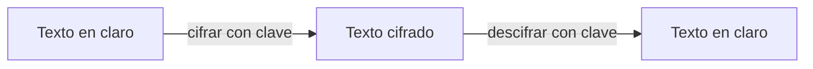
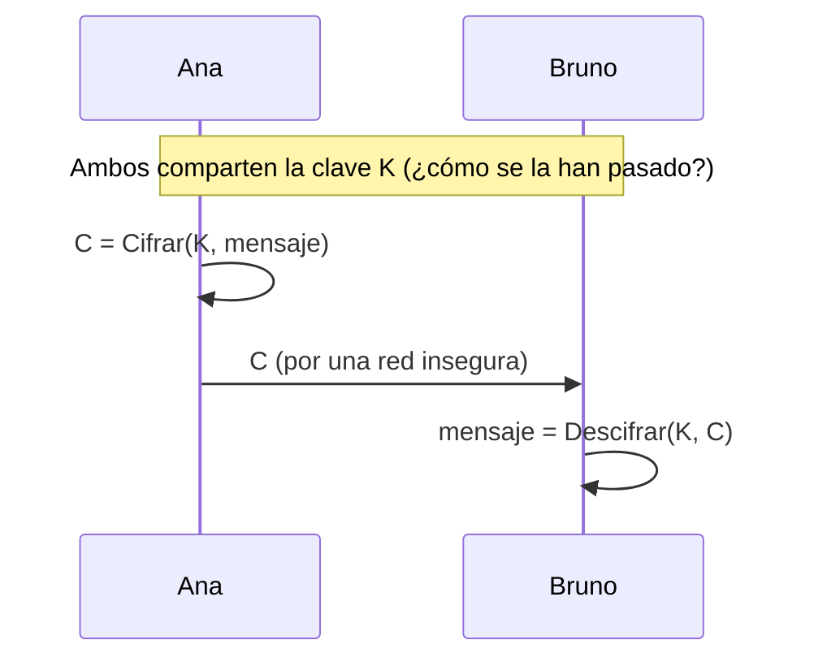
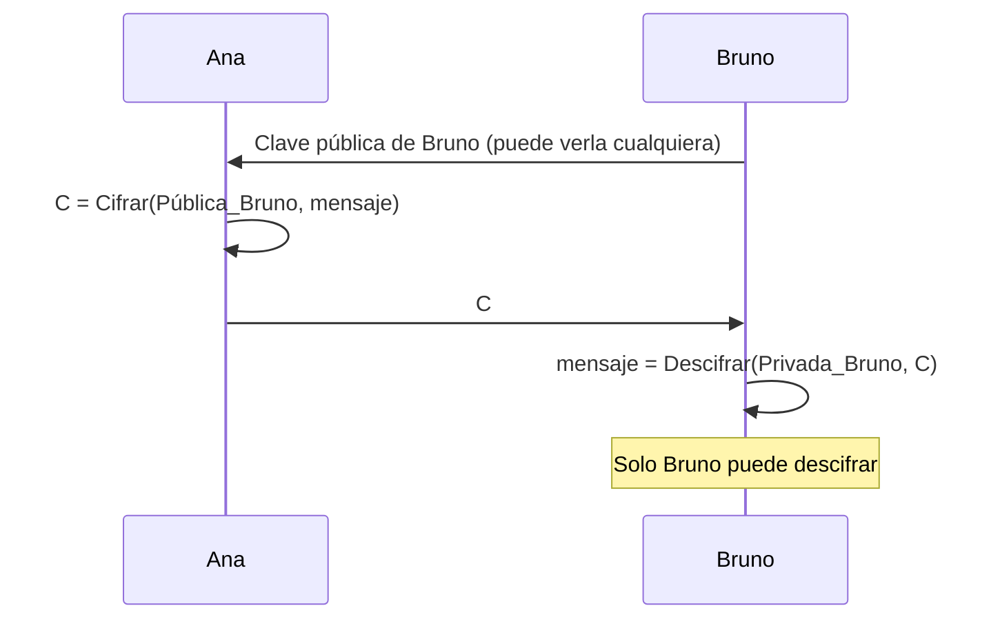
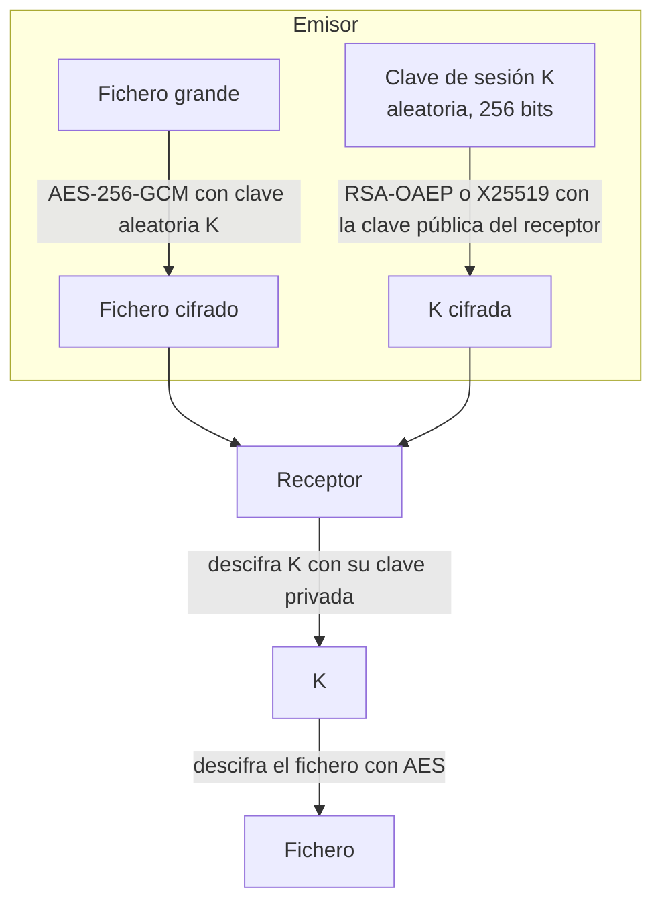
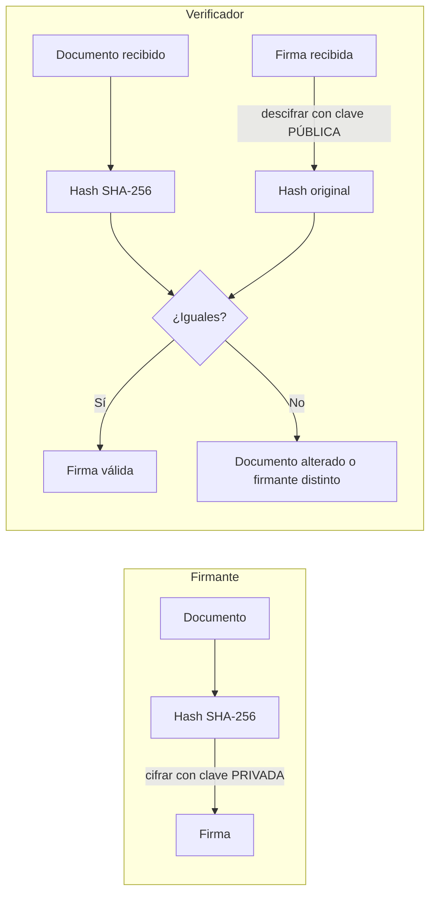
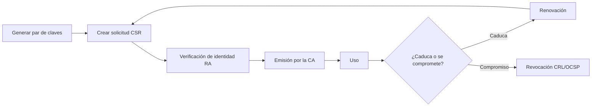
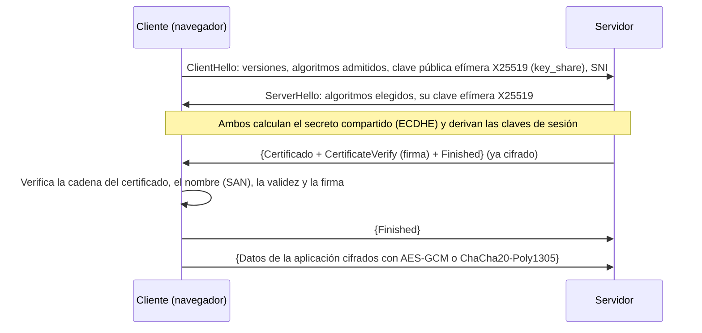

# UD3. Criptografía

> Fundamentos y aplicaciones de la criptografía para proteger la información almacenada y transmitida: cifrado simétrico y asimétrico, funciones hash, contraseñas, firma digital, certificados, PKI y TLS.

| Datos de la unidad | Información |
| --- | --- |
| Módulo | 0378. Seguridad y Alta Disponibilidad |
| Curso | 2.º ASIR |
| Duración | 14 horas |
| Resultados de aprendizaje | RA1 (g) · RA2 (f) · RA3 (c) · RA7 (e) |
| Herramientas | OpenSSL 3.x, GnuPG 2.4, Python 3 con la biblioteca `cryptography` |

---

## 1. Introducción

Cada vez que entras en la web de tu banco, envías un mensaje por WhatsApp, te conectas por SSH a un servidor o presentas un formulario con tu certificado digital, la **criptografía** está trabajando. Es la herramienta técnica que permite:

| Necesidad | Mecanismo criptográfico | Ejemplo |
| --- | --- | --- |
| Que nadie más pueda **leer** la información | **Cifrado** | Un portátil robado con el disco cifrado |
| Detectar si la información ha sido **modificada** | **Funciones hash**, **MAC** | Verificar una ISO descargada |
| Saber **quién** envía la información | **Firma digital**, **certificados** | Factura electrónica firmada |
| Que el emisor no pueda **negar** el envío | **Firma digital** | Presentación de impuestos con certificado |
| **Acordar** una clave secreta por una red insegura | **Intercambio de claves** (Diffie-Hellman) | Inicio de una conexión HTTPS |

Esta unidad conecta con todas las demás: las copias cifradas (UD2), el cifrado de disco y SSH (UD4), las VPN y el acceso remoto (UD6) y el proxy inverso con TLS (UD7).

## 2. Objetivos

- Explicar los conceptos de texto en claro, texto cifrado, clave, algoritmo y criptoanálisis, y el principio de Kerckhoffs.
- Diferenciar la criptografía **simétrica**, la **asimétrica** y los sistemas **híbridos**, y saber cuándo usar cada una.
- Usar **funciones hash** para verificar la integridad y comprender cómo se almacenan las contraseñas de forma segura.
- Firmar y verificar documentos, y explicar la diferencia entre **cifrar** y **firmar**.
- Interpretar un **certificado X.509** y explicar el funcionamiento de una **PKI**.
- Describir el funcionamiento de **TLS 1.3** y diagnosticar conexiones HTTPS.
- Reconocer algoritmos **obsoletos** y conocer la transición a la criptografía **post-cuántica**.
- Conocer el marco legal de la **firma electrónica** (eIDAS, Ley 6/2020).

---

## 3. Conceptos fundamentales

### 3.1. Vocabulario

| Término | Definición |
| --- | --- |
| **Criptografía** | Ciencia que estudia técnicas para proteger la información mediante transformaciones matemáticas |
| **Criptoanálisis** | Ciencia que estudia cómo romper esas protecciones |
| **Criptología** | Engloba criptografía y criptoanálisis |
| **Texto en claro** (*plaintext*) | Información original legible |
| **Texto cifrado** (*ciphertext*) | Información transformada, ininteligible sin la clave |
| **Algoritmo de cifrado** (*cipher*) | Procedimiento matemático que transforma el texto en claro en cifrado y viceversa |
| **Clave** | Dato secreto que controla la transformación |
| **Espacio de claves** | Número total de claves posibles (2¹²⁸ para una clave de 128 bits) |



### 3.2. Un ejemplo histórico: el cifrado César

Julio César desplazaba cada letra del alfabeto un número fijo de posiciones. Con un desplazamiento de 3: A→D, B→E, C→F…

En la terminal se puede reproducir con `tr`, que sustituye unos caracteres por otros:

```bash
echo "ATACAR AL AMANECER" | tr 'A-Z' 'D-ZA-C'
# DWDFDU DO DPDQHFHU

echo "DWDFDU DO DPDQHFHU" | tr 'D-ZA-C' 'A-Z'
# ATACAR AL AMANECER
```

¿Por qué es inseguro?

1. **Espacio de claves minúsculo**: solo hay 25 desplazamientos posibles. Se prueban todos en un segundo (**fuerza bruta**).
2. **Conserva la frecuencia de las letras**: en castellano la letra más frecuente es la E; en el texto cifrado lo será la H. Es vulnerable al **análisis de frecuencias**.

```bash
# Fuerza bruta: probar los 25 desplazamientos
MSG="DWDFDU DO DPDQHFHU"
ABC=ABCDEFGHIJKLMNOPQRSTUVWXYZ
for k in $(seq 1 25); do
  ROT="${ABC:$k}${ABC:0:$k}"
  printf '%2d: %s\n' "$k" "$(echo "$MSG" | tr "$ROT" "$ABC")"
done | grep -n "ATACAR"
```

<!-- enr:u3a -->
> [!WARNING]
> **Nunca inventes tu propio algoritmo de cifrado.** Los algoritmos fiables han sido analizados durante años por la comunidad; uno casero casi siempre tiene fallos. Usa siempre bibliotecas y algoritmos estándar.

### 3.3. Principio de Kerckhoffs

> «La seguridad de un sistema criptográfico debe depender únicamente del secreto de la **clave**, no del secreto del **algoritmo**.» (Auguste Kerckhoffs, 1883)

Por eso los algoritmos modernos (AES, RSA, SHA-2…) son **públicos** y han sido analizados durante años por la comunidad científica. Un algoritmo «secreto» o «casero» suele ser inseguro: **nunca se debe inventar un algoritmo propio** ni usar uno que no esté estandarizado.

### 3.4. Seguridad de un algoritmo

Un algoritmo moderno se considera seguro cuando el ataque más eficiente conocido es la **fuerza bruta** y el espacio de claves es tan grande que resulta inviable:

```text
Clave de 128 bits → 2^128 ≈ 3,4 × 10^38 claves posibles
A 10^12 claves por segundo → ≈ 10^19 años (la edad del universo es ≈ 1,4 × 10^10 años)
```

---

## 4. Criptografía simétrica

### 4.1. Concepto

En la criptografía **simétrica** (o de **clave secreta**) se usa **la misma clave** para cifrar y descifrar.



| Ventajas | Inconvenientes |
| --- | --- |
| **Muy rápida** (cifra gigabytes por segundo con aceleración por hardware AES-NI) | **Distribución de claves**: ¿cómo se hace llegar la clave al otro extremo de forma segura? |
| Claves cortas (128-256 bits) con seguridad muy alta | **Número de claves**: para que `n` personas se comuniquen por parejas hacen falta `n(n−1)/2` claves (1.000 personas → 499.500 claves) |
| Ideal para grandes volúmenes de datos | No proporciona no repudio: ambos tienen la misma clave |

### 4.2. Algoritmos simétricos

| Algoritmo | Tipo | Clave | Estado |
| --- | --- | --- | --- |
| **AES** (*Advanced Encryption Standard*) | Bloque (128 bits) | 128, 192, 256 bits | **Recomendado**. Estándar FIPS 197 desde 2001 |
| **ChaCha20** | Flujo | 256 bits | **Recomendado**. Muy rápido en equipos sin aceleración AES (móviles) |
| DES | Bloque (64 bits) | 56 bits | **Roto**. Se puede romper por fuerza bruta en horas |
| 3DES | Bloque (64 bits) | 112/168 bits | **Obsoleto**. Retirado por NIST |
| RC4 | Flujo | Variable | **Roto**. Prohibido en TLS (RFC 7465) |
| Blowfish | Bloque (64 bits) | Hasta 448 bits | Obsoleto por su tamaño de bloque; sustituido por AES |

### 4.3. Modos de operación

AES cifra **bloques** de 16 bytes. Para cifrar un fichero de varios megas se necesita un **modo de operación** que indica cómo encadenar los bloques.

| Modo | Funcionamiento | ¿Usar? |
| --- | --- | --- |
| **ECB** | Cada bloque se cifra de forma independiente | **Nunca**: bloques iguales producen cifrados iguales y se ven patrones |
| **CBC** | Cada bloque se combina (XOR) con el cifrado anterior; necesita un vector de inicialización (IV) | Aceptable con IV aleatorio, pero no detecta manipulaciones |
| **CTR** | Convierte el bloque en un cifrado de flujo con un contador | Rápido, pero no detecta manipulaciones |
| **GCM** | CTR + autenticación (etiqueta) | **Recomendado**: cifrado autenticado |

El problema de ECB se ilustra con la famosa imagen del «pingüino de ECB»: al cifrar una imagen en modo ECB, la silueta sigue siendo visible porque las zonas del mismo color producen bloques cifrados idénticos.

<!-- enr:u3b -->
> [!WARNING]
> **El modo ECB no debe usarse jamás:** bloques iguales de texto claro producen bloques iguales de texto cifrado y se «ven» los patrones (es el famoso ejemplo del pingüino cifrado). Se practica en el laboratorio (práctica 2).

### 4.4. Cifrado autenticado (AEAD)

Cifrar **no** garantiza la integridad. Con modos como CBC o CTR, un atacante puede modificar bits del texto cifrado y provocar cambios predecibles en el texto descifrado sin que el receptor lo detecte. Los algoritmos de **cifrado autenticado con datos asociados** (AEAD) resuelven el problema añadiendo una **etiqueta** (*tag*) que se comprueba al descifrar:

- **AES-GCM** (AES en modo Galois/Counter).
- **ChaCha20-Poly1305**.

Son los únicos que admite TLS 1.3.

**Ejemplo en Python** con la biblioteca `cryptography` (`sudo apt install python3-cryptography` o `sudo dnf install python3-cryptography`):

```python
#!/usr/bin/env python3
"""Cifrado autenticado AES-256-GCM: confidencialidad + integridad."""
import os
from cryptography.hazmat.primitives.ciphers.aead import AESGCM
from cryptography.exceptions import InvalidTag

clave = AESGCM.generate_key(bit_length=256)   # 32 bytes aleatorios
aes = AESGCM(clave)
nonce = os.urandom(12)                        # 96 bits; NUNCA se repite con la misma clave
mensaje = b"Transferir 1500 EUR a la cuenta ES00 1234"
datos_asociados = b"cabecera-v1"              # se autentican pero no se cifran

cifrado = aes.encrypt(nonce, mensaje, datos_asociados)
print("Cifrado (hex):", cifrado.hex())
print("Descifrado:   ", aes.decrypt(nonce, cifrado, datos_asociados).decode())

# Un atacante modifica un solo bit del texto cifrado
manipulado = bytearray(cifrado)
manipulado[5] ^= 0x01
try:
    aes.decrypt(nonce, bytes(manipulado), datos_asociados)
except InvalidTag:
    print("¡Manipulación detectada! La etiqueta de autenticación no coincide.")
```

Salida:

```text
Cifrado (hex): 9e454e855031a96e3b79f83067db3d35f84fed0a2c37faae5dbf15e06c394bfe38ae...
Descifrado:    Transferir 1500 EUR a la cuenta ES00 1234
¡Manipulación detectada! La etiqueta de autenticación no coincide.
```

- El **nonce** (*number used once*) debe ser distinto en cada cifrado con la misma clave. Repetirlo rompe la seguridad de GCM.
- Los 16 últimos bytes del resultado son la **etiqueta** de autenticación.

### 4.5. Cifrado simétrico de ficheros desde la terminal

#### Con OpenSSL

OpenSSL es la biblioteca y herramienta criptográfica más usada en Linux. La orden `openssl enc` cifra ficheros con una contraseña:

```bash
# Cifrar
openssl enc -aes-256-cbc -pbkdf2 -iter 600000 -salt -in informe.pdf -out informe.pdf.enc
# Descifrar
openssl enc -d -aes-256-cbc -pbkdf2 -iter 600000 -in informe.pdf.enc -out informe_descifrado.pdf
```

| Opción | Significado |
| --- | --- |
| `-aes-256-cbc` | Algoritmo AES con clave de 256 bits en modo CBC |
| `-pbkdf2 -iter 600000` | Deriva la clave a partir de la contraseña con PBKDF2 y 600.000 iteraciones, lo que hace muy lenta la fuerza bruta |
| `-salt` | Añade una sal aleatoria para que la misma contraseña genere claves distintas |

> [!WARNING]
> `openssl enc` **no admite modos autenticados** como GCM y, sin `-pbkdf2`, usa una derivación de clave débil y obsoleta. Para cifrar ficheros es preferible **GnuPG** o **age**, que usan cifrado autenticado.

#### Con GnuPG

**GnuPG** (*GNU Privacy Guard*) es la implementación libre del estándar OpenPGP:

```bash
gpg --symmetric --cipher-algo AES256 informe.pdf     # pide una frase de paso; genera informe.pdf.gpg
gpg --output informe.pdf --decrypt informe.pdf.gpg
```

#### Con age

**age** es una herramienta moderna, sencilla y con valores seguros por defecto (paquete `age` en Debian y EPEL):

```bash
age --passphrase --output informe.pdf.age informe.pdf
age --decrypt --output informe.pdf informe.pdf.age
```

### 4.6. Derivación de claves a partir de contraseñas

Las personas recuerdan **contraseñas**, pero los algoritmos necesitan **claves** de longitud fija y aleatorias. Una **función de derivación de claves** (KDF) convierte una contraseña en una clave, añadiendo una **sal** y siendo deliberadamente **lenta** para frenar la fuerza bruta:

| KDF | Característica |
| --- | --- |
| **PBKDF2** | Repite un HMAC miles de veces. Estándar y muy compatible |
| **scrypt** | Además de CPU, consume mucha memoria |
| **Argon2id** | Ganador de la *Password Hashing Competition*; resistente a GPU. **Recomendado** |
| **yescrypt** | Basado en scrypt; usado por defecto en `/etc/shadow` en Debian y otras distribuciones |

---

## 5. Criptografía asimétrica

### 5.1. Concepto

En la criptografía **asimétrica** (o de **clave pública**) cada participante tiene un **par de claves** matemáticamente relacionadas:

| Clave | Quién la conoce | Para qué sirve |
| --- | --- | --- |
| **Pública** | **Todo el mundo** (se publica) | **Cifrar** mensajes para su dueño y **verificar** sus firmas |
| **Privada** | **Solo su propietario** (nunca se comparte) | **Descifrar** los mensajes recibidos y **firmar** |

Lo que se cifra con una clave solo se puede descifrar con la otra, y **es computacionalmente inviable obtener la clave privada a partir de la pública**.



Resuelve los dos problemas de la simétrica:

- **Distribución de claves**: la clave pública puede enviarse por cualquier canal.
- **Número de claves**: `n` personas necesitan solo `n` pares.

| Ventajas | Inconvenientes |
| --- | --- |
| No hay que compartir secretos | **Lenta** (entre cientos y miles de veces más lenta que AES) |
| Permite **firma digital** y **no repudio** | Claves más largas |
| Escala bien | Hay que garantizar que una clave pública pertenece de verdad a quien dice → **certificados** |

### 5.2. RSA

**RSA** (Rivest, Shamir y Adleman, 1977) basa su seguridad en la dificultad de **factorizar** el producto de dos números primos muy grandes.

**Ejemplo con números pequeños** (solo didáctico; en la realidad los primos tienen más de 1.500 bits cada uno):

```text
1. Elegimos dos primos:            p = 61, q = 53
2. Módulo:                         n = p × q = 3233
3. Función de Euler:               φ(n) = (p−1)(q−1) = 3120
4. Exponente público:              e = 17         (coprimo con 3120)
5. Exponente privado:              d = 2753       (porque 17 × 2753 mod 3120 = 1)

   Clave pública  = (e, n) = (17, 3233)
   Clave privada  = (d, n) = (2753, 3233)

Cifrar el mensaje m = 65:          c = m^e mod n = 65^17 mod 3233 = 2790
Descifrar:                         m = c^d mod n = 2790^2753 mod 3233 = 65 ✔
```

Compruébalo en Python (la función `pow(base, exponente, módulo)` calcula potencias modulares):

```python
p, q, e = 61, 53, 17
n, phi = p * q, (p - 1) * (q - 1)
d = pow(e, -1, phi)                 # inverso modular: 2753
c = pow(65, e, n)                   # 2790
print(n, d, c, pow(c, d, n))        # 3233 2753 2790 65
```

Para romperlo habría que factorizar `n = 3233` y obtener 61 y 53, algo trivial con números pequeños pero inviable con un `n` de 3.072 bits.

**Tamaños recomendados**: mínimo **3.072 bits** para nuevos despliegues (recomendaciones del CCN y del NIST para usos a largo plazo); 2.048 bits se acepta aún en sistemas existentes.

### 5.3. Criptografía de curva elíptica (ECC)

La **criptografía de curva elíptica** ofrece la misma seguridad que RSA con claves mucho más cortas, por lo que es más rápida y eficiente:

| Seguridad equivalente | RSA | ECC |
| --- | --- | --- |
| 128 bits | 3.072 bits | 256 bits |
| 192 bits | 7.680 bits | 384 bits |
| 256 bits | 15.360 bits | 512 bits |

Algoritmos habituales:

| Algoritmo | Uso |
| --- | --- |
| **Ed25519** | Firma digital (claves SSH, GnuPG moderno) |
| **X25519** | Intercambio de claves (TLS 1.3, WireGuard, SSH) |
| **ECDSA P-256 / P-384** | Firma en certificados TLS |

### 5.4. Generar pares de claves con OpenSSL

```bash
# Par de claves RSA de 3072 bits
openssl genpkey -algorithm RSA -pkeyopt rsa_keygen_bits:3072 -out rsa_privada.pem
openssl pkey -in rsa_privada.pem -pubout -out rsa_publica.pem

# Par de claves Ed25519
openssl genpkey -algorithm ed25519 -out ed_privada.pem
openssl pkey -in ed_privada.pem -pubout -out ed_publica.pem

# Ver el contenido de una clave pública
openssl pkey -pubin -in rsa_publica.pem -text -noout | head -5
# Public-Key: (3072 bit)
# Modulus:
#     00:c4:1f:...

# Proteger la clave privada: solo legible por su propietario
chmod 600 rsa_privada.pem ed_privada.pem
```

- `genpkey` es la orden moderna y genérica para generar claves (sustituye a las antiguas `genrsa` y `gendsa`).
- Una clave privada puede protegerse además con una frase de paso añadiendo `-aes-256-cbc` a `genpkey`.

**Cifrar con la clave pública y descifrar con la privada:**

```bash
echo "PIN de la caja fuerte: 4821" > secreto.txt

# Cualquiera con la clave pública puede cifrar
openssl pkeyutl -encrypt -pubin -inkey rsa_publica.pem \
        -pkeyopt rsa_padding_mode:oaep -pkeyopt rsa_oaep_md:sha256 \
        -in secreto.txt -out secreto.enc

# Solo el dueño de la clave privada puede descifrar
openssl pkeyutl -decrypt -inkey rsa_privada.pem \
        -pkeyopt rsa_padding_mode:oaep -pkeyopt rsa_oaep_md:sha256 \
        -in secreto.enc
# PIN de la caja fuerte: 4821
```

`OAEP` es el esquema de relleno seguro para cifrar con RSA. El relleno antiguo PKCS#1 v1.5 tiene vulnerabilidades conocidas para el cifrado.

> [!NOTE]
> RSA solo puede cifrar directamente datos más pequeños que su clave (unos cientos de bytes). Para ficheros se usa un **sistema híbrido**.

### 5.5. Intercambio de claves Diffie-Hellman

El protocolo **Diffie-Hellman** (1976) permite que dos partes **acuerden un secreto compartido** a través de una red pública sin enviarlo nunca. Es la base del establecimiento de claves de TLS, SSH, WireGuard e IPsec.

**Ejemplo con números pequeños**:

```text
Parámetros públicos: primo p = 23, generador g = 5

Ana elige un secreto a = 6     → envía A = g^a mod p = 5^6  mod 23 = 8
Bruno elige un secreto b = 15  → envía B = g^b mod p = 5^15 mod 23 = 19

Ana calcula:    s = B^a mod p = 19^6 mod 23 = 2
Bruno calcula:  s = A^b mod p = 8^15 mod 23 = 2     → ¡el mismo secreto!

Un espía ve p, g, A=8 y B=19, pero para obtener s necesita a o b
(problema del logaritmo discreto, inviable con números grandes).
```

Hoy se usa su versión con curvas elípticas (**ECDHE** con **X25519**). La «E» final significa **efímero**: se genera un par nuevo en cada conexión, lo que proporciona **secreto perfecto hacia adelante** (*Perfect Forward Secrecy*, PFS): si en el futuro se roba la clave privada del servidor, las conversaciones grabadas en el pasado siguen protegidas.

<!-- enr:u3c -->

*Figura 3.1. La clave de sesión K cifra los datos; la criptografía asimétrica solo protege K.*

> [!TIP]
> **Regla mental:** simétrica = **rápida pero con problema de distribución de claves**; asimétrica = **lenta pero resuelve la distribución**. TLS, PGP y los mensajes seguros combinan ambas.

{}
**¿Qué usarías para cifrar un backup de 500 GB que solo tú vas a abrir? ¿Y para enviar una clave a un compañero sin haberos visto nunca?**

Backup → simétrica (AES-256-GCM, p. ej. con `age` o `restic`). Enviar una clave a alguien desconocido → asimétrica (clave pública del compañero) o intercambio de claves tipo Diffie-Hellman.
{}

### 5.6. Criptografía híbrida

En la práctica se combinan ambas para aprovechar sus ventajas:



1. Se genera una **clave de sesión** simétrica aleatoria.
2. Los datos se cifran con esa clave (rápido).
3. La clave de sesión se cifra con la **clave pública** del destinatario (o se acuerda con ECDHE).
4. El destinatario recupera la clave de sesión con su **clave privada** y descifra los datos.

Así funcionan **TLS**, **SSH**, **OpenPGP/GnuPG**, **S/MIME** y las **VPN**.

### 5.7. Comparativa

| Característica | Simétrica | Asimétrica |
| --- | --- | --- |
| Claves | Una compartida | Par pública/privada |
| Velocidad | Muy alta | Baja |
| Longitud de clave típica | 128-256 bits | RSA 3.072 bits; ECC 256 bits |
| Distribución de claves | Problema | Resuelta (la pública se publica) |
| Firma y no repudio | No | Sí |
| Uso típico | Cifrar datos | Intercambiar claves, firmar, autenticar |
| Ejemplos | AES, ChaCha20 | RSA, Ed25519, X25519, ECDSA |

---

## 6. Funciones hash

### 6.1. Concepto y propiedades

Una **función hash criptográfica** transforma datos de cualquier tamaño en un resumen (**hash** o **digest**) de longitud fija. Es una «huella digital» de los datos.

| Propiedad | Significado |
| --- | --- |
| **Determinista** | La misma entrada produce siempre el mismo hash |
| **Longitud fija** | SHA-256 produce siempre 256 bits (64 caracteres hexadecimales), sea la entrada de 1 byte o de 1 TB |
| **Unidireccional** (resistencia a preimagen) | Es inviable obtener la entrada a partir del hash |
| **Resistencia a colisiones** | Es inviable encontrar dos entradas distintas con el mismo hash |
| **Efecto avalancha** | Un cambio mínimo en la entrada cambia completamente el hash |

**Efecto avalancha:**

```bash
printf 'hola'  | sha256sum   # b221d9dbb083a7f33428d7c2a3c3198ae925614d70210e28716ccaa7cd4ddb79
printf 'Hola'  | sha256sum   # e633f4fc79badea1dc5db970cf397c8248bac47cc3acf9915ba60b5d76b0e88f
printf 'hola.' | sha256sum   # 3b952738efe124f6b34181cb9e608432741ab05df195462dc98b26f50f9ef217
```

Cambiar una sola letra a mayúscula, o añadir un punto, produce un resumen completamente distinto.

> [!NOTE]
> Se usa `printf` en lugar de `echo` porque `echo` añade un salto de línea al final, que también forma parte de los datos y cambiaría el hash.

### 6.2. Algoritmos

| Algoritmo | Tamaño | Estado |
| --- | --- | --- |
| MD5 | 128 bits | **Roto**: se generan colisiones en segundos. Solo vale para detectar errores accidentales |
| SHA-1 | 160 bits | **Roto**: primera colisión práctica en 2017 (ataque *SHAttered*). Retirado de certificados y firmas |
| **SHA-2** (SHA-256, SHA-384, SHA-512) | 256-512 bits | **Recomendado**. El más utilizado |
| **SHA-3** (SHA3-256, SHA3-512) | 256-512 bits | **Recomendado**. Diseño interno distinto de SHA-2 (alternativa de respaldo) |
| **BLAKE2 / BLAKE3** | Variable | Recomendados; muy rápidos |

```bash
printf 'hola' | md5sum             # 4d186321c1a7f0f354b297e8914ab240            (32 hex = 128 bits)
printf 'hola' | sha1sum            # 99800b85d3383e3a2fb45eb7d0066a4879a9dad0    (40 hex = 160 bits)
printf 'hola' | sha256sum          # b221d9db...cd4ddb79                          (64 hex = 256 bits)
printf 'hola' | openssl dgst -sha3-256
printf 'hola' | b2sum              # BLAKE2b-512
```

En Windows, PowerShell incluye `Get-FileHash`:

```powershell
Get-FileHash .\debian-13.1.0-amd64-netinst.iso -Algorithm SHA256
```

### 6.3. Usos de las funciones hash

| Uso | Ejemplo |
| --- | --- |
| **Verificar la integridad** de descargas | Comparar el hash de una ISO con el publicado |
| Detectar cambios en ficheros | Línea base de la UD1, AIDE, Wazuh |
| **Almacenar contraseñas** | `/etc/shadow` (con sal y algoritmo lento) |
| **Firma digital** | Se firma el hash del documento, no el documento entero |
| Identificar *malware* | Bases de datos de hashes (VirusTotal) |
| Deduplicación | restic identifica fragmentos repetidos por su hash (UD2) |
| Cadena de custodia | Hash de una evidencia forense (UD1) |
| Control de versiones | Git identifica cada *commit* por su hash |

**Ejemplo: verificar una ISO de Debian.** Debian publica un fichero `SHA256SUMS` y una firma `SHA256SUMS.sign`. La comprobación completa tiene dos pasos:

```bash
# 1. Comprobar que la ISO coincide con el hash publicado
sha256sum -c --ignore-missing SHA256SUMS
# debian-13.1.0-amd64-netinst.iso: La suma coincide

# 2. Comprobar que el fichero de hashes lo ha firmado de verdad Debian
#    (si un atacante controla la web, podría cambiar la ISO Y el fichero de hashes)
gpg --keyserver keyring.debian.org --recv-keys DF9B9C49EAA9298432589D76DA87E80D6294BE9B
gpg --verify SHA256SUMS.sign SHA256SUMS
# gpg: Firma correcta de "Debian CD signing key <debian-cd@lists.debian.org>"
```

### 6.4. MAC y HMAC

Un hash detecta cambios **accidentales**, pero un atacante que modifica un fichero puede recalcular también su hash. Un **MAC** (*Message Authentication Code*) añade una **clave secreta**: solo quien conoce la clave puede generar el código correcto. Aporta **integridad** y **autenticidad** (entre quienes comparten la clave).

**HMAC** es la construcción estándar de MAC basada en una función hash:

```bash
openssl dgst -sha256 -hmac "ClaveSecretaCompartida" pedido.json
# HMAC-SHA2-256(pedido.json)= 9cafa923cf95...
```

Ejemplo real: los *webhooks* de GitHub o de las pasarelas de pago envían una cabecera con el HMAC del mensaje para que el servidor compruebe que la petición es legítima.

---

<!-- enr:u3d -->
> [!WARNING]
> **Guardar contraseñas con `MD5` o `SHA-256` simples es un error grave:** son demasiado rápidos. Se deben usar funciones **lentas y con sal** (`yescrypt`, `Argon2id`, `bcrypt`, `scrypt`) para que probar millones de combinaciones sea inviable.

## 7. Almacenamiento seguro de contraseñas

### 7.1. El problema

Un servidor debe comprobar contraseñas **sin guardarlas en claro**. Si se roba la base de datos, las contraseñas no deben poder leerse.

| Método | ¿Seguro? | Problema |
| --- | --- | --- |
| Texto en claro | ✘ | Robo directo |
| Cifrado reversible | ✘ | Quien obtenga la clave las descifra todas |
| Hash rápido (MD5, SHA-256) | ✘ | Una GPU calcula miles de millones por segundo; además, misma contraseña = mismo hash |
| Hash rápido con sal | Mejor | Sigue siendo demasiado rápido |
| **Hash lento con sal** (yescrypt, Argon2id, bcrypt) | ✔ | Recomendado |

### 7.2. La sal

Una **sal** (*salt*) es un valor aleatorio distinto para cada usuario que se añade a la contraseña antes de calcular el hash. Así:

- Dos usuarios con la misma contraseña tienen hashes **distintos**.
- Las **tablas *rainbow*** (tablas precalculadas de contraseñas y sus hashes) dejan de servir.

```bash
# Misma contraseña, dos sales distintas → hashes distintos
openssl passwd -6 -salt Xy7kP2qa 'Prueba2026!'
openssl passwd -6 -salt Lm3Nz8Rt 'Prueba2026!'
```

### 7.3. El fichero `/etc/shadow`

En Linux los hashes de las contraseñas están en `/etc/shadow`, legible solo por `root`:

```bash
sudo grep "^fperez:" /etc/shadow
# fperez:$y$j9T$Fq1HcMv0...$Vb9w0Tz...:20367:0:99999:7:::
#        │ │   │            │
#        │ │   │            └── hash
#        │ │   └── sal
#        │ └── parámetros de coste
#        └── algoritmo
```

| Prefijo | Algoritmo |
| --- | --- |
| `$y$` | **yescrypt** (por defecto en Debian 11+, Ubuntu 22.04+, Fedora) |
| `$6$` | SHA-512-crypt (habitual en la familia Red Hat) |
| `$2b$` | bcrypt |
| `$argon2id$` | Argon2id |
| `$1$` | MD5-crypt (**obsoleto**) |
| `!` o `*` al principio | Cuenta bloqueada o sin contraseña utilizable |

Los campos numéricos posteriores indican la fecha del último cambio y la política de caducidad (`chage`).

```bash
# Generar un hash yescrypt manualmente (paquete whois en Debian)
mkpasswd -m yescrypt 'Prueba2026!'
# Algoritmo configurado en el sistema
grep ENCRYPT_METHOD /etc/login.defs
```

> [!IMPORTANT]
> En la práctica 3 se audita la robustez de contraseñas con John the Ripper **en el laboratorio y sobre cuentas de prueba**. Realizar esta auditoría sobre sistemas o cuentas ajenas sin autorización es delito.

---

## 8. Firma digital

### 8.1. Funcionamiento

La **firma digital** usa la criptografía asimétrica «al revés»: se **firma con la clave privada** y **cualquiera verifica con la clave pública**.



> [!NOTE]
> La descripción «cifrar el hash con la clave privada» es una simplificación válida para RSA. Algoritmos como Ed25519 o ECDSA calculan la firma de otra manera, pero el principio es el mismo: solo la clave privada puede generarla y la pública permite verificarla.

La firma digital proporciona:

| Propiedad | Por qué |
| --- | --- |
| **Integridad** | Si el documento cambia, su hash cambia y la verificación falla |
| **Autenticidad** | Solo el dueño de la clave privada pudo generar la firma |
| **No repudio** | El firmante no puede negar haber firmado (si su clave privada estaba protegida) |

La firma **no** proporciona confidencialidad: el documento firmado se puede leer. Si se necesita, se **firma y además se cifra**.

### 8.2. Firmar y verificar con OpenSSL

```bash
# Firmar el contrato con la clave privada (hash SHA-256 + RSA)
openssl dgst -sha256 -sign rsa_privada.pem -out contrato.sig contrato.pdf

# Verificar con la clave pública
openssl dgst -sha256 -verify rsa_publica.pem -signature contrato.sig contrato.pdf
# Verified OK

# Si el documento se modifica…
echo " " >> contrato.pdf
openssl dgst -sha256 -verify rsa_publica.pem -signature contrato.sig contrato.pdf
# Verification failure
```

Con Ed25519 se usa `pkeyutl` porque el algoritmo calcula su propio resumen internamente:

```bash
openssl pkeyutl -sign   -inkey ed_privada.pem -rawin -in contrato.pdf -out contrato.ed.sig
openssl pkeyutl -verify -pubin -inkey ed_publica.pem -rawin -in contrato.pdf -sigfile contrato.ed.sig
# Signature Verified Successfully
```

### 8.3. Cifrar frente a firmar

| Objetivo | Clave usada por el **emisor** | Clave usada por el **receptor** | Propiedad |
| --- | --- | --- | --- |
| **Cifrar** | **Pública del receptor** | **Privada del receptor** | Confidencialidad |
| **Firmar** | **Privada del emisor** | **Pública del emisor** | Integridad, autenticidad, no repudio |

Regla mnemotécnica: **se cifra para alguien** (con su clave pública) y **se firma como uno mismo** (con la propia clave privada).

### 8.4. GnuPG y el modelo de confianza OpenPGP

**GnuPG** permite cifrar y firmar correos y ficheros. En lugar de autoridades de certificación, OpenPGP usa tradicionalmente la **red de confianza** (*web of trust*): los usuarios firman las claves de las personas cuya identidad han comprobado.

```bash
# Generar un par de claves (GnuPG 2.4 usa Ed25519 para firmar y Cv25519 para cifrar por defecto)
gpg --quick-generate-key "Ana García <ana@empresa.local>" default default 1y

gpg --list-keys
gpg --armor --export ana@empresa.local > ana_publica.asc     # exportar la clave pública

# Firmar un documento (firma separada en texto ASCII)
gpg --armor --detach-sign informe.pdf                         # genera informe.pdf.asc
gpg --verify informe.pdf.asc informe.pdf

# Cifrar para Bruno (con su clave pública importada) y firmar como Ana
gpg --import bruno_publica.asc
gpg --encrypt --sign --armor -r bruno@empresa.local informe.pdf
```

### 8.5. Firma electrónica en el marco legal

El **Reglamento eIDAS** (UE 910/2014, actualizado por el Reglamento (UE) 2024/1183, conocido como eIDAS 2) y la **Ley 6/2020**, reguladora de determinados aspectos de los servicios electrónicos de confianza, distinguen tres niveles:

| Tipo | Requisitos | Valor legal | Ejemplo |
| --- | --- | --- | --- |
| **Firma electrónica simple** | Datos en formato electrónico asociados a otros datos | Admisible como prueba | Aceptar unas condiciones con una casilla |
| **Firma electrónica avanzada** | Vinculada al firmante de forma única, permite identificarlo, bajo su control exclusivo y detecta cambios posteriores | Mayor valor probatorio | Firma con un certificado software |
| **Firma electrónica cualificada** | Avanzada + certificado cualificado + dispositivo cualificado de creación de firma | **Equivalente a la firma manuscrita** en toda la UE | Firma con DNIe o con certificado en tarjeta criptográfica |

Formatos habituales: **PAdES** (PDF), **XAdES** (XML, factura electrónica), **CAdES** (cualquier fichero). En España, la aplicación **AutoFirma** del Gobierno permite firmar con certificados de la FNMT o el DNIe, y la plataforma **VALIDe** permite verificar firmas.

eIDAS 2 introduce además la **Cartera Europea de Identidad Digital** (*EUDI Wallet*), que los Estados miembros deben ofrecer a la ciudadanía.

---

## 9. Certificados digitales y PKI

### 9.1. El problema de la autenticidad de las claves públicas

Si Ana quiere cifrar un mensaje para Bruno necesita su clave pública. Pero ¿cómo sabe que la clave que ha recibido es **realmente** de Bruno y no de un atacante que se hace pasar por él (ataque de **intermediario**, *man-in-the-middle*)?

La solución es que una **tercera parte de confianza** (una **autoridad de certificación**) certifique con su firma que esa clave pública pertenece a Bruno. Ese documento firmado es un **certificado digital**.

### 9.2. Certificado X.509

Un **certificado digital** es un documento electrónico, firmado por una autoridad de certificación, que **vincula una clave pública con una identidad** (una persona, una organización, un servidor). El formato estándar es **X.509 v3** (RFC 5280).

Campos principales:

| Campo | Contenido | Ejemplo |
| --- | --- | --- |
| Versión | Versión de X.509 | 3 |
| Número de serie | Identificador único en la CA | `04:a3:...` |
| Algoritmo de firma | Cómo ha firmado la CA | `ecdsa-with-SHA384` |
| **Emisor** (*Issuer*) | CA que lo ha emitido | `C=US, O=Let's Encrypt, CN=E7` |
| **Validez** | Desde / hasta | `Not Before`, `Not After` |
| **Sujeto** (*Subject*) | Titular | `CN=www.ejemplo.es` |
| **Clave pública** del sujeto | Algoritmo y clave | EC P-256 |
| **Extensiones** | Nombres alternativos (**SAN**), usos de la clave, restricciones, puntos de distribución de CRL… | `DNS:ejemplo.es, DNS:www.ejemplo.es` |
| **Firma de la CA** | Firma de todo lo anterior | |

Ver el certificado de un servidor real:

```bash
openssl s_client -connect www.boe.es:443 -servername www.boe.es </dev/null 2>/dev/null \
  | openssl x509 -noout -subject -issuer -dates -ext subjectAltName
# subject=C=ES, ST=Madrid, O=Agencia Estatal Boletín Oficial del Estado, CN=www.boe.es
# issuer=...
# notBefore=...
# notAfter=...
# X509v3 Subject Alternative Name:
#     DNS:www.boe.es, DNS:boe.es
```

- `s_client` abre una conexión TLS como si fuera un navegador.
- `-servername` envía el nombre del servidor (SNI), necesario cuando un servidor aloja varios dominios.
- `x509 -noout` muestra campos del certificado sin imprimir el certificado codificado.

> [!NOTE]
> Los navegadores comprueban el nombre del servidor **solo** en la extensión **SAN** (*Subject Alternative Name*), no en el campo `CN`. Un certificado sin SAN será rechazado.

### 9.3. Autoridades de certificación y cadena de confianza

Las CA se organizan en jerarquía:

```text
┌───────────────────────────────┐
│ CA RAÍZ (Root CA)             │  Autofirmada. Su certificado viene preinstalado en el
│ "ISRG Root X1"                │  sistema operativo o el navegador (almacén de confianza).
└──────────────┬────────────────┘  Su clave privada se guarda fuera de línea.
               │ firma
┌──────────────▼────────────────┐
│ CA INTERMEDIA (subordinada)   │  Emite los certificados de usuario. Si se compromete,
│ "Let's Encrypt E7"            │  se revoca sin afectar a la raíz.
└──────────────┬────────────────┘
               │ firma
┌──────────────▼────────────────┐
│ CERTIFICADO FINAL (hoja)      │  El del servidor web.
│ "www.ejemplo.es"              │
└───────────────────────────────┘
```

El navegador **verifica la cadena**: comprueba la firma de cada certificado con la clave pública del superior hasta llegar a una raíz que está en su **almacén de confianza**.

```bash
# Ver la cadena completa que envía un servidor
openssl s_client -connect www.boe.es:443 -servername www.boe.es -showcerts </dev/null 2>/dev/null | grep -E "^ *[0-9] s:|i:"

# Almacén de confianza del sistema
ls /etc/ssl/certs | head            # Debian/Ubuntu
trust list | head                   # AlmaLinux/Rocky (p11-kit)
```

<!-- enr:u3e -->

*Figura 3.2. Un certificado es de confianza porque la cadena termina en una CA raíz que el sistema ya conoce.*

> [!TIP]
> Para ver la cadena de un sitio real desde la terminal: `openssl s_client -connect www.ejemplo.es:443 -showcerts </dev/null`. Verás cada certificado de la cadena y el resultado de la verificación.

### 9.4. Infraestructura de clave pública (PKI)

Una **PKI** es el conjunto de hardware, software, personas, políticas y procedimientos necesarios para crear, gestionar, distribuir, usar, almacenar y revocar certificados.

| Componente | Función |
| --- | --- |
| **Autoridad de certificación (CA)** | Emite y firma certificados |
| **Autoridad de registro (RA)** | Verifica la identidad del solicitante antes de la emisión (por ejemplo, la oficina donde acreditas tu identidad para obtener el certificado de la FNMT) |
| **Autoridad de validación (VA)** | Informa del estado de los certificados (OCSP) |
| **Repositorio** | Publica certificados y listas de revocación |
| **Política de certificación (CP) y Declaración de prácticas (CPS)** | Documentos que describen las reglas de la CA |
| **Titulares y partes que confían** | Usuarios de los certificados |

Ciclo de vida de un certificado:



La **CSR** (*Certificate Signing Request*) es una solicitud que contiene la clave pública y los datos del sujeto, firmada con la clave privada correspondiente. **La clave privada nunca sale del equipo del solicitante.**

### 9.5. Tipos de certificados

| Por su uso | Ejemplo |
| --- | --- |
| Servidor (TLS) | HTTPS, servidor de correo, VPN |
| Cliente / persona física | Certificado FNMT, DNIe |
| Representante / sello de empresa | Firma de facturas por una empresa |
| Firma de código | Instaladores y controladores firmados |
| Correo (S/MIME) | Firma y cifrado de correo |
| CA | Certificado raíz o intermedio |

| Por su validación (TLS) | Qué se comprueba |
| --- | --- |
| **DV** (*Domain Validated*) | Solo que el solicitante controla el dominio (Let's Encrypt) |
| **OV** (*Organization Validated*) | Además, la existencia de la organización |
| **EV** (*Extended Validation*) | Verificación más exhaustiva de la organización |

Desde 2025 el CA/Browser Forum (el organismo que fija las reglas de los certificados TLS públicos) ha aprobado reducir progresivamente la validez máxima de los certificados TLS: **200 días** desde marzo de 2026, **100 días** desde marzo de 2027 y **47 días** desde marzo de 2029. Esto obliga a **automatizar** la renovación.

### 9.6. Formatos de fichero

| Formato | Extensiones | Contenido | Codificación |
| --- | --- | --- | --- |
| **PEM** | `.pem`, `.crt`, `.cer`, `.key` | Certificados y/o claves | Texto Base64 entre `-----BEGIN ...-----` y `-----END ...-----` |
| **DER** | `.der`, `.cer` | Un certificado | Binario |
| **PKCS#12** | `.p12`, `.pfx` | Certificado **+ clave privada** + cadena, protegidos con contraseña | Binario |
| **PKCS#7** | `.p7b`, `.p7c` | Certificados y cadenas, **sin** clave privada | Base64 o binario |

Conversiones habituales:

```bash
# PEM → DER
openssl x509 -in servidor.crt -outform DER -out servidor.der
# Certificado + clave → PKCS#12 (para importarlo en Windows o en un navegador)
openssl pkcs12 -export -inkey servidor.key -in servidor.crt -certfile ca.crt -out servidor.p12
# Ver el contenido de un PKCS#12
openssl pkcs12 -in servidor.p12 -info -noout
```

> [!WARNING]
> Un fichero `.p12`/`.pfx` contiene la **clave privada**. Quien lo obtenga y adivine su contraseña puede firmar en tu nombre. Guárdalo cifrado, con una contraseña robusta, y nunca lo envíes por correo.

<!-- enr:u3f -->
{}
**El navegador muestra «NET::ERR_CERT_COMMON_NAME_INVALID». ¿Qué comprobación ha fallado?**

El nombre del sitio al que accedes no coincide con ninguna entrada SAN del certificado. La cadena de confianza y las fechas pueden estar bien; falla la comprobación de identidad (nombre). Solución: emitir el certificado con el SAN correcto.
{}

### 9.7. Revocación

Un certificado se **revoca** antes de su caducidad si la clave privada se compromete, el titular cambia de datos o deja de ser válido. Mecanismos:

| Mecanismo | Funcionamiento |
| --- | --- |
| **CRL** (*Certificate Revocation List*) | Lista firmada por la CA con los números de serie revocados; el cliente la descarga periódicamente |
| **OCSP** (*Online Certificate Status Protocol*) | El cliente pregunta en tiempo real a la CA por un certificado concreto |
| ***OCSP stapling*** | El servidor adjunta la respuesta OCSP en el saludo TLS, evitando que el cliente consulte a la CA |

La tendencia actual es combinar certificados de **corta duración** con CRL. Let's Encrypt, por ejemplo, dejó de ofrecer OCSP en 2025 y publica únicamente CRL.

---

## 10. Protocolos seguros: TLS y HTTPS

### 10.1. TLS

**TLS** (*Transport Layer Security*) protege las comunicaciones sobre TCP. Proporciona **confidencialidad** (cifrado simétrico), **integridad** (AEAD) y **autenticación** del servidor (y opcionalmente del cliente) mediante certificados.

| Versión | Estado |
| --- | --- |
| SSL 2.0 / 3.0 | **Prohibidos** (vulnerables: POODLE…) |
| TLS 1.0 / 1.1 | **Obsoletos** desde 2021 (RFC 8996) |
| **TLS 1.2** | Aceptable con conjuntos de cifrado modernos (ECDHE + AES-GCM o ChaCha20) |
| **TLS 1.3** (RFC 8446, 2018) | **Recomendado**. Más rápido (1 viaje de ida y vuelta) y sin algoritmos débiles |

### 10.2. Saludo de TLS 1.3 (simplificado)



Todos los elementos de la unidad aparecen aquí: **Diffie-Hellman** (ECDHE) para acordar claves con secreto hacia adelante, **firma digital** y **certificados** para autenticar al servidor, **hash** (HKDF) para derivar claves y **cifrado simétrico autenticado** para los datos.

### 10.3. HTTPS en la práctica

**HTTPS** es HTTP sobre TLS (puerto 443). Comprobaciones habituales desde la terminal:

```bash
# Versión de TLS, algoritmo y verificación del certificado
curl -vI https://www.boe.es 2>&1 | grep -E "SSL connection|subject:|issuer:|expire date|SSL certificate verify"
# * SSL connection using TLSv1.3 / TLS_AES_256_GCM_SHA384 / X25519 / RSASSA-PSS
# * SSL certificate verify ok.

# Forzar una versión concreta: ¿admite el servidor TLS 1.1? (no debería)
openssl s_client -connect www.boe.es:443 -tls1_1 </dev/null 2>&1 | grep -E "Protocol|alert|error"

# Días que faltan para que caduque un certificado
echo | openssl s_client -connect www.boe.es:443 -servername www.boe.es 2>/dev/null \
  | openssl x509 -noout -enddate
```

Buenas prácticas en un servidor HTTPS:

- Solo **TLS 1.2 y 1.3**, con conjuntos de cifrado AEAD y ECDHE.
- Redirigir HTTP a HTTPS y activar **HSTS** (`Strict-Transport-Security`), que obliga al navegador a usar siempre HTTPS.
- Certificados con **SAN** correctos, cadena completa y **renovación automática**.
- Comprobar la configuración con herramientas como `testssl.sh` o el analizador de SSL Labs.
- Generadores de configuración de referencia: [Mozilla SSL Configuration Generator](https://ssl-config.mozilla.org/).

### 10.4. Let's Encrypt y ACME

**Let's Encrypt** es una CA gratuita y automatizada. El protocolo **ACME** (RFC 8555) permite que un programa en el servidor (por ejemplo **Certbot**) solicite, valide y renueve certificados automáticamente:

```bash
sudo apt install -y certbot python3-certbot-nginx
sudo certbot --nginx -d www.ejemplo.es -d ejemplo.es     # obtiene e instala el certificado
sudo certbot renew --dry-run                              # prueba de renovación automática
systemctl list-timers | grep certbot                      # temporizador de renovación
```

La CA comprueba que controlas el dominio mediante un **desafío** (crear un fichero en `/.well-known/acme-challenge/` por HTTP o un registro TXT en el DNS). Por eso Let's Encrypt **no** sirve en un laboratorio sin dominio público: allí usaremos nuestra **propia CA** (práctica 5).

### 10.5. Protocolos seguros y sus equivalentes inseguros

| Inseguro (texto en claro) | Seguro | Puerto seguro |
| --- | --- | --- |
| HTTP | **HTTPS** | 443 |
| Telnet, rlogin | **SSH** | 22 |
| FTP | **SFTP** (sobre SSH) o **FTPS** (sobre TLS) | 22 / 990 |
| SMTP para envío | **SMTP con STARTTLS** / **SMTPS** | 587 / 465 |
| POP3 / IMAP | **POP3S** / **IMAPS** | 995 / 993 |
| LDAP | **LDAPS** o LDAP con STARTTLS | 636 / 389 |
| DNS | **DNS sobre TLS (DoT)**, **DNS sobre HTTPS (DoH)**, DNSSEC (integridad) | 853 / 443 |
| SNMP v1/v2c | **SNMPv3** con autenticación y cifrado | 161 |
| VNC sin cifrar, RDP sin NLA | VNC sobre SSH, **RDP con TLS/NLA** detrás de VPN | |

Estos protocolos se trabajan en la UD6 (acceso remoto y VPN).

---

## 11. Otras aplicaciones de la criptografía

| Aplicación | Tecnología | Unidad |
| --- | --- | --- |
| Cifrado de disco completo | LUKS2 (Linux), BitLocker (Windows), FileVault (macOS) | UD4 |
| Acceso remoto | SSH con claves Ed25519 | UD4, UD6 |
| Redes privadas virtuales | WireGuard, IPsec, OpenVPN | UD6 |
| Wi-Fi | WPA3 (SAE) | UD6 |
| Correo | OpenPGP, S/MIME | UD3 |
| Copias de seguridad | restic, Borg (AES-256) | UD2 |
| Mensajería | Protocolo Signal (cifrado de extremo a extremo) | — |
| Paquetes de software | Firmas de repositorios `apt`/`dnf` | UD4 |
| Arranque | UEFI Secure Boot | UD4 |
| Gestión de secretos | Gestores de contraseñas, HSM, TPM | UD4 |

---

<!-- enr:u3g -->
> [!IMPORTANT]
> **La seguridad de un sistema criptográfico es la de sus claves.** Una clave privada en un repositorio de Git, en un correo o con permisos `644` equivale a no tener cifrado. Protégelas con permisos `600`, contraseña de paso (*passphrase*) y, cuando sea posible, en un módulo hardware (HSM, YubiKey).

## 12. Gestión de claves

La seguridad de todo el sistema depende de las claves. Su gestión incluye:

| Fase | Buenas prácticas |
| --- | --- |
| **Generación** | Generador aleatorio criptográfico (`/dev/urandom`, `openssl rand`); longitud adecuada |
| **Almacenamiento** | Permisos `600`; frase de paso; tarjetas inteligentes, **TPM** o **HSM** (módulos hardware que nunca dejan salir la clave) |
| **Distribución** | Claves públicas por canales autenticados (huellas comprobadas); claves simétricas nunca por correo |
| **Uso** | Una clave para cada propósito (no usar la misma para firmar y cifrar) |
| **Rotación** | Renovar periódicamente y ante cualquier sospecha |
| **Revocación** | Procedimiento para invalidarlas (CRL, certificado de revocación de GnuPG) |
| **Destrucción** | Borrado seguro de las claves retiradas |
| **Copia de seguridad** | Las claves de cifrado de datos deben tener copia custodiada: si se pierden, se pierden los datos |

```bash
# Generar 32 bytes aleatorios (por ejemplo, una clave AES-256) en Base64
openssl rand -base64 32
# Generar una contraseña aleatoria de 20 caracteres
openssl rand -base64 15
```

---

## 13. Criptografía cuántica y post-cuántica

### 13.1. La amenaza cuántica

Un **ordenador cuántico** suficientemente grande podría ejecutar:

- El **algoritmo de Shor**, que factoriza números y calcula logaritmos discretos de forma eficiente → **rompería RSA, Diffie-Hellman y ECC**.
- El **algoritmo de Grover**, que acelera la fuerza bruta → reduce a la mitad la seguridad efectiva de las claves simétricas y los hashes. Se compensa usando **AES-256** y **SHA-384/512**.

| Algoritmo | Impacto cuántico | Medida |
| --- | --- | --- |
| RSA, ECDH, ECDSA, Ed25519 | **Roto** | Migrar a algoritmos post-cuánticos |
| AES-128 | Debilitado | Usar AES-256 |
| AES-256, SHA-384 | Seguro | Mantener |

Aunque aún no existe un ordenador cuántico capaz de hacerlo, existe el riesgo de **«almacenar ahora, descifrar después»** (*harvest now, decrypt later*): un adversario puede grabar hoy comunicaciones cifradas para descifrarlas dentro de unos años.

### 13.2. Criptografía post-cuántica (PQC)

La **criptografía post-cuántica** usa problemas matemáticos (retículos, hashes…) que se consideran resistentes a ordenadores clásicos y cuánticos. En agosto de 2024 el NIST publicó los primeros estándares:

| Estándar | Algoritmo | Uso |
| --- | --- | --- |
| **FIPS 203** | **ML-KEM** (antes CRYSTALS-Kyber) | Establecimiento de claves |
| **FIPS 204** | **ML-DSA** (antes CRYSTALS-Dilithium) | Firma digital |
| **FIPS 205** | **SLH-DSA** (antes SPHINCS+) | Firma digital basada en hashes |

La transición ya ha comenzado con esquemas **híbridos**, que combinan un algoritmo clásico y uno post-cuántico (si uno de los dos falla, el otro sigue protegiendo):

- Los navegadores principales y **OpenSSL 3.5** usan por defecto en TLS 1.3 el intercambio híbrido **X25519MLKEM768**.
- **OpenSSH 10.0** (2025) usa por defecto el intercambio de claves híbrido `mlkem768x25519-sha256`.

```bash
# ¿Qué intercambio de claves usa tu cliente SSH?
ssh -Q kex | grep -i mlkem
# ¿Admite tu OpenSSL los algoritmos post-cuánticos? (OpenSSL ≥ 3.5)
openssl version
openssl list -kem-algorithms | grep -i ml-kem
```

### 13.3. Criptografía cuántica

No hay que confundirla con la anterior. La **distribución cuántica de claves** (QKD, protocolo BB84) usa propiedades físicas de los fotones: cualquier intento de interceptación altera su estado y se detecta. Requiere hardware específico y enlaces dedicados; hoy es una tecnología de nicho.

### 13.4. Agilidad criptográfica

Las organizaciones deben prepararse para cambiar de algoritmos sin rediseñar sus sistemas: **inventariar** dónde se usa criptografía (certificados, VPN, SSH, aplicaciones), mantener el software actualizado y priorizar la información que debe permanecer confidencial durante muchos años.

### 13.5. Ampliación: cifrado homomórfico

El **cifrado homomórfico completo** (FHE, *Fully Homomorphic Encryption*) permite **operar sobre datos cifrados** sin descifrarlos: un servidor en la nube podría calcular estadísticas de datos médicos sin verlos nunca en claro. Es muy costoso computacionalmente, y técnicas como el *bootstrapping* buscan hacerlo práctico. Es un campo de investigación activo; puedes ampliar con el material complementario de esta unidad:

- [Presentación: *Applied Cryptography Blueprint* (PDF)](../Applied_Cryptography_Blueprint.pdf)
- [Presentación: *Optimized Post-Quantum FHE Bootstrapping* (PDF)](../Optimized_Post-Quantum_FHE_Bootstrapping.pdf)
- [Vídeo: cómo el *bootstrapping* limpia datos cifrados sin abrirlos (MP4)](../Cómo_el_Bootstrapping_Limpia_Datos_Cifrados_sin_Abrirlos.mp4)

---

## 14. Algoritmos recomendados (resumen práctico)

| Uso | Recomendado | Evitar |
| --- | --- | --- |
| Cifrado simétrico | **AES-256-GCM**, **ChaCha20-Poly1305** | DES, 3DES, RC4, AES-ECB |
| Hash | **SHA-256**, SHA-384, SHA-3, BLAKE2 | MD5, SHA-1 |
| Contraseñas | **Argon2id**, **yescrypt**, bcrypt, scrypt | MD5-crypt, hash sin sal |
| Firma | **Ed25519**, ECDSA P-256/P-384, RSA-PSS ≥ 3072 | RSA < 2048, DSA |
| Intercambio de claves | **X25519** (ECDHE), híbrido **X25519MLKEM768** | DH < 2048, RSA estático |
| TLS | **1.3** (1.2 con ECDHE + AEAD) | SSL, TLS 1.0, TLS 1.1 |
| Claves SSH | **Ed25519** | DSA, RSA < 3072 |

Fuentes: guías CCN-STIC, recomendaciones del NIST y de ENISA. Revisa siempre la versión vigente: las recomendaciones cambian con el tiempo.

## 15. Ejercicios

1. Descifra por fuerza bruta este mensaje cifrado con César: `FLIUDGR VHJXUR`.
2. ¿Cuántas claves simétricas necesitan 50 personas para comunicarse por parejas? ¿Y cuántos pares de claves con criptografía asimétrica?
3. Con el ejemplo de RSA (n = 3233, e = 17, d = 2753), cifra el mensaje m = 42 y descífralo en Python.
4. Con Diffie-Hellman p = 23, g = 5, Ana elige a = 4 y Bruno b = 3. Calcula A, B y el secreto compartido.
5. Calcula el hash SHA-256 de tu nombre con y sin salto de línea final. Explica la diferencia.
6. ¿Por qué no se deben almacenar las contraseñas con SHA-256 aunque se use sal?
7. Ana quiere enviar a Bruno un contrato confidencial y firmado. Indica qué claves usa cada uno y en qué orden.
8. Explica por qué el navegador confía en `www.boe.es` aunque nunca haya visto antes su certificado.
9. Un certificado caduca dentro de 3 días y la empresa renueva a mano cada año. ¿Qué problema tendrá con las nuevas reglas de validez? ¿Qué propones?
10. Clasifica como seguros u obsoletos: MD5, AES-256-GCM, TLS 1.0, Ed25519, SHA-1, RSA-1024, ChaCha20-Poly1305, 3DES.

{}
1. Desplazamiento 3: `CIFRADO SEGURO`.
2. 50 × 49 / 2 = 1.225 claves simétricas; 50 pares asimétricos.
3. `pow(42, 17, 3233)` = 2557; `pow(2557, 2753, 3233)` = 42.
4. A = 5⁴ mod 23 = 4; B = 5³ mod 23 = 10. Ana calcula B^a = 10⁴ mod 23 = 18 y Bruno calcula A^b = 4³ mod 23 = 18. Secreto compartido = 18.
5. `printf 'Ana' | sha256sum` y `echo 'Ana' | sha256sum` dan resultados distintos porque `echo` añade `\n`, que forma parte de los datos.
6. Porque SHA-256 es muy rápido: una GPU puede probar miles de millones de contraseñas por segundo. Se necesitan funciones lentas y costosas en memoria (Argon2id, yescrypt).
7. Ana firma con **su clave privada** y cifra con la **clave pública de Bruno**. Bruno descifra con **su clave privada** y verifica la firma con la **clave pública de Ana**.
8. Porque el certificado está firmado por una CA intermedia cuyo certificado está firmado por una CA raíz incluida en el almacén de confianza del navegador (cadena de confianza).
9. Con una validez máxima de 200 días (y menor en el futuro), la renovación anual manual no es posible. Debe automatizarse con ACME (Certbot u otro cliente).
10. Seguros: AES-256-GCM, Ed25519, ChaCha20-Poly1305. Obsoletos: MD5, TLS 1.0, SHA-1, RSA-1024, 3DES.
{}

## 16. Resumen

- La criptografía aporta **confidencialidad** (cifrado), **integridad** (hash, MAC), **autenticidad** y **no repudio** (firma digital).
- Por el **principio de Kerckhoffs**, la seguridad depende de la clave, no del secreto del algoritmo.
- La **criptografía simétrica** (AES, ChaCha20) es rápida pero plantea el problema de distribuir la clave. Se deben usar modos **autenticados** (GCM).
- La **asimétrica** (RSA, ECC) resuelve la distribución y permite firmar, pero es lenta. En la práctica se usan **sistemas híbridos**.
- **Diffie-Hellman** (ECDHE/X25519) permite acordar claves con **secreto hacia adelante**.
- Las **funciones hash** (SHA-2, SHA-3) generan huellas para verificar la integridad. MD5 y SHA-1 están rotos.
- Las contraseñas se almacenan con **sal** y funciones **lentas** (yescrypt, Argon2id).
- Los **certificados X.509** vinculan identidades y claves públicas; la **PKI** gestiona su ciclo de vida y la **cadena de confianza**.
- **TLS 1.3** combina todos estos mecanismos para proteger HTTPS y otros protocolos.
- La **criptografía post-cuántica** (ML-KEM, ML-DSA) ya se está desplegando en modo híbrido.

## 17. Referencias y documentación oficial

- [Documentación de OpenSSL 3](https://docs.openssl.org/)
- [GnuPG: manual](https://www.gnupg.org/documentation/manuals/gnupg/)
- [Biblioteca Python `cryptography`](https://cryptography.io/)
- [NIST FIPS 197 (AES)](https://csrc.nist.gov/pubs/fips/197/final) · [FIPS 180-4 (SHA)](https://csrc.nist.gov/pubs/fips/180-4/upd1/final) · [FIPS 203, 204 y 205 (PQC)](https://csrc.nist.gov/projects/post-quantum-cryptography)
- [RFC 8446: TLS 1.3](https://www.rfc-editor.org/rfc/rfc8446) · [RFC 5280: X.509](https://www.rfc-editor.org/rfc/rfc5280) · [RFC 8555: ACME](https://www.rfc-editor.org/rfc/rfc8555) · [RFC 8996: retirada de TLS 1.0 y 1.1](https://www.rfc-editor.org/rfc/rfc8996)
- [Reglamento eIDAS (UE) 910/2014 consolidado](https://eur-lex.europa.eu/legal-content/ES/TXT/?uri=CELEX:02014R0910-20240520) · [Ley 6/2020 de servicios electrónicos de confianza](https://www.boe.es/buscar/act.php?id=BOE-A-2020-14046)
- [CCN-CERT: guías CCN-STIC (criptología de empleo en el ENS)](https://www.ccn-cert.cni.es/es/guias.html)
- [Let's Encrypt: documentación](https://letsencrypt.org/docs/)
- [Mozilla: Server Side TLS](https://wiki.mozilla.org/Security/Server_Side_TLS) · [SSL Configuration Generator](https://ssl-config.mozilla.org/)
- [CA/Browser Forum: Baseline Requirements](https://cabforum.org/working-groups/server/baseline-requirements/)
