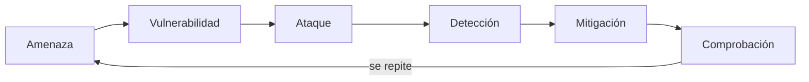
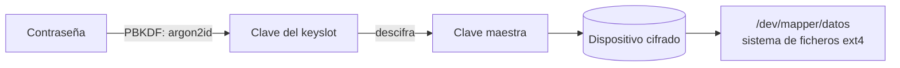
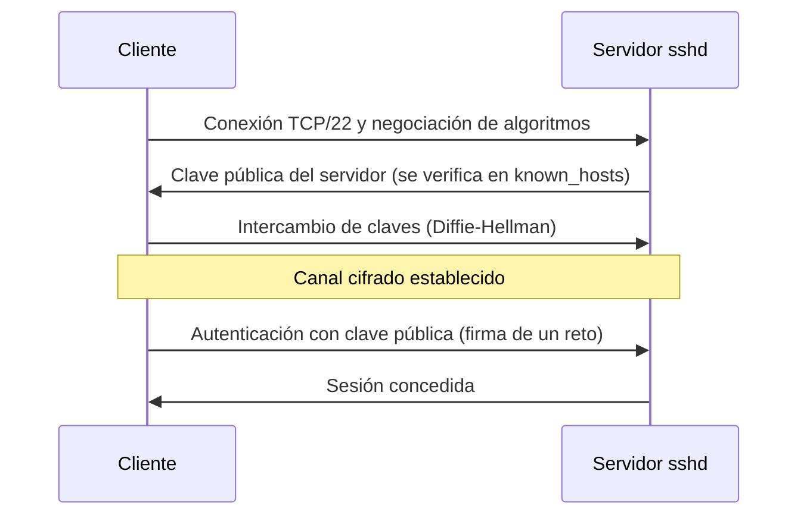
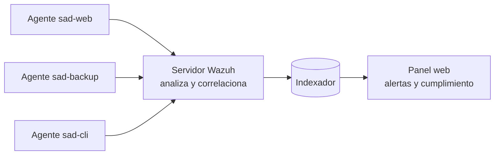

# UD4. Fortificación de hosts

> Cómo reducir la superficie de ataque de un servidor Linux (y de un Windows Server) aplicando el principio de mínimo privilegio: usuarios y permisos, contraseñas, arranque y disco, actualizaciones, servicios, cortafuegos local, SSH, control de acceso obligatorio, antimalware, integridad, registros y auditoría.

| Datos de la unidad | Información |
| --- | --- |
| Módulo | 0378. Seguridad y Alta Disponibilidad |
| Curso | 2.º ASIR |
| Duración | 14 horas |
| Resultados de aprendizaje | RA1 (e) · RA2 (a, b, c, d, e, h) |
| Sistemas | Debian 13 «trixie» · AlmaLinux 10 · Windows Server 2025 |

---

## 1. Introducción

Un servidor recién instalado **no es un servidor seguro**. Las instalaciones por defecto priorizan la comodidad: traen servicios activos que nadie ha pedido, usuarios con más permisos de los necesarios, contraseñas débiles aceptadas, sin cortafuegos configurado y sin registros pensados para investigar incidentes.

**Fortificar** (en inglés *hardening*) es el proceso de **reducir la superficie de ataque** de un sistema: eliminar lo que no se necesita, restringir lo que sí se necesita y vigilar lo que queda.

> [!NOTE]
> **Superficie de ataque** es el conjunto de puntos por los que un atacante podría intentar entrar o dañar un sistema: puertos abiertos, servicios, cuentas, paquetes instalados, ficheros con permisos excesivos, etc. Cuanto menor sea, menos oportunidades tiene el atacante.

### 1.1. Principios que guían todo el hardening

| Principio | Significado | Ejemplo |
| --- | --- | --- |
| **Mínimo privilegio** | Cada usuario o proceso tiene solo los permisos imprescindibles | El servidor web no se ejecuta como `root` |
| **Mínima exposición** | Solo se instala y se activa lo necesario | Si no usas FTP, no lo instales |
| **Defensa en profundidad** | Varias capas independientes: si una falla, otra protege | Cortafuegos + SSH con clave + Fail2ban + SELinux |
| **Seguro por defecto** | Lo que no está permitido expresamente, está denegado | Política `drop` en el cortafuegos |
| **Trazabilidad** | Todo lo importante queda registrado | `auditd`, `journald` |
| **Verificación** | Una medida que no se comprueba no existe | Un escaneo `nmap` tras cada cambio |

<!-- enr:u4a -->

*Figura 4.1. El hardening es un ciclo: medir antes y después, aplicar con copia previa y verificar siempre.*

> [!WARNING]
> **Regla de oro:** antes de tocar una configuración crítica (SSH, cortafuegos, PAM, `fstab`) haz copia del fichero, **mantén una segunda sesión abierta** y comprueba la sintaxis antes de recargar. Un error al endurecer SSH o el cortafuegos puede dejarte fuera de la máquina.

### 1.2. El ciclo del hardening

Cada medida de esta unidad se estudia con el mismo ciclo defensivo:



Por ejemplo, con SSH: la **amenaza** es un atacante remoto; la **vulnerabilidad**, que `sshd` acepta contraseñas; el **ataque**, miles de intentos de acceso automáticos; la **detección**, los registros de `journald` y Fail2ban; la **mitigación**, desactivar contraseñas y exigir clave pública; y la **comprobación**, intentar entrar con contraseña y verificar que se rechaza.

### 1.3. Guías de referencia

No hay que inventar qué endurecer. Existen guías elaboradas por expertos:

| Guía | Organismo | Uso |
| --- | --- | --- |
| **CIS Benchmarks** | Center for Internet Security | Listas de configuraciones recomendadas por sistema (Debian, Alma, Windows Server…), en niveles 1 y 2 |
| **CCN-STIC** (series 600 y 800) | Centro Criptológico Nacional (España) | Guías de configuración segura de sistemas, ligadas al Esquema Nacional de Seguridad |
| **Microsoft Security Baselines** | Microsoft | Líneas base de seguridad para Windows y Windows Server |
| **OpenSCAP / SCAP Security Guide** | Proyecto libre | Auditoría automática de cumplimiento en Linux |

> [!TIP]
> Antes de aplicar una recomendación pregúntate: *¿qué ataque evita? ¿qué puede dejar de funcionar si la aplico?* Una guía no sustituye al criterio del administrador.

### 1.4. Entorno de trabajo y convenciones

Los ejemplos usan el laboratorio de la unidad 1: red `SAD-NAT` 192.168.100.0/24 con `sad-cli` (192.168.100.10), `sad-backup` (.20) y `sad-web` (.30). Cuando los comandos difieren entre distribuciones se muestran en pestañas:

- **Debian / Ubuntu**: gestor `apt`, servicio SSH llamado `ssh`, control de acceso obligatorio **AppArmor**.
- **AlmaLinux / Rocky**: gestor `dnf`, servicio SSH llamado `sshd`, control de acceso obligatorio **SELinux**.

> [!WARNING]
> Muchos cambios de esta unidad pueden **dejarte sin acceso** al servidor (SSH, cortafuegos, PAM). Mantén siempre una segunda sesión abierta, haz copia del fichero antes de editarlo, valida la sintaxis antes de aplicar y trabaja con una *snapshot* de la máquina virtual.

---

## 2. Inventario: conocer lo que hay antes de endurecer

No se puede proteger lo que no se conoce. El primer paso es un **inventario** del host.

```bash
hostnamectl                       # nombre, sistema operativo, kernel, virtualización
cat /etc/os-release               # distribución y versión exacta
uname -r                          # versión del kernel
ip -br a                          # interfaces y direcciones (formato breve)
sudo ss -tulpn                    # puertos a la escucha y proceso asociado
systemctl list-unit-files --state=enabled --type=service   # servicios que arrancan solos
getent passwd | awk -F: '$3>=1000 && $3<65000 {print $1}'  # usuarios "humanos"
sudo find / -xdev -perm -4000 -type f 2>/dev/null           # ficheros SUID
```

Qué hace cada uno:

- `ss -tulpn`: *socket statistics*; `-t` TCP, `-u` UDP, `-l` solo los que escuchan (*listening*), `-p` muestra el proceso, `-n` no resuelve nombres. Sustituye al antiguo `netstat`, que está obsoleto.
- `getent passwd`: lista usuarios de todas las fuentes (local, LDAP…). Los UID menores de 1000 suelen ser cuentas del sistema.
- `-perm -4000`: ficheros con el bit **SUID** (se explica en el apartado 3.5).

Guarda siempre la salida: será tu **línea base** para comparar después de endurecer.

---

## 3. Usuarios, grupos, permisos y sudo

### 3.1. Cuentas y grupos

En Linux, cada usuario tiene un **UID** y pertenece a uno o más **grupos** (GID). La información está en:

| Fichero | Contenido |
| --- | --- |
| `/etc/passwd` | Usuario, UID, GID, directorio personal, shell |
| `/etc/shadow` | Hash de la contraseña y caducidad (solo legible por `root`) |
| `/etc/group` | Grupos y sus miembros |

```bash
sudo groupadd developers                             # crea el grupo
sudo useradd -m -s /bin/bash -c "Ana García" ana     # crea usuario con home y shell
sudo passwd ana                                      # establece contraseña
sudo usermod -aG developers ana                      # añade a un grupo SIN quitar los demás (-a es imprescindible)
id ana                                               # UID, GID y grupos
sudo passwd -l ana                                   # bloquea la contraseña (lock)
sudo usermod -s /usr/sbin/nologin cuenta_servicio    # cuenta que no puede abrir sesión
```

> [!CAUTION]
> `usermod -G grupo usuario` **sin** `-a` reemplaza todos los grupos suplementarios. Es un error clásico que deja a alguien sin acceso a `sudo`.

**Caducidad de contraseñas** con `chage`:

```bash
sudo chage -l ana            # muestra la política actual de la cuenta
sudo chage -M 90 -W 14 ana   # caduca a los 90 días, avisa 14 antes
```

<!-- enr:u4b -->
> [!WARNING]
> **Edita siempre `sudoers` con `visudo`** (o con `visudo -f /etc/sudoers.d/fichero`). Un error de sintaxis puede impedir usar `sudo` y dejarte sin privilegios. Comprueba con `sudo visudo -c` antes de cerrar la sesión.

### 3.2. sudo: privilegios controlados

Trabajar como `root` permanentemente es peligroso: cualquier error o ataque tiene poder total. **`sudo`** (*superuser do*) permite ejecutar **comandos concretos** con privilegios de otro usuario, **registrando** quién hizo qué.

La configuración está en `/etc/sudoers` y en `/etc/sudoers.d/`. **Nunca** se edita con un editor normal, sino con `visudo`, que comprueba la sintaxis (un error en sudoers puede dejarte sin `sudo`).

```bash
sudo visudo -f /etc/sudoers.d/10-webadmins     # crea/edita un fichero de reglas propio (se valida al guardar)
```

Contenido de ejemplo:

```text
# Los miembros del grupo webadmins pueden reiniciar nginx y ver sus logs, y nada más
%webadmins ALL=(root) /usr/bin/systemctl restart nginx, /usr/bin/journalctl -u nginx
```

Estructura de la regla: `quién  máquina=(como_quién)  comandos`.

```bash
sudo visudo -c                       # comprueba la sintaxis de todos los ficheros sudoers
sudo -l -U ana                       # qué puede hacer ana con sudo
sudo journalctl _COMM=sudo           # registro de usos de sudo
```

> [!WARNING]
> Evita reglas `ALL=(ALL) NOPASSWD: ALL`. Permitir `sudo vim`, `sudo less` o `sudo find` equivale a dar una shell de `root`, porque esos programas permiten ejecutar otros comandos desde su interior.

### 3.3. Permisos clásicos y umask

Los permisos se asignan a **propietario / grupo / otros** (lectura `r`=4, escritura `w`=2, ejecución `x`=1).

```bash
ls -l /etc/shadow            # solo root (y, en Debian, el grupo shadow) pueden leerlo
chmod 640 fichero            # propietario rw-, grupo r--, otros ---
chmod -R o-rwx /srv/datos    # quita todo permiso a "otros", recursivamente
chown -R www-data:www-data /var/www/html     # en AlmaLinux el usuario web es "apache" o "nginx"
```

La **umask** indica qué permisos se *quitan* a los ficheros nuevos. Con `umask 027`, los ficheros nuevos se crean `640` y los directorios `750`:

```bash
umask            # valor actual (normalmente 0022)
umask 027        # solo para la sesión actual
```

Para hacerlo permanente: en `/etc/login.defs` (`UMASK 027`) o en `/etc/profile.d/`.

### 3.4. ACL: permisos finos

Los permisos clásicos solo permiten un propietario y un grupo. Las **ACL** (*Access Control Lists*) permiten dar permisos a usuarios o grupos adicionales sin cambiar el propietario.

```bash
sudo apt install -y acl                      # Debian (en AlmaLinux ya viene instalado)
sudo mkdir /srv/proyecto
sudo setfacl -m u:ana:rwx /srv/proyecto           # ana: lectura, escritura, ejecución
sudo setfacl -m g:auditores:rx /srv/proyecto      # grupo auditores: solo lectura
sudo setfacl -d -m g:auditores:rx /srv/proyecto   # -d: ACL por defecto para ficheros futuros
getfacl /srv/proyecto                             # ver las ACL
```

Si un fichero tiene ACL, `ls -l` muestra un `+` al final de los permisos (`drwxrwx---+`).

### 3.5. Bits especiales

| Bit | Valor | Efecto | Riesgo |
| --- | --- | --- | --- |
| **SUID** | 4000 | El programa se ejecuta con los privilegios de su **propietario** | Un SUID root vulnerable permite escalar privilegios |
| **SGID** | 2000 | En ejecutables, con el grupo propietario; en directorios, los ficheros heredan el grupo | Igual que SUID, con el grupo |
| **Sticky** | 1000 | En un directorio, solo el propietario puede borrar sus ficheros (como `/tmp`) | — |

`passwd` necesita ser SUID root para poder escribir en `/etc/shadow`. Lo que debe alarmarte es un SUID **inesperado** (por ejemplo, en `/tmp` o en un binario que no recuerdas):

```bash
sudo find / -xdev -perm -4000 -type f -ls 2>/dev/null     # lista los SUID
sudo find / -xdev -type f -perm -0002 -ls 2>/dev/null     # ficheros escribibles por cualquiera
sudo find / -xdev \( -nouser -o -nogroup \) 2>/dev/null   # ficheros huérfanos
```

### 3.6. Ajustes del kernel con sysctl

`sysctl` modifica parámetros del kernel en caliente. Se hacen persistentes en `/etc/sysctl.d/`. Crea el fichero `/etc/sysctl.d/99-hardening.conf` (con `sudoedit`) con este contenido:

```ini
# Protección contra falsificación de origen (anti-spoofing)
net.ipv4.conf.all.rp_filter = 1
net.ipv4.conf.default.rp_filter = 1
# No aceptar ni enviar redirecciones ICMP
net.ipv4.conf.all.accept_redirects = 0
net.ipv6.conf.all.accept_redirects = 0
net.ipv4.conf.all.send_redirects = 0
# No aceptar enrutamiento de origen
net.ipv4.conf.all.accept_source_route = 0
# Protección frente a SYN flood
net.ipv4.tcp_syncookies = 1
# Ocultar direcciones del kernel y restringir dmesg
kernel.kptr_restrict = 2
kernel.dmesg_restrict = 1
```

```bash
sudo sysctl --system            # carga todos los ficheros de configuración
sysctl net.ipv4.tcp_syncookies  # comprueba un valor concreto
```

> [!NOTE]
> Un servidor que actúe como **router** necesita `net.ipv4.ip_forward = 1`. No lo desactives en esos casos (lo verás en las unidades 5 y 7).

---

## 4. Contraseñas y PAM

### 4.1. Qué es PAM

**PAM** (*Pluggable Authentication Modules*) es la capa que usan `login`, `sudo`, `sshd`, etc. para autenticar. Cada servicio tiene un fichero en `/etc/pam.d/` con reglas de cuatro tipos (`auth`, `account`, `password`, `session`) que invocan módulos (`pam_unix.so`, `pam_pwquality.so`, `pam_faillock.so`…).

> [!WARNING]
> Un error en PAM puede impedir **cualquier** inicio de sesión, incluido el de `root`. Deja siempre una sesión de `root` abierta mientras pruebas y copia el fichero antes (`sudo cp /etc/pam.d/common-password /etc/pam.d/common-password.bak`).

### 4.2. Calidad de contraseñas con pwquality

El módulo `pam_pwquality` rechaza contraseñas débiles al cambiarlas. Se configura en `/etc/security/pwquality.conf`:


{}
```bash
sudo apt install -y libpam-pwquality     # instala el módulo y lo activa en common-password
```
{}
{}
```bash
sudo dnf install -y libpwquality         # ya viene activado en el perfil de authselect
```
{}


```ini
# /etc/security/pwquality.conf
minlen = 12          # longitud mínima
minclass = 3         # al menos 3 tipos de carácter (minúscula, mayúscula, dígito, símbolo)
maxrepeat = 3        # máximo 3 caracteres iguales seguidos
usercheck = 1        # no puede contener el nombre de usuario
retry = 3            # intentos al cambiar la contraseña
enforce_for_root     # también se aplica a root
```

Comprobación (sin cambiar nada) con la utilidad `pwscore`, que puntúa una contraseña (paquete `libpwquality-tools` en Debian):

```bash
echo 'abc123' | pwscore                     # falla: "The password is shorter than 8 characters"
echo 'Correcto-Caballo-Pila-7!' | pwscore   # puntuación alta
```

> [!TIP]
> Las recomendaciones actuales (NIST SP 800-63B) favorecen **contraseñas largas** (frases) frente a reglas de complejidad estrictas o caducidades frecuentes, y comprobar que no estén en listas de contraseñas filtradas. El CE e) de RA1 pide «adoptar políticas de contraseñas»: documenta cuál adoptas y por qué.

<!-- enr:u4c -->
> [!TIP]
> Si activas `faillock` en un servidor, prueba primero con un usuario de pruebas y **no bloquees a `root` por consola**: ante un ataque de fuerza bruta, el bloqueo podría convertirse en una denegación de servicio sobre ti mismo.

### 4.3. Bloqueo por intentos fallidos con faillock

`pam_faillock` bloquea temporalmente una cuenta tras varios fallos seguidos: frena los intentos automáticos de adivinar contraseñas.

Parámetros en `/etc/security/faillock.conf`:

```ini
deny = 5               # bloquea tras 5 fallos consecutivos
fail_interval = 900    # los fallos cuentan si ocurren en 15 minutos
unlock_time = 600      # el bloqueo dura 10 minutos
```


{}
`authselect` gestiona PAM de forma segura; **no** edites a mano los ficheros que genera.

```bash
sudo authselect current                          # perfil activo
sudo authselect enable-feature with-faillock     # activa faillock en el perfil
sudo authselect apply-changes
```
{}
{}
En Debian se añaden las líneas a `/etc/pam.d/common-auth` (sigue el esquema de `man pam_faillock`):

```bash
sudo cp /etc/pam.d/common-auth /etc/pam.d/common-auth.bak     # copia de seguridad
sudoedit /etc/pam.d/common-auth
```

```text
auth    required                        pam_faillock.so preauth
auth    [success=1 default=ignore]      pam_unix.so nullok
auth    [default=die]                   pam_faillock.so authfail
auth    sufficient                      pam_faillock.so authsucc
auth    requisite                       pam_deny.so
auth    required                        pam_permit.so
```

Y en `/etc/pam.d/common-account` añade la línea `account required pam_faillock.so`.

Para volver atrás: `sudo cp /etc/pam.d/common-auth.bak /etc/pam.d/common-auth`.
{}


```bash
sudo faillock --user ana           # ver intentos fallidos registrados
sudo faillock --user ana --reset   # desbloquear manualmente
```

Prueba: abre una consola de otro usuario y equivócate 5 veces con `su - ana`; a partir de ahí, aunque la contraseña sea correcta, será rechazada hasta que pase `unlock_time`.

> [!WARNING]
> El bloqueo de cuentas puede usarse como **denegación de servicio**: un atacante que conozca un usuario puede bloquearlo a propósito. Por eso en SSH conviene combinar claves públicas (sin contraseña que fallar) con Fail2ban, que bloquea la **IP** y no la cuenta.

---

## 5. Arranque seguro y cifrado de disco

### 5.1. Cadena de arranque y Secure Boot

Si un atacante tiene acceso físico o a la consola, puede arrancar otro sistema o modificar el cargador. Defensas:

- **UEFI Secure Boot**: el firmware solo ejecuta cargadores firmados por una clave de confianza (en Debian y Alma, mediante el *shim* firmado y la clave de la distribución).
- **Contraseña de UEFI/BIOS** y orden de arranque restringido.
- **Contraseña de GRUB**: impide editar los parámetros del kernel (por ejemplo `init=/bin/bash`, que da una shell de root sin contraseña).

```bash
mokutil --sb-state             # SecureBoot enabled / disabled
```

Contraseña de GRUB (Debian). Genera primero el hash PBKDF2:

```bash
grub-mkpasswd-pbkdf2          # pide la contraseña dos veces y devuelve "grub.pbkdf2.sha512.10000...."
```

```bash
sudo cp /etc/grub.d/40_custom /root/40_custom.bak
sudoedit /etc/grub.d/40_custom   # añade al final las dos líneas siguientes
```

```text
set superusers="admingrub"
password_pbkdf2 admingrub grub.pbkdf2.sha512.10000.HASH_GENERADO
```

```bash
sudo update-grub                 # Debian: regenera grub.cfg
```

> [!NOTE]
> En AlmaLinux la contraseña de GRUB se establece con `sudo grub2-setpassword` (crea `user.cfg` y regenera la configuración). Sin cifrado de disco, la contraseña de GRUB **no basta**: quien extraiga el disco lo lee entero. Por eso se cifra.

### 5.2. Cifrado de disco con LUKS

**LUKS** (*Linux Unified Key Setup*) es el estándar de cifrado de volúmenes en Linux, gestionado con `cryptsetup` sobre el mecanismo `dm-crypt` del kernel. Cifra bloques con **AES-XTS** y protege la clave maestra con una o varias contraseñas (*keyslots*).



Ejemplo completo con un fichero que simula un disco (así no se arriesga nada):

```bash
sudo apt install -y cryptsetup            # Debian  ·  AlmaLinux: sudo dnf install -y cryptsetup

sudo truncate -s 200M /root/disco.img                     # fichero de 200 MB como "disco"
sudo cryptsetup luksFormat --type luks2 /root/disco.img   # ¡DESTRUYE el contenido! Pide confirmación (YES en mayúsculas)
sudo cryptsetup open /root/disco.img datos                # descifra y crea /dev/mapper/datos
sudo mkfs.ext4 /dev/mapper/datos                          # sistema de ficheros dentro del volumen cifrado
sudo mkdir -p /mnt/datos && sudo mount /dev/mapper/datos /mnt/datos
echo "dato confidencial" | sudo tee /mnt/datos/secreto.txt
```

Cerrar y comprobar que sin la contraseña no se lee:

```bash
sudo umount /mnt/datos
sudo cryptsetup close datos
sudo grep -c "dato confidencial" /root/disco.img          # 0: no aparece en claro
sudo cryptsetup luksDump /root/disco.img                  # cifrado, PBKDF, keyslots
```

> [!CAUTION]
> Haz **copia de la cabecera LUKS**: si se corrompe, los datos son irrecuperables aunque recuerdes la contraseña.
>
> ```bash
> sudo cryptsetup luksHeaderBackup /root/disco.img --header-backup-file /root/disco.header
> ```
>
> Guarda esa copia **fuera** del equipo, y protegida, porque quien tenga cabecera y contraseña puede descifrar.

Para montarlo automáticamente al arrancar se usan `/etc/crypttab` y `/etc/fstab`. En servidores sin intervención humana se estudian soluciones como **Clevis + Tang** o TPM2, que quedan fuera del alcance de esta unidad.

---

## 6. Actualizaciones y origen del software

Las vulnerabilidades conocidas son la vía de entrada más habitual. Mantener el sistema actualizado y **verificar de dónde procede el software** (CE b de RA2) es la medida más rentable.

### 6.1. Firmas de repositorios

Los gestores de paquetes verifican con criptografía (UD3) que los paquetes no han sido alterados:

- **APT**: los repositorios están firmados con claves GPG almacenadas en `/etc/apt/keyrings/` o `/usr/share/keyrings/`. Cada repositorio de terceros debe referenciar **su** clave con `signed-by=` (el antiguo `apt-key` está obsoleto).
- **DNF/RPM**: `gpgcheck=1` en cada `.repo` y paquetes firmados.

```bash
apt policy openssh-server            # Debian: de qué repositorio viene y qué versión se instalaría
rpm -K paquete.rpm                   # AlmaLinux: comprobar la firma de un RPM descargado
sudo apt install -y debsums && sudo debsums -s openssh-server   # Debian: ficheros modificados (sin salida = correcto)
sudo rpm -V openssh-server           # AlmaLinux: sin salida = todo correcto
```

> [!WARNING]
> Nunca uses `curl ... | sudo bash` sin revisar el script, ni desactives `gpgcheck`, ni uses `--allow-unauthenticated`. Es instalar código de origen desconocido con permisos de `root`.

### 6.2. Actualizar y reiniciar cuando haga falta


{}
```bash
sudo apt update                      # descarga la lista de paquetes disponibles
apt list --upgradable                # qué se actualizaría
sudo apt upgrade -y                  # aplica las actualizaciones
sudo apt install -y needrestart      # avisa de servicios que usan librerías antiguas
sudo needrestart -r l                # lista (l) lo que habría que reiniciar
```
{}
{}
```bash
sudo dnf check-update                # qué hay disponible
sudo dnf upgrade -y                  # aplica
sudo dnf updateinfo list security    # solo avisos de seguridad
sudo dnf needs-restarting -r         # ¿hace falta reiniciar? (código de salida 1 = sí)
```
{}


### 6.3. Actualizaciones automáticas de seguridad


{}
```bash
sudo apt install -y unattended-upgrades
sudo dpkg-reconfigure -plow unattended-upgrades       # activa la tarea periódica
sudo unattended-upgrade --dry-run --debug | tail      # simulación: no cambia nada
```

Configuración en `/etc/apt/apt.conf.d/50unattended-upgrades` (por defecto, solo actualizaciones de seguridad).
{}
{}
```bash
sudo dnf install -y dnf-automatic
sudo sed -i 's/^apply_updates.*/apply_updates = yes/' /etc/dnf/automatic.conf
sudo sed -i 's/^upgrade_type.*/upgrade_type = security/' /etc/dnf/automatic.conf
sudo systemctl enable --now dnf-automatic.timer
systemctl list-timers dnf-automatic.timer             # próxima ejecución
```
{}


> [!NOTE]
> En servidores críticos se prueban primero las actualizaciones en un entorno de preproducción y se aplican en una ventana de mantenimiento; la automatización plena suele reservarse a los parches de seguridad.

---

## 7. Servicios, puertos y procesos

Cada servicio activo es una puerta potencial. El objetivo: que **solo estén activos los servicios necesarios y solo en las interfaces necesarias** (CE h de RA2).

### 7.1. Ver qué hay activo

```bash
systemctl list-units --type=service --state=running       # servicios en ejecución ahora
systemctl list-unit-files --state=enabled --type=service  # los que arrancan al iniciar
sudo ss -tulpn                                            # puertos a la escucha
```

Interpreta la salida de `ss`: la columna *Local Address:Port* indica **dónde** escucha.

| Dirección | Significado |
| --- | --- |
| `0.0.0.0:22` | Escucha en **todas** las interfaces IPv4 (accesible desde la red) |
| `127.0.0.1:3306` | Solo en local (no accesible desde fuera): **lo ideal** para una base de datos |
| `[::]:80` | Todas las interfaces IPv6 |

### 7.2. Parar, deshabilitar y enmascarar

```bash
sudo systemctl disable --now cups.service     # --now: lo para ahora y evita que arranque en el siguiente inicio
sudo systemctl mask bluetooth.service         # lo enlaza a /dev/null: nadie puede arrancarlo, ni como dependencia
sudo apt purge -y telnetd                     # lo más seguro: desinstalar (AlmaLinux: sudo dnf remove ...)
```

### 7.3. Análisis de la seguridad de un servicio con systemd

`systemd` puede **aislar** cada servicio (sistema de ficheros de solo lectura, sin acceso a `/home`, sin privilegios nuevos…). El comando `systemd-analyze security` puntúa el nivel de exposición (0 = seguro, 10 = totalmente expuesto):

```bash
systemd-analyze security                       # resumen de todos los servicios
systemd-analyze security nginx.service         # detalle de uno
```

Se pueden añadir restricciones con un *drop-in* sin tocar el fichero original:

```bash
sudo systemctl edit nginx.service              # crea /etc/systemd/system/nginx.service.d/override.conf
```

```ini
[Service]
ProtectSystem=full          # /usr, /boot y /etc de solo lectura para este servicio
ProtectHome=true            # sin acceso a /home
PrivateTmp=true             # /tmp propio y aislado
NoNewPrivileges=true        # no puede ganar privilegios (impide los efectos de SUID)
```

```bash
sudo systemctl restart nginx && systemctl is-active nginx    # comprueba que sigue funcionando
```

> [!TIP]
> Si tras aplicar restricciones el servicio falla, elimina el override (`sudo systemctl revert nginx.service`) y añade las opciones de una en una.

<!-- enr:u4d -->
> [!NOTE]
> **Nmap solo contra tus máquinas de laboratorio.** Escanear sistemas ajenos sin permiso puede ser ilegal. Escanea siempre `192.168.100.0/24` (tu red de práctica), nunca redes públicas.

{}
**¿Qué diferencia hay entre `systemctl disable` y `systemctl mask`? ¿Cuál usarías para un servicio que nunca debe arrancar?**

`disable` impide el arranque automático, pero se puede iniciar a mano o por dependencia; `mask` lo enlaza a `/dev/null` y nada puede iniciarlo. Para algo que nunca debe ejecutarse: `mask`.
{}

### 7.4. Verificar desde fuera con Nmap

`ss` te dice lo que escucha *dentro* del equipo; **Nmap** muestra lo que ve un atacante *desde la red* (y, por tanto, lo que deja pasar el cortafuegos).

```bash
sudo apt install -y nmap          # AlmaLinux: sudo dnf install -y nmap
nmap -sV -p- 192.168.100.30       # -p- todos los puertos; -sV detecta la versión del servicio
```

> [!CAUTION]
> Escanea **solo equipos propios o con autorización escrita**. En el laboratorio, únicamente las máquinas de `SAD-NAT`.

---

## 8. Cortafuegos local

Un **cortafuegos de host** filtra el tráfico que entra y sale del propio equipo. Aunque haya un cortafuegos perimetral (UD7), el local aporta defensa en profundidad: protege frente a un atacante que ya está dentro de la red.

Política recomendada: **denegar por defecto** el tráfico entrante y permitir solo lo necesario.

| Herramienta | Qué es | Cuándo usarla |
| --- | --- | --- |
| **nftables** | Framework de filtrado del kernel (sustituye a `iptables`, que está obsoleto) | Cualquier distribución; máxima flexibilidad |
| **firewalld** | Gestor dinámico por zonas sobre nftables | AlmaLinux / Rocky (por defecto) |
| **UFW** | Interfaz sencilla (*Uncomplicated Firewall*) | Debian / Ubuntu para reglas básicas |

> [!WARNING]
> Usa **una sola** herramienta de cortafuegos a la vez. Mezclar `ufw`, `firewalld` y `nftables` produce reglas imprevisibles.

### 8.1. firewalld (AlmaLinux)

```bash
sudo systemctl enable --now firewalld
sudo firewall-cmd --get-active-zones                  # zonas y sus interfaces
sudo firewall-cmd --list-all                          # reglas de la zona activa
sudo firewall-cmd --permanent --add-service=ssh       # --permanent: sobrevive al reinicio
sudo firewall-cmd --permanent --add-service=https
sudo firewall-cmd --reload                            # aplica lo "permanent"
```

Para limitar SSH a la red del laboratorio se quita el servicio abierto a todos y se añade una regla con origen:

```bash
sudo firewall-cmd --permanent --remove-service=ssh
sudo firewall-cmd --permanent --add-rich-rule='rule family="ipv4" source address="192.168.100.0/24" service name="ssh" accept'
sudo firewall-cmd --reload
```

### 8.2. UFW (Debian / Ubuntu)

```bash
sudo apt install -y ufw
sudo ufw default deny incoming        # política por defecto: bloquear lo entrante
sudo ufw default allow outgoing
sudo ufw allow from 192.168.100.0/24 to any port 22 proto tcp   # SSH solo desde la red del laboratorio
sudo ufw allow 443/tcp                # HTTPS desde cualquier origen
sudo ufw enable                       # activa (¡asegúrate de que SSH está permitido antes!)
sudo ufw status verbose
```

### 8.3. nftables directamente

Un conjunto de reglas completo para un servidor con SSH y HTTPS. Se guarda en `/etc/nftables.conf`:

```text
flush ruleset

table inet filtro {
  chain entrada {
    type filter hook input priority 0; policy drop;     # todo lo no permitido se descarta

    ct state established,related accept                 # respuestas a conexiones ya iniciadas
    ct state invalid drop                               # paquetes sin sentido
    iif "lo" accept                                     # tráfico local
    ip protocol icmp icmp type echo-request limit rate 5/second accept   # ping limitado
    ip6 nexthdr icmpv6 accept                           # IPv6 necesita ICMPv6 para funcionar

    ip saddr 192.168.100.0/24 tcp dport 22 accept       # SSH solo desde el laboratorio
    tcp dport { 80, 443 } accept                        # web
    limit rate 3/minute log prefix "nft-drop: "         # registra (con límite) lo que se descarta
  }
  chain reenvio { type filter hook forward priority 0; policy drop; }
  chain salida  { type filter hook output  priority 0; policy accept; }
}
```

```bash
sudo cp /etc/nftables.conf /etc/nftables.conf.bak      # copia de seguridad
sudo nft -c -f /etc/nftables.conf                      # -c: solo COMPRUEBA la sintaxis
sudo nft -f /etc/nftables.conf                         # aplica
sudo nft list ruleset                                  # muestra las reglas activas
sudo systemctl enable --now nftables                   # persiste tras el reinicio
```

> [!TIP]
> **Red de seguridad antes de aplicar reglas por SSH**: programa un «deshacer» automático. Si te quedas sin acceso, en 2 minutos se vacía el cortafuegos.
>
> ```bash
> sudo systemd-run --on-active=120 --unit=deshacer-fw nft flush ruleset   # cuenta atrás de 120 s
> # ...aplicas las reglas y compruebas que sigues conectado...
> sudo systemctl stop deshacer-fw.timer                                   # cancelas el deshacer
> ```

Comprobación desde `sad-cli`:

```bash
nmap -p 22,80,443,3306 192.168.100.30        # 22/80/443 open (según lo que sirva), 3306 filtered o closed
```

---

## 9. Acceso remoto seguro: OpenSSH y Fail2ban

### 9.1. Cómo funciona SSH

**SSH** (*Secure Shell*) da acceso remoto cifrado. Usa criptografía asimétrica (UD3): el servidor se identifica con su **clave de host** y el cliente con contraseña o, mejor, con un **par de claves**.



### 9.2. Autenticación con clave pública

```bash
# En el CLIENTE (sad-cli)
ssh-keygen -t ed25519 -C "ana@sad-cli"                    # genera el par; protege la privada con una passphrase
ssh-copy-id -i ~/.ssh/id_ed25519.pub ana@192.168.100.30   # copia la pública a ~/.ssh/authorized_keys del servidor
ssh ana@192.168.100.30                                    # ahora entra con la clave
```

- `~/.ssh/id_ed25519` es la **clave privada**: no se comparte jamás (`chmod 600`).
- `~/.ssh/id_ed25519.pub` es la **pública**: se copia a los servidores.
- La primera conexión muestra la *huella* de la clave del servidor: **verifícala** por otro canal; si cambia sin motivo, podría tratarse de un ataque de intermediario.

<!-- enr:u4e -->
> [!WARNING]
> **Secuencia segura para endurecer SSH:** (1) copia de `sshd_config`, (2) comprueba la sintaxis con `sudo sshd -t`, (3) recarga con `systemctl reload ssh`, (4) **sin cerrar la sesión actual** abre otra y verifica que entras con clave. Solo entonces cierra la primera.

### 9.3. Endurecer sshd

Se escribe un fichero propio en `/etc/ssh/sshd_config.d/` (en lugar de editar `sshd_config`), que sobrevive a las actualizaciones. En `sshd` **gana el primer valor leído**, por eso el nombre empieza por `10-`: se lee antes que los de la distribución (`50-...`).

```bash
sudoedit /etc/ssh/sshd_config.d/10-hardening.conf
```

```text
PermitRootLogin no
PasswordAuthentication no
KbdInteractiveAuthentication no
PubkeyAuthentication yes
AllowUsers ana admin
MaxAuthTries 3
LoginGraceTime 30
X11Forwarding no
AllowTcpForwarding no
ClientAliveInterval 300
ClientAliveCountMax 2
```

| Parámetro | Efecto |
| --- | --- |
| `PermitRootLogin no` | `root` no puede entrar directamente |
| `PasswordAuthentication no` | Solo se acepta clave pública |
| `AllowUsers` | Lista blanca de usuarios autorizados |
| `MaxAuthTries 3` | Intentos de autenticación por conexión |
| `LoginGraceTime 30` | Segundos para autenticarse antes de cerrar |
| `X11Forwarding no` | Sin reenvío gráfico |
| `AllowTcpForwarding no` | Sin túneles TCP (actívalo solo si lo necesitas) |
| `ClientAliveInterval` / `ClientAliveCountMax` | Cierra sesiones muertas (5 min × 2) |

> [!WARNING]
> **Antes de recargar**, comprueba la sintaxis y comprueba que tu usuario tiene clave instalada. Mantén abierta otra sesión SSH: si algo falla, aún podrás corregirlo.

```bash
sudo sshd -t                                   # comprueba la sintaxis (sin salida = correcto)
sudo sshd -T | grep -Ei 'permitroot|passwordauth|allowusers'   # valores efectivos
sudo systemctl reload ssh                      # Debian: el servicio se llama "ssh"
sudo systemctl reload sshd                     # AlmaLinux: el servicio se llama "sshd"
```

`reload` recarga la configuración sin cortar las sesiones abiertas (a diferencia de `restart`).

Prueba de eficacia desde otra máquina, intentando entrar **sin** clave:

```bash
ssh -o PubkeyAuthentication=no ana@192.168.100.30
# Esperado: Permission denied (publickey).
```

Si la configuración dejara de funcionar, vuelve atrás: `sudo rm /etc/ssh/sshd_config.d/10-hardening.conf && sudo systemctl reload ssh`.

### 9.4. Fail2ban: bloqueo automático de IP abusivas

**Fail2ban** lee los registros, detecta patrones de fallo (por ejemplo, autenticaciones SSH fallidas) y **bloquea la IP** con el cortafuegos durante un tiempo.


{}
```bash
sudo apt install -y fail2ban python3-systemd
```
{}
{}
```bash
sudo dnf install -y epel-release
sudo dnf install -y fail2ban fail2ban-firewalld
```
{}


No se edita `jail.conf` (se sobrescribe al actualizar) sino un fichero propio, `/etc/fail2ban/jail.local`:

```ini
[DEFAULT]
bantime  = 1h                  # duración del bloqueo
findtime = 10m                 # ventana de tiempo para contar fallos
maxretry = 4                   # fallos permitidos
backend  = systemd             # lee de journald (en Debian 13 no hay auth.log por defecto)
ignoreip = 127.0.0.1/8 192.168.100.10   # IP que nunca se bloquean (tu equipo de administración)

[sshd]
enabled = true
```

```bash
sudo systemctl enable --now fail2ban
sudo fail2ban-client status                 # lista de jails activos
sudo fail2ban-client status sshd            # IP bloqueadas y contadores
sudo fail2ban-client set sshd unbanip 192.168.100.40    # desbloquear una IP
```

> [!NOTE]
> En AlmaLinux, para que Fail2ban use el cortafuegos de la distribución añade en `[DEFAULT]`: `banaction = firewallcmd-rich-rules` (lo aporta el paquete `fail2ban-firewalld`). En Debian con nftables: `banaction = nftables`.

---

## 10. Control de acceso obligatorio: SELinux y AppArmor

El control de acceso clásico (permisos `rwx`) es **discrecional**: el propietario decide. Si un servicio web es comprometido, el atacante hereda todo lo que ese usuario puede hacer. El **control de acceso obligatorio (MAC)** añade una política del sistema que **confina** cada proceso a lo que necesita, aunque sea `root`.

| | SELinux | AppArmor |
| --- | --- | --- |
| Distribuciones | RHEL, AlmaLinux, Rocky, Fedora | Debian, Ubuntu, SUSE |
| Modelo | **Etiquetas** (contextos) en procesos y ficheros | **Perfiles por ruta** de cada programa |
| Complejidad | Alta, muy granular | Media, más fácil de leer |
| Modos | `enforcing`, `permissive`, `disabled` | `enforce`, `complain` |

> [!CAUTION]
> «Desactivar SELinux» no es una solución: es perder una capa de defensa. Si algo falla, **se diagnostica y se ajusta**; no se apaga.

<!-- enr:u4f -->
> [!CAUTION]
> **No desactives SELinux «para que funcione»** (`setenforce 0` de forma permanente). Es la respuesta equivocada: lee el mensaje de `ausearch`/`audit2why` y corrige el contexto o el *boolean* adecuado. Desactivar SELinux elimina una capa de defensa completa.

### 10.1. SELinux (AlmaLinux)

```bash
getenforce                         # Enforcing | Permissive | Disabled
sestatus                           # estado y política
ls -Z /var/www/html                # contexto de los ficheros: usuario:rol:tipo:nivel
ps -eZ | grep httpd                # contexto de los procesos
```

El contexto clave es el **tipo** (`httpd_t` para el proceso, `httpd_sys_content_t` para su contenido). La política dice que `httpd_t` solo puede leer ficheros con ciertos tipos.

**Caso práctico de diagnóstico**: se publica un sitio desde `/srv/web` y Apache responde `403 Forbidden` aunque los permisos son correctos.

```bash
sudo dnf install -y httpd policycoreutils-python-utils setroubleshoot-server
sudo mkdir -p /srv/web && echo "<h1>Hola SELinux</h1>" | sudo tee /srv/web/index.html
# (apunta DocumentRoot de Apache a /srv/web y permite su acceso en la configuración de httpd)
curl -I http://localhost                                       # 403: el contenido tiene tipo "var_t", no "httpd_sys_content_t"
ls -Z /srv/web/index.html                                      # ...:var_t:s0
sudo ausearch -m avc -ts recent                                # registro de la denegación (AVC)
sudo semanage fcontext -a -t httpd_sys_content_t "/srv/web(/.*)?"   # define la regla de etiquetado permanente
sudo restorecon -Rv /srv/web                                   # aplica las etiquetas
ls -Z /srv/web/index.html                                      # ...:httpd_sys_content_t:s0
```

Los **booleanos** activan o desactivan comportamientos de la política sin escribir reglas:

```bash
getsebool -a | grep httpd_can_network              # ver booleanos relacionados
sudo setsebool -P httpd_can_network_connect on     # -P: permanente (permite que Apache conecte con otros servidores)
```

### 10.2. AppArmor (Debian / Ubuntu)

```bash
sudo apt install -y apparmor apparmor-utils
sudo aa-status                       # perfiles cargados, en enforce o complain
ls /etc/apparmor.d/                  # perfiles disponibles
sudo aa-complain /usr/sbin/nginx     # modo aprendizaje: solo registra, no bloquea (si existe el perfil)
sudo aa-enforce /usr/sbin/nginx      # modo imposición: bloquea y registra
sudo journalctl -k | grep -i apparmor   # denegaciones en el registro del kernel
```

Un perfil de AppArmor es un fichero legible. Ejemplo mínimo para un programa propio, guardado como `/etc/apparmor.d/usr.local.bin.informe`:

```text
#include <tunables/global>
/usr/local/bin/informe {
  #include <abstractions/base>
  /var/log/app/*.log  r,      # solo puede leer estos logs
  /srv/informes/**    rw,     # y escribir aquí
  deny /etc/shadow    r,      # prohibido expresamente
}
```

```bash
sudo apparmor_parser -r /etc/apparmor.d/usr.local.bin.informe   # carga o recarga el perfil
```

---

## 11. Antimalware e integridad de ficheros

### 11.1. Antimalware con ClamAV

Un **antivirus** detecta software malicioso por firmas y heurística. En servidores Linux sirve sobre todo para analizar lo que se **sube** o se **comparte** (correo, ficheros de usuarios, repositorios), protegiendo a los clientes que lo consumen (CE e de RA2).


{}
```bash
sudo apt install -y clamav clamav-freshclam    # freshclam actualiza las firmas como servicio
sudo systemctl enable --now clamav-freshclam
```
{}
{}
```bash
sudo dnf install -y epel-release
sudo dnf install -y clamav clamav-update
sudo freshclam                                 # descarga las firmas
```
{}


**Prueba inofensiva con el fichero EICAR**, una cadena de texto estándar que todos los antivirus detectan como si fuera un virus, sin serlo:

```bash
mkdir -p ~/prueba-av && cd ~/prueba-av
echo 'X5O!P%@AP[4\PZX54(P^)7CC)7}$EICAR-STANDARD-ANTIVIRUS-TEST-FILE!$H+H*' > eicar.txt
clamscan -r --infected ~/prueba-av             # -r recursivo; --infected solo muestra los positivos
# Esperado: .../eicar.txt: Eicar-Signature FOUND   (Infected files: 1)
rm eicar.txt
```

Análisis programado con `cron`: fichero `/etc/cron.d/clamav-scan`:

```text
# Cada noche a las 3:30 analiza /srv y registra solo los positivos
30 3 * * * root clamscan -r --infected --log=/var/log/clamav-nightly.log /srv
```

### 11.2. Integridad con AIDE

**AIDE** (*Advanced Intrusion Detection Environment*) guarda una «foto» (hashes, permisos, propietarios) de los ficheros importantes. Si luego alguien los modifica —por ejemplo, un atacante que sustituye `/bin/ls`—, AIDE lo detecta al comparar. Usa las funciones hash vistas en la UD3.


{}
```bash
sudo apt install -y aide
sudo aideinit                                            # crea la base de datos inicial (tarda unos minutos)
sudo cp /var/lib/aide/aide.db.new /var/lib/aide/aide.db  # la nueva base pasa a ser la de referencia
```
{}
{}
```bash
sudo dnf install -y aide
sudo aide --init
sudo mv /var/lib/aide/aide.db.new.gz /var/lib/aide/aide.db.gz
```
{}


Provoca un cambio y detéctalo:

```bash
sudo touch /etc/fichero-sospechoso.conf
sudo aide --check             # Debian: sudo aide --check -c /etc/aide/aide.conf
# Esperado: "Added entries: 1" con /etc/fichero-sospechoso.conf
sudo rm /etc/fichero-sospechoso.conf
```

> [!IMPORTANT]
> La base de datos de AIDE debe guardarse en un lugar donde el atacante no pueda modificarla (medio de solo lectura o servidor remoto). Si el atacante puede reescribirla, la comprobación no sirve.

---

## 12. Registros, auditoría y evaluación

### 12.1. Registros con journald

`systemd-journald` recoge los mensajes del kernel y de los servicios en un diario binario. Se consulta con `journalctl`:

```bash
journalctl -u ssh --since "1 hour ago"        # un servicio (AlmaLinux: -u sshd)
journalctl -p err -b                          # errores (prioridad err o peor) del arranque actual
journalctl -f                                 # seguir en tiempo real (como tail -f)
journalctl -u ssh | grep "Failed password"    # intentos fallidos de SSH
journalctl --disk-usage                       # espacio ocupado por el diario
```

En algunas instalaciones el diario es **volátil** (se pierde al reiniciar). Para conservarlo, crea `/etc/systemd/journald.conf.d/10-persistente.conf`:

```ini
[Journal]
Storage=persistent
SystemMaxUse=500M
```

```bash
sudo mkdir -p /etc/systemd/journald.conf.d     # (créalo antes de guardar el fichero)
sudo systemctl restart systemd-journald
```

> [!NOTE]
> Los registros locales son lo primero que borra un atacante. En entornos reales se **envían a un servidor central** (rsyslog, Wazuh) para conservarlos aunque el equipo caiga.

<!-- enr:u4g -->
{}
**Quieres saber quién modificó `/etc/passwd`. ¿Qué herramienta te lo dirá con precisión: `journalctl` o `auditd`?**

`auditd`, con una regla de vigilancia sobre ese fichero (`-w /etc/passwd -p wa -k identidad`), registra el usuario, el proceso y el momento exacto del cambio. `journalctl` solo ve lo que los servicios envían al registro.
{}

### 12.2. Auditoría con auditd

`journald` registra lo que los programas *cuentan*; el **sistema de auditoría** del kernel registra lo que **ocurre** (accesos a ficheros, llamadas al sistema), de forma difícil de falsear.

```bash
sudo apt install -y auditd           # AlmaLinux: sudo dnf install -y audit
sudo systemctl enable --now auditd
```

Reglas con `auditctl` (temporales) o en `/etc/audit/rules.d/*.rules` (permanentes):

```bash
sudo auditctl -w /etc/passwd -p wa -k identidad       # vigila escritura (w) y cambio de atributos (a)
sudo auditctl -w /etc/sudoers.d/ -p wa -k sudoers
sudo auditctl -l                                      # reglas activas
```

Reglas permanentes, en `/etc/audit/rules.d/50-hardening.rules`:

```text
-w /etc/passwd -p wa -k identidad
-w /etc/shadow -p wa -k identidad
-w /etc/ssh/sshd_config.d/ -p wa -k ssh
```

```bash
sudo augenrules --load                                # compila y carga las reglas
```

Comprobación: se provoca un evento y se busca por la clave.

```bash
sudo useradd prueba-audit
sudo ausearch -k identidad -i | tail -15       # -i interpreta números como nombres
sudo aureport --auth --summary                 # resumen de autenticaciones
sudo userdel prueba-audit
```

### 12.3. Lynis: auditoría automática

**Lynis** es una herramienta libre que analiza el sistema, puntúa su fortificación (*hardening index*) y propone sugerencias. Es una **auditoría local sin ataques**.

```bash
sudo apt install -y lynis        # AlmaLinux: sudo dnf install -y epel-release && sudo dnf install -y lynis
lynis --version                  # anota la versión (la de los repositorios puede ser antigua)
sudo lynis audit system          # recorre todas las categorías
sudo grep -E "^(hardening_index|warning\[\]|suggestion\[\])" /var/log/lynis-report.dat | head -20
```

Procedimiento recomendado: auditar → elegir 3-5 sugerencias de mayor impacto → aplicarlas → **volver a auditar** y comparar el índice.

> [!TIP]
> Una puntuación más alta no es el objetivo en sí. Cada sugerencia debe valorarse: algunas pueden romper un servicio que necesitas. Documenta las que decides **no aplicar** y por qué.

### 12.4. Wazuh: monitorización centralizada de seguridad

**Wazuh** es una plataforma libre de seguridad (tipo **SIEM/XDR**). Instalas un **agente** en cada equipo, que envía registros, cambios de integridad, vulnerabilidades y eventos de auditoría a un **servidor** que los correlaciona y muestra en un panel web.



Funciones relevantes para esta unidad: **FIM** (monitorización de integridad de ficheros, como AIDE pero centralizada), detección de rootkits, evaluación de configuración (SCA, basada en CIS), inventario de paquetes y detección de vulnerabilidades, y respuesta activa (bloquear una IP).

> [!NOTE]
> El servidor Wazuh requiere recursos (conviene disponer de 4 GB de RAM y 2 vCPU como mínimo para un laboratorio pequeño). La instalación asistida en una sola máquina está descrita en la documentación oficial (<https://documentation.wazuh.com>); consulta allí la versión vigente y los comandos exactos, que cambian entre versiones. Los pasos del laboratorio están en las [prácticas](../practicas/).

---

## 13. Fortificación de Windows Server 2025

Los principios son los mismos; cambian las herramientas.

| Medida | Herramienta |
| --- | --- |
| Línea base de seguridad | **Microsoft Security Baselines** (Security Compliance Toolkit) y GPO |
| Contraseñas y bloqueo | Directivas de cuenta (GPO) o `net accounts` |
| Antimalware | **Microsoft Defender Antivirus** (incluido) |
| Cifrado de disco | **BitLocker** |
| Contraseña del administrador local única por equipo | **Windows LAPS** (incluido en Windows Server 2025) |
| Cortafuegos | **Windows Defender Firewall with Advanced Security** |
| Auditoría | Directivas de auditoría avanzada y registro de eventos |

Ejemplos en **PowerShell** (como Administrador):

```powershell
# Estado de Microsoft Defender y actualización de firmas
Get-MpComputerStatus | Select-Object AMServiceEnabled, AntivirusEnabled, AntivirusSignatureLastUpdated
Update-MpSignature

# Análisis rápido
Start-MpScan -ScanType QuickScan

# Cortafuegos activado en todos los perfiles y bloqueo de entrada por defecto
Set-NetFirewallProfile -Profile Domain,Private,Public -Enabled True -DefaultInboundAction Block
Get-NetFirewallProfile | Format-Table Name, Enabled, DefaultInboundAction

# Permitir RDP solo desde la red de administración
New-NetFirewallRule -DisplayName "RDP admin" -Direction Inbound -Protocol TCP -LocalPort 3389 `
  -RemoteAddress 192.168.100.0/24 -Action Allow

# Desactivar SMBv1 (protocolo obsoleto y vulnerable)
Set-SmbServerConfiguration -EnableSMB1Protocol $false -Force
Get-SmbServerConfiguration | Select-Object EnableSMB1Protocol

# Bloqueo de cuenta tras 5 intentos durante 15 minutos y contraseña mínima de 12
net accounts /lockoutthreshold:5 /lockoutduration:15 /lockoutwindow:15 /minpwlen:12

# Auditoría de inicios de sesión (correctos y fallidos)
auditpol /set /subcategory:"Logon" /success:enable /failure:enable
auditpol /get /subcategory:"Logon"
```

> [!WARNING]
> Con `DefaultInboundAction Block` y sin reglas de permiso, puedes perder el acceso remoto (RDP, WinRM). Crea antes las reglas necesarias y trabaja con una *snapshot*.

**BitLocker** (requiere TPM o, en laboratorio, una directiva que permita protección solo con contraseña):

```powershell
Get-BitLockerVolume
Enable-BitLocker -MountPoint "D:" -EncryptionMethod XtsAes256 -PasswordProtector -UsedSpaceOnly
Add-BitLockerKeyProtector -MountPoint "D:" -RecoveryPasswordProtector     # clave de recuperación
```

> [!WARNING]
> Guarda la **clave de recuperación** de BitLocker fuera del equipo; sin ella no hay forma de recuperar los datos si se pierde la contraseña.

**Windows LAPS** guarda en Active Directory una contraseña de administrador local **distinta y rotada** en cada equipo, evitando que el robo de una credencial dé acceso a toda la red:

```powershell
Update-LapsADSchema                                    # una vez por bosque
Set-LapsADComputerSelfPermission -Identity "OU=Servidores,DC=sad,DC=local"
Get-LapsADPassword -Identity SRV01 -AsPlainText        # consulta (requiere permisos delegados)
```

Su activación se hace con una GPO («Configuración de LAPS»). Los detalles completos están en la documentación de Microsoft.

---

<!-- enr:u4h -->
> [!TIP]
> **Método de diagnóstico en tres pasos** cuando algo deja de funcionar tras endurecer: (1) ¿qué cambié? (`diff` con la copia), (2) ¿qué dice el registro? (`journalctl -xe`), (3) deshaz el último cambio y comprueba que vuelve a funcionar antes de buscar la causa.

## 14. Problemas habituales

| Síntoma | Causa probable | Solución |
| --- | --- | --- |
| Me he quedado sin SSH tras cambiar la configuración | Error de sintaxis, `AllowUsers` sin tu usuario, sin clave instalada | Entra por la consola de la VM, restaura la copia (`.bak`) y ejecuta `sshd -t` |
| `sudo: parse error in /etc/sudoers` | Se editó sin `visudo` | Entra como `root` por consola: `visudo`; o restaura la copia |
| El cortafuegos bloquea todo | Política `drop` sin regla de SSH | Consola de la VM: `nft flush ruleset` y revisa; usa el «deshacer» programado |
| Fail2ban bloquea a un compañero | `maxretry` bajo o IP compartida por NAT | `fail2ban-client set sshd unbanip IP` y añade `ignoreip` |
| Servicio web 403 en AlmaLinux sin errores de permisos | Contexto SELinux incorrecto | `ausearch -m avc -ts recent`, `restorecon` o `semanage fcontext` |
| Fail2ban no detecta intentos en Debian 13 | Busca `auth.log`, que no existe | `backend = systemd` y paquete `python3-systemd` |
| LUKS: «No key available with this passphrase» | Contraseña errónea o teclado distinto | Comprueba la distribución del teclado; restaura la cabecera si se corrompió |
| El servicio no arranca tras endurecer con systemd | Restricción demasiado estricta | `systemctl revert servicio` y añade las opciones de una en una |
| AIDE indica cambios tras cada actualización | Es lo esperado | Tras actualizar, regenera la base de referencia en un estado limpio |

---

## 15. Buenas prácticas

- **Documenta** el estado inicial y cada cambio (qué, por qué, cuándo y cómo revertirlo).
- **Una medida, una comprobación**: aplica, verifica y solo entonces pasa a la siguiente.
- **Copia de seguridad y *snapshot*** antes de tocar SSH, PAM, sudoers, cortafuegos o arranque.
- **No desactives** SELinux/AppArmor, el cortafuegos ni los registros «para que funcione»: busca la causa.
- **Cuentas nominales** y `sudo` en lugar de compartir `root`; revisa periódicamente quién tiene acceso.
- **Actualiza** con regularidad y suscríbete a los avisos de seguridad de tu distribución.
- **Centraliza los registros** y revisa las alertas: un registro que nadie lee no protege.
- **Repite la auditoría** (Lynis, OpenSCAP) tras los cambios y de forma periódica.

---

## 16. Ejercicios

1. Explica con tus palabras la diferencia entre *deshabilitar* (`disable`) y *enmascarar* (`mask`) un servicio. ¿Cuándo preferirías `mask`?
2. Escribe una regla de `sudoers` que permita al grupo `backup` ejecutar únicamente `/usr/bin/rsync` como `root`. ¿Con qué comando la validas?
3. Un fichero tiene permisos `-rwsr-xr-x` y propietario `root`. Explica qué significa la `s` y qué riesgo supone si el programa es vulnerable.
4. Diseña una política de contraseñas para una empresa de 50 empleados (longitud, complejidad, caducidad, bloqueo) y justifica cada decisión citando el riesgo que reduce.
5. Un `ss -tulpn` muestra `0.0.0.0:3306 users:(("mariadbd"...))` en el servidor web. ¿Qué problema hay y cómo lo corriges? Indica dos medidas complementarias.
6. Escribe la secuencia de comandos para montar un volumen LUKS en `/dev/sdb` y explica qué ocurriría si pierdes la cabecera.
7. Explica por qué en SSH conviene combinar `PasswordAuthentication no` con Fail2ban, y qué hace cada uno.
8. Apache devuelve 403 en AlmaLinux y los permisos son correctos. Describe los tres comandos que usarías, en orden, para diagnosticarlo.

{}
1. `disable` impide el arranque automático, pero otro servicio o un administrador puede iniciarlo; `mask` lo enlaza a `/dev/null` y **nada** puede iniciarlo. `mask` se usa cuando un servicio nunca debe ejecutarse (p. ej. `bluetooth` en un servidor).
2. `%backup ALL=(root) /usr/bin/rsync` en `/etc/sudoers.d/10-backup`, validada con `sudo visudo -cf /etc/sudoers.d/10-backup`.
3. `s` indica SUID: el programa se ejecuta con los privilegios de su propietario (`root`). Si tiene una vulnerabilidad, un usuario normal podría ejecutar código como `root` (escalada de privilegios).
4. Ejemplo: mínimo 12-14 caracteres (reduce la adivinación), sin caducidad forzada salvo sospecha de compromiso (NIST), comprobación frente a contraseñas comunes, bloqueo temporal tras 5 fallos (frena la automatización) y doble factor para accesos privilegiados.
5. MariaDB escucha en todas las interfaces y es alcanzable desde la red. Corrección: `bind-address = 127.0.0.1` (o la IP interna estrictamente necesaria) y regla de cortafuegos que bloquee el 3306 desde fuera; además, usuarios de BD limitados por host.
6. `cryptsetup luksFormat /dev/sdb`, `cryptsetup open /dev/sdb datos`, `mkfs.ext4 /dev/mapper/datos`, `mount`. Sin cabecera LUKS los datos son irrecuperables aunque se conozca la contraseña; por eso se guarda una copia con `luksHeaderBackup`.
7. `PasswordAuthentication no` elimina el vector de adivinar contraseñas; Fail2ban reduce el ruido y la carga bloqueando IP que insisten (y protege otros servicios con contraseña). Es defensa en profundidad.
8. `ls -Z` (contexto del contenido), `sudo ausearch -m avc -ts recent` (denegaciones), `sudo restorecon -Rv ruta` o `semanage fcontext` + `restorecon` (corrección).
{}

---

## 17. Actividad práctica: supuesto profesional

> [!IMPORTANT]
> **Supuesto.** La empresa *Textiles del Ebro* te contrata para revisar un servidor web Debian 13 recién desplegado por un proveedor. Tiene SSH con contraseña y `root` permitido, MariaDB escuchando en todas las interfaces, sin cortafuegos, sin actualizaciones automáticas y sin registros persistentes.

Entrega un informe breve con:

1. **Inventario** de la situación inicial (evidencias de `ss`, `systemctl`, `sshd -T`).
2. **Análisis de riesgos**: al menos 6 hallazgos, cada uno con amenaza, vulnerabilidad, impacto y prioridad.
3. **Plan de fortificación** ordenado, con el comando, la comprobación y la forma de revertir cada medida.
4. **Evidencias del resultado**: salida de `nmap` antes y después, índice de Lynis antes y después.
5. **Medidas pendientes** y justificación de las que decides no aplicar.

Las prácticas guiadas de esta unidad están en [Prácticas](../practicas/).

---

## 18. Resumen

- **Hardening** = reducir la superficie de ataque con mínimo privilegio y mínima exposición, siguiendo guías (CIS, CCN-STIC).
- Se empieza por un **inventario** y se termina con una **comprobación**.
- **Usuarios y permisos**: sudo con `visudo`, ACL, umask, vigilar SUID.
- **PAM**: `pwquality` para la calidad, `faillock` para el bloqueo; pruebas con sesión de respaldo.
- **LUKS** cifra el disco; guarda la cabecera. **GRUB** y **Secure Boot** protegen el arranque.
- **Actualizaciones** automáticas de seguridad y verificación de firmas de paquetes.
- **Servicios**: `ss`, `systemctl`, `systemd-analyze security`; verificación externa con Nmap.
- **Cortafuegos** local con política de denegación por defecto (nftables, firewalld, UFW).
- **SSH**: claves, sin root ni contraseñas, `sshd -t` antes de recargar; **Fail2ban** bloquea IP abusivas.
- **SELinux / AppArmor** confinan procesos: se ajustan, no se apagan.
- **ClamAV** y **AIDE** detectan malware y cambios; **journald**, **auditd**, **Lynis** y **Wazuh** dan visibilidad.
- En **Windows Server**: GPO, Defender, BitLocker, LAPS, cortafuegos y auditoría.

---

## 19. Referencias y documentación oficial

- CCN-CERT. *Guías CCN-STIC (series 600 y 800)*. <https://www.ccn-cert.cni.es/guias.html>
- Center for Internet Security. *CIS Benchmarks*. <https://www.cisecurity.org/cis-benchmarks>
- NIST. *SP 800-63B Digital Identity Guidelines*. <https://pages.nist.gov/800-63-3/sp800-63b.html>
- Debian. *Securing Debian Manual*. <https://www.debian.org/doc/manuals/securing-debian-manual/>
- Red Hat. *Security hardening (documentación de RHEL, aplicable a AlmaLinux)*. <https://docs.redhat.com>
- OpenSSH. *sshd_config(5)*. <https://man.openbsd.org/sshd_config>
- nftables wiki. <https://wiki.nftables.org>
- Fail2ban. <https://github.com/fail2ban/fail2ban>
- SELinux Project. <https://selinuxproject.org> · AppArmor wiki. <https://gitlab.com/apparmor/apparmor/-/wikis/home>
- Linux Audit. <https://github.com/linux-audit/audit-documentation>
- CISOfy. *Lynis documentation*. <https://cisofy.com/documentation/lynis/>
- Wazuh. *Documentation*. <https://documentation.wazuh.com>
- Microsoft. *Windows security baselines*, *Windows LAPS*, *BitLocker*. <https://learn.microsoft.com>
