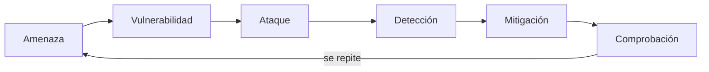
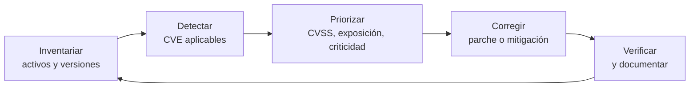
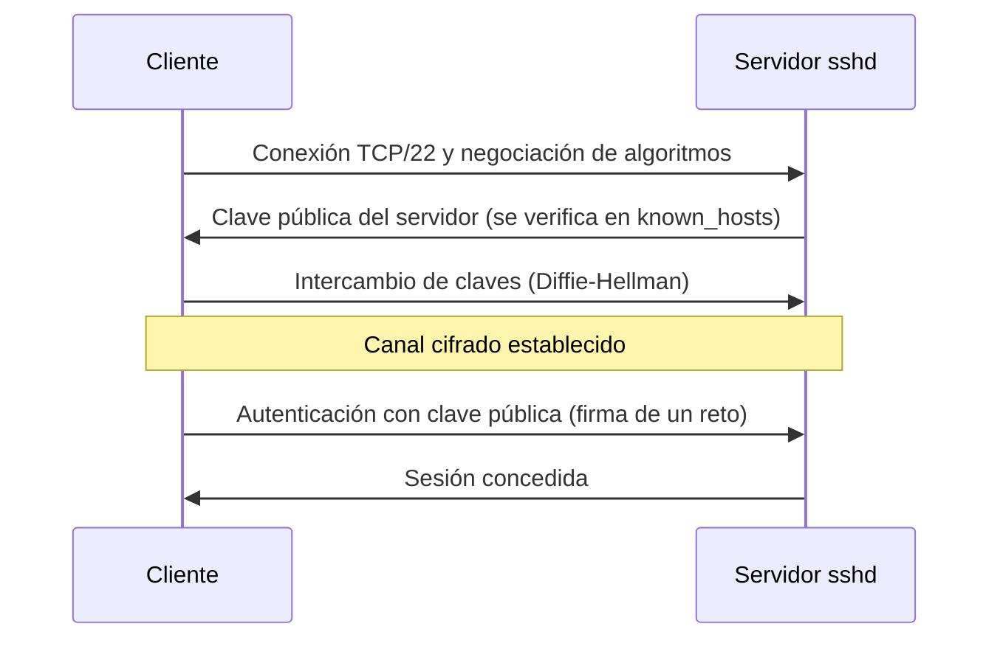

# UD04 · Fortificación de sistemas (*hardening*) y seguridad activa en el host

## Resumen del tema

Un servidor recién instalado **no es un servidor seguro**. Las instalaciones por defecto priorizan la comodidad: traen servicios que nadie ha pedido, aceptan contraseñas débiles, no filtran el tráfico y no guardan los registros que harían falta para investigar un incidente. **Fortificar** (en inglés, *hardening* o bastionado) es el proceso de **reducir la superficie de ataque** de un equipo: eliminar lo que no se necesita, restringir lo que sí se necesita y vigilar lo que queda.

En esta unidad aprendes a hacerlo sobre un servidor Linux (Debian 13 «trixie» como sistema de referencia, con las diferencias para AlmaLinux 10) y sobre Windows Server 2025. El hilo conductor es el ciclo defensivo que seguirás en todas las prácticas:

**amenaza → vulnerabilidad → ataque → detección → mitigación → comprobación**

Primero se entiende **qué amenaza** al sistema y cómo es un ataque por dentro (*Cyber Kill Chain*, MITRE ATT&CK); después se controla **quién entra** (autenticación, MFA, permisos, `sudo`), se **reduce lo expuesto** (arranque, servicios, cortafuegos, SSH, actualizaciones), se **confina y vigila** lo que queda (SELinux/AppArmor, antimalware, integridad, auditoría) y, si algo falla, se **responde** con método (análisis forense). Todo se mide: antes y después de cada cambio, con herramientas como Lynis u OpenSCAP.

> [!NOTE]
> Esta unidad es la primera del bloque de **seguridad activa** y es la más extensa del módulo (22 h). En el proyecto transversal [Mediterránea Dental](/guia/proyecto-clinica/) aplicarás todo a `srv-gestion`, el servidor con los historiales clínicos (datos de salud, categoría especial del RGPD). Lo que fortificas aquí se complementa con la [seguridad en redes (UD05)](/ud05/ud05-teoria/), el perímetro (UD06) y la alta disponibilidad (UD07).



### Planificación de la unidad

| Bloque | Horas |
|---|--:|
| Teoría (este documento) | 8 h |
| [Prácticas](/ud04/ud04-practicas/) (diez prácticas y la Tarea del proyecto, hito de la [INT-2](/guia/practicas-integradoras/)) | 12 h |
| Evaluación (prueba teórico-práctica de la unidad) | 2 h |
| **Total** | **22 h** |

| Apartado de la teoría | Horas |
|---|--:|
| 1. Superficie de ataque, principios y ciclo del *hardening* | 0,5 |
| 2. Amenazas lógicas y anatomía de un ataque | 1 |
| 3. Identificación, autenticación y autorización (MFA, contraseñas, biometría, PAM) | 0,75 |
| 4. Control de acceso y gestión de permisos | 1 |
| 5. Fortificación del sistema: guías, inventario, arranque, servicios, Windows y auditoría de bastionado | 1 |
| 6. Actualizaciones, origen del software y gestión de vulnerabilidades | 0,5 |
| 7. Seguridad de red del host: cortafuegos local, SSH y Fail2ban | 1 |
| 8. Control de acceso obligatorio: SELinux y AppArmor | 0,5 |
| 9. Antimalware e integridad de ficheros | 0,5 |
| 10. Registros y auditoría | 0,5 |
| 11. Respuesta a incidentes y análisis forense | 0,75 |
| **Total teoría** | **8** |

### Objetivos de aprendizaje

Al terminar esta unidad serás capaz de:

- Explicar qué es la superficie de ataque y aplicar los principios de mínimo privilegio, mínima exposición y defensa en profundidad (RA2.h).
- Clasificar las amenazas lógicas y describir la anatomía de un ataque con la *Cyber Kill Chain* y MITRE ATT&CK, relacionando cada fase con medidas preventivas y paliativas (RA2.a, RA2.c).
- Adoptar una política de contraseñas razonada y valorar el uso de MFA y de sistemas biométricos con sus tasas FAR/FRR (RA1.e, RA1.f).
- Gestionar usuarios, permisos, ACL y `sudo` con el mínimo privilegio (RA7.b).
- Fortificar el arranque, los servicios, el cortafuegos local y el acceso SSH de un servidor, y comprobar el resultado desde fuera con Nmap (RA2.h).
- Verificar el origen del software y el estado de actualización de un equipo (RA2.b).
- Confinar procesos con SELinux o AppArmor, detectar *malware* y cambios no autorizados (ClamAV, `rkhunter`, AIDE) y registrar y auditar la actividad (`journald`, `auditd`) (RA2.d, RA2.e).
- Medir el nivel de bastionado con Lynis y OpenSCAP y aplicar guías como los CIS Benchmarks o las CCN-STIC (RA2.c).
- Describir las fases del análisis forense y adquirir una evidencia preservando su integridad (RA1.i).

---

## 1. Superficie de ataque, principios y ciclo del *hardening*

### 1.1 Qué se protege y de qué

> [!NOTE]
> **Superficie de ataque** es el conjunto de puntos por los que un atacante podría intentar entrar o dañar un sistema: puertos abiertos, servicios, cuentas, paquetes instalados, ficheros con permisos excesivos, etc. Cuanto menor sea, menos oportunidades tiene.

Un servidor tiene tres clases de debilidades que el *hardening* trata de cerrar:

| Origen | Ejemplo | Cómo se reduce |
|---|---|---|
| **Software** (RA1.c) | Paquete con una vulnerabilidad conocida (CVE) | Actualizaciones y desinstalar lo innecesario |
| **Configuración** | `sshd` que acepta contraseñas y `root` | Guías de bastionado, auditoría con Lynis/OpenSCAP |
| **Humano / de procesos** | Contraseña débil reutilizada; cuenta de una persona que se fue | Política de contraseñas, MFA, revisión de accesos |

### 1.2 Principios que guían todo el *hardening*

| Principio | Significado | Ejemplo |
|---|---|---|
| **Mínimo privilegio** | Cada usuario o proceso tiene solo los permisos imprescindibles | El servidor web no se ejecuta como `root` |
| **Mínima exposición** | Solo se instala y se activa lo necesario | Si no usas FTP, no lo instales |
| **Defensa en profundidad** | Varias capas independientes: si una falla, otra protege | Cortafuegos + SSH con clave + Fail2ban + AppArmor |
| **Seguro por defecto** | Lo que no está permitido expresamente, está denegado | Política `drop` en el cortafuegos |
| **Trazabilidad** | Todo lo importante queda registrado | `auditd`, `journald` |
| **Verificación** | Una medida que no se comprueba no existe | Un escaneo `nmap` tras cada cambio |



> [!NOTE]
> **Ejemplo: reducir la superficie de ataque.** Un servidor instalado «con todo» escucha en 14 puertos, pero solo da un servicio web y administración remota. Cada puerto abierto es un posible punto de entrada. Se listan con `ss -tulpn`, se identifica qué proceso escucha en cada uno y se **elimina o se desactiva** lo que no se usa (`systemctl disable --now`). Resultado: 2 puertos expuestos (443 y 22 restringido por origen). Lo que no está instalado no puede ser atacado ni necesita parches.

### 1.3 El ciclo defensivo de cada medida

Cada medida de esta unidad se estudia con el mismo ciclo, que conviene interiorizar porque es también la estructura de las prácticas:



Ejemplo con SSH en `srv-gestion`: la **amenaza** es un atacante remoto; la **vulnerabilidad**, que `sshd` acepta contraseñas; el **ataque**, miles de intentos automáticos de acceso (técnica T1110 de MITRE ATT&CK); la **detección**, los registros de `journald` y los contadores de Fail2ban; la **mitigación**, exigir clave pública y segundo factor y bloquear las IP abusivas; y la **comprobación**, intentar entrar con contraseña y verificar que se rechaza.

### 1.4 Entorno de trabajo y convenciones

Los ejemplos usan el laboratorio del [proyecto transversal](/guia/proyecto-clinica/) (ver [Entorno de trabajo](/guia/entorno/)): `srv-gestion` (192.168.10.10) es el servidor a fortificar, `cli-recepcion` (192.168.10.50) hace de cliente y `atacante` simula las amenazas **solo dentro del laboratorio**. Cuando los comandos difieren entre distribuciones se muestran en pestañas:

- **Debian 13 «trixie» / Ubuntu Server LTS**: gestor `apt`, servicio SSH llamado `ssh`, control de acceso obligatorio **AppArmor**.
- **AlmaLinux 10 / Rocky**: gestor `dnf`, servicio SSH llamado `sshd`, control de acceso obligatorio **SELinux**.

> [!WARNING]
> **Regla de oro.** Antes de tocar una configuración crítica (SSH, cortafuegos, PAM, `sudoers`, `fstab`): (1) haz **copia del fichero**, (2) **mantén una segunda sesión abierta**, (3) **comprueba la sintaxis** antes de aplicar y (4) trabaja con una **instantánea** de la máquina virtual. Un error al endurecer SSH, PAM o el cortafuegos puede dejarte fuera de la máquina.

---

## 2. Amenazas lógicas y anatomía de un ataque

Una **amenaza lógica** es cualquier programa, instrucción o técnica que, sin ser un fallo físico, puede dañar la confidencialidad, la integridad o la disponibilidad de un sistema. Para defenderse hay que saber cómo se clasifican y cómo se desarrolla un ataque real.

### 2.1 Clasificación de las amenazas lógicas (RA2.a)

Se pueden clasificar de dos formas complementarias: por **lo que son** (software malicioso, técnicas de ataque) y por **el efecto** que producen sobre los principios de seguridad.

**a) Por su naturaleza**

| Familia | Ejemplos | Idea clave |
|---|---|---|
| ***Malware*** (software malicioso) | Virus, gusanos, troyanos, *ransomware*, *spyware*, *rootkits*, *botnets* | Programa creado para dañar, espiar o tomar el control |
| **Explotación de vulnerabilidades** | Desbordamiento de búfer, inyección SQL, fallos sin parchear | Se aprovecha un error de software o de configuración |
| **Ataques a credenciales** | Fuerza bruta, diccionario, *password spraying*, *credential stuffing* | Se obtiene acceso legítimo sin romper nada |
| **Ingeniería social** | *Phishing*, suplantación | Se engaña a la persona, no al sistema (UD01) |
| **Denegación de servicio** | DoS, DDoS | Se agota un recurso para impedir el servicio |
| **Amenazas internas** | Empleado descontento, error humano, cuenta olvidada | El riesgo viene de dentro de la organización |
| **Cadena de suministro** | Paquete o dependencia comprometidos | La entrada es *software* de confianza |

**b) Por el efecto sobre el sistema**

| Tipo | Qué hace | Principio afectado | Ejemplo |
|---|---|---|---|
| **Interrupción** | Inutiliza un recurso | Disponibilidad | DDoS, *ransomware* que cifra el servidor |
| **Interceptación** | Accede a información sin autorización | Confidencialidad | Captura de tráfico, *spyware* |
| **Modificación** | Altera información | Integridad | Cambiar un binario del sistema |
| **Fabricación** | Crea información falsa | Autenticidad | Correo con remitente suplantado |

### 2.2 *Malware*: tipos y comportamiento

**Malware** (*malicious software*) es cualquier software diseñado para dañar, espiar o tomar el control de un sistema sin el consentimiento de su responsable.

| Tipo | Característica principal | Ejemplo de comportamiento |
|---|---|---|
| **Virus** | Se adjunta a otros ficheros y necesita que se ejecuten | Infecta ejecutables o documentos |
| **Gusano** (*worm*) | Se propaga solo por la red aprovechando vulnerabilidades | WannaCry (2017) usó una vulnerabilidad de SMBv1 |
| **Troyano** | Aparenta ser legítimo, pero incluye funciones maliciosas | «Crack» de un programa que abre una puerta trasera |
| **Puerta trasera** (*backdoor*) | Permite acceso remoto oculto | El código malicioso introducido en `xz` (CVE-2024-3094) pretendía dar acceso por SSH |
| ***Ransomware*** | Cifra datos y pide un rescate; hoy suele robar los datos antes (doble extorsión) | LockBit, Akira |
| ***Spyware* / *infostealer*** | Roba información (contraseñas guardadas, cookies de sesión) | Robo de credenciales del navegador |
| ***Keylogger*** | Registra las pulsaciones del teclado | Captura la contraseña del banco |
| ***Rootkit*** | Se oculta en el sistema con privilegios elevados | Modifica el núcleo o las bibliotecas para esconder procesos |
| ***Botnet*** | Red de equipos infectados controlados remotamente | Cámaras IP usadas para DDoS (Mirai) |
| ***Cryptojacking*** | Usa los recursos del equipo para minar criptomonedas | Servidor con la CPU al 100 % sin motivo |
| ***Adware* / PUP** | Publicidad o programas no deseados | Barras de herramientas en el navegador |
| ***Fileless* / *living off the land*** | No deja ficheros: abusa de herramientas legítimas (PowerShell, `bash`, `curl`) | Descarga y ejecuta en memoria un *script* |

**Indicios técnicos de infección** que un administrador puede observar en Linux:

```bash
# Procesos que más CPU consumen (cryptojacking)
ps aux --sort=-%cpu | head -5

# Conexiones de red establecidas y programa que las abre
sudo ss -tupn state established

# Tareas programadas sospechosas (persistencia)
sudo crontab -l -u root
ls -la /etc/cron.d/ /etc/systemd/system/

# Ficheros modificados en los últimos 2 días en rutas de binarios
sudo find /usr/bin /usr/sbin -mtime -2 -type f
```

- `ps aux --sort=-%cpu` lista todos los procesos ordenados de mayor a menor uso de CPU.
- `ss -tupn` muestra sockets TCP (`t`) y UDP (`u`), el proceso asociado (`p`) y direcciones numéricas (`n`). `ss` es la herramienta actual; sustituye a `netstat`, que está obsoleta.
- `find -mtime -2` busca ficheros modificados hace menos de 2 días.

### 2.3 Anatomía de un ataque: *Cyber Kill Chain* (RA2.c)

Los ataques dirigidos suelen seguir una secuencia de fases. El modelo ***Cyber Kill Chain*** de Lockheed Martin es la forma más sencilla de explicarlo. Su utilidad para el defensor es esta: **romper cualquier eslabón de la cadena detiene el ataque**, lo que justifica la defensa en profundidad.

| Fase | Qué hace el atacante | Ejemplo contra `srv-gestion` | Medida preventiva o paliativa |
|---|---|---|---|
| 1. Reconocimiento | Recopila información | Escanea puertos con Nmap, busca empleados en redes sociales | Minimizar lo expuesto; detectar escaneos |
| 2. Preparación (*weaponization*) | Prepara el arma | Documento con macro o *exploit* para una versión concreta de un servicio | Inteligencia de amenazas |
| 3. Entrega | Hace llegar el arma | Correo de *phishing*; paquete trampa | Filtro de correo, formación, repositorios firmados |
| 4. Explotación | Aprovecha una vulnerabilidad | Se ejecuta la macro; se explota un servicio sin parchear | Actualizaciones, bloqueo de macros, AppArmor/SELinux |
| 5. Instalación | Se instala de forma persistente | Tarea `cron`, servicio `systemd` o clave en `authorized_keys` | AIDE, `auditd`, EDR |
| 6. Mando y control (C2) | Conecta con su servidor | Tráfico HTTPS a un dominio extraño | Cortafuegos de salida, *proxy*, IDS (UD05) |
| 7. Acciones sobre objetivos | Cumple su objetivo | Roba historiales clínicos y cifra el servidor | Segmentación, copias de seguridad, cifrado |

### 2.4 MITRE ATT&CK: el catálogo de técnicas

**MITRE ATT&CK** es una base de conocimiento pública que describe cómo operan los atacantes reales. Se organiza en **tácticas** (el *porqué*: el objetivo en cada fase) y **técnicas** (el *cómo*), con identificadores del tipo `T1110`. La matriz *Enterprise* tiene 14 tácticas:

| Táctica | Objetivo del atacante |
|---|---|
| Reconocimiento (*Reconnaissance*) | Reunir información |
| Desarrollo de recursos (*Resource Development*) | Preparar infraestructura y herramientas |
| Acceso inicial (*Initial Access*) | Entrar en la red o en el equipo |
| Ejecución (*Execution*) | Ejecutar código propio |
| Persistencia (*Persistence*) | Mantener el acceso tras reinicios o cambios de contraseña |
| Escalada de privilegios (*Privilege Escalation*) | Conseguir permisos más altos |
| Evasión de defensas (*Defense Evasion*) | Evitar ser detectado |
| Acceso a credenciales (*Credential Access*) | Robar usuarios y contraseñas |
| Descubrimiento (*Discovery*) | Conocer el entorno |
| Movimiento lateral (*Lateral Movement*) | Pasar a otros equipos |
| Recopilación (*Collection*) | Reunir los datos de interés |
| Mando y control (*Command and Control*) | Comunicarse con el equipo comprometido |
| Exfiltración (*Exfiltration*) | Sacar los datos |
| Impacto (*Impact*) | Destruir, cifrar o interrumpir |

Algunas técnicas relacionadas con esta unidad, y la defensa que practicarás:

| Técnica ATT&CK | Táctica | Defensa en esta unidad |
|---|---|---|
| T1110 Fuerza bruta (T1110.001 adivinar contraseñas, T1110.003 *password spraying*, T1110.004 *credential stuffing*) | Acceso a credenciales | Política de contraseñas, `faillock`, Fail2ban, MFA (P4.1, P4.2, P4.6) |
| T1078 Cuentas válidas | Acceso inicial / persistencia | MFA, revisión de cuentas, `auditd` |
| T1021.004 Servicios remotos: SSH | Movimiento lateral | `sshd` fortificado, `AllowUsers`, cortafuegos |
| T1098.004 Manipulación de cuenta: claves SSH autorizadas | Persistencia | AIDE sobre `~/.ssh`, `auditd` |
| T1053.003 Tarea programada: `cron` | Persistencia / ejecución | AIDE, revisión de `cron` (P4.8) |
| T1543.002 Servicio de sistema: `systemd` | Persistencia | AIDE, `auditd` sobre `/etc/systemd` |
| T1548.003 Abuso de `sudo` | Escalada de privilegios | Reglas `sudoers` mínimas, registro (P4.4) |
| T1014 *Rootkit* | Evasión de defensas | `rkhunter`, AIDE, Secure Boot (P4.7) |
| T1070 Borrado de indicadores | Evasión de defensas | Registros remotos, `auditd` |
| T1496 Secuestro de recursos (*cryptojacking*) | Impacto | Monitorización de CPU y conexiones |
| T1486 Datos cifrados para impacto (*ransomware*) | Impacto | Copias 3-2-1 (UD02), mínimo privilegio, antimalware |

> [!TIP]
> **Cómo se usa en la práctica.** Cuando analices un incidente, localiza cada observación en una táctica: «el atacante hizo fuerza bruta (Acceso a credenciales), creó una clave en `authorized_keys` (Persistencia) y cifró la carpeta de pacientes (Impacto)». Después pregúntate qué control habría detenido cada paso. Es el método para decidir **qué medidas priorizar**.

### 2.5 Ataques a contraseñas

Las credenciales son el objetivo más habitual. Estos son los ataques que debes reconocer:

| Ataque | Descripción | Contramedida |
|---|---|---|
| **Fuerza bruta** | Probar todas las combinaciones posibles | Longitud, bloqueo tras intentos fallidos, MFA |
| **Diccionario** | Probar palabras y contraseñas habituales | Rechazar contraseñas conocidas o filtradas |
| ***Password spraying*** | Probar una contraseña común (`Verano2026!`) contra muchas cuentas | Detección de intentos distribuidos, MFA |
| ***Credential stuffing*** | Usar pares usuario/contraseña filtrados de otros servicios | No reutilizar contraseñas, MFA |
| **Ataque *offline* al hash** | Si se roba el fichero de hashes, se prueban contraseñas sin límite de intentos | Algoritmos lentos con sal (yescrypt, Argon2): [UD03](/ud03/ud03-teoria/) |

¿Por qué es tan importante la **longitud**? El número de combinaciones posibles es `N^L`, siendo `N` el número de símbolos posibles y `L` la longitud. Este *script* estima cuánto tardaría un atacante con un equipo de varias GPU contra un *hash* rápido (10 000 millones de intentos por segundo):

```python
#!/usr/bin/env python3
"""Tiempo estimado para recorrer todas las combinaciones de una contraseña."""
import math

INTENTOS_POR_SEGUNDO = 1e10   # equipo con varias GPU contra un hash rápido

casos = {
    "8 minúsculas":                         (26, 8),
    "8 caracteres (may, min, num, sím)":    (94, 8),
    "12 caracteres (may, min, num, sím)":   (94, 12),
    "16 minúsculas":                        (26, 16),
    "Frase de 5 palabras (lista de 7776)":  (7776, 5),
}

for nombre, (simbolos, longitud) in casos.items():
    combinaciones = simbolos ** longitud
    bits = math.log2(combinaciones)
    segundos = combinaciones / INTENTOS_POR_SEGUNDO
    anios = segundos / (3600 * 24 * 365)
    print(f"{nombre:<38} {bits:5.1f} bits  {anios:12.2e} años")
```

```text
8 minúsculas                            37.6 bits      6.62e-07 años   (≈ 21 segundos)
8 caracteres (may, min, num, sím)       52.4 bits      1.93e-02 años   (≈ 7 días)
12 caracteres (may, min, num, sím)      78.7 bits      1.51e+06 años
16 minúsculas                           75.2 bits      1.38e+05 años
Frase de 5 palabras (lista de 7776)     64.6 bits      9.02e+01 años
```

La conclusión es clara: **la longitud aporta más seguridad que la complejidad**. Una frase de paso larga y fácil de recordar es mejor que una contraseña corta y complicada. Y la fuerza bruta *en línea* (contra el servicio) es mucho más lenta que la *offline*, porque el servidor puede limitar los intentos: por eso se combinan **bloqueo de cuentas** y **MFA**.

### 2.6 Herramientas preventivas y paliativas

| Tipo | Objetivo | Herramientas de esta unidad |
|---|---|---|
| **Preventivas** | Evitar que el ataque tenga éxito | Actualizaciones, mínimo privilegio, cortafuegos, SSH con clave y MFA, AppArmor/SELinux |
| **De detección** | Darse cuenta de que ocurre o ha ocurrido | `journald`, `auditd`, AIDE, `rkhunter`, ClamAV, Fail2ban |
| **Paliativas / de respuesta** | Limitar el daño y recuperar | Bloqueo de IP, cuarentena, copias de seguridad, análisis forense |

---

## 3. Identificación, autenticación y autorización

### 3.1 El modelo AAA

El control de acceso se apoya en cuatro pasos, a veces resumidos como **IAAA**:

| Paso | Pregunta | Ejemplo |
|---|---|---|
| **Identificación** | ¿Quién dices ser? | Escribo el usuario `ana` |
| **Autenticación** | ¿Cómo lo demuestras? | Introduzco la contraseña y el código del móvil |
| **Autorización** | ¿Qué puedes hacer? | Puedo leer `/srv/clinica` pero no `/srv/direccion` |
| **Auditoría** (*accounting*) | ¿Qué has hecho? | El sistema registra que abrí `historiales.csv` a las 10:20 |

### 3.2 Factores de autenticación

| Factor | Basado en | Ejemplos |
|---|---|---|
| **Algo que sabes** | Conocimiento | Contraseña, PIN, frase de paso |
| **Algo que tienes** | Posesión | Móvil con app TOTP, llave FIDO2, tarjeta inteligente, DNIe |
| **Algo que eres** | Inherencia (biometría) | Huella, rostro, iris, voz |

La **autenticación multifactor (MFA)** combina al menos **dos factores de tipos distintos**. Usuario + contraseña + PIN **no** es MFA (son dos factores del mismo tipo: conocimiento).

### 3.3 Políticas de contraseñas (RA1.e)

Las recomendaciones han cambiado mucho en los últimos años. La guía **NIST SP 800-63B** (revisión 4, 2025) y las guías del CCN e INCIBE coinciden en las ideas principales:

| Recomendación actual | Por qué |
|---|---|
| **Longitud mínima** de 15 caracteres si la contraseña es el único factor (8 si forma parte de un sistema MFA) y permitir al menos 64 | La longitud es lo que más aumenta la resistencia |
| Permitir **todos los caracteres**, incluidos espacios | Facilita las frases de paso |
| **No imponer reglas de composición** (obligar a mayúscula + número + símbolo) | Generan patrones previsibles: `Verano2026!` |
| **No obligar a cambiarla periódicamente**; cambiarla solo si hay indicios de compromiso | Los cambios forzados llevan a `Verano2026!` → `Otoño2026!` |
| Comparar con **listas de contraseñas filtradas** y comunes | Evita `123456`, `password`, `Admin2026` |
| **Limitar los intentos** fallidos | Frena la fuerza bruta en línea |
| Permitir **gestores de contraseñas** y pegar | Fomenta contraseñas largas y únicas |
| Usar **MFA** siempre que sea posible, y obligatoriamente en cuentas privilegiadas y accesos remotos | Una contraseña robada deja de ser suficiente |
| Almacenar las contraseñas con un **hash lento y con sal** | Dificulta los ataques *offline* (UD03) |

Ejemplo de **política de contraseñas** para una pequeña empresa (la que adoptarás en la práctica 4.1 para Mediterránea Dental):

```text
POLÍTICA DE CONTRASEÑAS - Versión 1.0
1. Cada persona usa una cuenta individual; se prohíben las cuentas compartidas.
2. Longitud mínima: 12 caracteres para cuentas con MFA y 15 sin MFA.
3. Se recomiendan frases de paso (p. ej. "tostada-azul-mochila-trueno").
4. Se rechazan contraseñas presentes en listas de contraseñas filtradas.
5. La cuenta se bloquea 15 minutos tras 5 intentos fallidos.
6. MFA obligatorio en correo, VPN y cuentas de administración.
7. Las contraseñas se cambian solo ante sospecha de compromiso.
8. Se usará el gestor de contraseñas corporativo (Bitwarden/KeePassXC).
9. Las cuentas de administración son distintas de las de uso diario.
10. Las cuentas se deshabilitan el mismo día de la baja del empleado.
```

> [!NOTE]
> Los sistemas operativos no aplican «las recomendaciones del NIST» por sí solos: hay que traducir cada punto a una configuración concreta (PAM en Linux, directivas de cuenta en Windows). Eso es lo que haces en el apartado 3.6.

#### Explora: cuánto tarda en romperse una contraseña



> [!TIP]
> **Consejo.** Ten claro qué cuenta como **factor**: algo que *sabes* (contraseña), algo que *tienes* (llave FIDO2, app TOTP) o algo que *eres* (huella). Dos contraseñas no son MFA, porque son el mismo factor. Y no todos los segundos factores valen igual: SMS < código TOTP < llave física FIDO2, que además resiste al *phishing* porque está ligada al sitio legítimo.

### 3.4 Autenticación multifactor (MFA)

No todos los segundos factores resisten igual a un atacante:

| Método | Resistencia al *phishing* | Comentario |
|---|---|---|
| SMS | Baja | Vulnerable a duplicado de SIM y a *phishing* |
| Código TOTP (app) | Media | El usuario puede teclearlo en una web falsa |
| Notificación *push* | Media | Riesgo de «fatiga de MFA» si se aprueba sin mirar |
| **Llave FIDO2 / *passkey*** | **Alta** | La credencial está ligada al dominio real: no funciona en una web falsa |

**TOTP** (*Time-based One-Time Password*, RFC 6238) genera un código de 6 dígitos que cambia cada 30 segundos. Cliente y servidor comparten un **secreto** (se transmite una sola vez, normalmente como código QR) y calculan el código a partir de ese secreto y de la hora actual con un HMAC (RFC 4226 para el HOTP en el que se basa). Por eso **el reloj de ambos debe estar sincronizado**. En Linux se integra con PAM mediante `libpam-google-authenticator` (a pesar del nombre, funciona con cualquier aplicación TOTP: FreeOTP, Aegis, KeePassXC…). Lo configurarás sobre SSH en la práctica 4.2.

**FIDO2 / WebAuthn y *passkeys*.** FIDO2 es el conjunto de estándares de la FIDO Alliance y del W3C (**WebAuthn** para el navegador y **CTAP2** para hablar con la llave) que sustituye a la contraseña por **criptografía de clave pública**: la llave (o el móvil, o el sistema operativo) genera un par de claves **por cada sitio**; la clave privada nunca sale del dispositivo y se desbloquea con un gesto local (PIN, huella). Una ***passkey*** es una credencial FIDO2 sincronizable entre dispositivos. Como la credencial está asociada al dominio, una web de *phishing* no puede usarla. OpenSSH admite llaves FIDO2 de forma nativa con claves `ed25519-sk`:

```bash
ssh-keygen -t ed25519-sk -O resident -O verify-required -C "ana@llave-fido2"   # requiere una llave física
```

- `-t ed25519-sk`: tipo de clave ligado a un autenticador de seguridad (*security key*).
- `-O resident`: guarda la credencial en la propia llave (se puede recuperar en otro equipo con `ssh-keygen -K`).
- `-O verify-required`: exige PIN o verificación de usuario además de tocar la llave.

### 3.5 Sistemas biométricos (RA1.f)

La **biometría** autentica a una persona por sus características físicas (huella, rostro, iris, geometría de la mano, venas) o de comportamiento (voz, forma de teclear, firma manuscrita).

**Funcionamiento**: en el **registro** (*enrolment*) se captura la característica y se guarda una **plantilla** matemática (no la imagen). En cada **verificación** se compara la nueva captura con la plantilla y se calcula una puntuación de similitud. Si supera un **umbral**, se acepta.

Los errores se miden con dos tasas:

| Tasa | Significado | Consecuencia |
|---|---|---|
| **FAR** (*False Acceptance Rate*) | Porcentaje de impostores aceptados | Problema de **seguridad** |
| **FRR** (*False Rejection Rate*) | Porcentaje de usuarios legítimos rechazados | Problema de **comodidad** |
| **EER** (*Equal Error Rate*) | Punto en que FAR = FRR | Cuanto más bajo, mejor es el sistema |

Si subimos el umbral, baja la FAR pero sube la FRR, y viceversa. Un centro de datos prioriza una FAR muy baja; un móvil busca un equilibrio.

| Ventajas | Inconvenientes |
|---|---|
| No se olvida ni se presta | **No se puede cambiar** si se compromete la plantilla |
| Difícil de transferir a otra persona | Falsos positivos y negativos |
| Cómoda y rápida | Posibles ataques de suplantación (huellas de silicona, fotos, *deepfakes*); se requiere detección de vida |
| Buena como segundo factor | Son **datos de categoría especial** según el art. 9 del RGPD: su tratamiento está muy restringido |

> [!IMPORTANT]
> En el ámbito laboral, la Agencia Española de Protección de Datos considera que el uso de biometría para el control horario es, con carácter general, desproporcionado si existen alternativas menos intrusivas (Guía de la AEPD sobre tratamientos de control de presencia mediante sistemas biométricos, 2023). Antes de implantar biometría hay que hacer un análisis de necesidad y proporcionalidad y una evaluación de impacto (EIPD).

### 3.6 PAM en Linux y directivas de cuenta en Windows

#### Qué es PAM

**PAM** (*Pluggable Authentication Modules*) es la capa que usan `login`, `sudo`, `sshd`, etc. para autenticar. Cada servicio tiene un fichero en `/etc/pam.d/` con reglas de cuatro tipos (`auth`, `account`, `password`, `session`) que invocan módulos (`pam_unix.so`, `pam_pwquality.so`, `pam_faillock.so`, `pam_google_authenticator.so`…). Cambiar el comportamiento de la autenticación es, por tanto, añadir o quitar módulos de la pila, sin tocar los programas.

> [!WARNING]
> Un error en PAM puede impedir **cualquier** inicio de sesión, incluido el de `root`. Deja siempre una sesión de `root` abierta mientras pruebas y copia el fichero antes (`sudo cp /etc/pam.d/common-password /etc/pam.d/common-password.bak`).

#### Calidad de contraseñas con `pwquality`

El módulo `pam_pwquality` rechaza contraseñas débiles **al cambiarlas**. Se configura en `/etc/security/pwquality.conf`:


{}
```bash
sudo apt install -y libpam-pwquality libpwquality-tools   # módulo PAM + utilidad pwscore
```
{}
{}
```bash
sudo dnf install -y libpwquality         # ya viene activado en el perfil de authselect
```
{}


```ini
# /etc/security/pwquality.conf
# longitud mínima
minlen = 12
# al menos 3 tipos de carácter (minúscula, mayúscula, dígito, símbolo)
minclass = 3
# máximo 3 caracteres iguales seguidos
maxrepeat = 3
# no puede contener el nombre de usuario
usercheck = 1
# intentos al cambiar la contraseña
retry = 3
# también se aplica a root
enforce_for_root
```

Comprobación (sin cambiar nada) con la utilidad `pwscore`, que puntúa una contraseña de 0 a 100 o indica por qué la rechaza:

```bash
echo 'abc123' | pwscore                     # falla: "The password is shorter than 8 characters"
echo 'Correcto-Caballo-Pila-7!' | pwscore   # puntuación alta
```

> [!TIP]
> Fíjate en que `minclass` es una regla de composición, que el NIST desaconseja. Se mantiene aquí porque muchas auditorías (CIS, ENS) todavía la piden: **documenta cuál adoptas y por qué**. El CE e) de RA1 pide «adoptar políticas de contraseñas», no copiar una receta.

#### Bloqueo por intentos fallidos con `faillock`

`pam_faillock` bloquea temporalmente una cuenta tras varios fallos seguidos: frena los intentos automáticos de adivinar contraseñas. Parámetros en `/etc/security/faillock.conf`:

```ini
# bloquea tras 5 fallos consecutivos
deny = 5
# los fallos cuentan si ocurren en 15 minutos
fail_interval = 900
# el bloqueo dura 10 minutos
unlock_time = 600
```


{}
`authselect` gestiona PAM de forma segura; **no** edites a mano los ficheros que genera.

```bash
sudo authselect current                          # perfil activo
sudo authselect enable-feature with-faillock     # activa faillock en el perfil
sudo authselect apply-changes
```
{}
{}
En Debian se añaden las líneas a `/etc/pam.d/common-auth` (sigue el esquema de `man pam_faillock`):

```bash
sudo cp /etc/pam.d/common-auth /etc/pam.d/common-auth.bak     # copia de seguridad
sudoedit /etc/pam.d/common-auth
```

```text
auth    required                        pam_faillock.so preauth
auth    [success=1 default=ignore]      pam_unix.so nullok
auth    [default=die]                   pam_faillock.so authfail
auth    sufficient                      pam_faillock.so authsucc
auth    requisite                       pam_deny.so
auth    required                        pam_permit.so
```

Y en `/etc/pam.d/common-account` añade la línea `account required pam_faillock.so`.

Para volver atrás: `sudo cp /etc/pam.d/common-auth.bak /etc/pam.d/common-auth`.
{}


```bash
sudo faillock --user ana           # ver intentos fallidos registrados
sudo faillock --user ana --reset   # desbloquear manualmente
```

> [!WARNING]
> El bloqueo de cuentas puede usarse como **denegación de servicio**: un atacante que conozca un usuario puede bloquearlo a propósito. Por eso en SSH conviene combinar claves públicas (sin contraseña que fallar) con Fail2ban, que bloquea la **IP** y no la cuenta. Prueba `faillock` siempre con un usuario de pruebas y no bloquees a `root` por consola.

#### Directivas de cuenta en Windows Server

En Windows las mismas ideas se configuran en **Directivas de cuenta** (*Account Policies*), dentro de la directiva de grupo (GPO) del dominio o de la directiva de seguridad local:

| Directiva | Ruta (`Configuración del equipo > Directivas > Configuración de Windows > Configuración de seguridad`) | Valor de referencia |
|---|---|---|
| Longitud mínima de la contraseña | Directivas de cuenta > Directiva de contraseñas | 12 o más |
| Umbral de bloqueo de cuenta | Directivas de cuenta > Directiva de bloqueo de cuenta | 5 intentos |
| Duración del bloqueo / restablecer contador | Directivas de cuenta > Directiva de bloqueo de cuenta | 15 minutos |

En un servidor independiente (sin dominio), `net accounts` y la consola `secpol.msc` actúan sobre la directiva local. Verás los comandos en el apartado 5.6.

---

## 4. Control de acceso y gestión de permisos

### 4.1 Modelos de control de acceso: DAC, MAC y RBAC

| Modelo | Quién decide | Ejemplo |
|---|---|---|
| **DAC** (*Discretionary Access Control*) | El **propietario** del recurso | Permisos `rwx` de UNIX, permisos NTFS |
| **MAC** (*Mandatory Access Control*) | **La política del sistema**, aunque seas propietario o `root` | SELinux, AppArmor (apartado 8) |
| **RBAC** (*Role-Based Access Control*) | El **rol** que desempeña la persona | Grupo `administracion` con acceso a facturación; roles en la base de datos |

En la práctica se combinan: DAC como base, RBAC mediante grupos y MAC como red de seguridad.

### 4.2 Cuentas y grupos en Linux

En Linux, cada usuario tiene un **UID** y pertenece a uno o más **grupos** (GID). La información está en:

| Fichero | Contenido |
|---|---|
| `/etc/passwd` | Usuario, UID, GID, directorio personal, *shell* |
| `/etc/shadow` | *Hash* de la contraseña y caducidad (solo legible por `root`) |
| `/etc/group` | Grupos y sus miembros |

```bash
sudo groupadd developers                             # crea el grupo
sudo useradd -m -s /bin/bash -c "Ana García" ana     # crea usuario con home y shell
sudo passwd ana                                      # establece contraseña
sudo usermod -aG developers ana                      # añade a un grupo SIN quitar los demás (-a es imprescindible)
id ana                                               # UID, GID y grupos
sudo passwd -l ana                                   # bloquea la contraseña (lock)
sudo usermod -s /usr/sbin/nologin cuenta_servicio    # cuenta que no puede abrir sesión
```

> [!CAUTION]
> `usermod -G grupo usuario` **sin** `-a` reemplaza todos los grupos suplementarios. Es un error clásico que deja a alguien sin acceso a `sudo`.

**Caducidad de contraseñas** con `chage`:

```bash
sudo chage -l ana            # muestra la política actual de la cuenta
sudo chage -M 90 -W 14 ana   # caduca a los 90 días, avisa 14 antes (solo si tu política lo exige)
```

### 4.3 Permisos clásicos y `umask`

Los permisos se asignan a **propietario / grupo / otros** (lectura `r`=4, escritura `w`=2, ejecución `x`=1).

```bash
ls -l /etc/shadow            # solo root (y, en Debian, el grupo shadow) pueden leerlo
chmod 640 fichero            # propietario rw-, grupo r--, otros ---
chmod -R o-rwx /srv/datos    # quita todo permiso a "otros", recursivamente
chown -R www-data:www-data /var/www/html     # en AlmaLinux el usuario web es "apache" o "nginx"
```

La **umask** indica qué permisos se *quitan* a los ficheros nuevos. Con `umask 027`, los ficheros nuevos se crean `640` y los directorios `750`:

```bash
umask            # valor actual (normalmente 0022)
umask 027        # solo para la sesión actual
```

Para hacerlo permanente: en `/etc/login.defs` (`UMASK 027`) o en `/etc/profile.d/`.

**Explora: calculadora de permisos y umask**

Marca permisos y comprueba el valor octal, la forma simbólica y el efecto del `umask` sobre los ficheros y directorios que se creen.



### 4.4 ACL POSIX: permisos finos

Los permisos clásicos solo permiten un propietario y un grupo. Las **ACL** (*Access Control Lists*) permiten dar permisos a usuarios o grupos adicionales sin cambiar el propietario.

```bash
sudo apt install -y acl                      # Debian (en AlmaLinux ya viene instalado)
sudo mkdir /srv/proyecto
sudo setfacl -m u:ana:rwx /srv/proyecto           # ana: lectura, escritura, ejecución
sudo setfacl -m g:auditores:rx /srv/proyecto      # grupo auditores: solo lectura
sudo setfacl -d -m g:auditores:rx /srv/proyecto   # -d: ACL por defecto para ficheros futuros
getfacl /srv/proyecto                             # ver las ACL
```

Si un fichero tiene ACL, `ls -l` muestra un `+` al final de los permisos (`drwxrwx---+`). Ten en cuenta que la **máscara** (`mask::`) limita los permisos efectivos de las entradas de usuario y grupo: `getfacl` marca con `#effective:` lo que realmente se concede.

> [!NOTE]
> **Ejemplo: lectura de un directorio.** Un directorio `/srv/datos` con permisos `750`, propietario `root` y grupo `clinica`: el propietario lo gestiona todo, los miembros de `clinica` pueden listar y entrar (r-x) pero no crear ni borrar, y el resto no puede ni listar. Recuerda que **el permiso `x` en un directorio significa poder atravesarlo**; sin él no accedes a lo que contiene, aunque tengas permiso sobre los ficheros.

### 4.5 ACL de NTFS en Windows

En Windows Server los permisos NTFS son ACL con herencia. Se gestionan en la pestaña *Seguridad* del recurso o con `icacls`:

```powershell
# Quitar la herencia y conservar una copia de los permisos heredados como explícitos
icacls D:\Clinica /inheritance:d
# Dar lectura y ejecución al grupo Auditores sobre la carpeta y su contenido (OI = objetos, CI = contenedores)
icacls D:\Clinica /grant "Auditores:(OI)(CI)RX"
# Quitar el permiso al grupo Todos
icacls D:\Clinica /remove Todos
# Ver el resultado
icacls D:\Clinica
```

> [!NOTE]
> Los permisos de **recurso compartido** (SMB) y los de **NTFS** se combinan: el efectivo es el más restrictivo de los dos. Es habitual dejar el recurso compartido en *Control total* para el grupo adecuado y filtrar con NTFS.

### 4.6 Bits especiales

| Bit | Valor | Efecto | Riesgo |
|---|---|---|---|
| **SUID** | 4000 | El programa se ejecuta con los privilegios de su **propietario** | Un SUID `root` vulnerable permite escalar privilegios |
| **SGID** | 2000 | En ejecutables, con el grupo propietario; en directorios, los ficheros heredan el grupo | Igual que SUID, con el grupo |
| **Sticky** | 1000 | En un directorio, solo el propietario puede borrar sus ficheros (como `/tmp`) | — |

`passwd` necesita ser SUID `root` para poder escribir en `/etc/shadow`. Lo que debe alarmarte es un SUID **inesperado** (por ejemplo, en `/tmp` o en un binario que no recuerdas):

```bash
sudo find / -xdev -perm -4000 -type f -ls 2>/dev/null     # lista los SUID
sudo find / -xdev -type f -perm -0002 -ls 2>/dev/null     # ficheros escribibles por cualquiera
sudo find / -xdev \( -nouser -o -nogroup \) 2>/dev/null   # ficheros huérfanos
```

### 4.7 Elevación controlada de privilegios: `sudo` y UAC

Trabajar como `root` permanentemente es peligroso: cualquier error o ataque tiene poder total. **`sudo`** (*superuser do*) permite ejecutar **comandos concretos** con privilegios de otro usuario, **registrando** quién hizo qué. La configuración está en `/etc/sudoers` y en `/etc/sudoers.d/`.

> [!WARNING]
> **Edita siempre `sudoers` con `visudo`** (o con `visudo -f /etc/sudoers.d/fichero`), que comprueba la sintaxis al guardar. Un error de sintaxis puede impedir usar `sudo` y dejarte sin privilegios. Comprueba con `sudo visudo -c` antes de cerrar la sesión.

```bash
sudo visudo -f /etc/sudoers.d/10-webadmins     # crea/edita un fichero de reglas propio
```

Contenido de ejemplo:

```text
# Los miembros del grupo webadmins pueden reiniciar nginx y ver sus logs, y nada más
%webadmins ALL=(root) /usr/bin/systemctl restart nginx, /usr/bin/journalctl -u nginx
```

Estructura de la regla: `quién  máquina=(como_quién)  comandos`.

```bash
sudo visudo -c                       # comprueba la sintaxis de todos los ficheros sudoers
sudo -l -U ana                       # qué puede hacer ana con sudo
sudo journalctl _COMM=sudo           # registro de usos de sudo
```

> [!WARNING]
> Evita reglas `ALL=(ALL) NOPASSWD: ALL`. Permitir `sudo vim`, `sudo less` o `sudo find` equivale a dar una *shell* de `root`, porque esos programas permiten ejecutar otros comandos desde su interior (técnica T1548.003 de ATT&CK).

**UAC** (*User Account Control*) es el mecanismo equivalente en Windows. Cuando una persona administradora inicia sesión, Windows le da **dos *tokens***: uno filtrado (de usuario estándar) con el que corre todo por defecto y otro completo que solo se usa tras una confirmación (el aviso de elevación). Así, un programa malicioso lanzado por error no hereda privilegios de administración sin que alguien lo apruebe. El comportamiento se ajusta por directiva (*Control de cuentas de usuario: comportamiento de la petición de elevación para los administradores*) y no debe desactivarse.

> [!TIP]
> **Consejo.** Edita siempre `sudoers` con `visudo`, que valida la sintaxis antes de guardar: un error en ese fichero puede dejarte sin `sudo` y sin la posibilidad de arreglarlo. Mejor aún, no toques el fichero principal y añade tus reglas en `/etc/sudoers.d/` comprobándolas con `visudo -cf`. Aplica el mínimo privilegio: autoriza **órdenes concretas** a grupos concretos, no `ALL` a todos.

### 4.8 Ajustes del *kernel* con `sysctl`

`sysctl` modifica parámetros del *kernel* en caliente. Se hacen persistentes en `/etc/sysctl.d/`. Crea el fichero `/etc/sysctl.d/99-hardening.conf` (con `sudoedit`) con este contenido:

```ini
# Protección contra falsificación de origen (anti-spoofing)
net.ipv4.conf.all.rp_filter = 1
net.ipv4.conf.default.rp_filter = 1
# No aceptar ni enviar redirecciones ICMP
net.ipv4.conf.all.accept_redirects = 0
net.ipv6.conf.all.accept_redirects = 0
net.ipv4.conf.all.send_redirects = 0
# No aceptar enrutamiento de origen
net.ipv4.conf.all.accept_source_route = 0
# Protección frente a SYN flood
net.ipv4.tcp_syncookies = 1
# Ocultar direcciones del kernel y restringir dmesg
kernel.kptr_restrict = 2
kernel.dmesg_restrict = 1
```

```bash
sudo sysctl --system            # carga todos los ficheros de configuración
sysctl net.ipv4.tcp_syncookies  # comprueba un valor concreto
```

> [!NOTE]
> Un servidor que actúe como **router** necesita `net.ipv4.ip_forward = 1`. No lo desactives en esos casos (lo verás en las unidades 6 y 7).

---

## 5. Fortificación del sistema

### 5.1 Guías de bastionado

No hay que inventar qué endurecer. Existen guías elaboradas por expertos y, en muchos casos, herramientas que comprueban automáticamente si se cumplen:

| Guía | Organismo | Uso |
|---|---|---|
| **CIS Benchmarks** | Center for Internet Security | Listas de configuraciones recomendadas por sistema (Debian, AlmaLinux, Windows Server…), en **niveles 1** (básico, poco impacto) y **2** (entornos de alta seguridad). Cada recomendación indica la comprobación y la corrección |
| **Guías CCN-STIC** (series 600 y 800) | Centro Criptológico Nacional (España) | Guías de configuración segura de sistemas, ligadas al Esquema Nacional de Seguridad (ENS). Las 600 tratan de sistemas y aplicaciones concretos; las 800 desarrollan el ENS |
| **Microsoft Security Baselines** | Microsoft | Líneas base de seguridad para Windows y Windows Server (*Security Compliance Toolkit*) |
| **OpenSCAP / SCAP Security Guide** | Proyecto libre | Auditoría automática de cumplimiento en Linux con perfiles como CIS o ANSSI |
| **Lynis** | CISOfy (proyecto libre) | Auditoría local con puntuación (*hardening index*) y sugerencias |

> [!TIP]
> Antes de aplicar una recomendación pregúntate: *¿qué ataque evita? ¿qué puede dejar de funcionar si la aplico?* Una guía no sustituye al criterio del administrador: documenta las medidas que decides **no** aplicar y por qué. Los CIS Benchmarks se descargan en PDF previo registro gratuito; en un laboratorio sirven como lista de comprobación, y OpenSCAP o Lynis automatizan gran parte de ella.

### 5.2 Inventario: conocer lo que hay antes de endurecer

No se puede proteger lo que no se conoce. El primer paso es un **inventario** del *host* (RA2.h):

```bash
hostnamectl                       # nombre, sistema operativo, kernel, virtualización
cat /etc/os-release               # distribución y versión exacta
uname -r                          # versión del kernel
ip -br a                          # interfaces y direcciones (formato breve)
sudo ss -tulpn                    # puertos a la escucha y proceso asociado
systemctl list-unit-files --state=enabled --type=service   # servicios que arrancan solos
getent passwd | awk -F: '$3>=1000 && $3<65000 {print $1}'  # usuarios "humanos"
sudo find / -xdev -perm -4000 -type f 2>/dev/null           # ficheros SUID
```

Qué hace cada uno:

- `ss -tulpn`: *socket statistics*; `-t` TCP, `-u` UDP, `-l` solo los que escuchan (*listening*), `-p` muestra el proceso, `-n` no resuelve nombres. Sustituye al antiguo `netstat`, que está obsoleto.
- `getent passwd`: lista usuarios de todas las fuentes (local, LDAP…). Los UID menores de 1000 suelen ser cuentas del sistema.
- `-perm -4000`: ficheros con el bit **SUID** (apartado 4.6).

Guarda siempre la salida: será tu **línea base** para comparar después de endurecer.

### 5.3 Seguridad del arranque y cifrado de disco

Si un atacante tiene acceso físico o a la consola, puede arrancar otro sistema o modificar el cargador. Defensas:

- **UEFI *Secure Boot***: el firmware solo ejecuta cargadores firmados por una clave de confianza (en Debian y AlmaLinux, mediante el *shim* firmado y la clave de la distribución). Frena *bootkits* y cargadores manipulados.
- **Contraseña de UEFI/BIOS** y orden de arranque restringido.
- **Contraseña de GRUB**: impide editar los parámetros del *kernel* (por ejemplo `init=/bin/bash`, que da una *shell* de `root` sin contraseña).

```bash
mokutil --sb-state             # SecureBoot enabled / disabled
```

Contraseña de GRUB (Debian). Genera primero el *hash* PBKDF2, que evita guardar la contraseña en claro:

```bash
grub-mkpasswd-pbkdf2          # pide la contraseña dos veces y devuelve "grub.pbkdf2.sha512.10000...."
sudo cp /etc/grub.d/40_custom /root/40_custom.bak
sudoedit /etc/grub.d/40_custom   # añade al final las dos líneas siguientes
```

```text
set superusers="admingrub"
password_pbkdf2 admingrub grub.pbkdf2.sha512.10000.HASH_GENERADO
```

```bash
sudo update-grub                 # Debian: regenera grub.cfg
```

> [!NOTE]
> En Debian las entradas de arranque normales siguen arrancando sin pedir la contraseña (llevan `--unrestricted`); esta solo se exige para **editar** una entrada o abrir la línea de órdenes de GRUB, que es lo que interesa. En AlmaLinux la contraseña de GRUB se establece con `sudo grub2-setpassword`.

**Cifrado de disco.** Sin cifrado, la contraseña de GRUB **no basta**: quien extraiga el disco lo lee entero desde otro equipo. **LUKS** (*Linux Unified Key Setup*) es el estándar de cifrado de volúmenes en Linux, gestionado con `cryptsetup` sobre `dm-crypt`; en Windows el equivalente es **BitLocker** (apartado 5.6). Cifra los bloques con AES-XTS y protege la clave maestra con una o varias contraseñas (*keyslots*). Aquí solo interesa su papel en el bastionado: protege los **datos en reposo** (un portátil robado, un disco retirado sin borrar) pero **no** protege con el equipo encendido y la sesión abierta, ni frente a un atacante que ya tenga privilegios en el sistema.

> [!CAUTION]
> Con LUKS, si se corrompe la cabecera o se pierden todas las contraseñas, los datos son irrecuperables. Haz copia de la cabecera (`cryptsetup luksHeaderBackup`) y guárdala **fuera** del equipo y protegida.

El funcionamiento interno de LUKS (algoritmos, *keyslots*, derivación de la clave) y la práctica completa de creación, apertura, copia de cabecera y recuperación se desarrollan en la [UD03. Criptografía](/ud03/ud03-teoria/) y sus [prácticas](/ud03/ud03-practicas/). En esta unidad solo debes recordar **dónde encaja** en el bastionado y comprobar si un servidor lo usa (`lsblk -f` muestra los volúmenes `crypto_LUKS`).

### 5.4 Servicios, puertos y procesos

Cada servicio activo es una puerta potencial. El objetivo: que **solo estén activos los servicios necesarios y solo en las interfaces necesarias** (RA2.h).

```bash
systemctl list-units --type=service --state=running       # servicios en ejecución ahora
systemctl list-unit-files --state=enabled --type=service  # los que arrancan al iniciar
sudo ss -tulpn                                            # puertos a la escucha
```

Interpreta la salida de `ss`: la columna *Local Address:Port* indica **dónde** escucha.

| Dirección | Significado |
|---|---|
| `0.0.0.0:22` | Escucha en **todas** las interfaces IPv4 (accesible desde la red) |
| `127.0.0.1:3306` | Solo en local (no accesible desde fuera): **lo ideal** para una base de datos |
| `[::]:80` | Todas las interfaces IPv6 |

**Parar, deshabilitar y enmascarar**

```bash
sudo systemctl disable --now cups.service     # --now: lo para ahora y evita que arranque en el siguiente inicio
sudo systemctl mask bluetooth.service         # lo enlaza a /dev/null: nadie puede arrancarlo, ni como dependencia
sudo apt purge -y telnetd                     # lo más seguro: desinstalar (AlmaLinux: sudo dnf remove ...)
```

`systemctl` es la orden con la que se controla `systemd`, el sistema de inicio de Debian, Ubuntu y AlmaLinux; `disable` quita el arranque automático, `--now` además lo detiene, y `mask` lo bloquea por completo.

**Aislamiento de servicios con `systemd`.** `systemd` puede **aislar** cada servicio (sistema de ficheros de solo lectura, sin acceso a `/home`, sin privilegios nuevos…). `systemd-analyze security` puntúa el nivel de exposición (0 = seguro, 10 = totalmente expuesto):

```bash
systemd-analyze security                       # resumen de todos los servicios
systemd-analyze security nginx.service         # detalle de uno
```

Se pueden añadir restricciones con un *drop-in* sin tocar el fichero original:

```bash
sudo systemctl edit nginx.service              # crea /etc/systemd/system/nginx.service.d/override.conf
```

```ini
[Service]
# /usr, /boot y /etc de solo lectura para este servicio
ProtectSystem=full
# sin acceso a /home
ProtectHome=true
# /tmp propio y aislado
PrivateTmp=true
# no puede ganar privilegios (impide los efectos de SUID)
NoNewPrivileges=true
```

```bash
sudo systemctl restart nginx && systemctl is-active nginx    # comprueba que sigue funcionando
```

> [!TIP]
> Si tras aplicar restricciones el servicio falla, elimina el *override* (`sudo systemctl revert nginx.service`) y añade las opciones de una en una.

{}
**¿Qué diferencia hay entre `systemctl disable` y `systemctl mask`? ¿Cuál usarías para un servicio que nunca debe arrancar?**

`disable` impide el arranque automático, pero se puede iniciar a mano o por dependencia; `mask` lo enlaza a `/dev/null` y nada puede iniciarlo. Para algo que nunca debe ejecutarse: `mask`.
{}

> [!NOTE]
> **Comentario.** Verificar «desde fuera» importa porque **tu cortafuegos y tu servicio ven cosas distintas**. `ss` te dice qué está escuchando en el servidor; `nmap` desde otra máquina te dice qué puede alcanzar de verdad un atacante. Si coinciden, la regla funciona; si el puerto escucha pero Nmap lo ve «filtrado», el cortafuegos hace su trabajo. Guarda siempre las dos salidas, antes y después.

### 5.5 Verificar desde fuera con Nmap

`ss` te dice lo que escucha *dentro* del equipo; **Nmap** muestra lo que ve un atacante *desde la red* (y, por tanto, lo que deja pasar el cortafuegos). Es la fase de reconocimiento de la *Kill Chain*, usada ahora por el defensor.

```bash
sudo apt install -y nmap          # AlmaLinux: sudo dnf install -y nmap
nmap -sV -p- 192.168.10.10        # -p- todos los puertos; -sV detecta la versión del servicio
```

| Estado de Nmap | Significado |
|---|---|
| `open` | Hay un servicio que responde |
| `closed` | El equipo responde (RST) pero no hay servicio |
| `filtered` | Nadie responde: un cortafuegos descarta los paquetes |

> [!CAUTION]
> **Nmap solo contra tus máquinas de laboratorio.** Escanear sistemas ajenos sin permiso puede ser ilegal (Código Penal, art. 197 bis y siguientes). En el laboratorio, escanea únicamente `192.168.10.0/24`, nunca redes públicas ni la red del centro.

### 5.6 Fortificación de Windows Server 2025

Los principios son los mismos; cambian las herramientas.

| Medida | Herramienta |
|---|---|
| Línea base de seguridad | **Microsoft Security Baselines** (*Security Compliance Toolkit*) y GPO |
| Contraseñas y bloqueo | Directivas de cuenta (GPO) o `net accounts` |
| Antimalware | **Microsoft Defender Antivirus** (incluido) |
| Cifrado de disco | **BitLocker** |
| Contraseña del administrador local única por equipo | **Windows LAPS** (incluido en Windows Server 2025) |
| Cortafuegos | **Windows Defender Firewall with Advanced Security** |
| Auditoría | Directivas de auditoría avanzada y registro de eventos |

Ejemplos en **PowerShell** (como Administrador):

```powershell
# Estado de Microsoft Defender y actualización de firmas
Get-MpComputerStatus | Select-Object AMServiceEnabled, AntivirusEnabled, AntivirusSignatureLastUpdated
Update-MpSignature

# Análisis rápido
Start-MpScan -ScanType QuickScan

# Cortafuegos activado en todos los perfiles y bloqueo de entrada por defecto
Set-NetFirewallProfile -Profile Domain,Private,Public -Enabled True -DefaultInboundAction Block
Get-NetFirewallProfile | Format-Table Name, Enabled, DefaultInboundAction

# Permitir RDP solo desde la red de administración
New-NetFirewallRule -DisplayName "RDP admin" -Direction Inbound -Protocol TCP -LocalPort 3389 `
  -RemoteAddress 192.168.10.0/24 -Action Allow

# Desactivar SMBv1 (protocolo obsoleto y vulnerable; en Windows Server 2025 ya no viene instalado)
Set-SmbServerConfiguration -EnableSMB1Protocol $false -Force
Get-SmbServerConfiguration | Select-Object EnableSMB1Protocol

# Bloqueo de cuenta tras 5 intentos durante 15 minutos y contraseña mínima de 12
net accounts /lockoutthreshold:5 /lockoutduration:15 /lockoutwindow:15 /minpwlen:12

# Auditoría de inicios de sesión (correctos y fallidos). Se usa el GUID de la subcategoría "Logon"
# porque el nombre depende del idioma del sistema ("Inicio de sesión" en español).
auditpol /set /subcategory:"{0CCE9215-69AE-11D9-BED3-505054503030}" /success:enable /failure:enable
auditpol /get /subcategory:"{0CCE9215-69AE-11D9-BED3-505054503030}"
```

> [!WARNING]
> Con `DefaultInboundAction Block` y sin reglas de permiso, puedes perder el acceso remoto (RDP, WinRM). Crea antes las reglas necesarias y trabaja con una instantánea.

**BitLocker** (requiere TPM o, en laboratorio, una directiva que permita protección solo con contraseña):

```powershell
Get-BitLockerVolume
Enable-BitLocker -MountPoint "D:" -EncryptionMethod XtsAes256 -PasswordProtector -UsedSpaceOnly
Add-BitLockerKeyProtector -MountPoint "D:" -RecoveryPasswordProtector     # clave de recuperación
```

> [!WARNING]
> Guarda la **clave de recuperación** de BitLocker fuera del equipo; sin ella no hay forma de recuperar los datos si se pierde la contraseña.

**Windows LAPS** guarda en Active Directory una contraseña de administrador local **distinta y rotada** en cada equipo, evitando que el robo de una credencial dé acceso a toda la red:

```powershell
Update-LapsADSchema                                    # una vez por bosque
Set-LapsADComputerSelfPermission -Identity "OU=Servidores,DC=clinica,DC=local"
Get-LapsADPassword -Identity SRV01 -AsPlainText        # consulta (requiere permisos delegados)
```

Su activación se hace con una GPO («Configuración de LAPS»). Los detalles completos están en la documentación de Microsoft. Una vez fortificado el sistema, el visor de eventos permite localizar los intentos fallidos de inicio de sesión (evento **4625**) y los correctos (**4624**), equivalentes a lo que en Linux consultas con `journalctl`.

### 5.7 Auditoría automatizada del bastionado: Lynis y OpenSCAP

Medir es la mitad del bastionado: sin una medición antes y después no puedes demostrar que una medida ha servido. Hay dos herramientas libres que cubren necesidades distintas:

| | **Lynis** | **OpenSCAP** |
|---|---|---|
| Qué es | Auditor local con *scripts* de comprobación y puntuación global | Implementación del estándar SCAP del NIST para auditar contra perfiles |
| Resultado | *Hardening index* (0-100) y sugerencias | Informe de cumplimiento por regla (*pass/fail*) contra un perfil (CIS, ANSSI, STIG…) |
| Ventaja | Rápido, sin configuración | Comparable con una norma concreta; trae la corrección de cada regla |
| Inconveniente | Las sugerencias son genéricas | Los perfiles disponibles dependen de la distribución y versión |

**Lynis** es una **auditoría local sin ataques**:

```bash
sudo apt install -y lynis        # AlmaLinux: sudo dnf install -y epel-release && sudo dnf install -y lynis
lynis --version                  # anota la versión (la de los repositorios puede ser antigua)
sudo lynis audit system          # recorre todas las categorías
sudo grep -E "^(hardening_index|warning\[\]|suggestion\[\])" /var/log/lynis-report.dat | head -20
```

Procedimiento recomendado: auditar → elegir 3-5 sugerencias de mayor impacto → aplicarlas → **volver a auditar** y comparar el índice.

> [!TIP]
> Una puntuación más alta no es el objetivo en sí. Cada sugerencia debe valorarse: algunas pueden romper un servicio que necesitas. Documenta las que decides **no aplicar** y por qué.

**OpenSCAP** evalúa el sistema contra un perfil de la **SCAP Security Guide** y genera un informe HTML:

```bash
apt search ^ssg-                                                # qué paquetes de contenido SCAP ofrece tu versión
sudo apt install -y openscap-scanner ssg-base ssg-debian        # Debian: la herramienta oscap y los contenidos
ls /usr/share/xml/scap/ssg/content/                             # contenidos disponibles (ficheros *-ds.xml)
oscap info /usr/share/xml/scap/ssg/content/FICHERO-ds.xml       # lista los perfiles del fichero elegido
```

```bash
# Evaluación (sustituye FICHERO y PERFIL por los que muestre oscap info)
sudo oscap xccdf eval --profile PERFIL \
     --results resultado.xml --report informe.html \
     /usr/share/xml/scap/ssg/content/FICHERO-ds.xml
```

- `oscap xccdf eval`: ejecuta una evaluación XCCDF (el formato de listas de comprobación de SCAP).
- `--profile`: el perfil de reglas a comprobar (el identificador aparece en `oscap info`).
- `--results` y `--report`: guardan el resultado en XML y un informe HTML legible.

> [!NOTE]
> Los paquetes y los contenidos disponibles cambian entre versiones de Debian y de AlmaLinux (en esta última, el paquete es `scap-security-guide`). **Consulta la documentación del proyecto** y el contenido de `/usr/share/xml/scap/ssg/content/` para ver para qué versión del sistema hay perfil. Si no existe uno para tu versión exacta, úsalo solo como orientación y anótalo en el informe.

---

## 6. Actualizaciones, origen del software y gestión de vulnerabilidades

Las vulnerabilidades conocidas son la vía de entrada más habitual. Mantener el sistema actualizado y **verificar de dónde procede el software** (RA2.b) es la medida más rentable.

### 6.1 Firmas de repositorios y verificación del origen

Los gestores de paquetes verifican con criptografía (UD03) que los paquetes no han sido alterados:

- **APT**: los repositorios están firmados con claves GPG almacenadas en `/etc/apt/keyrings/` o `/usr/share/keyrings/`. Cada repositorio de terceros debe referenciar **su** clave con `signed-by=` (el antiguo `apt-key` está retirado).
- **DNF/RPM**: `gpgcheck=1` en cada `.repo` y paquetes firmados.
- **Descargas sueltas**: se comparan con la **suma de verificación** (SHA-256) publicada por el proyecto, idealmente obtenida por un canal distinto, y con su firma GPG si la hay.

```bash
apt policy openssh-server            # Debian: de qué repositorio viene y qué versión se instalaría
rpm -K paquete.rpm                   # AlmaLinux: comprobar la firma de un RPM descargado
sudo apt install -y debsums && sudo debsums -s openssh-server   # Debian: ficheros modificados (sin salida = correcto)
sudo rpm -V openssh-server           # AlmaLinux: sin salida = todo correcto
sha256sum -c SHA256SUMS --ignore-missing   # comprobar una descarga contra la lista de sumas publicada
```

Ejemplo de repositorio de terceros con la sintaxis actual (formato *deb822* y clave en `/etc/apt/keyrings`; el nombre y las URL son ilustrativos):

```text
# /etc/apt/sources.list.d/ejemplo.sources
Types: deb
URIs: https://repo.ejemplo.org/debian
Suites: trixie
Components: main
Signed-By: /etc/apt/keyrings/ejemplo.gpg
```

> [!WARNING]
> Nunca uses `curl ... | sudo bash` sin revisar el *script*, ni desactives `gpgcheck`, ni uses `--allow-unauthenticated`. Es instalar código de origen desconocido con permisos de `root`. El caso de `xz` (CVE-2024-3094) demostró que incluso un componente legítimo puede ser un vector: de ahí la importancia de vigilar versiones y de aplicar mínimo privilegio.

### 6.2 Actualizar y reiniciar cuando haga falta


{}
```bash
sudo apt update                      # descarga la lista de paquetes disponibles
apt list --upgradable                # qué se actualizaría
sudo apt upgrade -y                  # aplica las actualizaciones
sudo apt install -y needrestart      # avisa de servicios que usan librerías antiguas
sudo needrestart -r l                # lista (l) lo que habría que reiniciar
```
{}
{}
```bash
sudo dnf check-update                # qué hay disponible
sudo dnf upgrade -y                  # aplica
sudo dnf updateinfo list security    # solo avisos de seguridad
sudo dnf needs-restarting -r         # ¿hace falta reiniciar? (código de salida 1 = sí)
```
{}


### 6.3 Actualizaciones automáticas de seguridad


{}
```bash
sudo apt install -y unattended-upgrades
sudo dpkg-reconfigure -plow unattended-upgrades       # activa la tarea periódica
sudo unattended-upgrade --dry-run --debug | tail      # simulación: no cambia nada
```

Configuración en `/etc/apt/apt.conf.d/50unattended-upgrades` (por defecto, solo actualizaciones de seguridad).
{}
{}
```bash
sudo dnf install -y dnf-automatic
sudo sed -i 's/^apply_updates.*/apply_updates = yes/' /etc/dnf/automatic.conf
sudo sed -i 's/^upgrade_type.*/upgrade_type = security/' /etc/dnf/automatic.conf
sudo systemctl enable --now dnf-automatic.timer
systemctl list-timers dnf-automatic.timer             # próxima ejecución
```
{}


En Windows Server, el equivalente es **Windows Update** (con directivas de grupo que programan descargas e instalaciones) o **WSUS** (*Windows Server Update Services*), que permite aprobar las actualizaciones antes de distribuirlas a los equipos de la organización.

> [!NOTE]
> En servidores críticos se prueban primero las actualizaciones en un entorno de preproducción y se aplican en una ventana de mantenimiento; la automatización plena suele reservarse a los parches de seguridad.

### 6.4 Ciclo de gestión de vulnerabilidades

Una **vulnerabilidad** es una debilidad que puede ser explotada; las conocidas se catalogan con un identificador **CVE** y se puntúan con **CVSS** (de 0 a 10). Gestionarlas es un proceso continuo, no una acción puntual:



| Paso | En Debian | Comentario |
|---|---|---|
| Inventariar | `dpkg -l`, `apt list --installed` | Sin inventario no hay forma de saber si te afecta una CVE |
| Detectar | Avisos de seguridad de Debian (DSA) y *Security Tracker*; escáneres como Lynis, OpenSCAP o Wazuh | Consulta [security-tracker.debian.org](https://security-tracker.debian.org/tracker/) para ver el estado de una CVE en tu versión |
| Priorizar | CVSS + si el servicio está **expuesto** + criticidad del activo | Una vulnerabilidad media en un servicio publicado en Internet puede ser más urgente que una crítica en un equipo aislado |
| Corregir | `apt upgrade`; si no hay parche, mitigación (desactivar la función, regla de cortafuegos) | Un parche no aplicado por falta de reinicio **no** protege |
| Verificar | Escaneo posterior y comprobación de la versión efectiva | `needrestart` indica qué procesos usan aún bibliotecas viejas |

La detección centralizada de vulnerabilidades en toda la flota se estudia en la [UD05 (seguridad en redes y SIEM)](/ud05/ud05-teoria/).

---

## 7. Seguridad de red del *host*: cortafuegos local, SSH y Fail2ban

### 7.1 Cortafuegos local

Un **cortafuegos de *host*** filtra el tráfico que entra y sale del propio equipo. Aunque haya un cortafuegos perimetral (UD06), el local aporta defensa en profundidad: protege frente a un atacante que ya está dentro de la red (movimiento lateral) y frente a errores del perímetro. Política recomendada: **denegar por defecto** el tráfico entrante y permitir solo lo necesario.

| Herramienta | Qué es | Cuándo usarla |
|---|---|---|
| **nftables** | *Framework* de filtrado del *kernel*; sustituye a `iptables`, que es heredado | Cualquier distribución; es la opción de referencia en estos apuntes |
| **UFW** | Interfaz sencilla (*Uncomplicated Firewall*) sobre el *kernel* | Debian / Ubuntu para reglas básicas |
| **firewalld** | Gestor dinámico por zonas sobre nftables | AlmaLinux / Rocky (por defecto) |

> [!WARNING]
> Usa **una sola** herramienta de cortafuegos a la vez. Mezclar `ufw`, `firewalld` y `nftables` produce reglas imprevisibles, porque todas escriben en el mismo conjunto de reglas del *kernel*.

#### nftables directamente

Un conjunto de reglas completo para un servidor con SSH (solo desde la LAN) y HTTP/HTTPS. Se guarda en `/etc/nftables.conf`, que es el fichero que lee el servicio `nftables` de Debian al arrancar:

```text
#!/usr/sbin/nft -f
flush ruleset

table inet filtro {
  chain entrada {
    # todo lo no permitido se descarta
    type filter hook input priority filter; policy drop;

    # respuestas a conexiones ya iniciadas
    ct state established,related accept
    # paquetes sin sentido
    ct state invalid drop
    # tráfico local
    iif "lo" accept
    # ping limitado
    ip protocol icmp icmp type echo-request limit rate 5/second accept
    # IPv6 necesita ICMPv6 para funcionar
    ip6 nexthdr icmpv6 accept

    # SSH solo desde la LAN de la clínica
    ip saddr 192.168.10.0/24 tcp dport 22 accept
    # web
    tcp dport { 80, 443 } accept
    # registra (con límite) lo que se descarta
    limit rate 3/minute log prefix "nft-drop: "
  }
  chain reenvio { type filter hook forward priority filter; policy drop; }
  chain salida  { type filter hook output  priority filter; policy accept; }
}
```

Cómo leerlo: la tabla `inet` cubre IPv4 e IPv6; la cadena `entrada` se engancha (`hook input`) al tráfico dirigido al propio equipo; `policy drop` descarta lo que ninguna regla acepte; y `ct state` consulta el seguimiento de conexiones (*connection tracking*) del *kernel*.

```bash
sudo cp /etc/nftables.conf /etc/nftables.conf.bak      # copia de seguridad
sudo nft -c -f /etc/nftables.conf                      # -c: solo COMPRUEBA la sintaxis
sudo nft -f /etc/nftables.conf                         # aplica
sudo nft list ruleset                                  # muestra las reglas activas
sudo systemctl enable --now nftables                   # persiste tras el reinicio
```

> [!TIP]
> **Red de seguridad antes de aplicar reglas por SSH**: programa un «deshacer» automático. Si te quedas sin acceso, en 2 minutos se vacía el cortafuegos.
>
> ```bash
> sudo systemd-run --on-active=120 --unit=deshacer-fw nft flush ruleset   # cuenta atrás de 120 s
> # ...aplicas las reglas y compruebas que sigues conectado...
> sudo systemctl stop deshacer-fw.timer                                   # cancelas el deshacer
> ```

#### Alternativas: UFW y firewalld


{}
```bash
sudo apt install -y ufw
sudo ufw default deny incoming        # política por defecto: bloquear lo entrante
sudo ufw default allow outgoing
sudo ufw allow from 192.168.10.0/24 to any port 22 proto tcp   # SSH solo desde la LAN
sudo ufw allow 443/tcp                # HTTPS desde cualquier origen
sudo ufw enable                       # activa (¡asegúrate de que SSH está permitido antes!)
sudo ufw status verbose
```
{}
{}
```bash
sudo systemctl enable --now firewalld
sudo firewall-cmd --get-active-zones                  # zonas y sus interfaces
sudo firewall-cmd --list-all                          # reglas de la zona activa
sudo firewall-cmd --permanent --remove-service=ssh    # quita SSH abierto a todos
sudo firewall-cmd --permanent --add-rich-rule='rule family="ipv4" source address="192.168.10.0/24" service name="ssh" accept'
sudo firewall-cmd --permanent --add-service=https
sudo firewall-cmd --reload                            # aplica lo "permanent"
```
{}


### 7.2 Cómo funciona SSH

**SSH** (*Secure Shell*) da acceso remoto cifrado. Usa criptografía asimétrica (UD03): el servidor se identifica con su **clave de *host*** y el cliente con contraseña o, mejor, con un **par de claves**.



### 7.3 Autenticación con clave pública

```bash
# En el CLIENTE (cli-recepcion)
ssh-keygen -t ed25519 -C "ana@cli-recepcion"                 # genera el par; protege la privada con una passphrase
ssh-copy-id -i ~/.ssh/id_ed25519.pub ana@192.168.10.10       # copia la pública a ~/.ssh/authorized_keys del servidor
ssh ana@192.168.10.10                                        # ahora entra con la clave
```

- `~/.ssh/id_ed25519` es la **clave privada**: no se comparte jamás (`chmod 600`).
- `~/.ssh/id_ed25519.pub` es la **pública**: se copia a los servidores.
- La primera conexión muestra la *huella* de la clave del servidor: **verifícala** por otro canal; si cambia sin motivo, podría tratarse de un ataque de intermediario.
- Ed25519 es el algoritmo recomendado; las claves DSA ya no son admitidas por OpenSSH y las RSA solo son aceptables con 3072 bits o más.

### 7.4 Endurecer `sshd`

Se escribe un fichero propio en `/etc/ssh/sshd_config.d/` (en lugar de editar `sshd_config`), que sobrevive a las actualizaciones. En `sshd` **gana el primer valor leído**, por eso el nombre empieza por `10-`: se lee antes que los de la distribución (`50-...`).

```bash
sudoedit /etc/ssh/sshd_config.d/10-hardening.conf
```

```text
PermitRootLogin no
PasswordAuthentication no
KbdInteractiveAuthentication no
PubkeyAuthentication yes
AllowUsers ana
MaxAuthTries 3
LoginGraceTime 30
X11Forwarding no
AllowTcpForwarding no
ClientAliveInterval 300
ClientAliveCountMax 2
```

| Parámetro | Efecto |
|---|---|
| `PermitRootLogin no` | `root` no puede entrar directamente |
| `PasswordAuthentication no` | Solo se acepta clave pública |
| `KbdInteractiveAuthentication no` | Desactiva el método interactivo (usado por PAM para contraseñas y códigos) |
| `AllowUsers` | Lista blanca de usuarios autorizados |
| `MaxAuthTries 3` | Intentos de autenticación por conexión |
| `LoginGraceTime 30` | Segundos para autenticarse antes de cerrar |
| `X11Forwarding no` | Sin reenvío gráfico |
| `AllowTcpForwarding no` | Sin túneles TCP (actívalo solo si lo necesitas) |
| `ClientAliveInterval` / `ClientAliveCountMax` | Cierra sesiones muertas (5 min × 2) |

> [!WARNING]
> **Secuencia segura para endurecer SSH:** (1) copia de `sshd_config`, (2) comprueba la sintaxis con `sudo sshd -t`, (3) recarga con `systemctl reload ssh`, (4) **sin cerrar la sesión actual** abre otra y verifica que entras con clave. Solo entonces cierra la primera. Si desactivas la contraseña antes de comprobar la clave, te quedas fuera.

```bash
sudo sshd -t                                   # comprueba la sintaxis (sin salida = correcto)
sudo sshd -T | grep -Ei 'permitroot|passwordauth|allowusers'   # valores efectivos
sudo systemctl reload ssh                      # Debian: el servicio se llama "ssh"
sudo systemctl reload sshd                     # AlmaLinux: el servicio se llama "sshd"
```

`reload` recarga la configuración sin cortar las sesiones abiertas (a diferencia de `restart`). Prueba de eficacia desde otra máquina, intentando entrar **sin** clave:

```bash
ssh -o PubkeyAuthentication=no ana@192.168.10.10
# Esperado: Permission denied (publickey).
```

Si la configuración dejara de funcionar, vuelve atrás: `sudo rm /etc/ssh/sshd_config.d/10-hardening.conf && sudo systemctl reload ssh`.

**Explora: audita un `sshd_config`**

Pega o modifica la configuración y comprueba qué controles de bastionado cumple. Es un ejemplo ficticio: no sustituye a `sshd -T` ni a Lynis en el servidor real.



> [!WARNING]
> **Atención: no te quedes fuera.** Antes de recargar `sshd` con una configuración nueva, comprueba la sintaxis con `sudo sshd -t`, mantén abierta una **segunda sesión** ya autenticada y prueba el acceso nuevo desde una tercera. Si algo falla, la sesión abierta te permite revertir. Desactivar la contraseña sin haber comprobado que la clave funciona es la forma más rápida de perder el acceso a un servidor.

### 7.5 Segundo factor TOTP en SSH

Con clave pública y contraseña desactivada, el robo de la clave privada da acceso total. Añadir un **segundo factor** (algo que *sabes/tienes*: el móvil con la app TOTP) exige que el atacante comprometa dos cosas distintas. En Debian se hace con PAM y el paquete `libpam-google-authenticator`, y con `sshd` pidiendo **dos métodos encadenados**: primero la clave y después el código.

1. Cada persona genera su secreto con `google-authenticator` (crea `~/.google_authenticator`) y lo registra en su app.
2. En `/etc/pam.d/sshd` se sustituye la autenticación por contraseña por el módulo TOTP.
3. En `sshd` se activa el método interactivo y se exige la combinación:

```text
KbdInteractiveAuthentication yes
AuthenticationMethods publickey,keyboard-interactive
```

La coma significa «**y**»: hay que superar ambos métodos en ese orden (un espacio significaría «o»). El procedimiento completo, con comprobaciones y vuelta atrás, está en la [práctica 4.2](/ud04/ud04-practicas/#práctica-42--ssh-con-clave-ed25519-y-segundo-factor-totp).

> [!IMPORTANT]
> Un TOTP depende de la hora: comprueba con `timedatectl` que el reloj del servidor está sincronizado. Y guarda los **códigos de emergencia** que genera `google-authenticator`: si pierdes el móvil, son tu única vía de entrada además de la consola de la máquina.

### 7.6 Fail2ban: bloqueo automático de IP abusivas

**Fail2ban** lee los registros, detecta patrones de fallo (por ejemplo, autenticaciones SSH fallidas) y **bloquea la IP** con el cortafuegos durante un tiempo. Es un sistema de **prevención** reactivo: actúa después de los primeros fallos.


{}
```bash
sudo apt install -y fail2ban python3-systemd
```
{}
{}
```bash
sudo dnf install -y epel-release
sudo dnf install -y fail2ban fail2ban-firewalld
```
{}


No se edita `jail.conf` (se sobrescribe al actualizar) sino un fichero propio, `/etc/fail2ban/jail.local`:

```ini
[DEFAULT]
# duración del bloqueo
bantime  = 1h
# ventana de tiempo para contar fallos
findtime = 10m
# fallos permitidos
maxretry = 4
# lee de journald (en Debian 13 no hay auth.log por defecto)
backend  = systemd
# acción de bloqueo con nftables (Debian 13 no instala iptables)
banaction = nftables
# IP que nunca se bloquean (tu equipo de administración)
ignoreip = 127.0.0.1/8 192.168.10.50

[sshd]
enabled = true
```

```bash
sudo systemctl enable --now fail2ban
sudo fail2ban-client status                 # lista de jails activos
sudo fail2ban-client status sshd            # IP bloqueadas y contadores
sudo fail2ban-client set sshd unbanip 192.168.10.66    # desbloquear una IP
```

> [!NOTE]
> En AlmaLinux, para que Fail2ban use el cortafuegos de la distribución usa `banaction = firewallcmd-rich-rules` (lo aporta el paquete `fail2ban-firewalld`). Si recargas `/etc/nftables.conf` con `flush ruleset`, desaparecen también las tablas que crea Fail2ban: reinicia el servicio después (`sudo systemctl restart fail2ban`).

---

## 8. Control de acceso obligatorio: SELinux y AppArmor

El control de acceso clásico (permisos `rwx`) es **discrecional**: el propietario decide. Si un servicio web es comprometido, el atacante hereda todo lo que ese usuario puede hacer. El **control de acceso obligatorio (MAC)** añade una política del sistema que **confina** cada proceso a lo que necesita, aunque sea `root`. Es la barrera que convierte un servicio comprometido (fase *Explotación* de la *Kill Chain*) en un incidente acotado.

| | SELinux | AppArmor |
|---|---|---|
| Distribuciones | RHEL, AlmaLinux, Rocky, Fedora | Debian, Ubuntu, SUSE |
| Modelo | **Etiquetas** (contextos) en procesos y ficheros | **Perfiles por ruta** de cada programa |
| Complejidad | Alta, muy granular | Media, más fácil de leer |
| Modos | `enforcing`, `permissive`, `disabled` | `enforce`, `complain` |

> [!CAUTION]
> **No desactives SELinux «para que funcione»** (`setenforce 0` de forma permanente). Es perder una capa de defensa completa. Si algo falla, **se diagnostica y se ajusta**: lee el mensaje de `ausearch`/`audit2why` y corrige el contexto o el *boolean* adecuado.

### 8.1 SELinux (AlmaLinux)

```bash
getenforce                         # Enforcing | Permissive | Disabled
sestatus                           # estado y política
ls -Z /var/www/html                # contexto de los ficheros: usuario:rol:tipo:nivel
ps -eZ | grep httpd                # contexto de los procesos
```

El contexto clave es el **tipo** (`httpd_t` para el proceso, `httpd_sys_content_t` para su contenido). La política dice que `httpd_t` solo puede leer ficheros con ciertos tipos.

**Caso práctico de diagnóstico**: se publica un sitio desde `/srv/web` y Apache responde `403 Forbidden` aunque los permisos son correctos.

```bash
sudo dnf install -y httpd policycoreutils-python-utils setroubleshoot-server
sudo mkdir -p /srv/web && echo "<h1>Hola SELinux</h1>" | sudo tee /srv/web/index.html
# (apunta DocumentRoot de Apache a /srv/web y permite su acceso en la configuración de httpd)
curl -I http://localhost                                       # 403: el contenido tiene tipo "var_t", no "httpd_sys_content_t"
ls -Z /srv/web/index.html                                      # ...:var_t:s0
sudo ausearch -m avc -ts recent                                # registro de la denegación (AVC)
sudo semanage fcontext -a -t httpd_sys_content_t "/srv/web(/.*)?"   # define la regla de etiquetado permanente
sudo restorecon -Rv /srv/web                                   # aplica las etiquetas
ls -Z /srv/web/index.html                                      # ...:httpd_sys_content_t:s0
```

Los **booleanos** activan o desactivan comportamientos de la política sin escribir reglas:

```bash
getsebool -a | grep httpd_can_network              # ver booleanos relacionados
sudo setsebool -P httpd_can_network_connect on     # -P: permanente (permite que Apache conecte con otros servidores)
```

> [!TIP]
> **Consejo.** Cuando un servicio falla y sospechas de SELinux, **no lo desactives**: ponlo en modo permisivo solo para diagnosticar (`setenforce 0`), busca los rechazos con `ausearch -m avc -ts recent`, corrige la etiqueta o el booleano necesario y vuelve a modo *enforcing* (`setenforce 1`). Desactivarlo es como quitar la alarma porque suena. El mismo razonamiento vale para AppArmor: usa el modo *complain* para ajustar el perfil.

### 8.2 AppArmor (Debian / Ubuntu)

```bash
sudo apt install -y apparmor apparmor-utils
sudo aa-status                       # perfiles cargados, en enforce o complain
ls /etc/apparmor.d/                  # perfiles disponibles
sudo aa-complain /usr/sbin/nginx     # modo aprendizaje: solo registra, no bloquea (si existe el perfil)
sudo aa-enforce /usr/sbin/nginx      # modo imposición: bloquea y registra
sudo journalctl -k | grep -i apparmor   # denegaciones en el registro del kernel
```

Un perfil de AppArmor es un fichero legible. Ejemplo mínimo para un programa propio, guardado como `/etc/apparmor.d/usr.local.bin.informe`:

```text
#include <tunables/global>
/usr/local/bin/informe {
  #include <abstractions/base>
  /var/log/app/*.log  r,      # solo puede leer estos logs
  /srv/informes/**    rw,     # y escribir aquí
  deny /etc/shadow    r,      # prohibido expresamente
}
```

```bash
sudo apparmor_parser -r /etc/apparmor.d/usr.local.bin.informe   # carga o recarga el perfil
```

---

## 9. Antimalware e integridad de ficheros

### 9.1 Antimalware con ClamAV

Un **antivirus** detecta software malicioso por **firmas** (huellas de muestras conocidas) y **heurística** (comportamientos sospechosos). En servidores Linux sirve sobre todo para analizar lo que se **sube** o se **comparte** (correo, ficheros de usuarios, repositorios), protegiendo a los clientes que lo consumen (RA2.e). **ClamAV** es el motor libre de referencia; no es un EDR ni vigila el comportamiento de los procesos.


{}
```bash
sudo apt install -y clamav clamav-freshclam    # freshclam actualiza las firmas como servicio
sudo systemctl enable --now clamav-freshclam
```
{}
{}
```bash
sudo dnf install -y epel-release
sudo dnf install -y clamav clamav-update
sudo freshclam                                 # descarga las firmas
```
{}


**Prueba inofensiva con el fichero EICAR**, una cadena de texto estándar que todos los antivirus detectan como si fuera un virus, sin serlo (RA2.d: análisis en un entorno controlado):

```bash
mkdir -p ~/prueba-av && cd ~/prueba-av
echo 'X5O!P%@AP[4\PZX54(P^)7CC)7}$EICAR-STANDARD-ANTIVIRUS-TEST-FILE!$H+H*' > eicar.txt
clamscan -r --infected ~/prueba-av             # -r recursivo; --infected solo muestra los positivos
# Esperado: .../eicar.txt: Eicar-Signature FOUND   (Infected files: 1)
rm eicar.txt
```

Análisis programado con `cron`: fichero `/etc/cron.d/clamav-scan`:

```text
# Cada noche a las 3:30 analiza /srv y registra solo los positivos
30 3 * * * root clamscan -r --infected --log=/var/log/clamav-nightly.log /srv
```

> [!WARNING]
> Las opciones `--remove` (borrar) o `--move=DIR` (cuarentena) actúan sobre ficheros reales: un falso positivo sobre un fichero del sistema puede romperlo. Empieza siempre solo detectando (`--infected`) y revisa los resultados antes de automatizar acciones.

### 9.2 Detección de *rootkits* con `rkhunter`

Un ***rootkit*** oculta su presencia modificando binarios del sistema, bibliotecas o el *kernel*, de modo que `ls`, `ps` o `ss` no muestran lo que hay. **`rkhunter`** (*Rootkit Hunter*) busca indicios: compara el *hash* de binarios importantes con valores conocidos y con su propia base de propiedades, revisa ficheros y directorios ocultos típicos de *rootkits* conocidos, permisos anómalos y configuraciones de riesgo (como `PermitRootLogin` en `sshd`).

```bash
sudo apt install -y rkhunter             # AlmaLinux: sudo dnf install -y rkhunter (repositorio EPEL)
sudo rkhunter --propupd                  # registra el estado actual como referencia (hazlo con el sistema limpio)
sudo rkhunter --check --skip-keypress --report-warnings-only   # análisis; solo muestra advertencias
sudo less /var/log/rkhunter.log          # registro completo de la ejecución
```

> [!NOTE]
> `rkhunter` tiene un mantenimiento escaso y genera **falsos positivos** (por ejemplo, tras actualizar paquetes hay que volver a ejecutar `--propupd`). Úsalo como una capa más junto con AIDE, el cortafuegos y los registros, no como garantía de que el sistema está limpio. Un *rootkit* a nivel de *kernel* puede ocultarse incluso de él: ante la sospecha, se analiza una **copia** del disco desde otro sistema (apartado 11).

### 9.3 Integridad con AIDE

**AIDE** (*Advanced Intrusion Detection Environment*) guarda una «foto» (*hashes*, permisos, propietarios) de los ficheros importantes. Si luego alguien los modifica —por ejemplo, un atacante que sustituye `/bin/ls` o añade una clave en `authorized_keys`—, AIDE lo detecta al comparar. Usa las funciones *hash* vistas en la UD03.


{}
```bash
sudo apt install -y aide
sudo aideinit                                            # crea la base de datos inicial (tarda unos minutos)
sudo cp /var/lib/aide/aide.db.new /var/lib/aide/aide.db  # la nueva base pasa a ser la de referencia
```
{}
{}
```bash
sudo dnf install -y aide
sudo aide --init
sudo mv /var/lib/aide/aide.db.new.gz /var/lib/aide/aide.db.gz
```
{}


Provoca un cambio y detéctalo:

```bash
sudo touch /etc/fichero-sospechoso.conf
sudo aide --check             # Debian: sudo aide --check -c /etc/aide/aide.conf
# Esperado: "Added entries: 1" con /etc/fichero-sospechoso.conf
sudo rm /etc/fichero-sospechoso.conf
```

> [!IMPORTANT]
> La base de datos de AIDE debe guardarse en un lugar donde el atacante no pueda modificarla (medio de solo lectura o servidor remoto). Si el atacante puede reescribirla, la comprobación no sirve. Tras una actualización **legítima** de paquetes, AIDE avisará de diferencias hasta que regeneres la base de referencia en un estado limpio.

### 9.4 Microsoft Defender y EDR

En Windows Server 2025, **Microsoft Defender Antivirus** viene incluido (apartado 5.6) y combina firmas, heurística y protección en la nube. Un **EDR** (*Endpoint Detection and Response*) va un paso más allá: recoge de forma continua la actividad del equipo (procesos, conexiones, cambios de ficheros) para detectar comportamientos y permitir la respuesta (aislar el equipo, matar un proceso). En el ámbito del software libre, **Wazuh** cumple esa función de forma centralizada; se estudia en la [UD05](/ud05/ud05-teoria/).

---

## 10. Registros (*logs*) y auditoría

### 10.1 Registros con `journald` y `rsyslog`

`systemd-journald` recoge los mensajes del *kernel* y de los servicios en un diario binario. Se consulta con `journalctl`:

```bash
journalctl -u ssh --since "1 hour ago"        # un servicio (AlmaLinux: -u sshd)
journalctl -p err -b                          # errores (prioridad err o peor) del arranque actual
journalctl -f                                 # seguir en tiempo real (como tail -f)
journalctl -u ssh | grep "Failed password"    # intentos fallidos de SSH
journalctl --disk-usage                       # espacio ocupado por el diario
```

En algunas instalaciones el diario es **volátil** (se pierde al reiniciar). Para conservarlo, crea `/etc/systemd/journald.conf.d/10-persistente.conf`:

```ini
[Journal]
Storage=persistent
SystemMaxUse=500M
```

```bash
sudo mkdir -p /etc/systemd/journald.conf.d     # (créalo antes de guardar el fichero)
sudo systemctl restart systemd-journald
```

**`rsyslog`** es el servicio clásico de *syslog*: escribe los mensajes en ficheros de texto (`/var/log/auth.log`, `/var/log/syslog`) y, sobre todo, puede **reenviarlos a un servidor central** (por eso se sigue usando). En Debian 13 no se instala por defecto: el diario de `journald` es la fuente principal.

> [!NOTE]
> Los registros locales son lo primero que borra un atacante (técnica T1070). En entornos reales se **envían a un servidor central** (`rsyslog` con TLS o un agente de Wazuh) para conservarlos aunque el equipo caiga. La centralización y la correlación de eventos se estudian en la [UD05](/ud05/ud05-teoria/).

En Windows, el equivalente es el **Visor de eventos** (*Event Viewer*): el registro *Seguridad* guarda los inicios de sesión (4624 correcto, 4625 fallido) si la auditoría está activada (apartado 5.6).

> [!TIP]
> **Consejo.** Filtra antes de leer: `journalctl -u ssh --since "1 hour ago"` limita a un servicio y un intervalo, y `journalctl -p err -b` muestra solo los errores del arranque actual. En un incidente no se lee el registro entero: se pregunta *qué servicio, cuándo y con qué gravedad*, y se anota la hora exacta del primer síntoma.

### 10.2 Auditoría con `auditd`

`journald` registra lo que los programas *cuentan*; el **sistema de auditoría** del *kernel* registra lo que **ocurre** (accesos a ficheros, llamadas al sistema), de forma difícil de falsear.

{}
**Quieres saber quién modificó `/etc/passwd`. ¿Qué herramienta te lo dirá con precisión: `journalctl` o `auditd`?**

`auditd`, con una regla de vigilancia sobre ese fichero (`-w /etc/passwd -p wa -k identidad`), registra el usuario, el proceso y el momento exacto del cambio. `journalctl` solo ve lo que los servicios envían al registro.
{}

```bash
sudo apt install -y auditd           # AlmaLinux: sudo dnf install -y audit
sudo systemctl enable --now auditd
```

Reglas con `auditctl` (temporales) o en `/etc/audit/rules.d/*.rules` (permanentes):

```bash
sudo auditctl -w /etc/passwd -p wa -k identidad       # vigila escritura (w) y cambio de atributos (a)
sudo auditctl -w /etc/sudoers.d/ -p wa -k sudoers
sudo auditctl -l                                      # reglas activas
```

Reglas permanentes, en `/etc/audit/rules.d/50-hardening.rules`:

```text
-w /etc/passwd -p wa -k identidad
-w /etc/shadow -p wa -k identidad
-w /etc/ssh/sshd_config.d/ -p wa -k ssh
```

```bash
sudo augenrules --load                                # compila y carga las reglas
```

Comprobación: se provoca un evento y se busca por la clave.

```bash
sudo useradd prueba-audit
sudo ausearch -k identidad -i | tail -15       # -i interpreta números como nombres
sudo aureport --auth --summary                 # resumen de autenticaciones
sudo userdel prueba-audit
```

Un evento de `auditd` indica **quién** (`auid`, el usuario original aunque haya usado `sudo`), **qué** (ruta y acción), **cuándo** y **con qué resultado**. Para proteger la propia auditoría de manipulaciones, la última regla del fichero puede ser `-e 2`, que hace las reglas **inmutables** hasta el próximo reinicio (no la actives hasta tener la configuración final).

### 10.3 Monitorización centralizada

Reunir los registros y alertas de todos los equipos en un único panel (SIEM/XDR) corresponde a la [UD05. Seguridad en redes](/ud05/ud05-teoria/), donde se instala Wazuh. Aquí te interesa lo que cada *host* debe aportar: registros persistentes, auditoría y comprobaciones de integridad.

---

## 11. Respuesta a incidentes y análisis forense

### 11.1 Fases de la gestión de un incidente

Un **incidente** es un evento que compromete la confidencialidad, integridad o disponibilidad de un activo. Aunque el detalle de la gestión (notificación, roles, comunicación) se estudió en la [UD01](/ud01/ud01-teoria/), recuerda el ciclo clásico de referencia (NIST SP 800-61, revisión 2; la revisión 3, de 2025, lo reorganiza según el marco NIST CSF 2.0, pero las actividades son las mismas):

| Fase | Qué se hace | Ejemplo en `srv-gestion` |
|---|---|---|
| **Preparación** | Políticas, herramientas, copias, contactos | Registros persistentes, AIDE y `auditd` activos |
| **Detección y análisis** | Confirmar el incidente y su alcance | Alerta de AIDE: `authorized_keys` modificado |
| **Contención, erradicación y recuperación** | Aislar, eliminar la causa, restaurar | Desconectar de la red, restaurar desde una copia limpia |
| **Actividad posterior** | Lecciones aprendidas | Añadir MFA, revisar permisos |

El **análisis forense** se integra en la segunda y tercera fase: antes de limpiar el equipo hay que **preservar las evidencias**, porque limpiar destruye pruebas.

### 11.2 Principios y fases del análisis forense (RA1.i)

El **análisis forense informático** consiste en identificar, adquirir, preservar, analizar y presentar evidencias digitales de forma que tengan **validez** en un procedimiento interno o judicial.

- **No alterar la evidencia original**: se trabaja siempre sobre **copias**.
- **Cadena de custodia**: documento que registra quién ha tenido la evidencia, cuándo, dónde y para qué.
- **Integridad demostrable**: se calcula el ***hash*** del original y de la copia; deben coincidir.
- **Orden de volatilidad** (RFC 3227): se recoge primero lo que antes desaparece.

| Orden | Fuente de evidencia | Volatilidad |
|:-:|---|---|
| 1 | Registros de CPU, caché | Nanosegundos |
| 2 | Memoria RAM, tabla de procesos, conexiones de red | Se pierde al apagar |
| 3 | Ficheros temporales, *swap* | Minutos-horas |
| 4 | Disco | Persistente |
| 5 | Registros remotos, copias de seguridad | Persistente |
| 6 | Soportes de archivo, documentación física | Muy persistente |

| Fase | Descripción |
|---|---|
| 1. **Identificación** | Determinar qué equipos y soportes pueden contener evidencias |
| 2. **Adquisición / preservación** | Copia bit a bit, cálculo de *hashes*, bloqueo de escritura, cadena de custodia |
| 3. **Análisis** | Línea temporal, ficheros borrados, registros, artefactos del navegador, memoria |
| 4. **Documentación** | Registrar cada acción, herramienta y versión utilizadas |
| 5. **Presentación** | Informe pericial claro para personas no técnicas |

Modelo de **registro de cadena de custodia**:

| Fecha y hora | Evidencia | Acción | Responsable | Hash SHA-256 | Observaciones |
|---|---|---|---|---|---|
| 06/10/2026 11:45 | `usb.img` (USB_EMPLEADO) | Recepción | (nombre) | (hash) | Entregada por RR. HH. |
| 06/10/2026 11:50 | `evidencia_caso01.img` | Copia bit a bit con `dd` | (nombre) | (hash) | Coincide con el original |

### 11.3 Herramientas

| Herramienta | Para qué | Notas |
|---|---|---|
| `dd`, `dcfldd`, `dc3dd`, `ddrescue` | Copia bit a bit de discos y particiones | `dcfldd` y `dc3dd` calculan *hashes* durante la copia; `ddrescue` es preferible con discos defectuosos |
| `sha256sum` | Comprobar la integridad de original y copia | Evita MD5 y SHA-1 como único *hash* de integridad |
| **The Sleuth Kit** (`fls`, `icat`, `mactime`) | Análisis por línea de órdenes de sistemas de ficheros, ficheros borrados y líneas temporales | Libre; es el motor de Autopsy |
| **Autopsy** | Interfaz gráfica sobre The Sleuth Kit: casos, módulos de ingesta, búsqueda de palabras clave, ficheros borrados, informes | Libre; funciona en Windows y Linux |
| **Volatility 3** | Análisis de volcados de **memoria RAM** (procesos, conexiones, módulos) | Libre; la adquisición de memoria en Linux se hace con herramientas como LiME o AVML |

En entornos profesionales se añaden bloqueadores de escritura por *hardware* y normas como **ISO/IEC 27037** (identificación, recogida y preservación de evidencias) o **UNE 71506** (metodología para el análisis forense de evidencias electrónicas).

### 11.4 Ejemplo: adquisición de una imagen de disco

> [!WARNING]
> Ejemplo para laboratorio: se trabaja sobre un **disco virtual secundario** (`/dev/sdb`) de una máquina virtual. Equivocarse de dispositivo en `dd` puede destruir datos.

```bash
# 1. Identificar el dispositivo que se va a copiar
lsblk -o NAME,SIZE,MODEL,SERIAL

# 2. Hash del dispositivo ORIGINAL
sudo sha256sum /dev/sdb | tee original.sha256

# 3. Copia bit a bit a un fichero de imagen
sudo dd if=/dev/sdb of=/evidencias/caso01_sdb.img bs=4M conv=noerror,sync status=progress

# 4. Hash de la IMAGEN: debe coincidir con el del original
sha256sum /evidencias/caso01_sdb.img | tee imagen.sha256

# 5. Analizar la imagen montándola en SOLO LECTURA
sudo mkdir -p /mnt/caso01
sudo mount -o ro,loop,noexec,nodev /evidencias/caso01_sdb.img /mnt/caso01
```

- `dd` copia bloque a bloque: `if` es el origen (*input file*), `of` el destino (*output file*), `bs=4M` el tamaño de bloque y `conv=noerror,sync` hace que continúe ante sectores defectuosos rellenándolos con ceros.
- `mount -o ro,loop` monta el fichero de imagen como si fuera un disco, en **solo lectura** (`ro`); `noexec` impide ejecutar programas de la imagen y `nodev` ignora ficheros de dispositivo.

La práctica guiada ([4.9](/ud04/ud04-practicas/#práctica-49--adquisición-forense-con-verificación-hash-y-análisis-con-autopsy)) repite este procedimiento sobre una «memoria USB» simulada, recupera un fichero borrado y abre la imagen en Autopsy.

---

## Problemas habituales

Método de diagnóstico en tres pasos cuando algo deja de funcionar tras endurecer: (1) **¿qué cambié?** (`diff` con la copia `.bak`), (2) **¿qué dice el registro?** (`journalctl -xe`), (3) **deshaz el último cambio** y comprueba que vuelve a funcionar antes de buscar la causa.

| Síntoma | Causa probable | Solución |
|---|---|---|
| Me he quedado sin SSH tras cambiar la configuración | Error de sintaxis, `AllowUsers` sin tu usuario, sin clave instalada | Entra por la consola de la VM, restaura la copia (`.bak`) y ejecuta `sshd -t` |
| `Permission denied (publickey,keyboard-interactive)` tras activar TOTP | Reloj desincronizado, módulo PAM mal ordenado o usuario sin `~/.google_authenticator` | `timedatectl`; revisa `/etc/pam.d/sshd`; entra por consola y usa un código de emergencia |
| `sudo: parse error in /etc/sudoers` | Se editó sin `visudo` | Entra como `root` por consola: `visudo`; o restaura la copia |
| El cortafuegos bloquea todo | Política `drop` sin regla de SSH | Consola de la VM: `nft flush ruleset` y revisa; usa el «deshacer» programado |
| Fail2ban bloquea a un compañero | `maxretry` bajo o IP compartida por NAT | `fail2ban-client set sshd unbanip IP` y añade `ignoreip` |
| Fail2ban no detecta intentos en Debian 13 | Busca `auth.log`, que no existe | `backend = systemd` y paquete `python3-systemd` |
| Fail2ban no bloquea aunque detecta | La acción busca `iptables`, que no está instalado | `banaction = nftables` en `jail.local` |
| Servicio web 403 en AlmaLinux sin errores de permisos | Contexto SELinux incorrecto | `ausearch -m avc -ts recent`, `restorecon` o `semanage fcontext` |
| El servicio no arranca tras endurecer con `systemd` | Restricción demasiado estricta | `systemctl revert servicio` y añade las opciones de una en una |
| AIDE indica cambios tras cada actualización | Es lo esperado | Tras actualizar, regenera la base de referencia en un estado limpio |
| ClamAV no detecta EICAR | Base de firmas sin descargar o ruta equivocada | `sudo freshclam` y revisa la ruta del análisis |
| `rkhunter` avisa de muchos ficheros modificados | Se actualizó el sistema tras `--propupd` | Revisa cada aviso; si es una actualización legítima, repite `--propupd` |
| Los *hashes* del original y la copia forense no coinciden | Se montó o modificó el original, o se copió un dispositivo en uso | Repite la adquisición protegiendo el original (`chmod 444`, solo lectura) |

---

## Buenas prácticas de seguridad

- **Documenta** el estado inicial y cada cambio (qué, por qué, cuándo y cómo revertirlo).
- **Una medida, una comprobación**: aplica, verifica y solo entonces pasa a la siguiente. Una medida que no se comprueba no existe.
- **Copia de seguridad e instantánea** antes de tocar SSH, PAM, `sudoers`, cortafuegos o arranque; **valida la sintaxis** (`visudo -c`, `sshd -t`, `nft -c`) antes de aplicar.
- **No desactives** SELinux/AppArmor, el cortafuegos ni los registros «para que funcione»: busca la causa.
- **Cuentas nominales** y `sudo` con reglas mínimas en lugar de compartir `root`; **MFA** en accesos remotos y cuentas de administración; revisa periódicamente quién tiene acceso.
- **Actualiza** con regularidad, prioriza las vulnerabilidades por exposición y criticidad, y suscríbete a los avisos de seguridad de tu distribución.
- **Centraliza los registros** y revisa las alertas: un registro que nadie lee no protege.
- **Protege la línea base**: la base de datos de AIDE, las copias de configuración y las copias de la cabecera LUKS no deben poder ser modificadas por quien ataca.
- **Repite la auditoría** (Lynis, OpenSCAP) tras los cambios y de forma periódica.
- **Pruebas solo en el laboratorio**: escaneos, ataques de contraseñas y *malware* de prueba, únicamente sobre tus máquinas y con intentos mínimos.
- **Preserva antes de limpiar**: ante un incidente, copia y calcula el *hash* de las evidencias antes de reinstalar o borrar nada.

---

## Ejercicios

1. Explica con tus palabras la diferencia entre *deshabilitar* (`disable`) y *enmascarar* (`mask`) un servicio. ¿Cuándo preferirías `mask`?
2. Escribe una regla de `sudoers` que permita al grupo `backup` ejecutar únicamente `/usr/bin/rsync` como `root`. ¿Con qué comando la validas?
3. Un fichero tiene permisos `-rwsr-xr-x` y propietario `root`. Explica qué significa la `s` y qué riesgo supone si el programa es vulnerable.
4. Diseña una política de contraseñas para una empresa de 50 empleados (longitud, composición, caducidad, bloqueo, MFA) y justifica cada decisión citando el riesgo que reduce.
5. Un `ss -tulpn` muestra `0.0.0.0:3306 users:(("mariadbd"...))` en el servidor web. ¿Qué problema hay y cómo lo corriges? Indica dos medidas complementarias.
6. Un lector de huella para el control de acceso a la sala de servidores rechaza con frecuencia a personal autorizado, pero nunca ha aceptado a un extraño. ¿Qué tasa (FAR o FRR) es alta? ¿Qué harías con el umbral y qué consecuencia tiene?
7. Clasifica en una táctica de ATT&CK y en una fase de la *Kill Chain* cada observación: (a) 400 intentos de `ssh` fallidos en 2 minutos; (b) una línea nueva en `/root/.ssh/authorized_keys`; (c) `/home/ana/pacientes/` cifrada con extensión `.locked`.
8. Explica por qué en SSH conviene combinar `PasswordAuthentication no` con Fail2ban, y qué hace cada uno. Después, indica qué aporta añadir TOTP.
9. Apache devuelve 403 en AlmaLinux y los permisos son correctos. Describe los tres comandos que usarías, en orden, para diagnosticarlo.
10. Se sospecha que un servidor Linux ha sido comprometido. Ordena estas acciones según el orden de volatilidad y justifica: apagar el equipo, copiar el disco, guardar la lista de conexiones y procesos, volcar la memoria RAM.
11. Calcula cuántas combinaciones tiene una contraseña de 10 caracteres de un alfabeto de 62 símbolos y expresa el resultado en bits. ¿Cuántos años tardaría un atacante a 10<sup>10</sup> intentos/s?

{}
1. `disable` impide el arranque automático, pero otro servicio o un administrador puede iniciarlo; `mask` lo enlaza a `/dev/null` y **nada** puede iniciarlo. `mask` se usa cuando un servicio nunca debe ejecutarse (p. ej. `bluetooth` en un servidor).
2. `%backup ALL=(root) /usr/bin/rsync` en `/etc/sudoers.d/10-backup`, validada con `sudo visudo -cf /etc/sudoers.d/10-backup`.
3. `s` indica SUID: el programa se ejecuta con los privilegios de su propietario (`root`). Si tiene una vulnerabilidad, un usuario normal podría ejecutar código como `root` (escalada de privilegios).
4. Ejemplo: mínimo 12-15 caracteres (reduce la adivinación), sin reglas de composición ni caducidad forzada salvo sospecha de compromiso (NIST), comprobación frente a listas de contraseñas filtradas, bloqueo temporal tras 5 fallos (frena la automatización) y MFA para accesos remotos y cuentas privilegiadas (una contraseña robada no basta).
5. MariaDB escucha en todas las interfaces y es alcanzable desde la red. Corrección: `bind-address = 127.0.0.1` (o la IP interna estrictamente necesaria) y regla de cortafuegos que bloquee el 3306 desde fuera; además, usuarios de BD limitados por *host*.
6. Es alta la **FRR** (se rechaza a personas legítimas); la FAR es baja. Se podría **bajar el umbral** para reducir la FRR, pero eso sube la FAR y reduce la seguridad. Para una sala de servidores suele convenir mantener una FAR muy baja y ofrecer un método alternativo (tarjeta o PIN) a quienes son rechazados.
7. (a) Acceso a credenciales, T1110 (fuerza bruta); *Kill Chain*: explotación/entrega del ataque a credenciales. (b) Persistencia, T1098.004 (claves SSH autorizadas); *Kill Chain*: instalación. (c) Impacto, T1486 (datos cifrados); *Kill Chain*: acciones sobre objetivos.
8. `PasswordAuthentication no` elimina el vector de adivinar contraseñas; Fail2ban reduce el ruido y la carga bloqueando IP que insisten (y protege otros servicios con contraseña). Es defensa en profundidad. TOTP añade un segundo factor: robar la clave privada ya no basta.
9. `ls -Z` (contexto del contenido), `sudo ausearch -m avc -ts recent` (denegaciones), `sudo restorecon -Rv ruta` o `semanage fcontext` + `restorecon` (corrección).
10. Orden: (1) volcar la memoria RAM y guardar la lista de conexiones y procesos (`ss`, `ps`; ambos se pierden al apagar), (2) copiar el disco, (3) apagar el equipo. Se recoge primero lo más volátil. Apagar va el último porque destruye la RAM y el estado de la red; y, si hay que contener el incidente antes, es preferible desconectar el equipo de la red sin apagarlo.
11. 62<sup>10</sup> ≈ 8,4·10<sup>17</sup> combinaciones ≈ 59,5 bits. A 10<sup>10</sup> intentos/s: ≈ 8,4·10<sup>7</sup> s ≈ 2,7 años. Con 14 caracteres del mismo alfabeto, el tiempo se multiplica por 62<sup>4</sup> (≈ 1,5·10<sup>7</sup>).
{}

---

## Supuesto profesional

> [!IMPORTANT]
> **Supuesto.** Mediterránea Dental S. L. quiere publicar en Internet su **web de citas** en un servidor **Debian 13 recién instalado** por el proveedor (hasta que se monte la DMZ de la UD06, lo llamamos `srv-web-pre`). El servidor tiene SSH con contraseña y `root` permitido, una base de datos escuchando en todas las interfaces, sin cortafuegos, sin actualizaciones automáticas, registros volátiles y sin ninguna comprobación de integridad. Tu tarea es elaborar y ejecutar su **plan de bastionado**, documentando la puntuación de Lynis antes y después de aplicar las medidas.

Para autoevaluarte, redacta un informe breve (no se entrega) con:

1. **Inventario** de la situación inicial (evidencias de `ss`, `systemctl`, `sshd -T`) y escaneo `nmap` desde otra máquina.
2. **Análisis de riesgos**: al menos 8 hallazgos, cada uno con amenaza, vulnerabilidad, impacto, prioridad y técnica ATT&CK asociada.
3. **Plan de fortificación** ordenado, con el comando, la comprobación y la forma de revertir cada medida.
4. **Evidencias del resultado**: salida de `nmap` antes y después, *hardening index* de Lynis antes y después.
5. **Medidas pendientes** y justificación de las que decides no aplicar, más un breve **plan de mantenimiento** (actualizaciones, revisión de registros, copias, revisión de accesos).

{}
Aplica primero lo que **más reduce el riesgo con menos probabilidad de dejarte fuera**, y deja para el final lo que puede aislarte:

| Orden | Medida | Comprobación | Vuelta atrás |
|--:|---|---|---|
| 0 | Instantánea, directorio de evidencias, `lynis audit system` y `nmap -sV -p-` («antes») | Informe y escaneo guardados | — |
| 1 | `apt upgrade` y `unattended-upgrades` | `apt list --upgradable` vacío; `--dry-run` correcto | Instantánea |
| 2 | Usuarios nominales, `sudo` mínimo, política de contraseñas (PAM) | `sudo -l -U`, `pwscore` | Copias `.bak` |
| 3 | Base de datos solo en `127.0.0.1`; desinstalar/enmascarar servicios sobrantes | `ss -tulpn`, `systemctl list-unit-files` | Restaurar configuración |
| 4 | SSH: clave Ed25519, sin `root`, sin contraseña, TOTP | Prueba positiva y negativa desde otra sesión | Borrar `10-hardening.conf` |
| 5 | Cortafuegos `nftables` con `policy drop` y Fail2ban | `nmap` desde fuera; fallos simulados bloqueados | «Deshacer» programado |
| 6 | AppArmor en `enforce`, ClamAV sobre las subidas, AIDE y `auditd` | `aa-status`, EICAR, cambio simulado | Reglas `.bak` |
| 7 | Registros persistentes y envío al servidor de monitorización (UD05) | `journalctl --disk-usage` | Quitar el fichero de `journald.conf.d` |
| 8 | `lynis audit system` («después») y `nmap` («después») | Comparación del índice y de los puertos | — |
{}

La [tarea de repaso del proyecto](/ud04/ud04-practicas/#tarea-de-repaso-del-proyecto-no-se-entrega--fortificación-de-un-servidor) (no se entrega) es la versión de laboratorio de este supuesto y sirve de ensayo para la práctica integradora INT-1.

---

## Resumen

- **Hardening** = reducir la superficie de ataque con mínimo privilegio y mínima exposición, siguiendo guías (CIS Benchmarks, CCN-STIC) y midiendo antes y después (Lynis, OpenSCAP).
- Las **amenazas lógicas** se clasifican por su naturaleza y su efecto; un ataque se descompone en fases (*Cyber Kill Chain*) y técnicas (MITRE ATT&CK), y romper un solo eslabón lo detiene.
- **Contraseñas**: la longitud pesa más que la complejidad (NIST SP 800-63B); se combinan con bloqueo (`faillock`) y **MFA** (TOTP, FIDO2/*passkeys*). La biometría se evalúa con FAR, FRR y EER.
- **Permisos**: DAC, MAC y RBAC; `sudo` con `visudo`, ACL, `umask` y vigilancia de SUID; UAC en Windows.
- **PAM** gestiona la autenticación en Linux (`pwquality`, `faillock`, TOTP); en Windows, directivas de cuenta y GPO.
- **Arranque y disco**: Secure Boot, contraseña de GRUB y cifrado LUKS/BitLocker (la práctica de LUKS está en la UD03).
- **Servicios**: `ss`, `systemctl`, `systemd-analyze security`; verificación externa con Nmap.
- **Actualizaciones y origen del software**: repositorios firmados, sumas de verificación, `unattended-upgrades` y ciclo de gestión de vulnerabilidades.
- **Cortafuegos local** con política de denegación por defecto (nftables); **SSH** con claves Ed25519, sin `root` ni contraseñas, `sshd -t` antes de recargar; **Fail2ban** bloquea IP abusivas.
- **SELinux / AppArmor** confinan procesos: se ajustan, no se apagan.
- **ClamAV**, **`rkhunter`** y **AIDE** detectan *malware*, *rootkits* y cambios; **`journald`** y **`auditd`** dan trazabilidad.
- **Forense**: no alterar el original, calcular *hashes*, mantener la cadena de custodia y respetar el orden de volatilidad.
- En **Windows Server 2025**: GPO, Defender, BitLocker, LAPS, cortafuegos y auditoría.

---

## Autoevaluación


- q: "¿Qué es la superficie de ataque de un sistema?"
  options: ["El número de usuarios que tiene", "El conjunto de puntos por los que un atacante podría intentar entrar o dañar el sistema", "La cantidad de memoria RAM disponible", "El tamaño del cortafuegos"]
  answer: 1
  explain: "Puertos abiertos, servicios, cuentas, paquetes instalados y ficheros con permisos excesivos forman la superficie de ataque. El hardening consiste en reducirla."
- q: "Según las recomendaciones actuales (NIST SP 800-63B), ¿qué política de contraseñas es más adecuada?"
  options: ["8 caracteres con mayúscula, número y símbolo, que caducan cada 30 días", "Contraseñas cortas pero cambiadas cada semana", "Una contraseña común para todo el equipo", "Contraseñas largas (frases), sin reglas de composición ni caducidad forzada, comprobadas frente a listas filtradas y con MFA"]
  answer: 3
  explain: "La longitud aporta más resistencia que la complejidad; los cambios forzados generan patrones previsibles. Se refuerza con límite de intentos y MFA."
- q: "¿Por qué una llave FIDO2/passkey resiste mejor al phishing que un código TOTP?"
  options: ["Porque la credencial está ligada al dominio real y no funciona en una web falsa", "Porque el código es más largo", "Porque se envía por SMS", "Porque no necesita ningún dispositivo"]
  answer: 0
  explain: "El autenticador firma un reto asociado al dominio legítimo. Un código TOTP, en cambio, puede teclearse en una página falsa y ser reutilizado por el atacante."
- q: "Un sistema biométrico rechaza con frecuencia a usuarios legítimos. ¿Qué tasa es alta y qué ocurre si se baja el umbral para corregirlo?"
  options: ["La FAR es alta; bajar el umbral reduce la FAR", "La EER es cero", "La FRR es alta; bajar el umbral reduce la FRR pero aumenta la FAR", "Ambas tasas bajan siempre a la vez"]
  answer: 2
  explain: "FRR es el porcentaje de rechazos de personas legítimas. FAR y FRR evolucionan en sentido contrario al mover el umbral: más comodidad implica menos seguridad."
- q: "En la Cyber Kill Chain, ¿qué fase corresponde a crear una tarea cron o una clave en authorized_keys para mantener el acceso?"
  options: ["Reconocimiento", "Entrega", "Instalación (persistencia)", "Acciones sobre objetivos"]
  answer: 2
  explain: "La instalación persigue que el acceso sobreviva a reinicios y cambios de contraseña. En ATT&CK es la táctica de Persistencia."
- q: "¿Por qué se edita sudoers con visudo?"
  options: ["Porque comprueba la sintaxis antes de guardar y evita quedarse sin sudo por un error", "Porque es más rápido", "Porque cifra el fichero", "Porque añade usuarios automáticamente"]
  answer: 0
  explain: "Un error de sintaxis en sudoers puede impedir usar sudo. visudo valida el fichero (y 'visudo -c' comprueba todos los de /etc/sudoers.d)."
- q: "Al endurecer SSH con AuthenticationMethods publickey,keyboard-interactive, ¿qué significa la coma?"
  options: ["Basta superar uno de los dos métodos", "Se desactiva la clave pública", "Se permite el acceso de root", "Hay que superar ambos métodos, en ese orden"]
  answer: 3
  explain: "La coma encadena métodos (clave y después código TOTP); un espacio los trataría como alternativas. Así el robo de la clave privada ya no basta."
- q: "Apache devuelve 403 en AlmaLinux aunque los permisos son correctos. ¿Cuál es la actuación adecuada?"
  options: ["Ejecutar setenforce 0 de forma permanente", "Leer la denegación con ausearch/audit2why y corregir el contexto (restorecon/semanage) o el booleano", "Dar permisos 777 a la carpeta", "Desinstalar Apache"]
  answer: 1
  explain: "Desactivar SELinux elimina una capa de defensa. Lo correcto es diagnosticar la denegación (AVC) y ajustar etiquetas o booleanos."
- q: "¿Qué detecta AIDE que no detecta un antivirus basado en firmas?"
  options: ["Solo virus conocidos", "Intentos de fuerza bruta", "Cambios no autorizados en ficheros (hash, permisos, propietario) respecto a una línea base, aunque no sean malware conocido", "Vulnerabilidades de red"]
  answer: 2
  explain: "AIDE compara el estado actual con una referencia: detecta modificaciones, ficheros nuevos o permisos cambiados, sin necesitar una firma del atacante."
- q: "En una adquisición forense, ¿para qué sirve calcular el hash SHA-256 del original y de la copia?"
  options: ["Para demostrar que la copia es idéntica y que el análisis no ha alterado la evidencia", "Para comprimir la imagen", "Para cifrar la evidencia", "Para borrar el original"]
  answer: 0
  explain: "Si los hashes coinciden antes y después del análisis, la integridad de la evidencia es demostrable. Es un requisito para su validez."


## Referencias

- [Real Decreto 1629/2009](https://www.boe.es/buscar/act.php?id=BOE-A-2009-18355) (título y módulo 0378) y [Decreto 114/2025](https://dogv.gva.es/) del Consell, currículo autonómico (RA y CE de la unidad).
- Centro Criptológico Nacional. [Guías CCN-STIC (series 600 y 800)](https://www.ccn-cert.cni.es/guias.html).
- Center for Internet Security. [CIS Benchmarks](https://www.cisecurity.org/cis-benchmarks).
- NIST. [SP 800-63B, Digital Identity Guidelines: Authentication and Authenticator Management](https://pages.nist.gov/800-63-4/).
- NIST. [SP 800-61, Computer Security Incident Handling Guide](https://csrc.nist.gov/pubs/sp/800/61/r3/final).
- IETF. [RFC 6238, TOTP: Time-Based One-Time Password Algorithm](https://www.rfc-editor.org/rfc/rfc6238) · [RFC 3227, Guidelines for Evidence Collection and Archiving](https://www.rfc-editor.org/rfc/rfc3227).
- MITRE. [ATT&CK](https://attack.mitre.org/) · Lockheed Martin. [Cyber Kill Chain](https://www.lockheedmartin.com/en-us/capabilities/cyber/cyber-kill-chain.html).
- INCIBE. [Recursos y guías de ciberseguridad](https://www.incibe.es/).
- Debian. [Securing Debian Manual](https://www.debian.org/doc/manuals/securing-debian-manual/) · [Debian Security Tracker](https://security-tracker.debian.org/tracker/).
- Red Hat. [Security hardening (RHEL, aplicable a AlmaLinux)](https://docs.redhat.com).
- OpenSSH. [sshd_config(5)](https://man.openbsd.org/sshd_config) · [Documentación de nftables](https://wiki.nftables.org) · [Fail2ban](https://github.com/fail2ban/fail2ban).
- [SELinux Project](https://selinuxproject.org) · [AppArmor wiki](https://gitlab.com/apparmor/apparmor/-/wikis/home) · [Linux Audit](https://github.com/linux-audit/audit-documentation).
- CISOfy. [Lynis](https://cisofy.com/documentation/lynis/) · [OpenSCAP](https://www.open-scap.org/) · [ClamAV](https://docs.clamav.net/) · [AIDE](https://aide.github.io/).
- [The Sleuth Kit y Autopsy](https://www.sleuthkit.org/) · [Volatility 3](https://volatility3.readthedocs.io/).
- ISO/IEC 27037 y UNE 71506 (evidencias digitales), citadas como normas de referencia.
- Microsoft. [Windows security baselines, Windows LAPS y BitLocker](https://learn.microsoft.com).
