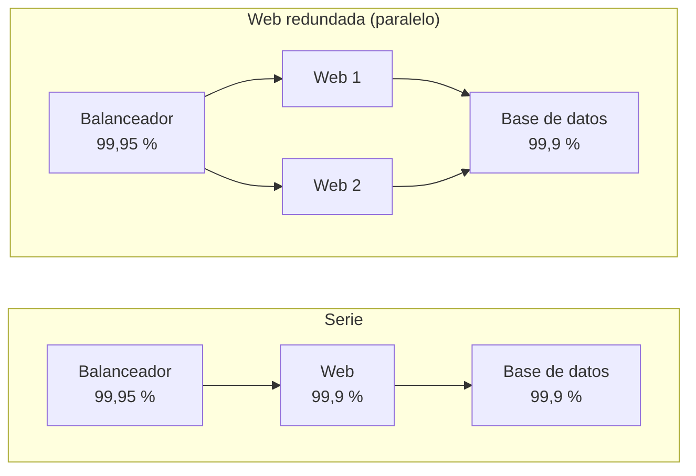
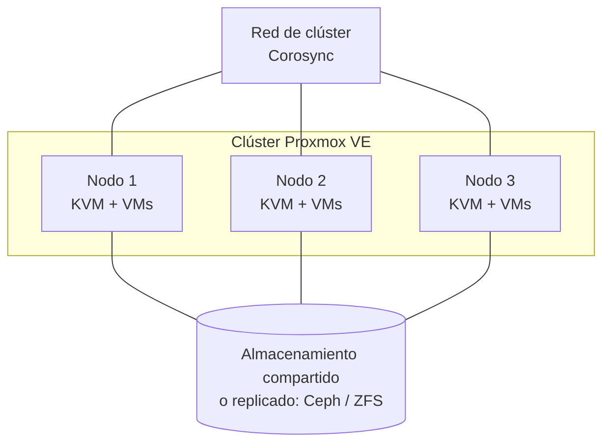
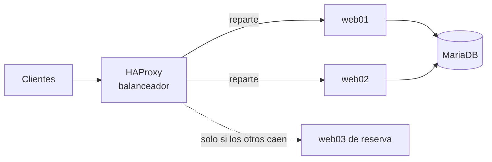
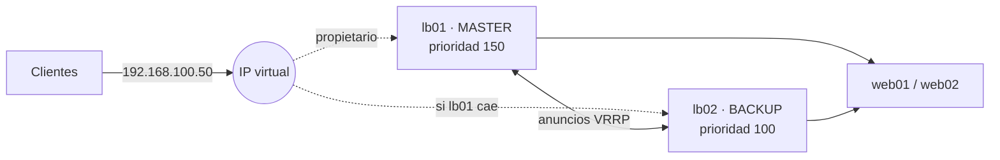
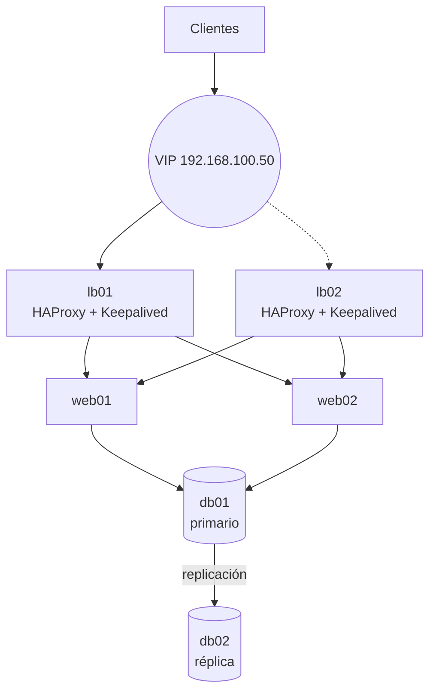

# UD5. Alta disponibilidad

> Cómo diseñar servicios que siguen funcionando cuando falla un componente: medir la disponibilidad, localizar los puntos únicos de fallo, añadir redundancia (hardware, red, virtualización, balanceo, IP virtual, clústeres y replicación de datos) y comprobar que la recuperación funciona.

| Datos de la unidad | Información |
| --- | --- |
| Módulo | 0378. Seguridad y Alta Disponibilidad |
| Curso | 2.º ASIR |
| Duración | 14 horas |
| Resultados de aprendizaje | RA6 (a, b, c, d, e, f, g, h, i) |
| Herramientas | HAProxy 3.x · Keepalived 2.x · Pacemaker/Corosync · MariaDB 11.x · Proxmox VE 9 · mdadm · Docker |

---

## 1. Introducción

A las 9:00 de un lunes, la tienda en línea de una empresa deja de responder. Cada hora parada supone ventas perdidas, clientes enfadados y, a veces, sanciones contractuales. Lo grave no es que algo falle (**todo acaba fallando**: discos, fuentes de alimentación, cables, actualizaciones, errores humanos), sino que **un único fallo detenga el servicio completo**.

La **alta disponibilidad** (HA, *High Availability*) es el conjunto de técnicas de diseño que permite que un servicio siga prestándose, con una interrupción mínima o nula, cuando un componente falla. No consiste en evitar los fallos, sino en **diseñar el sistema para que los fallos no se noten** (o se noten muy poco).

Esta unidad cierra el círculo del módulo: en la UD2 viste cómo proteger los datos, en la UD4 cómo fortificar un servidor y aquí aprenderás a que **el servicio sobreviva** cuando un servidor, un disco o una red se caen.

## 2. Objetivos

- Calcular la disponibilidad de un sistema y traducirla a tiempo de parada anual.
- Identificar **puntos únicos de fallo** (SPOF) en una infraestructura y proponer medidas proporcionadas.
- Definir **RTO** y **RPO** de un servicio y relacionarlos con la solución elegida.
- Describir soluciones hardware de continuidad: alimentación, RAID, redundancia de red.
- Valorar la virtualización como herramienta de alta disponibilidad (Proxmox VE).
- Implantar un **balanceador de carga** (HAProxy) con comprobaciones de salud.
- Implantar una **IP virtual** con VRRP/Keepalived y probar la conmutación (*failover*).
- Comprender el funcionamiento de un clúster Pacemaker/Corosync: **quórum** y *fencing*.
- Replicar una base de datos y razonar la diferencia entre replicación y copia de seguridad.
- Documentar y justificar una solución de HA, **probando siempre el fallo**.

---

## 3. Conceptos fundamentales

### 3.1. Disponibilidad y fiabilidad

| Concepto | Qué mide | Ejemplo |
| --- | --- | --- |
| **Fiabilidad** | Probabilidad de que un componente funcione sin fallos durante un periodo | Un disco que dura 5 años sin fallar |
| **Disponibilidad** | Porcentaje del tiempo en que el servicio está **operativo** | Una web accesible el 99,95 % del año |
| **Mantenibilidad** | Facilidad y rapidez para reparar | Cambiar un disco en caliente en 10 minutos |

Son cosas distintas: un sistema poco fiable (falla a menudo) puede tener buena disponibilidad si se repara en segundos y está redundado.

### 3.2. MTBF, MTTR y la fórmula de la disponibilidad

- **MTBF** (*Mean Time Between Failures*): tiempo medio **entre** fallos. Mide la fiabilidad.
- **MTTR** (*Mean Time To Repair/Recover*): tiempo medio **de reparación** o recuperación. Mide la rapidez de la respuesta.

$$
D = \frac{MTBF}{MTBF + MTTR}
$$

Para mejorar la disponibilidad hay dos caminos: **aumentar el MTBF** (mejor hardware, redundancia interna, mantenimiento preventivo) o **reducir el MTTR** (automatizar la conmutación, tener repuestos, monitorizar para detectar antes). En HA moderna, casi siempre se actúa sobre el MTTR: la conmutación automática lo reduce de horas a segundos.

> [!NOTE]
> **Ejemplo.** Un servidor con MTBF = 8 760 h (un fallo al año) y MTTR = 4 h: D = 8760 / 8764 = **99,954 %**, unas 4 horas de parada anuales. Si una conmutación automática reduce el MTTR a 30 segundos, la parada anual baja a unos 30 segundos.

<!-- enr:u5a -->
> [!TIP]
> **Memoriza tres cifras:** 99 % → 3,65 días/año de parada; 99,9 % → 8,76 h/año; 99,99 % → 52,6 min/año. Cada «nueve» más multiplica el coste por un factor grande: no pidas 99,999 % si el negocio solo necesita 99,9 %.

### 3.3. Los «nueves»

La disponibilidad se expresa en «nueves». Cada nueve adicional **reduce diez veces** la parada admisible, y **multiplica el coste**:

| Disponibilidad | Parada anual | Parada mensual (aprox.) | Típico de |
| --- | --- | --- | --- |
| 99 % («dos nueves») | 3,65 días | 7,2 horas | Servicios internos no críticos |
| 99,9 % («tres nueves») | 8,76 horas | 43,8 minutos | Aplicaciones de empresa |
| 99,99 % («cuatro nueves») | 52,6 minutos | 4,4 minutos | Servicios críticos, comercio electrónico |
| 99,999 % («cinco nueves») | 5,26 minutos | 26 segundos | Telecomunicaciones, sanidad crítica |

### 3.4. SLA, SLO y SLI

| Sigla | Significado | Qué es |
| --- | --- | --- |
| **SLI** (*Service Level Indicator*) | Indicador | La medida real: «el 99,93 % de las peticiones respondieron en < 500 ms» |
| **SLO** (*Service Level Objective*) | Objetivo | La meta interna: «≥ 99,9 % de disponibilidad mensual» |
| **SLA** (*Service Level Agreement*) | Acuerdo | El **contrato** con el cliente, con penalizaciones si no se cumple |

Un SLA indica qué se mide, cómo, en qué periodo y qué se **excluye** (mantenimientos programados, causas de fuerza mayor).

### 3.5. Disponibilidad de varios componentes: serie y paralelo

Un servicio depende de varios componentes. La forma de conectarlos determina la disponibilidad total:

- **En serie** (todos son necesarios): `D = D1 × D2 × … × Dn`. La disponibilidad **empeora** con cada componente añadido.
- **En paralelo** (basta con uno): `D = 1 − (1−D1) × (1−D2) × …`. La disponibilidad **mejora** con cada réplica.



Un script en Python para calcularlo (guárdalo como `disp.py`):

```python
#!/usr/bin/env python3
"""Calculadora de disponibilidad (UD5)."""

HORAS_ANIO = 8760

def disponibilidad(mtbf, mttr):
    return mtbf / (mtbf + mttr)

def serie(*ds):
    r = 1.0
    for d in ds:
        r *= d
    return r

def paralelo(*ds):
    f = 1.0
    for d in ds:
        f *= (1 - d)
    return 1 - f

def parada_anual(d):
    """Minutos de parada al año para una disponibilidad d (0-1)."""
    return (1 - d) * HORAS_ANIO * 60

def formato(m):
    if m >= 60:
        return f"{m/60:.2f} h"
    if m >= 1:
        return f"{m:.2f} min"
    return f"{m*60:.1f} s"

if __name__ == "__main__":
    web, bd, lb = 0.999, 0.999, 0.9995
    s = serie(web, bd, lb)
    print(f"Serie (web, bd, balanceador) = {s*100:.4f} %  -> {formato(parada_anual(s))}")
    w2 = paralelo(web, web)
    s2 = serie(w2, bd, lb)
    print(f"Dos web en paralelo = {w2*100:.5f} %")
    print(f"Cadena completa      = {s2*100:.4f} %  -> {formato(parada_anual(s2))}")
```

```bash
python3 disp.py
```

Salida esperada:

```text
Serie (web, bd, balanceador) = 99.7502 %  -> 21.88 h
Dos web en paralelo = 99.99990 %
Cadena completa      = 99.8500 %  -> 13.14 h
```

**Lección importante:** duplicar el servidor web mejora solo de 99,75 % a 99,85 %. El **eslabón más débil** (la base de datos y el balanceador, que siguen siendo únicos) limita el resultado. No sirve de nada redundar un componente si otro sigue siendo un SPOF.

<!-- enr:u5b -->
> [!WARNING]
> **Disponibilidad en serie = multiplicar.** Si una aplicación depende de 3 componentes con 99,9 % cada uno, la disponibilidad total es 0,999³ ≈ 99,7 %: **peor** que la de cualquiera de ellos. Por eso la redundancia se aplica en paralelo en cada capa.

{}
**Tienes dos servidores web detrás de un solo balanceador HAProxy. ¿Cuál es el punto único de fallo?**

El balanceador. Si cae, los dos servidores web dejan de ser accesibles aunque estén sanos. Se corrige con un segundo balanceador y una IP virtual (Keepalived/VRRP).
{}

### 3.6. Punto único de fallo (SPOF)

Un **SPOF** (*Single Point of Failure*) es un componente cuyo fallo detiene todo el servicio. Se detectan recorriendo la cadena de dependencias de punta a punta y preguntando en cada eslabón: **«si esto falla, ¿qué ocurre?»**.

| Capa | Posibles SPOF | Medida |
| --- | --- | --- |
| Energía | Una única fuente de alimentación, un único SAI | Doble fuente + 2 SAI / generador |
| Red | Un único switch, router, cable o proveedor | Doble enlace, *bonding*, VRRP, doble ISP |
| Servidor | Una única máquina | Clúster, balanceo, virtualización con HA |
| Almacenamiento | Un único disco o cabina | RAID, replicación, almacenamiento distribuido |
| Datos | Una sola copia de la base de datos | Replicación + copias de seguridad |
| Aplicación | Un solo balanceador, un solo DNS | Pareja de balanceadores con IP virtual, DNS secundario |
| Personas | Solo un administrador conoce el sistema | Documentación, formación, guardias |
| Ubicación | Un único CPD | Sitio secundario (recuperación ante desastres) |

> [!IMPORTANT]
> La redundancia debe aplicarse con **proporcionalidad**: un SPOF solo se elimina si el coste de la parada que provoca supera el coste de la medida. Esa decisión se documenta (CE i de RA6).

### 3.7. Redundancia, tolerancia a fallos y alta disponibilidad

| Término | Significado |
| --- | --- |
| **Redundancia** | Disponer de más componentes de los estrictamente necesarios |
| **Tolerancia a fallos** | El sistema sigue funcionando **sin interrupción perceptible** ante un fallo (RAID 1, fuentes dobles) |
| **Alta disponibilidad** | El servicio se **recupera automáticamente en poco tiempo** (segundos o minutos), puede haber un corte breve |
| **Recuperación ante desastres (DR)** | Restaurar el servicio tras un fallo grave (incendio, ransomware) en otro lugar, con más tiempo |

Modelos de redundancia:

| Modelo | Funcionamiento | Ventaja | Inconveniente |
| --- | --- | --- | --- |
| **Activo-pasivo** | Un nodo trabaja; el otro espera y toma el relevo | Sencillo de razonar | El recurso pasivo está ocioso |
| **Activo-activo** | Todos los nodos atienden peticiones | Aprovecha recursos, escala | Gestionar el estado compartido es más complejo |
| **N+1** | N nodos necesarios más 1 de reserva | Coste moderado | Solo tolera un fallo a la vez |
| **N+M / 2N** | M reservas o duplicado completo | Muy robusto | Caro |

### 3.8. RTO y RPO

Son los dos parámetros que **dimensionan** la solución:

- **RTO** (*Recovery Time Objective*): **cuánto tiempo** puede estar parado el servicio como máximo.
- **RPO** (*Recovery Point Objective*): **cuántos datos** (medidos en tiempo) se pueden perder como máximo.


| Servicio | RPO | RTO | Solución típica |
| --- | --- | --- | --- |
| Tienda en línea (base de datos de pedidos) | ≈ 0 | < 5 min | Replicación síncrona + clúster con conmutación automática |
| Web corporativa (contenido estático) | 24 h | 1 h | Copia diaria + servidor de reserva |
| Servidor de ficheros | 4 h | 4 h | Copias frecuentes + restauración |
| Entorno de desarrollo | 7 días | 3 días | Copia semanal |

> [!NOTE]
> Un RPO bajo se consigue **replicando** los datos con frecuencia; un RTO bajo, **automatizando la conmutación**. Cuanto más bajos, más caro. La UD2 (copias de seguridad) y la UD5 (HA) se complementan: HA protege contra el fallo de un componente; la copia protege contra el borrado, la corrupción o el ransomware.

### 3.9. Plan de continuidad

La HA técnica forma parte de un **plan de continuidad de negocio** (BCP) y un **plan de recuperación ante desastres** (DRP). Se elabora así:

1. **BIA** (*Business Impact Analysis*): qué servicios son críticos y cuánto cuesta una hora de parada.
2. **RTO/RPO** por servicio.
3. **Análisis de riesgos** (UD1): qué fallos son probables.
4. **Estrategia**: qué redundancia y qué copias.
5. **Procedimientos documentados** para fallos concretos.
6. **Pruebas periódicas** (simulacros): un plan que nunca se ha probado no es un plan.

---

## 4. Redundancia de hardware y de red

### 4.1. Alimentación

- **Fuentes de alimentación redundantes** (en servidores): si una falla, la otra mantiene el equipo. Cada fuente se conecta a una **regleta/circuito distinto**.
- **SAI** (UPS): mantiene la energía unos minutos y permite un apagado ordenado. Se monitoriza con **NUT** (*Network UPS Tools*) para apagar los servidores automáticamente.
- **Generador** para cortes largos en centros de datos.

### 4.2. RAID: redundancia de discos

**RAID** combina varios discos para ganar rendimiento y/o tolerancia a fallos de disco.

| Nivel | Discos mínimos | Tolera | Capacidad útil | Uso |
| --- | --- | --- | --- | --- |
| RAID 0 | 2 | **Nada** (solo velocidad) | 100 % | Datos temporales |
| RAID 1 | 2 | 1 disco | 50 % | Sistema, bases de datos pequeñas |
| RAID 5 | 3 | 1 disco | (n−1)/n | Ficheros, equilibrio |
| RAID 6 | 4 | 2 discos | (n−2)/n | Discos grandes, más seguridad |
| RAID 10 | 4 | 1 por pareja | 50 % | Bases de datos, alto rendimiento |

> [!WARNING]
> **RAID no es una copia de seguridad.** Protege del fallo de un disco, pero **no** del borrado accidental, de un virus que cifre los ficheros, de la corrupción lógica ni de un incendio: todos esos errores se replican al instante en los discos espejo.

**Ejemplo con RAID 1 por software (`mdadm`)** usando ficheros como discos (laboratorio sin riesgo; Debian y AlmaLinux):

```bash
sudo apt install -y mdadm        # AlmaLinux: sudo dnf install -y mdadm
cd /root
sudo truncate -s 200M disco1.img disco2.img disco3.img
sudo losetup -f --show disco1.img     # imprime /dev/loop0 (anota el nombre real que te asigne)
sudo losetup -f --show disco2.img     # /dev/loop1
sudo losetup -f --show disco3.img     # /dev/loop2
sudo mdadm --create /dev/md0 --level=1 --raid-devices=2 /dev/loop0 /dev/loop1
cat /proc/mdstat                      # [UU] = los dos discos están sincronizados
sudo mkfs.ext4 /dev/md0 && sudo mkdir -p /mnt/raid && sudo mount /dev/md0 /mnt/raid
echo "datos críticos" | sudo tee /mnt/raid/dato.txt
```

**Prueba de fallo** (simula que un disco se estropea):

```bash
sudo mdadm /dev/md0 --fail /dev/loop1      # marca el disco como fallido
cat /proc/mdstat                           # [U_] = degradado; los datos siguen accesibles
cat /mnt/raid/dato.txt                     # el servicio no se ha interrumpido
sudo mdadm /dev/md0 --remove /dev/loop1    # retira el disco "roto"
sudo mdadm /dev/md0 --add /dev/loop2       # añade el de repuesto
cat /proc/mdstat                           # verás la reconstrucción y luego [UU]
```

Limpieza al terminar: `sudo umount /mnt/raid && sudo mdadm --stop /dev/md0`, y `sudo losetup -D`.

Para que el sistema recuerde la matriz al arrancar: `sudo mdadm --detail --scan | sudo tee -a /etc/mdadm/mdadm.conf` (en AlmaLinux, `/etc/mdadm.conf`).

### 4.3. Redundancia de red: *bonding*

Una máquina con una sola tarjeta de red tiene un SPOF en la NIC, el cable y el puerto del switch. El **bonding** (agregación de enlaces) une varias interfaces físicas en una **interfaz lógica**:

| Modo | Nombre | Comportamiento | Requiere configurar el switch |
| --- | --- | --- | --- |
| 1 | `active-backup` | Una interfaz activa, otra en reserva | No |
| 2 | `balance-xor` | Reparto por hash | Depende |
| 4 | `802.3ad` (LACP) | Agregación dinámica estándar | **Sí** (LACP) |
| 6 | `balance-alb` | Balanceo adaptativo | No |

Configuración con **systemd-networkd** (ficheros en `/etc/systemd/network/`), válida para un modo `active-backup` en cualquier distribución con systemd:

```ini
# /etc/systemd/network/10-bond0.netdev
[NetDev]
Name=bond0
Kind=bond

[Bond]
Mode=active-backup
MIIMonRefreshSec=100ms        # comprueba el enlace cada 100 ms
PrimaryReselectPolicy=always
```

```ini
# /etc/systemd/network/20-eth-bond.network   (aplica a las dos NIC físicas)
[Match]
Name=enp0s8 enp0s9

[Network]
Bond=bond0
```

```ini
# /etc/systemd/network/30-bond0.network
[Match]
Name=bond0

[Network]
Address=192.168.100.55/24
Gateway=192.168.100.1
```

En sistemas con **NetworkManager** (AlmaLinux) es equivalente con `nmcli`:

```bash
sudo nmcli con add type bond con-name bond0 ifname bond0 bond.options "mode=active-backup,miimon=100"
sudo nmcli con add type ethernet slave-type bond con-name bond0-p1 ifname enp0s8 master bond0
sudo nmcli con add type ethernet slave-type bond con-name bond0-p2 ifname enp0s9 master bond0
sudo nmcli con mod bond0 ipv4.method manual ipv4.addresses 192.168.100.55/24
sudo nmcli con up bond0
```

Comprobación y **prueba de fallo**:

```bash
cat /proc/net/bonding/bond0              # modo, interfaz activa ("Currently Active Slave")
ping -i 0.2 192.168.100.1 &              # tráfico continuo durante la prueba
sudo ip link set enp0s8 down             # simula que se desconecta el cable principal
cat /proc/net/bonding/bond0              # la interfaz activa cambia a enp0s9; el ping apenas pierde paquetes
sudo ip link set enp0s8 up               # restablece
```

---

<!-- enr:u5c -->

*Figura 5.1. Arquitectura de referencia: cada capa está duplicada, así que no hay un único componente cuyo fallo pare el servicio.*

## 5. Virtualización y alta disponibilidad

### 5.1. Por qué ayuda la virtualización

Al virtualizar, el «servidor» deja de ser un equipo físico para ser un **fichero** (los discos de la máquina virtual) que cualquier anfitrión puede ejecutar. Esto aporta:

- **Instantáneas** (*snapshots*): volver a un estado anterior en segundos (no sustituyen a la copia de seguridad).
- **Copias** y **plantillas**: recrear servidores rápidamente (reduce el MTTR).
- **Migración en vivo**: mover una VM encendida de un anfitrión a otro sin cortar el servicio (mantenimiento sin parada).
- **HA de máquinas virtuales**: si cae el anfitrión, otra máquina física **arranca la VM automáticamente**.
- **Consolidación** y aislamiento: varios servicios en un mismo hardware sin interferir.

### 5.2. Arquitectura de un clúster de virtualización



Para que una VM pueda arrancar en otro nodo, **sus discos deben ser accesibles desde él**: almacenamiento compartido (NFS, iSCSI, Ceph) o **replicado** (ZFS con replicación periódica).

### 5.3. Proxmox VE

**Proxmox VE** es una plataforma libre de virtualización basada en **KVM** (máquinas virtuales completas) y **LXC** (contenedores), con interfaz web, clúster, copias de seguridad, almacenamiento Ceph/ZFS y un gestor de HA integrado. Usa **Corosync** para la comunicación y el quórum del clúster.

| Concepto | Descripción |
| --- | --- |
| **Nodo** | Servidor físico (o virtual, en laboratorio) con Proxmox |
| **Clúster** | Conjunto de nodos que se gestionan juntos; necesita **quórum** |
| **HA Manager** | Servicio que reinicia en otro nodo los recursos HA si su nodo falla |
| **Grupo HA / reglas de afinidad** | Qué nodos son preferentes para un recurso |
| **Watchdog** | Mecanismo que **reinicia un nodo** que ha perdido el quórum (hace de *fencing*) |

Comandos básicos (en un nodo Proxmox, como `root`):

```bash
pvecm create labsad                  # crea el clúster en el primer nodo
pvecm add 192.168.100.101            # en los otros nodos: se unen al primero
pvecm status                         # nodos, votos y quórum ("Quorate: Yes")
ha-manager add vm:100 --state started   # registra la VM 100 como recurso HA
ha-manager status                    # estado de los recursos y del gestor
qm migrate 100 pve2 --online         # migración en vivo de la VM 100 al nodo pve2
```

> [!WARNING]
> Con **dos nodos** un clúster Proxmox pierde el quórum cuando cae uno (queda 1 voto de 2: no hay mayoría). Se usan **tres nodos** o un dispositivo de quórum externo (*QDevice*) para el tercer voto. Ver el apartado 8.

**Prueba de fallo de un nodo** (en laboratorio): con la VM 100 en HA ejecutándose en `pve2`, apaga bruscamente `pve2` (desde VirtualBox, «Apagar la máquina»). Tras unos minutos, `ha-manager status` mostrará que la VM se ha reiniciado en `pve1` o `pve3`. El tiempo transcurrido es tu **RTO real**.

---

## 6. Balanceo de carga con HAProxy

### 6.1. Qué es y qué resuelve

Un **balanceador de carga** reparte las peticiones entre varios servidores (*backends*). Resuelve dos problemas a la vez:

- **Escalabilidad**: más servidores = más capacidad.
- **Disponibilidad**: si un backend falla, el balanceador **deja de enviarle tráfico** gracias a las *comprobaciones de salud* (*health checks*).



**Balanceador frente a proxy inverso**: un *proxy inverso* recibe las peticiones en nombre de los servidores (puede cachear, cifrar, filtrar: UD7). Un balanceador es un proxy inverso que, además, **distribuye** entre varios destinos. HAProxy hace ambas cosas.

**Capa 4 frente a capa 7**:

| Modo | Qué ve | Uso |
| --- | --- | --- |
| `mode tcp` (capa 4) | Solo IP y puerto | Cualquier protocolo TCP (bases de datos, SSH) |
| `mode http` (capa 7) | Cabeceras, URL, cookies | Enrutar por ruta o dominio, cookies de persistencia |

### 6.2. Algoritmos de reparto

| Algoritmo (`balance`) | Funcionamiento | Cuándo |
| --- | --- | --- |
| `roundrobin` | Turno rotatorio (admite pesos) | Servidores similares |
| `leastconn` | Al servidor con menos conexiones activas | Conexiones largas (bases de datos) |
| `source` | Hash de la IP de origen: mismo cliente, mismo servidor | Persistencia sencilla |
| `uri` | Hash de la URL | Cachés |

### 6.3. Configuración

Instalación (HAProxy 3.x en Debian 13; en AlmaLinux 10 está en los repositorios AppStream):

```bash
sudo apt install -y haproxy          # AlmaLinux: sudo dnf install -y haproxy
haproxy -v                           # anota la versión
sudo cp /etc/haproxy/haproxy.cfg /etc/haproxy/haproxy.cfg.bak     # copia de seguridad
```

Fichero `/etc/haproxy/haproxy.cfg` (sustituye las secciones `frontend`/`backend` de ejemplo; mantén `global` y `defaults` de tu distribución si ya existen):

```text
global
    log /dev/log local0
    maxconn 2000
    user haproxy
    group haproxy
    daemon

defaults
    log     global
    mode    http
    option  httplog
    option  dontlognull
    timeout connect 5s
    timeout client  30s
    timeout server  30s
    retries 3

frontend fe_web
    bind *:80
    default_backend be_web

backend be_web
    balance roundrobin
    option httpchk
    http-check send meth GET uri /salud.php ver HTTP/1.1 hdr Host localhost
    http-check expect status 200
    default-server inter 2s fall 3 rise 2
    server web01 192.168.100.61:80 check
    server web02 192.168.100.62:80 check

listen stats
    bind 192.168.100.51:8404
    stats enable
    stats uri /stats
    stats refresh 5s
    stats auth admin:CambiaEstaClave
```

Qué hace cada parte:

- `frontend`: dónde **escucha** (`bind *:80`) y a qué backend envía por defecto.
- `backend`: el grupo de servidores y el algoritmo.
- `option httpchk` + `http-check`: cada servidor se comprueba pidiendo `/salud.php`; solo si responde **200** se considera sano. Es mucho mejor comprobar la **aplicación** que solo el puerto.
- `inter 2s fall 3 rise 2`: comprueba cada 2 s; tras 3 fallos seguidos lo marca caído (≈ 6 s); tras 2 éxitos lo vuelve a activar.
- `listen stats`: panel web de estado. **Asegúralo**: escucha solo en la IP interna y con usuario/clave (no uses la contraseña del ejemplo).

Validación, aplicación y comprobación:

```bash
sudo haproxy -c -f /etc/haproxy/haproxy.cfg     # comprueba la sintaxis: "Configuration file is valid"
sudo systemctl enable --now haproxy
sudo systemctl reload haproxy                   # recarga sin cortar conexiones (tras cambios)
for i in $(seq 1 6); do curl -s http://192.168.100.51/ | grep -o 'web0[0-9]'; done
# Esperado: web01 web02 web01 web02 web01 web02
```

### 6.4. Persistencia de sesión y estado

Si la aplicación guarda la sesión del usuario **en memoria del servidor**, el reparto aleatorio rompe la sesión (el usuario «pierde el login» al saltar de servidor). Soluciones, de menor a mayor calidad:

1. **Persistencia por cookie** en el balanceador:

```text
backend be_web
    balance roundrobin
    cookie SRV insert indirect nocache
    server web01 192.168.100.61:80 check cookie w1
    server web02 192.168.100.62:80 check cookie w2
```

2. **Aplicaciones sin estado** (*stateless*): la sesión se guarda en un almacén compartido (Redis, base de datos) y cualquier servidor puede atender cualquier petición. Es la solución recomendada y la que permite escalar.
3. En ficheros subidos por usuarios (por ejemplo, WordPress): almacenamiento compartido (NFS, objeto) o sincronización.

### 6.5. Cabecera con la IP real del cliente

Tras el balanceador, los servidores web ven la IP del balanceador, no la del cliente. Se soluciona con `option forwardfor` en el `backend` (añade `X-Forwarded-For`) y configurando Apache/Nginx para registrarla.

```text
backend be_web
    option forwardfor
```

> [!WARNING]
> **El balanceador pasa a ser un SPOF.** Hemos movido el punto único de fallo de los servidores web al balanceador. Para eliminarlo se duplica el balanceador y se comparte una IP virtual entre los dos (apartado 7).

---

## 7. IP virtual con VRRP y Keepalived

### 7.1. Idea

Los clientes se conectan a **una única IP** (la IP virtual, VIP). Dos o más máquinas se «disputan» esa IP: **la tiene una sola cada vez**. Si la propietaria falla, otra se queda con ella y los clientes ni se enteran (salvo un corte de unos segundos).

**VRRP** (*Virtual Router Redundancy Protocol*, RFC 5798) es el protocolo que lo hace posible. **Keepalived** es el software libre que lo implementa en Linux, además de comprobar la salud de servicios.



Funcionamiento:

1. Cada nodo tiene una **prioridad**; el de mayor prioridad es el **MASTER** y posee la VIP.
2. El MASTER envía **anuncios** periódicos (por defecto cada segundo).
3. Si el BACKUP deja de recibirlos durante ~3 intervalos, asume el rol de MASTER, se configura la VIP y envía un **ARP gratuito** para que los equipos actualicen su caché.

### 7.2. Configuración de Keepalived

```bash
sudo apt install -y keepalived       # AlmaLinux: sudo dnf install -y keepalived
```

**lb01** (`/etc/keepalived/keepalived.conf`):

```text
global_defs {
    router_id LB01
    enable_script_security
    script_user root
}

# Script que comprueba si HAProxy está vivo; si no, baja la prioridad
vrrp_script chk_haproxy {
    script "/usr/bin/pgrep -x haproxy"
    interval 2          # cada 2 s
    timeout 2
    fall 2              # 2 fallos seguidos -> falla
    rise 2
    weight -60          # al fallar resta 60 puntos a la prioridad
}

vrrp_instance VI_WEB {
    state MASTER
    interface enp0s3                 # tu interfaz real (ip -br a)
    virtual_router_id 51             # mismo número en ambos nodos
    priority 150
    advert_int 1
    unicast_src_ip 192.168.100.51    # IP propia
    unicast_peer {
        192.168.100.52               # IP del otro nodo
    }
    authentication {
        auth_type PASS
        auth_pass Lab2627x           # máx. 8 caracteres; solo evita errores, no es seguridad real
    }
    virtual_ipaddress {
        192.168.100.50/24 dev enp0s3
    }
    track_script {
        chk_haproxy
    }
}
```

**lb02**: igual, pero `router_id LB02`, `state BACKUP`, `priority 100`, `unicast_src_ip 192.168.100.52` y `unicast_peer { 192.168.100.51 }`.

Claves:

- `virtual_router_id` identifica el grupo VRRP: debe **coincidir** en ambos nodos y ser único en la red.
- `unicast_peer`: envía los anuncios a la IP del otro nodo en lugar de usar multicast (más fiable en redes virtualizadas).
- `track_script`: si HAProxy muere, la prioridad baja de 150 a 90 (< 100) y **el otro nodo se convierte en MASTER** aunque la máquina siga encendida. Sin esto, un servicio caído con el sistema operativo vivo no provocaría conmutación.
- `auth_pass`: VRRPv3 (RFC 5798) eliminó la autenticación; en Keepalived su valor es solo informativo. **No es una medida de seguridad**: protege el segmento con VLAN/ACL (UD6).

Dos ajustes adicionales para que HAProxy funcione en el nodo que **aún no tiene** la IP virtual (por si quieres que haproxy haga `bind` en la VIP):

```bash
echo 'net.ipv4.ip_nonlocal_bind = 1' | sudo tee /etc/sysctl.d/90-ha.conf
sudo sysctl --system
```

Si, como en el ejemplo, HAProxy escucha en `*:80`, no es necesario.

Si hay cortafuegos, permite el protocolo VRRP (protocolo IP 112) entre los nodos. Con UFW: `sudo ufw allow in on enp0s3 from 192.168.100.52 proto vrrp` (usa `proto vrrp` si tu versión lo admite; con nftables: `ip protocol vrrp accept`).

Arranque y comprobación:

```bash
sudo keepalived -t -f /etc/keepalived/keepalived.conf   # comprueba la configuración (-t = test)
sudo systemctl enable --now keepalived
ip -br a show enp0s3                    # en lb01 debe aparecer 192.168.100.50 como segunda IP
journalctl -u keepalived -n 20 --no-pager   # "Entering MASTER STATE"
```

<!-- enr:u5d -->
> [!NOTE]
> **Failover no es lo mismo que alta disponibilidad completa.** Keepalived mueve la IP en 1-3 segundos, pero las conexiones abiertas se cortan y las sesiones se pierden si no se comparten. Mide siempre cuánto dura la interrupción.

### 7.3. Prueba de fallo (*failover*)

Desde un cliente, un `ping` y una petición continua a la VIP:

```bash
ping 192.168.100.50 &
while true; do date +%T; curl -s -m 1 http://192.168.100.50/ | grep -o 'web0[0-9]' || echo "SIN RESPUESTA"; sleep 0.5; done
```

En `lb01` provoca el fallo:

```bash
sudo systemctl stop haproxy          # fallo del SERVICIO (el chk_haproxy baja la prioridad)
# o bien: sudo systemctl stop keepalived   /  apagar la VM  (fallo del NODO)
```

Resultado esperado: unos 3-6 segundos con «SIN RESPUESTA» y después el servicio vuelve; en `lb02`, `ip -br a` muestra ahora la VIP y `journalctl -u keepalived` indica *MASTER STATE*. Al arrancar de nuevo `lb01`, recupera la VIP (por tener mayor prioridad): puedes evitar este «vaivén» con la opción `nopreempt`, que mantiene el MASTER actual mientras esté sano.

> [!CAUTION]
> **Cerebro dividido (*split-brain*) en VRRP**: si falla la comunicación entre los nodos pero ambos siguen vivos, **los dos creen ser MASTER** y los dos tienen la VIP: conflicto de IP. Reduce el riesgo con una red de anuncios fiable y prioridades bien diseñadas.

---

## 8. Clústeres de alta disponibilidad: Pacemaker y Corosync

Cuando lo que se debe mantener no es solo una IP, sino **servicios con estado o con dependencias** (una base de datos sobre un disco compartido, un servicio que debe arrancar después de montar un volumen), se usa un **gestor de recursos de clúster**.

### 8.1. Componentes

| Componente | Función |
| --- | --- |
| **Corosync** | Capa de **comunicación y pertenencia**: sabe qué nodos están vivos y mantiene el **quórum** |
| **Pacemaker** | **Gestor de recursos**: decide dónde se ejecuta cada recurso, lo arranca, vigila y mueve |
| **Agentes de recurso** | Scripts que arrancan/paran/comprueban un recurso (`IPaddr2`, `systemd`, `Filesystem`…) |
| **STONITH / fencing** | Mecanismo para **aislar o apagar** un nodo sospechoso antes de recuperar sus recursos |
| **`pcs`** | Herramienta de línea de comandos para gestionar todo el clúster |

<!-- enr:u5e -->
> [!CAUTION]
> **Split-brain (cerebro dividido):** si dos nodos creen que son el principal a la vez y ambos escriben en el mismo almacenamiento, se **corrompen los datos**. El *quórum* (mayoría de votos) y el *fencing* (apagar el nodo dudoso) existen para evitarlo. Un clúster de **dos nodos** necesita un tercer elemento (testigo/quorum device).

### 8.2. Quórum y *fencing*

**Quórum.** Un clúster solo actúa si la **mayoría** de los nodos se ven entre sí. Con 3 nodos, hacen falta 2 votos. Así, si la red se parte en dos grupos (uno de 2 nodos y otro de 1), solo el grupo mayoritario sigue operando: **el minoritario se detiene**. Esto evita el **cerebro dividido**, en el que dos subgrupos creen estar a cargo y ambos escriben en los mismos datos, corrompiéndolos.

| Nodos | Votos necesarios | Fallos tolerados |
| --- | --- | --- |
| 2 | 2 (o configuración `two_node`) | 0 sin ayuda externa |
| 3 | 2 | 1 |
| 5 | 3 | 2 |

Los clústeres de **dos nodos** necesitan una solución especial: un tercer voto (*QDevice*) o una configuración `two_node` junto con *fencing*.

**Fencing (STONITH, *Shoot The Other Node In The Head*).** Si un nodo deja de responder, el clúster **no puede saber** si ha caído de verdad o simplemente está aislado y sigue escribiendo en el disco compartido. Antes de arrancar sus recursos en otro nodo, **fuerza su apagado** (por la gestión remota IPMI/iLO, un conmutador de energía, o un dispositivo virtual en laboratorio). Sin *fencing* un clúster con datos compartidos es **inseguro**.

> [!WARNING]
> En el laboratorio se desactiva STONITH para simplificar (`stonith-enabled=false`). **No lo hagas nunca en producción** con almacenamiento compartido.

### 8.3. Ejemplo con `pcs`: IP virtual + servicio web activo-pasivo

Dos nodos (`nodo1` 192.168.100.81, `nodo2` 192.168.100.82). Mismos pasos en Debian y AlmaLinux salvo la instalación:


{}
```bash
sudo apt install -y pcs pacemaker corosync fence-agents-all nginx
sudo systemctl disable --now nginx            # Pacemaker lo arrancará, no systemd
```
{}
{}
```bash
sudo dnf config-manager --set-enabled highavailability     # repositorio HA (en AlmaLinux 10)
sudo dnf install -y pcs pacemaker corosync fence-agents-all nginx
sudo systemctl disable --now nginx
sudo firewall-cmd --permanent --add-service=high-availability && sudo firewall-cmd --reload
```
{}


En **ambos nodos**: contraseña del usuario `hacluster` y servicio `pcsd`:

```bash
echo 'hacluster:ClaveClusterLab1' | sudo chpasswd      # solo laboratorio
sudo systemctl enable --now pcsd
```

En **un solo nodo** (`nodo1`):

```bash
sudo pcs host auth nodo1 nodo2 -u hacluster -p ClaveClusterLab1
sudo pcs cluster setup labsad nodo1 nodo2 --force      # crea corosync.conf (--force en Debian si hay un clúster previo)
sudo pcs cluster start --all
sudo pcs cluster enable --all                          # arranque automático
sudo pcs property set stonith-enabled=false            # SOLO LABORATORIO
sudo pcs resource create vip ocf:heartbeat:IPaddr2 ip=192.168.100.80 cidr_netmask=24 op monitor interval=10s
sudo pcs resource create web systemd:nginx op monitor interval=15s
sudo pcs constraint colocation add web with vip INFINITY   # web debe estar donde esté la IP
sudo pcs constraint order vip then web                     # primero la IP, luego el web
sudo pcs status
```

`pcs status` debe mostrar los dos nodos *Online* y los recursos `vip` y `web` *Started* en el mismo nodo.

**Prueba de fallo:**

```bash
sudo pcs node standby nodo1       # fallo "ordenado": los recursos migran a nodo2
sudo pcs status                   # vip y web están ahora en nodo2
curl -s http://192.168.100.80/ | head -3
sudo pcs node unstandby nodo1
# Fallo "brusco": apaga la VM de nodo2 (o 'sudo systemctl stop corosync') y observa desde nodo1 como pcs status mueve los recursos
```

---

## 9. Replicación de datos

### 9.1. Por qué replicar

La base de datos es el SPOF más habitual: el balanceador y los servidores web son «sin estado» y fáciles de duplicar, **los datos no**. Replicar significa mantener **copias sincronizadas en tiempo real** en otro servidor.

| Tipo | Funcionamiento | RPO | Latencia |
| --- | --- | --- | --- |
| **Asíncrona** | El primario confirma al cliente sin esperar a la réplica | Pequeña pérdida posible | Baja |
| **Semisíncrona** | Espera a que al menos una réplica reciba el cambio | Casi 0 | Media |
| **Síncrona** | Espera a que las réplicas apliquen el cambio | 0 | Alta |

> [!IMPORTANT]
> **La replicación no es una copia de seguridad.** Un `DROP TABLE` accidental o un ransomware se replican **al instante** a todas las réplicas. Se necesitan además copias históricas independientes (UD2).

### 9.2. Replicación primario-réplica en MariaDB

MariaDB 11.x (Debian 13 incluye 11.8). Dos servidores: `db01` (primario, 192.168.100.70) y `db02` (réplica, 192.168.100.71). Instalación en ambos:

```bash
sudo apt install -y mariadb-server      # AlmaLinux: sudo dnf install -y mariadb-server
sudo systemctl enable --now mariadb
```

**En `db01`**, fichero `/etc/mysql/mariadb.conf.d/60-replica.cnf` (en AlmaLinux: `/etc/my.cnf.d/60-replica.cnf`):

```ini
[mysqld]
server_id        = 1
log_bin          = /var/log/mysql/mariadb-bin
binlog_format    = ROW
bind-address     = 192.168.100.70      # escucha solo en la IP interna
```

```bash
sudo mkdir -p /var/log/mysql && sudo chown mysql:mysql /var/log/mysql
sudo systemctl restart mariadb
sudo mariadb -e "CREATE USER 'repl'@'192.168.100.71' IDENTIFIED BY 'ClaveReplLab1'; GRANT REPLICATION SLAVE ON *.* TO 'repl'@'192.168.100.71';"
sudo mariadb -e "SHOW MASTER STATUS\G"       # anota File y Position (también existe BINLOG_GTID_POS)
```

**En `db02`**, `60-replica.cnf` con `server_id = 2`, `relay_log = /var/log/mysql/relay-bin`, `read_only = 1` y `bind-address = 192.168.100.71`; reinicia y enlázala con GTID:

```bash
sudo mariadb <<'SQL'
CHANGE MASTER TO
  MASTER_HOST='192.168.100.70',
  MASTER_USER='repl',
  MASTER_PASSWORD='ClaveReplLab1',
  MASTER_USE_GTID=slave_pos;
START REPLICA;
SQL
sudo mariadb -e "SHOW REPLICA STATUS\G" | grep -E 'Slave_IO_Running|Slave_SQL_Running|Seconds_Behind_Master|Last_.*Error'
```

Resultado esperado: `Slave_IO_Running: Yes`, `Slave_SQL_Running: Yes` y `Seconds_Behind_Master: 0`.

Prueba de replicación y fallo:

```bash
# En db01: crear datos
sudo mariadb -e "CREATE DATABASE tienda; CREATE TABLE tienda.pedidos (id INT AUTO_INCREMENT PRIMARY KEY, producto VARCHAR(50)); INSERT INTO tienda.pedidos (producto) VALUES ('camiseta'),('pantalón');"
# En db02: debe verse lo mismo
sudo mariadb -e "SELECT * FROM tienda.pedidos;"
# Fallo: apaga db01. Promociona db02:
sudo mariadb -e "STOP REPLICA; RESET REPLICA ALL; SET GLOBAL read_only=0;"
# La aplicación debe apuntar ahora a db02 (por eso se usa un nombre o una VIP, no la IP directa)
```

> [!NOTE]
> Esta promoción manual muestra los pasos, pero tiene un riesgo: si `db01` volvía a arrancar con datos propios no replicados habría **divergencia**. En producción se automatiza con herramientas como **MariaDB MaxScale**, **Orchestrator** o con **Galera Cluster** (replicación síncrona multi-primario), que gestionan el quórum y la reintegración de los nodos.

<!-- enr:u5f -->
> [!WARNING]
> **La replicación no es una copia de seguridad.** Si borras una tabla por error, la réplica la borra también en milisegundos. Necesitas ambas cosas: replicación (disponibilidad) y copias con histórico (recuperación).

### 9.3. Almacenamiento replicado y distribuido

| Tecnología | Descripción | Uso |
| --- | --- | --- |
| **DRBD** | «RAID 1 por red» entre dos servidores a nivel de bloque | Clúster activo-pasivo con Pacemaker |
| **Ceph** | Almacenamiento distribuido (bloque, ficheros, objetos) con réplicas | Proxmox, nubes privadas |
| **GlusterFS / NFS + rsync** | Sistema de ficheros replicado o sincronizado | Contenido web compartido |
| **ZFS + replicación** | Instantáneas enviadas periódicamente a otro servidor | VM en Proxmox con RPO de minutos |
| **NAS/SAN redundantes** | Cabinas con doble controladora | Entornos corporativos |

---

## 10. Escalabilidad

La alta disponibilidad y la **escalabilidad** (CE h) se diseñan juntas:

- **Escalado vertical** (*scale up*): más CPU/RAM en la misma máquina. Sencillo, pero con límite y con parada.
- **Escalado horizontal** (*scale out*): **más máquinas** detrás del balanceador. Es la base de la nube. Exige aplicaciones **sin estado**.

### 10.1. Contenedores y escalado horizontal

Los contenedores (Docker) permiten crear réplicas idénticas en segundos. Ejemplo mínimo con **Docker Compose**: tres réplicas de un servidor web detrás de HAProxy.

```text
# compose.yaml
services:
  web:
    image: nginx:stable-alpine
    deploy:
      replicas: 3
    volumes:
      - ./index.html:/usr/share/nginx/html/index.html:ro
  lb:
    image: haproxy:lts-alpine
    ports:
      - "8080:80"
    volumes:
      - ./haproxy.cfg:/usr/local/etc/haproxy/haproxy.cfg:ro
    depends_on:
      - web
```

```text
# haproxy.cfg (para Docker: usa el DNS interno de Docker para descubrir las réplicas)
global
    log stdout format raw local0
defaults
    mode http
    timeout connect 5s
    timeout client 30s
    timeout server 30s
resolvers docker
    nameserver dns 127.0.0.11:53
    hold valid 5s
frontend fe
    bind *:80
    default_backend be
backend be
    balance roundrobin
    server-template web 3 web:80 check resolvers docker init-addr none
```

```bash
echo "<h1>Servidor web escalable</h1>" > index.html
docker compose up -d --scale web=3          # lanza 3 réplicas
docker compose ps
curl -s http://localhost:8080/
docker stop $(docker compose ps -q web | head -1)   # simula la caída de una réplica
curl -s http://localhost:8080/                      # sigue respondiendo
docker compose down
```

### 10.2. Pruebas de carga

Antes de afirmar que una solución aguanta, se **mide**. `ab` (ApacheBench) es suficiente en clase:

```bash
sudo apt install -y apache2-utils           # AlmaLinux: sudo dnf install -y httpd-tools
ab -n 2000 -c 20 http://192.168.100.50/     # 2000 peticiones, 20 simultáneas, contra la VIP
```

Fíjate en `Requests per second`, `Time per request` y `Failed requests`. Lanza la prueba **mientras** provocas el fallo de un backend: así mides el efecto real de un fallo bajo carga.

> [!CAUTION]
> Lanza pruebas de carga **solo contra tus propios servicios** de laboratorio. Una prueba de carga contra un tercero es, a efectos prácticos, un ataque de denegación de servicio.

---

## 11. Monitorización de la disponibilidad

Un fallo que nadie detecta no se corrige. La HA necesita **monitorización** (reduce el MTTR) y **alertas**.

| Qué vigilar | Herramienta / técnica |
| --- | --- |
| Servicio respondiendo desde fuera | Comprobaciones HTTP periódicas (Uptime Kuma, Prometheus *blackbox exporter*, Zabbix) |
| Estado de los backends | Panel de estadísticas de HAProxy |
| Estado del clúster | `pcs status`, `pvecm status`, `ha-manager status` |
| Replicación | `SHOW REPLICA STATUS` (retraso, errores) |
| RAID | `cat /proc/mdstat`, `mdadm --monitor` |
| Recursos | CPU, memoria, disco y red (Prometheus + Grafana, Zabbix) |

Ejemplo de comprobación sencilla desde un script (por ejemplo, ejecutado cada minuto con un temporizador de systemd o `cron`):

```bash
#!/bin/bash
# /usr/local/bin/chequeo-web.sh — comprueba la VIP y registra el resultado
URL="http://192.168.100.50/salud.php"
CODIGO=$(curl -s -o /dev/null -m 3 -w '%{http_code}' "$URL")
if [ "$CODIGO" != "200" ]; then
    logger -p user.crit -t chequeo-web "FALLO: $URL devolvió $CODIGO"
    exit 1
fi
logger -p user.info -t chequeo-web "OK: $URL devolvió 200"
```

```bash
sudo install -m 755 chequeo-web.sh /usr/local/bin/chequeo-web.sh
echo '* * * * * root /usr/local/bin/chequeo-web.sh' | sudo tee /etc/cron.d/chequeo-web
journalctl -t chequeo-web --since "5 min ago"
```

---

<!-- enr:u5g -->
{}
**¿Qué técnica es más adecuada para un RPO de 0 y un RTO de segundos en una base de datos crítica?**

Replicación síncrona (o semisíncrona) con conmutación automática (*failover*). La copia nocturna da un RPO de horas y la replicación asíncrona puede perder las últimas transacciones.
{}

## 12. Ejemplo integrado: arquitectura de referencia



| Componente | SPOF eliminado | Técnica | Cómo se prueba |
| --- | --- | --- | --- |
| Balanceador | Sí | 2 nodos + VRRP | Parar HAProxy en `lb01` |
| Servidores web | Sí | 2 backends + health check | Parar Apache en `web01` |
| Base de datos | Parcial (promoción manual) | Replicación MariaDB | Apagar `db01` |
| Red | No (un solo switch virtual) | — | Documentar como riesgo aceptado |
| Datos | Copia | Copias de seguridad (UD2) | Restauración de prueba |

Un diseño real documenta **qué SPOF quedan** y por qué se aceptan.

---

## 13. Problemas habituales

| Síntoma | Causa probable | Solución |
| --- | --- | --- |
| HAProxy no arranca | Error de sintaxis | `haproxy -c -f /etc/haproxy/haproxy.cfg` indica la línea |
| Un backend aparece `DOWN` y está en marcha | La ruta de `httpchk` devuelve 404/500 o hay un cortafuegos | `curl -v http://IP_BACKEND/salud.php` desde el balanceador |
| Las dos máquinas tienen la VIP | Anuncios VRRP bloqueados (cortafuegos o red) | Permite el protocolo 112; `unicast_peer`; `tcpdump -ni enp0s3 proto 112` |
| La VIP no migra al fallar HAProxy | No hay `track_script` o la prioridad no baja lo suficiente | `weight` debe hacer que `150 − 60 < 100` |
| Tras la conmutación los clientes tardan en recuperar | Caché ARP en el cliente | Keepalived envía ARP gratuito; comprueba `arp -an`; reduce el tiempo de caché |
| `pcs cluster setup` falla por un clúster previo | Hay configuración de Corosync anterior | Usa `--force` o `pcs cluster destroy` en los nodos |
| `pcs status` muestra `partition WITHOUT quorum` | Faltan votos | Verifica la red; con 2 nodos, usa `two_node`/QDevice |
| Réplica MariaDB con `Slave_IO_Running: No` | Usuario/clave/cortafuegos | `Last_IO_Error`; prueba `mariadb -h db01 -urepl -p` y puerto 3306 |
| RAID degradado no se reconstruye | No se añadió el disco de reemplazo | `mdadm /dev/md0 --add /dev/…` y observa `/proc/mdstat` |

---

## 14. Buenas prácticas

- **Prueba el fallo siempre**: una solución de HA que nunca se ha roto a propósito no está validada.
- **Documenta** los SPOF restantes y los que aceptas, con su justificación.
- **Comprueba la aplicación**, no solo el puerto (*health check* con la ruta real).
- **Aplicaciones sin estado** y datos fuera del servidor web.
- **Monitoriza y alerta**; la conmutación automática sin aviso oculta problemas hasta que fallan dos componentes.
- **Replicación ≠ copia de seguridad**: mantén las dos.
- **Fencing y quórum** en cualquier clúster con datos compartidos.
- **Simplicidad**: cada pieza de HA añadida introduce complejidad y nuevos modos de fallo.
- **Actualiza por tandas** (nodo a nodo) aprovechando la redundancia, sin parar el servicio.
- **Seguridad**: asegura el panel de estadísticas, la red de replicación y de clúster; usa usuarios con mínimos privilegios.

---

## 15. Ejercicios

1. Un servicio consta de un router (99,9 %), un firewall (99,9 %) y un servidor (99,5 %) en serie. Calcula la disponibilidad total y la parada anual. ¿Qué ocurre si duplicas **solo** el servidor?
2. Calcula la disponibilidad de un componente con MTBF = 2 000 h y MTTR = 8 h. ¿Y si una conmutación automática reduce el MTTR a 0,01 h?
3. Una clínica pide RPO = 15 min y RTO = 1 h para su base de datos de citas. ¿Qué solución de replicación y qué frecuencia de copia propondrías? Justifícalo.
4. Explica por qué un clúster de 2 nodos sin QDevice ni *fencing* es peligroso para una base de datos en disco compartido.
5. En la configuración de Keepalived del apartado 7, ¿qué ocurriría si el `weight` fuera `-20`? ¿Habría conmutación cuando HAProxy muere?
6. ¿Por qué con `option httpchk` a `/salud.php` se detectan más fallos que con un simple `check` de puerto? Pon un ejemplo de fallo que solo detecte el primero.
7. Dibuja la arquitectura de HA para una tienda con 500 pedidos/hora: indica los SPOF que eliminas y los que aceptas.
8. Describe la secuencia de pasos para actualizar el sistema operativo de los dos servidores web **sin dejar de ofrecer el servicio**.

{}
1. D = 0,999 × 0,999 × 0,995 = 0,99302 → ≈ 99,30 % → unas 61 horas de parada al año. Duplicar el servidor (paralelo): 1 − 0,005² = 0,999975; total = 0,999 × 0,999 × 0,999975 = 0,99798 → ≈ 99,80 % → ≈ 17,7 h. El router y el firewall pasan a ser el límite.
2. D = 2000/2008 = 99,60 %. Con MTTR = 0,01 h: 2000/2000,01 = 99,9995 %.
3. Replicación asíncrona o semisíncrona (RPO de segundos) y conmutación semiautomática o automática (RTO < 1 h); además, copias de seguridad cada hora/día para protección frente a borrados.
4. Sin quórum mayoritario ni *fencing*, una partición de red puede hacer que ambos nodos monten el disco y escriban a la vez (*split-brain*), corrompiendo los datos.
5. Prioridad = 150 − 20 = 130 > 100: el nodo sigue siendo MASTER aunque HAProxy haya muerto; **no habría conmutación** y el servicio quedaría caído.
6. El *check* de puerto solo verifica que el puerto responde; `httpchk` comprueba que la aplicación devuelve 200. Ejemplo: Apache arrancado pero con la base de datos caída, devolviendo error 500.
7. Respuesta abierta: balanceadores duplicados con VIP, ≥ 2 web, BD con réplica, doble fuente/SAI, copias externas. Aceptar un solo CPD si el coste de un segundo sitio no está justificado.
8. Sacar `web01` del balanceador (`disable server be_web/web01` en el *socket* de HAProxy o parar el servicio), actualizar, reiniciar, comprobar su salud, reincorporarlo; repetir con `web02`.
{}

---

## 16. Actividad práctica: supuesto profesional

> [!IMPORTANT]
> **Supuesto.** *Librería Pilar* factura 40 % de sus ventas en línea (≈ 600 €/hora). Hoy funciona con un servidor único (web + base de datos) y una copia semanal en USB. Hace dos meses estuvo caída 7 horas por un fallo de disco. Presupuesto disponible: moderado.

Entrega un documento con:

1. **Análisis**: SPOF actuales, impacto económico de una hora de parada y propuesta de **SLO**, **RTO** y **RPO**.
2. **Diseño**: diagrama de la arquitectura propuesta y tabla de componentes (qué SPOF elimina cada uno, coste aproximado).
3. **Implantación en laboratorio**: balanceador + 2 web + BD con réplica (prácticas).
4. **Pruebas de fallo** con evidencias: parar un backend, parar el balanceador, apagar la BD primaria; para cada una, tiempo de interrupción medido.
5. **Riesgos residuales** y plan de mejora a futuro (CE h): crecimiento de la demanda, segundo CPD, automatización.

Las prácticas guiadas están en [Prácticas](../practicas/).

---

## 17. Resumen

- **Disponibilidad** = MTBF / (MTBF + MTTR); se expresa en «nueves». Reducir el **MTTR** (automatizando) es la palanca más eficaz.
- Un **SPOF** es todo componente cuyo fallo detiene el servicio; se eliminan con **redundancia** proporcionada.
- **RTO** (tiempo) y **RPO** (datos) dimensionan la solución. **RAID**, **bonding**, **virtualización** y **fuentes/SAI** protegen el hardware y la red.
- **HAProxy** reparte carga y retira los servidores caídos mediante *health checks*; **Keepalived/VRRP** da una IP virtual con conmutación automática.
- **Pacemaker + Corosync** gestionan clústeres con dependencias; el **quórum** y el *fencing* evitan el cerebro dividido.
- **Replicar no es hacer copias de seguridad**; la base de datos suele ser el SPOF restante.
- Toda solución se **documenta, se monitoriza y se prueba rompiéndola**.

---

## 18. Referencias y documentación oficial

- HAProxy. *Configuration Manual*. <https://docs.haproxy.org>
- Keepalived. *Documentación*. <https://www.keepalived.org/manpage.html>
- IETF. *RFC 5798: Virtual Router Redundancy Protocol (VRRP) Version 3*. <https://www.rfc-editor.org/rfc/rfc5798>
- ClusterLabs. *Pacemaker Explained* y *Clusters from Scratch*. <https://clusterlabs.org/pacemaker/doc/>
- Corosync. <https://corosync.github.io/corosync/>
- Proxmox VE. *Administration Guide* (Cluster Manager, High Availability). <https://pve.proxmox.com/pve-docs/>
- MariaDB. *Replication Overview*. <https://mariadb.com/kb/en/replication-overview/>
- Linux kernel. *Bonding*. <https://docs.kernel.org/networking/bonding.html>
- Linux RAID wiki / `mdadm(8)`. <https://raid.wiki.kernel.org>
- Docker. *Compose file reference*. <https://docs.docker.com/reference/compose-file/>
- Ceph. <https://docs.ceph.com>
- INCIBE. *Guía de continuidad de negocio*. <https://www.incibe.es>
