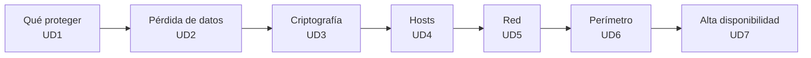

# Seguridad y Alta Disponibilidad · Módulo 0378

Apuntes y prácticas del módulo profesional **0378. Seguridad y alta disponibilidad** del ciclo formativo de grado superior **Administración de Sistemas Informáticos en Red (ASIR)**, 2.º curso, curso **2026/27**.

| Característica | Valor |
|---|---|
| **Referencia curricular** | Real Decreto 1629/2009 (modificado por el RD 500/2024) y Decreto 114/2025 del Consell |
| **Duración oficial** | **133 horas**, planificadas a **5 horas semanales** (1 h cada día lectivo) |
| **Resultados de aprendizaje** | 7 (RA1 a RA7) |
| **Entorno de laboratorio** | VirtualBox 7 · Debian 13 (AlmaLinux 10 donde se indica) |
| **Proyecto común** | [Mediterránea Dental: protege una clínica unidad a unidad](/guia/proyecto-clinica/) |

> [!NOTE]
> Estos apuntes **no son un manual de herramientas**. Están organizados para alcanzar los resultados de aprendizaje oficiales y siguen siempre el ciclo
> **amenaza → vulnerabilidad → ataque → detección → mitigación → comprobación**. Toda práctica de alta disponibilidad incluye una **prueba de fallo** y la comprobación de la recuperación.

## El hilo del módulo

## Unidades didácticas

Cada unidad tiene **teoría** (conceptos, ejemplos y ejercicios) y **prácticas** (fichas con duración, nivel, RA/CE y entrega, comprobaciones y problemas habituales). El reparto de horas es el de la [guía didáctica](/guia/temporalizacion/).

  
RA1 · RA7 · 14 h<h3>UD1 · Introducción, riesgos y marco legal</h3>
Principios, amenazas, vulnerabilidades, autenticación, incidentes, forense y legislación.

<a href="ud01-seguridad-informatica/ud01-teoria/">Teoría</a> · <a href="ud01-seguridad-informatica/ud01-practicas/">Prácticas</a>

  
RA1 · RA6 · 18 h<h3>UD2 · Seguridad pasiva y copias</h3>
CPD, SAI, RAID, LVM, copias 3-2-1-1-0, RPO/RTO y borrado seguro.

<a href="ud02-seguridad-pasiva/ud02-teoria/">Teoría</a> · <a href="ud02-seguridad-pasiva/ud02-practicas/">Prácticas</a>

  
RA1 · RA2 · RA3 · 18 h<h3>UD3 · Criptografía</h3>
Hash, cifrado, firma, certificados, PKI, TLS y cifrado de volúmenes.

<a href="ud03-criptografia/ud03-teoria/">Teoría</a> · <a href="ud03-criptografia/ud03-practicas/">Prácticas</a>

  
RA1 · RA2 · 22 h<h3>UD4 · Fortificación de hosts</h3>
Hardening, usuarios, SSH, cortafuegos local, LUKS, MAC, auditoría, Lynis y Wazuh.

<a href="ud04-fortificacion-hosts/ud04-teoria/">Teoría</a> · <a href="ud04-fortificacion-hosts/ud04-practicas/">Prácticas</a>

  
RA2 · RA3 · 18 h<h3>UD5 · Seguridad en redes</h3>
Amenazas por capas, VLAN y ACL, Wi-Fi, IDS/IPS con Suricata y análisis de tráfico.

<a href="ud05-seguridad-redes/ud05-teoria/">Teoría</a> · <a href="ud05-seguridad-redes/ud05-practicas/">Prácticas</a>

  
RA1 · RA3 · RA4 · RA5 · 25 h<h3>UD6 · Seguridad perimetral</h3>
DMZ, nftables, NAT, proxy directo e inverso, SSH, VPN y RADIUS.

<a href="ud06-seguridad-perimetral/ud06-teoria/">Teoría</a> · <a href="ud06-seguridad-perimetral/ud06-practicas/">Prácticas</a>

  
RA6 · 18 h<h3>UD7 · Alta disponibilidad</h3>
SPOF, RAID, balanceo, IP virtual, replicación, clústeres y pruebas de fallo.

<a href="ud07-alta-disponibilidad/ud07-teoria/">Teoría</a> · <a href="ud07-alta-disponibilidad/ud07-practicas/">Prácticas</a>

## Calendario del curso



## Relación entre unidades y resultados de aprendizaje

| Unidad | RA1 | RA2 | RA3 | RA4 | RA5 | RA6 | RA7 | Horas |
|---|:-:|:-:|:-:|:-:|:-:|:-:|:-:|--:|
| UD1 Introducción, riesgos y marco legal | ● | ○ | | | | | ● | 14 |
| UD2 Seguridad pasiva y copias | ● | | | | | ● | | 18 |
| UD3 Criptografía | ● | ● | ● | | | | | 18 |
| UD4 Fortificación de hosts | ● | ● | | | | | | 22 |
| UD5 Seguridad en redes | | ● | ○ | | | | | 18 |
| UD6 Seguridad perimetral | ○ | | ● | ● | ● | | | 25 |
| UD7 Alta disponibilidad | | | | | | ● | | 18 |
| **Total** | | | | | | | | **133** |

● contribución principal · ○ contribución secundaria. El detalle por criterio está en [Resultados de aprendizaje y criterios de evaluación](/guia/ra-ce/).

## Cómo leer estos apuntes

> [!TIP]
> **Consejo.** Una forma más cómoda o profesional de hacer algo.

> [!WARNING]
> **Atención.** Un error habitual o algo que puede dar problemas.

> [!IMPORTANT]
> **Clave.** Un concepto imprescindible para el resultado de aprendizaje.

> [!CAUTION]
> **Peligro.** Una operación que puede destruir datos o dejarte sin acceso. Haz antes una instantánea.

{}
Las pistas y las soluciones de los ejercicios aparecen plegadas. Intenta resolver el ejercicio antes de abrirlas.
{}

Los sistemas se indican con etiquetas: . Consulta también la [guía del módulo](/guia/): resultados de aprendizaje, temporalización, proyecto, entorno y evaluación.

## Fuentes

- [Real Decreto 1629/2009 (BOE)](https://www.boe.es/buscar/act.php?id=BOE-A-2009-18355) y [Decreto 114/2025 (DOGV)](https://dogv.gva.es/datos/2025/08/04/pdf/2025_29742_es.pdf).
- [INCIBE](https://www.incibe.es/) y [Debian Security](https://www.debian.org/security/).
