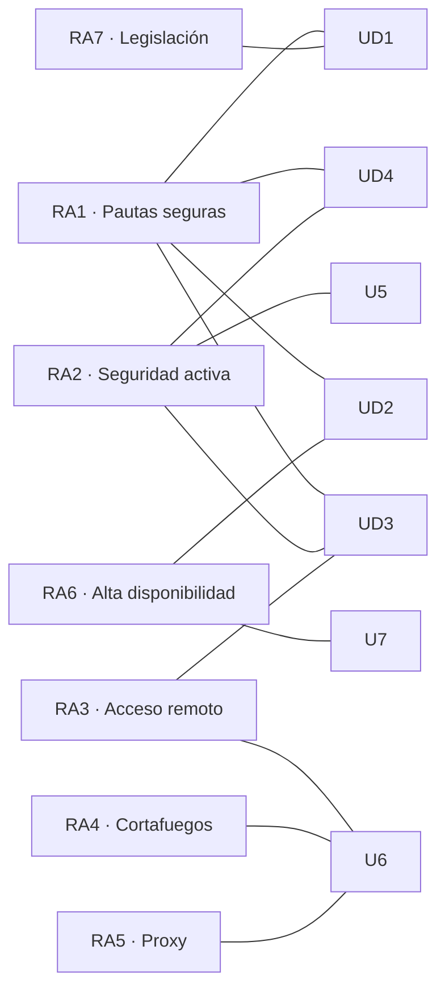

# Resultados de aprendizaje y criterios de evaluación

El módulo **0378. Seguridad y alta disponibilidad** pertenece al título de **Técnico Superior en Administración de Sistemas Informáticos en Red** y se imparte en **2.º curso**. Sus resultados de aprendizaje (RA) y criterios de evaluación (CE) proceden de las enseñanzas mínimas del **Real Decreto 1629/2009, de 30 de octubre**, modificado por el **Real Decreto 500/2024, de 21 de mayo**. El currículo autonómico vigente es el del **Decreto 114/2025, de 29 de julio, del Consell**, que fija **133 horas** (4 horas semanales).

> [!IMPORTANT]
> Un **resultado de aprendizaje** describe lo que sabrás hacer al terminar el módulo. Un **criterio de evaluación** es una evidencia concreta de que lo has conseguido. Cada unidad, práctica y actividad de estos apuntes indica qué CE trabaja.

> [!NOTE]
> El orden de las unidades no sigue el de los RA. El currículo describe *qué* hay que conseguir, no *en qué orden* se enseña: primero se estudia qué proteger y cómo cifrarlo (UD1 a UD4), después la red y su perímetro (UD5 y UD6) y, al final, cómo garantizar que el servicio no se detiene (UD7), porque la alta disponibilidad reutiliza lo aprendido antes.

## Mapa de contribución

● contribución principal · ○ contribución complementaria. Los textos de los criterios son **literales** del Real Decreto 1629/2009.

## RA1. Adopta pautas y prácticas de tratamiento seguro de la información, reconociendo las vulnerabilidades de un sistema informático y la necesidad de asegurarlo.

| CE | Criterio de evaluación | Unidades |
|---|---|---|
| RA1.a | Se ha valorado la importancia de asegurar la privacidad, coherencia y disponibilidad de la información en los sistemas informáticos. | [UD1](/ud01-seguridad-informatica/), [UD2](/ud02-seguridad-pasiva/) ○ |
| RA1.b | Se han descrito las diferencias entre seguridad física y lógica. | [UD1](/ud01-seguridad-informatica/), [UD2](/ud02-seguridad-pasiva/) |
| RA1.c | Se han clasificado las principales vulnerabilidades de un sistema informático, según su tipología y origen. | [UD1](/ud01-seguridad-informatica/), [UD4](/ud04-fortificacion-hosts/) ○ |
| RA1.d | Se ha contrastado la incidencia de las técnicas de ingeniería social en los fraudes informáticos. | [UD1](/ud01-seguridad-informatica/) |
| RA1.e | Se han adoptado políticas de contraseñas. | [UD4](/ud04-fortificacion-hosts/) |
| RA1.f | Se han valorado las ventajas que supone la utilización de sistemas biométricos. | [UD4](/ud04-fortificacion-hosts/) |
| RA1.g | Se han aplicado técnicas criptográficas en el almacenamiento y transmisión de la información. | [UD3](/ud03-criptografia/) |
| RA1.h | Se ha reconocido la necesidad de establecer un plan integral de protección perimetral, especialmente en sistemas conectados a redes públicas. | [UD1](/ud01-seguridad-informatica/) ○, [UD6](/ud06-seguridad-perimetral/) |
| RA1.i | Se han identificado las fases del análisis forense ante ataques a un sistema. | [UD4](/ud04-fortificacion-hosts/) |

## RA2. Implanta mecanismos de seguridad activa, seleccionando y ejecutando contramedidas ante amenazas o ataques al sistema.

| CE | Criterio de evaluación | Unidades |
|---|---|---|
| RA2.a | Se han clasificado los principales tipos de amenazas lógicas contra un sistema informático. | [UD4](/ud04-fortificacion-hosts/), [UD5](/ud05-seguridad-redes/) ○ |
| RA2.b | Se ha verificado el origen y la autenticidad de las aplicaciones instaladas en un equipo, así como el estado de actualización del sistema operativo. | [UD4](/ud04-fortificacion-hosts/) |
| RA2.c | Se han identificado la anatomía de los ataques más habituales, así como las medidas preventivas y paliativas disponibles. | [UD4](/ud04-fortificacion-hosts/), [UD5](/ud05-seguridad-redes/) |
| RA2.d | Se han analizado diversos tipos de amenazas, ataques y software malicioso, en entornos de ejecución controlados. | [UD4](/ud04-fortificacion-hosts/), [UD5](/ud05-seguridad-redes/) |
| RA2.e | Se han implantado aplicaciones específicas para la detección de amenazas y la eliminación de software malicioso. | [UD4](/ud04-fortificacion-hosts/) |
| RA2.f | Se han utilizado técnicas de cifrado, firmas y certificados digitales en un entorno de trabajo basado en el uso de redes públicas. | [UD3](/ud03-criptografia/) |
| RA2.g | Se han evaluado las medidas de seguridad de los protocolos usados en redes inalámbricas. | [UD5](/ud05-seguridad-redes/) |
| RA2.h | Se ha reconocido la necesidad de inventariar y controlar los servicios de red que se ejecutan en un sistema. | [UD4](/ud04-fortificacion-hosts/) ○, [UD5](/ud05-seguridad-redes/) |
| RA2.i | Se han descrito los tipos y características de los sistemas de detección de intrusiones. | [UD5](/ud05-seguridad-redes/) |

## RA3. Implanta técnicas seguras de acceso remoto a un sistema informático, interpretando y aplicando el plan de seguridad.

| CE | Criterio de evaluación | Unidades |
|---|---|---|
| RA3.a | Se han descrito escenarios típicos de sistemas con conexión a redes públicas en los que se precisa fortificar la red interna. | [UD6](/ud06-seguridad-perimetral/) |
| RA3.b | Se han clasificado las zonas de riesgo de un sistema, según criterios de seguridad perimetral. | [UD6](/ud06-seguridad-perimetral/) |
| RA3.c | Se han identificado los protocolos seguros de comunicación y sus ámbitos de utilización. | [UD3](/ud03-criptografia/), [UD5](/ud05-seguridad-redes/) ○, [UD6](/ud06-seguridad-perimetral/) ○ |
| RA3.d | Se han configurado redes privadas virtuales mediante protocolos seguros a distintos niveles. | [UD6](/ud06-seguridad-perimetral/) |
| RA3.e | Se ha implantado un servidor como pasarela de acceso a la red interna desde ubicaciones remotas. | [UD6](/ud06-seguridad-perimetral/) |
| RA3.f | Se han identificado y configurado los posibles métodos de autenticación en el acceso de usuarios remotos a través de la pasarela. | [UD6](/ud06-seguridad-perimetral/) |
| RA3.g | Se ha instalado, configurado e integrado en la pasarela un servidor remoto de autenticación. | [UD5](/ud05-seguridad-redes/) ○, [UD6](/ud06-seguridad-perimetral/) |

## RA4. Implanta cortafuegos para asegurar un sistema informático, analizando sus prestaciones y controlando el tráfico hacia la red interna.

| CE | Criterio de evaluación | Unidades |
|---|---|---|
| RA4.a | Se han descrito las características, tipos y funciones de los cortafuegos. | [UD6](/ud06-seguridad-perimetral/) |
| RA4.b | Se han clasificado los niveles en los que se realiza el filtrado de tráfico. | [UD6](/ud06-seguridad-perimetral/) |
| RA4.c | Se ha planificado la instalación de cortafuegos para limitar los accesos a determinadas zonas de la red. | [UD6](/ud06-seguridad-perimetral/) |
| RA4.d | Se han configurado filtros en un cortafuegos a partir de un listado de reglas de filtrado. | [UD6](/ud06-seguridad-perimetral/) |
| RA4.e | Se han revisado los registros de sucesos de cortafuegos, para verificar que las reglas se aplican correctamente. | [UD6](/ud06-seguridad-perimetral/) |
| RA4.f | Se han probado distintas opciones para implementar cortafuegos, tanto software como hardware. | [UD6](/ud06-seguridad-perimetral/) |
| RA4.g | Se han diagnosticado problemas de conectividad en los clientes provocados por los cortafuegos. | [UD6](/ud06-seguridad-perimetral/) |
| RA4.h | Se ha elaborado documentación relativa a la instalación, configuración y uso de cortafuegos. | [UD6](/ud06-seguridad-perimetral/) |

## RA5. Implanta servidores «proxy», aplicando criterios de configuración que garanticen el funcionamiento seguro del servicio.

| CE | Criterio de evaluación | Unidades |
|---|---|---|
| RA5.a | Se han identificado los tipos de «proxy», sus características y funciones principales. | [UD6](/ud06-seguridad-perimetral/) |
| RA5.b | Se ha instalado y configurado un servidor «proxy-cache». | [UD6](/ud06-seguridad-perimetral/) |
| RA5.c | Se han configurado los métodos de autenticación en el «proxy». | [UD6](/ud06-seguridad-perimetral/) |
| RA5.d | Se ha configurado un «proxy» en modo transparente. | [UD6](/ud06-seguridad-perimetral/) |
| RA5.e | Se ha utilizado el servidor «proxy» para establecer restricciones de acceso Web. | [UD6](/ud06-seguridad-perimetral/) |
| RA5.f | Se han solucionado problemas de acceso desde los clientes al «proxy». | [UD6](/ud06-seguridad-perimetral/) |
| RA5.g | Se han realizado pruebas de funcionamiento del «proxy», monitorizando su actividad con herramientas gráficas. | [UD6](/ud06-seguridad-perimetral/) |
| RA5.h | Se ha configurado un servidor «proxy» en modo inverso. | [UD6](/ud06-seguridad-perimetral/), [UD7](/ud07-alta-disponibilidad/) ○ |
| RA5.i | Se ha elaborado documentación relativa a la instalación, configuración y uso de servidores «proxy». | [UD6](/ud06-seguridad-perimetral/) |

## RA6. Implanta soluciones de alta disponibilidad empleando técnicas de virtualización y configurando los entornos de prueba.

| CE | Criterio de evaluación | Unidades |
|---|---|---|
| RA6.a | Se han analizado supuestos y situaciones en las que se hace necesario implementar soluciones de alta disponibilidad. | [UD7](/ud07-alta-disponibilidad/) |
| RA6.b | Se han identificado soluciones hardware para asegurar la continuidad en el funcionamiento de un sistema. | [UD2](/ud02-seguridad-pasiva/), [UD7](/ud07-alta-disponibilidad/) ○ |
| RA6.c | Se han evaluado las posibilidades de la virtualización de sistemas para implementar soluciones de alta disponibilidad. | [UD7](/ud07-alta-disponibilidad/) |
| RA6.d | Se ha implantado un servidor redundante que garantice la continuidad de servicios en casos de caída del servidor principal. | [UD7](/ud07-alta-disponibilidad/) |
| RA6.e | Se ha implantado un balanceador de carga a la entrada de la red interna. | [UD7](/ud07-alta-disponibilidad/) |
| RA6.f | Se han implantado sistemas de almacenamiento redundante sobre servidores y dispositivos específicos. | [UD2](/ud02-seguridad-pasiva/), [UD7](/ud07-alta-disponibilidad/) |
| RA6.g | Se ha evaluado la utilidad de los sistemas de «clusters» para aumentar la fiabilidad y productividad del sistema. | [UD7](/ud07-alta-disponibilidad/) |
| RA6.h | Se han analizado soluciones de futuro para un sistema con demanda creciente. | [UD7](/ud07-alta-disponibilidad/) |
| RA6.i | Se han esquematizado y documentado soluciones para diferentes supuestos con necesidades de alta disponibilidad. | [UD7](/ud07-alta-disponibilidad/) |

## RA7. Reconoce la legislación y normativa sobre seguridad y protección de datos valorando su importancia.

| CE | Criterio de evaluación | Unidades |
|---|---|---|
| RA7.a | Se ha descrito la legislación sobre protección de datos de carácter personal. | [UD1](/ud01-seguridad-informatica/) |
| RA7.b | Se ha determinado la necesidad de controlar el acceso a la información personal almacenada. | [UD1](/ud01-seguridad-informatica/), [UD4](/ud04-fortificacion-hosts/) ○ |
| RA7.c | Se han identificado las figuras legales que intervienen en el tratamiento y mantenimiento de los ficheros de datos. | [UD1](/ud01-seguridad-informatica/) |
| RA7.d | Se ha contrastado el deber de poner a disposición de las personas los datos personales que les conciernen. | [UD1](/ud01-seguridad-informatica/) |
| RA7.e | Se ha descrito la legislación actual sobre los servicios de la sociedad de la información y comercio electrónico. | [UD1](/ud01-seguridad-informatica/) |
| RA7.f | Se han contrastado las normas sobre gestión de seguridad de la información. | [UD1](/ud01-seguridad-informatica/) |
| RA7.g | Se ha comprendido la necesidad de conocer y respetar la normativa legal aplicable. | [UD1](/ud01-seguridad-informatica/), [UD2](/ud02-seguridad-pasiva/) ○, [UD3](/ud03-criptografia/) ○, [UD4](/ud04-fortificacion-hosts/) ○, [UD5](/ud05-seguridad-redes/) ○, [UD6](/ud06-seguridad-perimetral/) ○, [UD7](/ud07-alta-disponibilidad/) ○ |
