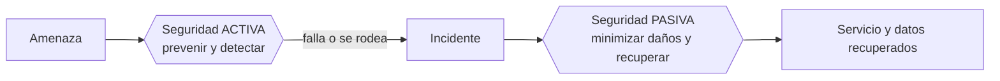
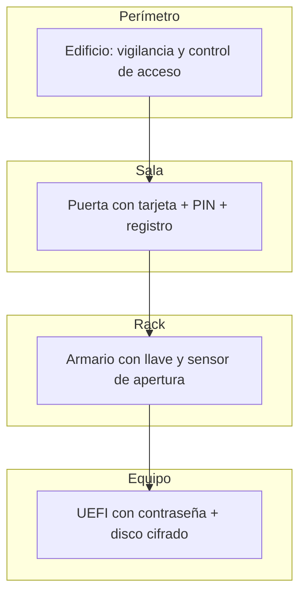
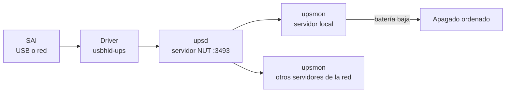
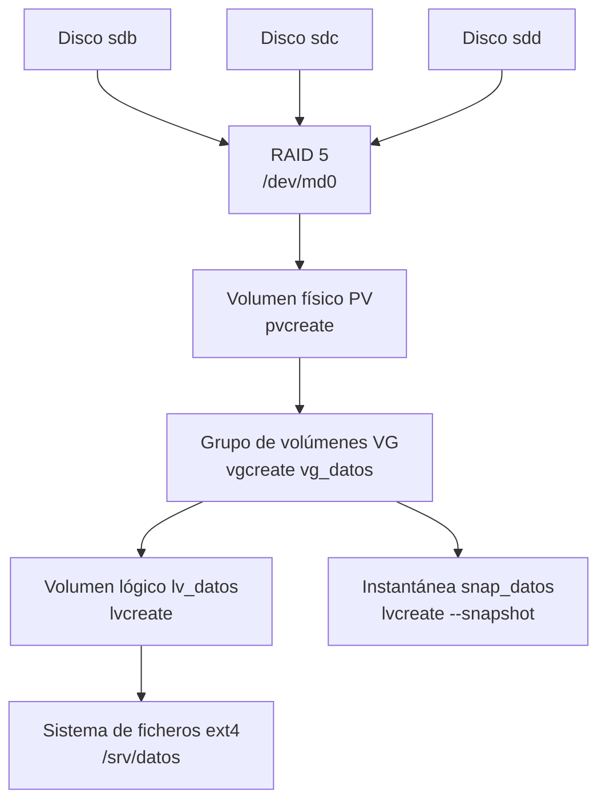
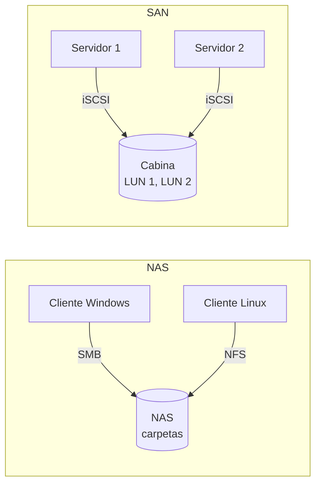
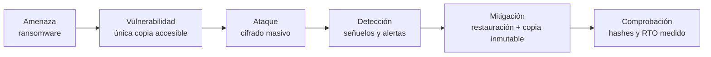
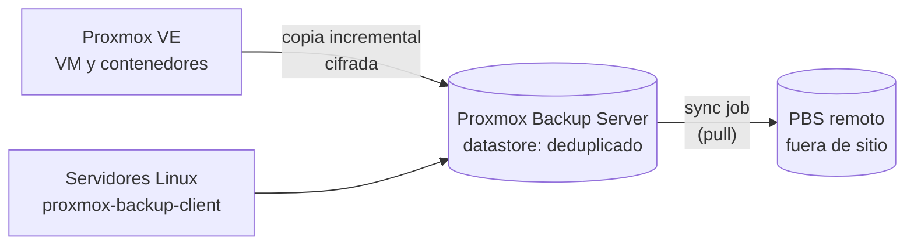
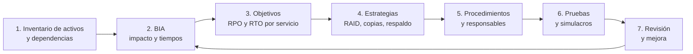

# UD2 · Seguridad pasiva: seguridad física, almacenamiento y copias de seguridad

## Resumen del tema

La **seguridad activa** intenta *evitar* los incidentes (cortafuegos, contraseñas, antivirus, cifrado). Pero ninguna medida de prevención es infalible: los discos se averían, un empleado borra una carpeta por error, el *ransomware* consigue entrar y los edificios sufren incendios e inundaciones. La **seguridad pasiva** parte de una idea realista: **el incidente va a ocurrir**. Su objetivo es minimizar los daños y garantizar la **recuperación**.

En esta unidad estudias, de abajo arriba, las capas de la seguridad pasiva:

1. **Seguridad física y ambiental**: dónde está el equipo, quién puede tocarlo y qué le pasa si falla la luz, el aire acondicionado o hay fuego.
2. **Almacenamiento redundante**: cómo seguir funcionando cuando falla un disco (RAID, LVM, sistemas de ficheros con sumas de verificación).
3. **Copias de seguridad**: cómo recuperar la información cuando falla *todo lo demás* (borrado accidental, *ransomware*, catástrofe).
4. **Continuidad**: planes de contingencia y recuperación, y **borrado seguro** al final de la vida de los soportes.



> [!NOTE]
> **Cómo se relaciona con otras unidades.** La UD1 identificó los activos y el riesgo; esta unidad protege el activo más valioso (la información) frente a la pérdida. La [UD3](/ud03-criptografia/ud03-teoria/) aporta el cifrado de copias y volúmenes, y la [UD7](/ud07-alta-disponibilidad/ud07-teoria/) lleva la redundancia un paso más allá: que el **servicio** no se detenga.

### Planificación de la unidad

**Reparto de horas** (18 h en total):

| Bloque | Horas |
|---|--:|
| Teoría (esta página) | 7 h |
| Prácticas ([ver prácticas](/ud02-seguridad-pasiva/ud02-practicas/)) | 9 h |
| Evaluación (prueba teórico-práctica y entrega de la Tarea del proyecto) | 2 h |
| **Total** | **18 h** |

**Reparto de la teoría por apartados:**

| Apartado | Horas | CE |
|---|--:|---|
| 1. Seguridad pasiva: concepto y contexto | 0,5 h | RA1.a, RA1.b |
| 2. Seguridad física y centro de proceso de datos | 1 h | RA1.b, RA6.b |
| 3. Alimentación eléctrica y SAI | 0,5 h | RA6.b |
| 4. El almacenamiento y sus fallos | 1 h | RA1.a, RA6.b |
| 5. Redundancia de almacenamiento: RAID y LVM | 1 h | RA6.b, RA6.f |
| 6. Almacenamiento en red: DAS, NAS y SAN | 0,25 h | RA6.b, RA6.f |
| 7. Copias de seguridad: estrategia | 1 h | RA1.a |
| 8. Herramientas de copia y automatización | 0,75 h | RA1.a, RA6.f |
| 9. Continuidad: plan de contingencia y recuperación | 0,5 h | RA1.a, RA6.b |
| 10. Borrado seguro y ciclo de vida de los soportes | 0,5 h | RA1.b |
| **Total teoría** | **7 h** | |

### Objetivos de aprendizaje

Al terminar esta unidad serás capaz de:

- Diferenciar **seguridad activa y pasiva**, y **seguridad física y lógica**, y relacionarlas con la disponibilidad, la integridad y la confidencialidad (RA1.a, RA1.b).
- Describir las medidas de **seguridad física y ambiental** de un CPD y los niveles **Tier** (RA1.b).
- Dimensionar un **SAI** y configurar el **apagado ordenado** de un servidor con **NUT** (RA6.b).
- Comparar tecnologías de almacenamiento y **monitorizar** el estado de los discos con S.M.A.R.T. (RA6.b).
- Explicar los niveles **RAID** y **LVM**, e **implantar** almacenamiento redundante por software con `mdadm` (RA6.f).
- Distinguir **DAS, NAS y SAN**, y conocer las ventajas de **ZFS** y **Btrfs** (RA6.b, RA6.f).
- Diseñar una **política de copias** a partir de **RPO**, **RTO** y la regla **3-2-1-1-0** (RA1.a).
- Realizar copias con `tar`, `rsync`, `restic` y BorgBackup, automatizarlas con *timers* de systemd y **probar su restauración**.
- Conocer **Proxmox Backup Server** y las **imágenes de sistema** con Clonezilla.
- Redactar un **plan de contingencia y recuperación** y aplicar **borrado seguro** según el soporte.

---

## 1. Seguridad pasiva: concepto y contexto

### 1.1 Seguridad activa y seguridad pasiva



| | Seguridad **activa** | Seguridad **pasiva** |
|---|---|---|
| Objetivo | **Evitar** el incidente o detectarlo a tiempo | **Reducir** sus consecuencias y **recuperarse** |
| Momento | Antes y durante | Durante y después |
| Ejemplos | Cortafuegos, antivirus, contraseñas robustas, cifrado, IDS | SAI, RAID, copias de seguridad, plan de recuperación, centro de respaldo |
| Pregunta que responde | ¿Cómo evito que ocurra? | ¿Qué hago cuando ocurra? |

> [!TIP]
> **Analogía del cinturón de seguridad.** El cinturón no evita el accidente: reduce sus consecuencias. Es seguridad pasiva. El vídeo *El invento millonario que Volvo regaló*, que acompaña a esta unidad, cuenta cómo un ingeniero patentó el cinturón de tres puntos y lo cedió para que se instalase en todos los coches. Verlo sirve de introducción a la idea central de la unidad: **las medidas pasivas son las que salvan cuando falla todo lo demás**. Lo encuentras en la sección [Recursos de la unidad](#recursos-de-la-unidad).

Un caso real ilustra la diferencia. Una gestoría sufre un ataque de *ransomware*:

| Escenario | Sin seguridad pasiva | Con seguridad pasiva |
|---|---|---|
| Situación | Ficheros cifrados en el servidor y en el disco USB conectado | Ficheros cifrados en el servidor |
| Copias | La única copia estaba en el USB, también cifrada | Copia diaria en un repositorio externo inmutable |
| Resultado | Pagar el rescate (sin garantías) o perder 10 años de expedientes | Restaurar los datos de anoche en 3 horas |

### 1.2 Disponibilidad, integridad y confidencialidad (RA1.a)

La seguridad de la información persigue tres propiedades (tríada **CID**, estudiada en la [UD1](/ud01-seguridad-informatica/ud01-teoria/)). La seguridad pasiva protege sobre todo las dos primeras:

| Propiedad | Qué significa | Cómo la protege la seguridad pasiva |
|---|---|---|
| **Disponibilidad** | La información y los servicios son accesibles cuando se necesitan | SAI, RAID, fuentes redundantes, centro de respaldo, copias y plan de recuperación |
| **Integridad** (*coherencia*) | Los datos son exactos y no han sido alterados | Sumas de verificación (ZFS, Btrfs), `fsck`, apagado ordenado, copias verificadas |
| **Confidencialidad** (*privacidad*) | Solo accede quien está autorizado | Control de acceso físico, copias cifradas, borrado seguro de soportes |

> [!IMPORTANT]
> **Obligación legal.** El artículo 32 del RGPD exige «la capacidad de restaurar la disponibilidad y el acceso a los datos personales de forma rápida en caso de incidente físico o técnico». Un hospital, una clínica o una asesoría **deben poder demostrar** que saben restaurar. Por eso esta unidad insiste en probar las restauraciones.

### 1.3 Seguridad física y seguridad lógica (RA1.b)

| | Seguridad **física** | Seguridad **lógica** |
|---|---|---|
| Protege | El **hardware**, las instalaciones y los soportes | El **software**, los datos y los accesos |
| Frente a | Robo, incendio, inundación, cortes eléctricos, acceso no autorizado a la sala | Intrusiones, *malware*, errores de configuración, accesos indebidos |
| Ejemplos | Sala cerrada con control de acceso, extintor de gas, SAI, cámaras, candado del portátil | Contraseñas, permisos, cortafuegos, cifrado, antivirus, RAID por software, copias con `restic` |

Las dos son **complementarias**: sin seguridad física, la lógica se puede esquivar. Quien tiene acceso físico a un servidor puede arrancarlo desde un USB, extraer el disco o resetear la contraseña del administrador. Por eso se combinan:

| Riesgo por acceso físico | Medida física | Medida lógica que la complementa |
|---|---|---|
| Arrancar el equipo con un USB ajeno | Sala cerrada, candado en el chasis | Contraseña de UEFI, orden de arranque fijo, *Secure Boot* |
| Extraer el disco y leerlo en otro equipo | Armario con llave, inventario de soportes | **Cifrado de disco** con LUKS ([UD3](/ud03-criptografia/ud03-teoria/)) |
| Robo de un portátil | Candado Kensington, política de no dejarlo en el coche | Cifrado completo del disco, borrado remoto |
| Conectar un dispositivo USB malicioso | Tapones o bloqueo de puertos | Políticas de dispositivos extraíbles ([UD4](/ud04-fortificacion-hosts/ud04-teoria/)) |

> [!NOTE]
> **Dónde encaja cada medida de esta unidad.** Físicas: CPD, climatización, extinción, SAI, fuentes redundantes, armarios para copias. Lógicas: RAID por software, LVM, `restic`, políticas de copia, borrado criptográfico. Algunas son **mixtas**: el RAID por *hardware* es físico (controladora) y el RAID por *software* es lógico, pero ambos persiguen lo mismo, la disponibilidad.

---

## 2. Seguridad física y centro de proceso de datos

### 2.1 El centro de proceso de datos (CPD)

Un **CPD** (*data center*) es la sala o el edificio donde se concentran los servidores, el almacenamiento y la electrónica de red de una organización. Concentrar los equipos tiene ventajas (control de acceso, climatización y mantenimiento centralizados), pero también un riesgo: **todo está en el mismo sitio**. En una pyme, el «CPD» puede ser un armario con llave; los principios son los mismos.

Aspectos a considerar en su diseño:

| Aspecto | Buenas prácticas |
|---|---|
| **Ubicación** | Lejos de zonas inundables, sótanos, cocinas, aparcamientos y fachadas. Preferible una planta intermedia sin ventanas y lejos de interferencias electromagnéticas |
| **Control de acceso** | Puerta robusta, tarjeta + PIN o biometría, registro de entradas y salidas, acompañamiento de visitas, videovigilancia |
| **Climatización** | Temperatura de entrada a los equipos entre **18 y 27 °C** (rango recomendado por ASHRAE) y humedad controlada para evitar condensación y electricidad estática |
| **Pasillos frío/caliente** | Los *racks* se colocan enfrentados: los equipos aspiran aire frío por delante y expulsan aire caliente por detrás, sin que se mezclen |
| **Incendios** | Detección precoz (detectores por aspiración), extinción con **gases limpios** (como el FK-5-1-12) o agua nebulizada; nunca rociadores de agua convencionales sobre los equipos |
| **Agua** | Detectores de inundación bajo el suelo técnico; ninguna tubería por encima de los *racks* |
| **Suelo técnico y cableado** | Falso suelo o bandejas superiores; cableado ordenado y etiquetado |
| **Alimentación** | SAI, grupo electrógeno, doble acometida, PDU redundantes, fuentes de alimentación duplicadas en los servidores |
| **Comunicaciones** | Dos operadores con rutas físicas diferentes |
| **Monitorización ambiental** | Sensores de temperatura, humedad, humo, agua y apertura de puertas con alertas |

Estas medidas se corresponden con los requisitos de los marcos de referencia: el **Esquema Nacional de Seguridad** (Real Decreto 311/2022) las agrupa en las medidas de **protección de las instalaciones e infraestructuras** (`mp.if`: áreas separadas y con control de acceso, acondicionamiento de locales, energía eléctrica, protección frente a incendios e inundaciones, registro de entrada y salida de equipamiento), y la norma **ISO/IEC 27001** (anexo A) dedica un grupo de controles a la seguridad física.



> [!TIP]
> **Defensa en profundidad.** Igual que en la seguridad lógica, la física se organiza en **capas** concéntricas: perímetro, edificio, sala, armario y equipo. Quien supera una capa se encuentra con la siguiente.

### 2.2 Niveles Tier de un CPD

El **Uptime Institute** clasifica los CPD en cuatro niveles (**Tier I a IV**) según su redundancia. La norma europea equivalente es la **EN 50600** y la referencia en cableado e infraestructura de telecomunicaciones es **TIA-942**.

| Nivel | Redundancia | Disponibilidad orientativa | Parada anual aproximada |
|---|---|---|---|
| **Tier I** | Básica, sin redundancia (N) | 99,671 % | 28,8 h |
| **Tier II** | Componentes redundantes (N+1) | 99,741 % | 22 h |
| **Tier III** | Mantenible sin parar: varias rutas de alimentación y refrigeración | 99,982 % | 1,6 h |
| **Tier IV** | Tolerante a fallos: todo duplicado (2N) | 99,995 % | 26 min |

`N` es la capacidad necesaria para que el CPD funcione. `N+1` significa que hay **un** componente de reserva. `2N` significa que **todo** está duplicado. A mayor nivel, mayor disponibilidad… y mayor coste.

**Cálculo de la parada anual a partir de la disponibilidad.** Un año tiene 8.760 horas:

```text
Parada anual = (1 - disponibilidad) × 8.760 h

Tier III (99,982 %):  0,00018 × 8.760 h = 1,58 h  ≈ 1,6 h
Tier I   (99,671 %):  0,00329 × 8.760 h = 28,8 h
```

### 2.3 Centro de respaldo

Un **centro de respaldo** es una segunda ubicación, a suficiente distancia del CPD principal, donde se pueden recuperar los servicios si una catástrofe afecta a la primera.

| Tipo | Descripción | Tiempo de recuperación | Coste |
|---|---|---|---|
| **Sala fría** (*cold site*) | Espacio con alimentación y climatización, sin equipos | Días o semanas | Bajo |
| **Sala templada** (*warm site*) | Equipos instalados, datos restaurados desde copia | Horas o días | Medio |
| **Sala caliente** (*hot site*) | Réplica en tiempo casi real, lista para conmutar | Minutos | Alto |
| **Nube** | Recuperación en un proveedor *cloud* (*Disaster Recovery as a Service*) | Variable | Pago por uso |

### 2.4 Seguridad física de los puestos y soportes

La seguridad física no se limita al CPD:

- **Portátiles**: cifrado de disco, candados Kensington, política de no dejarlos en el coche.
- **Puestos de trabajo**: bloqueo de pantalla automático y política de mesas limpias.
- **Soportes extraíbles**: inventario, cifrado y armarios ignífugos para las copias.
- **Papel**: destructoras con el nivel de seguridad adecuado (norma DIN 66399).

### 2.5 Soluciones *hardware* para la continuidad (RA6.b)

Parte de la continuidad se consigue con componentes físicos **redundantes** que permiten que el equipo siga funcionando cuando falla una pieza. Eliminan **puntos únicos de fallo** (SPOF, *Single Point Of Failure*, concepto que se desarrolla en la [UD7](/ud07-alta-disponibilidad/ud07-teoria/)).

| Componente | Solución *hardware* de continuidad | Qué ocurre si falla una pieza |
|---|---|---|
| Alimentación del equipo | **Dos fuentes** redundantes conectadas a dos líneas eléctricas (PDU A y B) | La otra fuente asume toda la carga sin parar el servidor |
| Alimentación del local | SAI + grupo electrógeno + doble acometida | El SAI cubre el corte hasta que arranca el generador |
| Discos | Bahías ***hot-swap*** (cambio en caliente) y RAID | Se sustituye el disco sin apagar el servidor |
| Controladora RAID | Caché protegida por batería o condensador (BBU / *flash-backed*) | No se pierden las escrituras pendientes en un corte |
| Memoria | **ECC** (corrige errores de un bit y detecta los de dos) | Se corrige el error sin corromper datos |
| Refrigeración | Ventiladores redundantes y CRAC/CRAH en N+1 | El resto mantiene la temperatura |
| Red | Dos tarjetas agregadas (*bonding*/LACP), dos *switches* | El tráfico sigue por el enlace superviviente |
| Servidores | *Clúster* y balanceo de carga | Otro nodo asume el servicio ([UD7](/ud07-alta-disponibilidad/ud07-teoria/)) |
| CPD | Centro de respaldo | Se conmuta a la segunda ubicación |

> [!NOTE]
> Estas medidas **reducen** la probabilidad de parada, pero no la eliminan. Un servidor con fuentes y discos redundantes sigue siendo un único servidor: si se incendia la sala, se pierde todo. Por eso las medidas *hardware* se complementan siempre con copias fuera del edificio.

---

## 3. Alimentación eléctrica y SAI

### 3.1 Problemas de la red eléctrica

| Problema | Descripción | Efecto en los equipos |
|---|---|---|
| **Corte** (*blackout*) | Pérdida total del suministro | Apagado brusco: pérdida de datos no guardados, corrupción de sistemas de ficheros |
| **Microcorte** | Interrupción de milisegundos | Reinicios inesperados |
| **Subtensión** (*brownout*) | Tensión por debajo de lo normal durante un tiempo | Mal funcionamiento, estrés en las fuentes |
| **Sobretensión** | Tensión por encima de lo normal | Daño en componentes |
| **Pico** (*spike*) | Sobretensión muy breve e intensa (rayos, conmutaciones) | Destrucción de fuentes y placas |
| **Ruido eléctrico** | Interferencias en la señal | Errores, reinicios |

### 3.2 Sistema de alimentación ininterrumpida (SAI / UPS)

Un **SAI** (*UPS*, *Uninterruptible Power Supply*) contiene baterías que alimentan los equipos cuando falla la red. Su objetivo **no** es mantener los servidores encendidos durante horas, sino:

1. Absorber microcortes y **filtrar** la corriente.
2. Dar tiempo para un **apagado ordenado** si el corte se prolonga, o para que arranque un **grupo electrógeno**.

| Tipo | Funcionamiento | Protección | Uso típico |
|---|---|---|---|
| ***Off-line* / *standby*** | Los equipos se alimentan de la red; al detectar un corte, conmuta a baterías (unos 5-10 ms) | Básica | Puestos de trabajo |
| **Interactivo** (*line-interactive*) | Como el anterior, pero con un regulador (AVR) que corrige subtensiones y sobretensiones sin usar la batería | Media | Pequeños servidores, electrónica de red |
| ***On-line* de doble conversión** | La corriente se convierte siempre a continua y de nuevo a alterna: los equipos nunca dependen directamente de la red; conmutación de 0 ms | Máxima | Servidores y CPD |

### 3.3 Dimensionar un SAI

La potencia de un SAI se expresa en **VA** (potencia aparente) y en **W** (potencia real). La relación entre ambas es el **factor de potencia** (FP):

```text
W = VA × FP        →        VA = W / FP
```

**Ejemplo**: queremos proteger un servidor (450 W), un *switch* (60 W) y un *router* (30 W).

```text
Consumo total               = 450 + 60 + 30 = 540 W
Margen de seguridad (+25 %) = 540 × 1,25    = 675 W
SAI con FP = 0,9            → 675 / 0,9     = 750 VA como mínimo
```

Se elegiría un SAI de **1000 VA / 900 W** o superior, comprobando en la tabla del fabricante que la **autonomía** a 540 W es suficiente para completar el apagado ordenado (por ejemplo, más de 10 minutos).

> [!TIP]
> **Autonomía.** Calcula cuánto tarda tu servidor en apagarse de forma ordenada (apagar servicios, volcar cachés y desmontar sistemas de ficheros) y exige al SAI **al menos el doble** a plena carga. Las baterías se degradan: cada 3-5 años pierden capacidad y hay que sustituirlas.

### 3.4 Monitorización del SAI con NUT

Un SAI solo es útil si el servidor **se entera** de que está funcionando con batería y se apaga correctamente antes de que esta se agote. **NUT** (*Network UPS Tools*) es el *software* libre estándar para ello. Se compone de tres piezas:



- **Driver**: habla con el SAI (por USB, serie o red). Para SAI USB se usa `usbhid-ups`; para un SAI simulado en laboratorio, `dummy-ups`.
- **`upsd`**: servidor que publica el estado del SAI en el puerto TCP **3493**.
- **`upsmon`**: vigila el estado y ejecuta el apagado cuando el SAI está en batería (`OB`) y con batería baja (`LB`).

**Estados del SAI** que publica NUT en la variable `ups.status`:

| Estado | Significado | Qué hace `upsmon` |
|---|---|---|
| `OL` | *On Line*: alimentado desde la red eléctrica | Nada |
| `OB` | *On Battery*: sin red, funcionando con batería | Avisa (notificación `ONBATT`) |
| `LB` | *Low Battery*: batería casi agotada | Ordena el apagado (`SHUTDOWNCMD`) |

Configuración mínima en modo autónomo. Las rutas dependen de la distribución: `/etc/nut/` en Debian y Ubuntu, `/etc/ups/` en AlmaLinux.

```ini
# nut.conf - modo de funcionamiento
MODE=standalone
```

```ini
# ups.conf - definición del SAI conectado por USB
[sai01]
    driver = usbhid-ups
    port = auto
    desc = "SAI del rack principal"
```

```ini
# upsd.users - usuario que usará upsmon para conectarse a upsd
[monuser]
    password = CambiaEstaClave
    upsmon primary
```

```ini
# upsmon.conf - qué SAI vigilar y qué hacer
MONITOR sai01@localhost 1 monuser CambiaEstaClave primary
SHUTDOWNCMD "/sbin/shutdown -h +0"
```

- `MODE=standalone`: un único servidor con el SAI conectado directamente (para varios servidores se usa `netserver` en el que tiene el cable y `netclient` en los demás).
- `MONITOR sai01@localhost 1 monuser … primary`: `1` es el número de fuentes de alimentación que aporta este SAI al servidor; `primary` indica que este equipo está conectado al SAI y es el último en apagarse (los equipos remotos se declaran `secondary`).
- `SHUTDOWNCMD`: la orden que se ejecuta cuando hay que apagar.

Consulta del estado:

```bash
upsc sai01@localhost
# battery.charge: 100
# battery.runtime: 1260         ← autonomía estimada en segundos
# input.voltage: 230.0
# ups.load: 38                  ← porcentaje de carga
# ups.status: OL                ← OL = en línea; OB = en batería; LB = batería baja
```

> [!WARNING]
> **Seguridad de NUT.** Por defecto `upsd` solo escucha en `127.0.0.1`. Si abres el puerto 3493 a la red para que otros servidores se apaguen con el mismo SAI, limita el acceso con el cortafuegos a esas direcciones, usa contraseñas robustas en `upsd.users`, protege los ficheros de configuración (`chmod 640`, grupo `nut`) y valora cifrar la comunicación con TLS (consulta la documentación de NUT). Un atacante que controle `upsd` puede **apagar tus servidores**.

> [!NOTE]
> En la [práctica 2.1](/ud02-seguridad-pasiva/ud02-practicas/#práctica-21--sai-simulado-y-apagado-ordenado-con-nut) se simula un SAI con el driver `dummy-ups`, de modo que se puede probar el apagado automático sin *hardware* y sin cortar la luz del aula.

---

## 4. El almacenamiento y sus fallos

### 4.1 Medios de almacenamiento

| Característica | HDD | SSD SATA | SSD NVMe |
|---|---|---|---|
| Tecnología | Platos magnéticos y cabezales | Memoria flash NAND | Memoria flash NAND en bus PCIe |
| Velocidad secuencial | 150-280 MB/s | ~550 MB/s | 3.000-14.000 MB/s |
| Latencia | Milisegundos | Microsegundos | Decenas de microsegundos |
| Coste por TB | Bajo | Medio | Medio-alto |
| Fallos típicos | Mecánicos (cabezales, motor), sectores defectuosos | Desgaste de celdas, fallo de controladora | Desgaste, temperatura, controladora |
| Uso típico | Copias de seguridad, archivo, NAS de gran capacidad | Sistemas, servidores | Bases de datos, virtualización |

Además de los discos hay otros medios que importan en una estrategia de copias:

| Medio | Características | Uso en copias |
|---|---|---|
| **Cinta LTO** | Alta capacidad (LTO-9: 18 TB nativos por cartucho), bajo coste por TB, se puede **desconectar físicamente** y existen cintas **WORM** (una escritura, muchas lecturas) | Copia *offline* e inmutable de largo plazo |
| **NAS / servidor de copias** | Almacenamiento en red con *snapshots* | Copia local rápida (RTO bajo) |
| **Almacenamiento en la nube** | Compatible S3, bloqueo de objetos (*Object Lock*), pago por uso | Copia fuera de sitio e inmutable |
| **Discos externos USB** | Baratos y portátiles; fáciles de olvidar, perder o cifrar con el equipo | Solo como complemento, cifrados y rotados |

Indicadores de fiabilidad que aparecen en las hojas de características:

| Indicador | Significado |
|---|---|
| **MTBF** (*Mean Time Between Failures*) | Tiempo medio entre fallos, estadístico para una **población grande** de discos |
| **AFR** (*Annualized Failure Rate*) | Porcentaje de discos que se espera que fallen en un año |
| **TBW** (*Terabytes Written*) | Cantidad total de datos que se pueden escribir en un SSD durante su garantía |
| **DWPD** (*Drive Writes Per Day*) | Cuántas veces al día se puede escribir la capacidad completa del SSD durante la garantía |
| **URE** (*Unrecoverable Read Error*) | Probabilidad de un error de lectura irrecuperable (por ejemplo, 1 por cada 10¹⁵ bits leídos) |

**Ejemplo**: un SSD de 1 TB con 600 TBW. Si el servidor escribe 200 GB al día, ¿cuántos años durará?

```text
600 TBW / 0,2 TB/día = 3.000 días ≈ 8,2 años
```

### 4.2 Tipos de fallo del almacenamiento

| Tipo | Ejemplo | Medida |
|---|---|---|
| **Físico** | Rotura del cabezal, desgaste de la memoria flash | RAID, copias, sustitución preventiva |
| **Lógico** | Sistema de ficheros corrupto tras un apagado brusco | SAI, sistemas de ficheros con *journaling*, `fsck`, copias |
| **Error humano** | `rm -rf` en el directorio equivocado | Copias, *snapshots*, permisos, papelera |
| **Malware** | *Ransomware* que cifra los datos | Copias desconectadas o inmutables |
| **Catástrofe** | Incendio o inundación del CPD | Copias fuera del edificio, centro de respaldo |
| **Corrupción silenciosa** (*bit rot*) | Bits que cambian sin que nadie lo detecte | Sistemas con sumas de comprobación (ZFS, Btrfs), RAID con verificación periódica |

### 4.3 Monitorización con S.M.A.R.T.

**S.M.A.R.T.** (*Self-Monitoring, Analysis and Reporting Technology*) es un sistema de autodiagnóstico de los discos que registra indicadores de salud. Permite **anticipar** muchos fallos: sustituir un disco que se degrada es mucho mejor que reconstruir un RAID tras su caída. El paquete **smartmontools** incluye `smartctl` (consulta) y `smartd` (vigilancia continua).

```bash
sudo apt install -y smartmontools    # Debian / Ubuntu
# sudo dnf install -y smartmontools  # AlmaLinux

# Estado global de salud
sudo smartctl -H /dev/sda
# SMART overall-health self-assessment test result: PASSED

# Todos los atributos
sudo smartctl -a /dev/sda

# Lanzar una autoprueba corta (unos 2 minutos) y ver el resultado
sudo smartctl -t short /dev/sda
sudo smartctl -l selftest /dev/sda
```

- `-H` muestra solo el veredicto global. `-a` muestra toda la información (atributos, registro de errores, autopruebas).
- `-t short` inicia una autoprueba corta **en segundo plano**; `-l selftest` muestra el registro de autopruebas.

Atributos más relevantes en un HDD:

| ID | Atributo | Interpretación |
|---|---|---|
| 5 | `Reallocated_Sector_Ct` | Sectores defectuosos reasignados. Si crece, el disco se está degradando |
| 187 | `Reported_Uncorrect` | Errores no corregibles |
| 197 | `Current_Pending_Sector` | Sectores pendientes de reasignar: **mala señal** |
| 198 | `Offline_Uncorrectable` | Sectores ilegibles |
| 194 | `Temperature_Celsius` | Temperatura |
| 9 | `Power_On_Hours` | Horas de funcionamiento |

En un SSD NVMe se usa la herramienta `nvme-cli`:

```bash
sudo apt install -y nvme-cli
sudo nvme smart-log /dev/nvme0
# critical_warning      : 0
# temperature           : 38 °C
# percentage_used       : 7%        ← desgaste estimado
# media_errors          : 0
```

Para vigilancia continua, `smartd` puede enviar avisos. Ejemplo de `/etc/smartd.conf`:

```text
# Vigila todos los discos, lanza una prueba corta diaria a las 2:00 y una larga los sábados a las 3:00
DEVICESCAN -a -o on -S on -s (S/../.././02|L/../../6/03) -m admin@empresa.local
```

> [!WARNING]
> Los discos virtuales de VirtualBox **no** admiten S.M.A.R.T. Para practicar, usa `smartctl` en el equipo anfitrión (existe versión para Windows) o en un equipo físico. S.M.A.R.T. **no predice todos los fallos**: un disco puede morir sin avisar con todos los atributos en verde. Es un complemento del RAID y de las copias, no un sustituto.

### 4.4 Sistemas de ficheros con integridad: ZFS y Btrfs

Los sistemas de ficheros clásicos (ext4, XFS) confían en que el disco devuelve lo mismo que se escribió. **ZFS** y **Btrfs** no se fían: son sistemas de ficheros de **copia en escritura** (*copy-on-write*) que calculan una **suma de verificación** de cada bloque y la comprueban en cada lectura. Si el bloque está corrupto y existe otra copia (espejo o paridad), lo **corrigen automáticamente** (*self-healing*). Así combaten la corrupción silenciosa (*bit rot*) que un RAID clásico no detecta.

| Característica | ZFS (OpenZFS) | Btrfs | ext4 + `mdadm` + LVM |
|---|---|---|---|
| Sumas de verificación de datos | Sí, siempre | Sí (por defecto) | No |
| Redundancia integrada | `mirror`, **RAID-Z1/Z2/Z3** | RAID 1, 10 (RAID 5/6 con problemas conocidos: no usar en producción) | `mdadm` (capa aparte) |
| *Snapshots* | Instantáneos, baratos, de solo lectura o clones | Sí, sobre subvolúmenes | LVM (con límite de espacio) |
| Replicación incremental | `zfs send` / `zfs receive` | `btrfs send` / `btrfs receive` | `rsync`, `restic` |
| Verificación periódica | `zpool scrub` | `btrfs scrub` | `mdadm` *check*, `fsck` |
| Licencia e integración | CDDL: **no** va en el núcleo Linux; en Debian se instala desde `contrib` (DKMS) | GPL: **en el núcleo** | GPL: en el núcleo |
| Uso típico | NAS (TrueNAS), servidores de ficheros, virtualización (Proxmox) | Equipos de escritorio, *snapshots* del sistema (openSUSE) | Servidores generales |

Ejemplos **conceptuales** (no se practican en esta unidad, pero muestran la filosofía):

```bash
# ZFS: un grupo con RAID-Z1 (similar a RAID 5) y un sistema de ficheros con instantáneas
sudo zpool create datos raidz1 /dev/sdb /dev/sdc /dev/sdd
sudo zfs create datos/empresa
sudo zfs snapshot datos/empresa@2026-10-07      # instantánea inmediata
sudo zpool scrub datos                          # recorre todo el pool verificando las sumas
sudo zpool status datos                         # estado y errores corregidos

# Btrfs: instantánea de solo lectura de un subvolumen y verificación
sudo btrfs subvolume snapshot -r /srv/datos /srv/.snapshots/datos-2026-10-07
sudo btrfs scrub start /srv/datos
```

> [!IMPORTANT]
> Las instantáneas de ZFS y Btrfs, igual que las de LVM, están **en los mismos discos** que los datos. Protegen frente a borrados, errores humanos y, si son de solo lectura, frente a *ransomware* de usuario; **no** protegen frente a la pérdida del propio almacenamiento. Para eso se replican a otro equipo (`zfs send`, `btrfs send`) o se copian con una herramienta de *backup*.

### 4.5 Políticas de almacenamiento: clasificación, ciclo de vida y retención

No toda la información merece la misma protección ni el mismo coste. Una **política de almacenamiento** clasifica los datos y decide dónde viven, cuánto se conservan y cómo se eliminan:

| Fase | Pregunta | Decisión |
|---|---|---|
| **Clasificación** | ¿Cuán sensible y crítico es el dato? | Datos de salud (RGPD, categoría especial) → máxima protección y cifrado; web pública → mínima |
| **Almacenamiento activo** | ¿Dónde se usa a diario? | Medio rápido y redundante (SSD/HDD en RAID) |
| **Copia** | ¿Con qué frecuencia y dónde? | Según RPO/RTO y 3-2-1-1-0 (apartado 7) |
| **Archivo** | ¿Se conserva por obligación legal? | Medio barato y estable (disco de archivo, cinta) |
| **Eliminación** | ¿Cuándo y cómo se destruye? | Al vencer el plazo, con borrado seguro (apartado 10) |

> [!NOTE]
> **Retención y ley.** El RGPD obliga a no conservar datos personales más tiempo del necesario; otras normas obligan a conservar ciertos documentos. Por ejemplo, la Ley 41/2002 exige conservar la documentación clínica, como mínimo, cinco años desde el alta de cada proceso asistencial (la normativa autonómica puede ampliar el plazo). La política de retención se fija **junto con el área legal**, no solo con criterios técnicos.

---

## 5. Redundancia de almacenamiento: RAID y LVM

### 5.1 Redundancia y puntos únicos de fallo

La **redundancia** consiste en duplicar componentes para que, si uno falla, otro ocupe su lugar. Elimina **puntos únicos de fallo** (SPOF). En el almacenamiento, el SPOF más evidente es el disco.

| Componente | Redundancia |
|---|---|
| Discos | RAID |
| Fuentes de alimentación | Dos fuentes conectadas a dos líneas eléctricas distintas |
| Alimentación | SAI + grupo electrógeno + doble acometida |
| Red | Dos tarjetas de red agregadas (*bonding*), dos *switches* |
| Servidores | *Clúster* y balanceo de carga ([UD7](/ud07-alta-disponibilidad/ud07-teoria/)) |
| CPD | Centro de respaldo |

### 5.2 RAID: qué es y cómo funciona

**RAID** (*Redundant Array of Independent Disks*) combina varios discos físicos en una única unidad lógica para obtener **rendimiento**, **redundancia** o ambos. Se basa en tres técnicas:

| Técnica | Qué hace |
|---|---|
| ***Striping*** (división) | Reparte los datos en bloques entre varios discos → más rendimiento |
| ***Mirroring*** (espejo) | Escribe los mismos datos en varios discos → redundancia |
| **Paridad** | Guarda información calculada (XOR) que permite reconstruir un disco perdido → redundancia con menos espacio |

#### Cómo funciona la paridad

La paridad usa la operación lógica **XOR** (⊕), que cumple una propiedad clave: si `P = A ⊕ B`, entonces `A = P ⊕ B`. Es decir, si se pierde un dato, se puede **recalcular** a partir de los demás y de la paridad.

```text
Disco 1 (A):  1 0 1 1 0 0 1 0
Disco 2 (B):  0 1 1 0 1 0 0 1
              ───────────────  XOR
Paridad (P):  1 1 0 1 1 0 1 1

¡Falla el disco 2! Lo reconstruimos:
A ⊕ P      =  1 0 1 1 0 0 1 0  ⊕  1 1 0 1 1 0 1 1  =  0 1 1 0 1 0 0 1  = B ✔
```

Puedes comprobarlo en Python:

```python
A, B = 0b10110010, 0b01101001
P = A ^ B                 # ^ es el operador XOR en Python
print(f"{P:08b}")         # 11011011
print(f"{A ^ P:08b}")     # 01101001  -> es B recuperado
```

### 5.3 Niveles RAID



#### RAID 0: *striping*

```text
      Datos: A1 A2 A3 A4 A5 A6
   ┌────────┐   ┌────────┐
   │   A1   │   │   A2   │
   │   A3   │   │   A4   │
   │   A5   │   │   A6   │
   └────────┘   └────────┘
     Disco 1      Disco 2
```

- Mínimo **2** discos. Capacidad: **suma** de todos.
- Rendimiento máximo en lectura y escritura.
- **Sin redundancia**: si falla **un** disco se pierde **todo**. De hecho, es menos fiable que un solo disco.
- Uso: datos temporales, cachés, edición de vídeo con copia aparte.

#### RAID 1: *mirroring*

```text
   ┌────────┐   ┌────────┐
   │   A1   │   │   A1   │
   │   A2   │   │   A2   │
   │   A3   │   │   A3   │
   └────────┘   └────────┘
     Disco 1      Disco 2
```

- Mínimo **2** discos. Capacidad: la de **un** disco (50 % de aprovechamiento con 2).
- Tolera el fallo de todos los discos menos uno.
- Lectura rápida (se puede leer de ambos), escritura como un solo disco.
- Uso: discos del sistema operativo en servidores y pequeños servidores.

#### RAID 5: *striping* con paridad distribuida

```text
   ┌────────┐   ┌────────┐   ┌────────┐
   │   A1   │   │   A2   │   │   Ap   │
   │   B1   │   │   Bp   │   │   B2   │
   │   Cp   │   │   C1   │   │   C2   │
   └────────┘   └────────┘   └────────┘
     Disco 1      Disco 2      Disco 3        (p = bloque de paridad)
```

- Mínimo **3** discos. Capacidad: `(n − 1) × tamaño del disco`.
- Tolera el fallo de **1** disco.
- Buena lectura; la escritura es más lenta porque hay que recalcular la paridad (penalización de escritura).
- Riesgo: durante la **reconstrucción** se leen todos los discos restantes; con discos grandes, un error de lectura (URE) o un segundo fallo provocan la pérdida del conjunto. Por eso **no se recomienda con discos de gran capacidad**.

#### RAID 6: doble paridad

- Mínimo **4** discos. Capacidad: `(n − 2) × tamaño`.
- Tolera el fallo de **2** discos simultáneos.
- Escritura más lenta que RAID 5. Es la opción habitual para cabinas con discos grandes.

#### RAID 10 (1+0): espejos divididos

```text
                 RAID 0
        ┌──────────┴──────────┐
     RAID 1                RAID 1
   ┌────┴────┐          ┌────┴────┐
   │ A1 │ A1 │          │ A2 │ A2 │
   │ A3 │ A3 │          │ A4 │ A4 │
   Disco1 Disco2        Disco3 Disco4
```

- Mínimo **4** discos (número par). Capacidad: 50 %.
- Tolera un fallo por cada espejo (hasta n/2 si son en espejos distintos).
- Excelente rendimiento en escritura y reconstrucción rápida (solo se copia el espejo).
- Uso: bases de datos y máquinas virtuales.

#### Comparativa

| Nivel | Discos mín. | Capacidad útil (n discos de T) | Fallos tolerados | Lectura | Escritura | Uso típico |
|---|:-:|---|---|---|---|---|
| RAID 0 | 2 | n × T | 0 | Muy alta | Muy alta | Temporales |
| RAID 1 | 2 | T | n − 1 | Alta | Normal | Sistema operativo |
| RAID 5 | 3 | (n − 1) × T | 1 | Alta | Media | Ficheros, discos pequeños |
| RAID 6 | 4 | (n − 2) × T | 2 | Alta | Baja-media | Cabinas, NAS grandes |
| RAID 10 | 4 | (n / 2) × T | 1 por espejo | Muy alta | Alta | Bases de datos, VM |

**Ejemplo de cálculo**: 6 discos de 4 TB.

| Nivel | Capacidad útil | Aprovechamiento |
|---|---|---|
| RAID 0 | 24 TB | 100 % |
| RAID 5 | 20 TB | 83 % |
| RAID 6 | 16 TB | 67 % |
| RAID 10 | 12 TB | 50 % |

> [!TIP]
> **Fórmulas rápidas** (N discos del mismo tamaño T): RAID 0 → N·T; RAID 1 → T; RAID 5 → (N−1)·T; RAID 6 → (N−2)·T; RAID 10 → N·T/2.

{}
**Tienes 4 discos de 2 TB. ¿Qué capacidad útil obtienes con RAID 5 y con RAID 10? ¿Cuántos discos pueden fallar?**

RAID 5 → (4−1)·2 = 6 TB y tolera 1 fallo. RAID 10 → 4·2/2 = 4 TB y tolera 1 fallo seguro (hasta 2 si no son del mismo espejo).
{}

### 5.4 RAID por *hardware*, por *software* y *fake RAID*

| Tipo | Descripción | Ventajas | Inconvenientes |
|---|---|---|---|
| **Hardware** | Controladora dedicada con procesador y caché (a menudo con batería o condensador) | Independiente del SO, rendimiento, caché protegida | Coste; si se estropea la controladora, se necesita otra compatible |
| **Software** | El sistema operativo gestiona el RAID (`mdadm` en Linux, Espacios de almacenamiento en Windows) | Gratuito, flexible, portable entre equipos | Usa CPU del sistema (hoy poco relevante) |
| ***Fake RAID*** (de la placa base) | La BIOS lo configura, pero el trabajo lo hace un controlador del SO | Ninguna real | Dependencia de la placa; poco recomendable en servidores |

### 5.5 RAID por software en Linux con `mdadm`

`mdadm` (*multiple devices admin*) es la herramienta estándar para gestionar RAID por software en Linux. Ejemplo: RAID 5 con tres discos y un **disco de reserva** (*hot spare*), que sustituye automáticamente al disco que falle.

```bash
# Instalar mdadm
sudo apt install -y mdadm         # Debian / Ubuntu
# sudo dnf install -y mdadm       # AlmaLinux

# Crear el RAID 5 con /dev/sdb, /dev/sdc y /dev/sdd, y /dev/sde como reserva
sudo mdadm --create /dev/md0 --level=5 --raid-devices=3 \
     /dev/sdb /dev/sdc /dev/sdd --spare-devices=1 /dev/sde

# Ver el progreso de la sincronización inicial
cat /proc/mdstat
# md0 : active raid5 sdd[4] sde[3](S) sdc[1] sdb[0]
#       2093056 blocks super 1.2 level 5, 512k chunk, algorithm 2 [3/3] [UUU]
#       [=====>...............]  resync = 27.3% ...
```

- `--create /dev/md0`: crea el dispositivo RAID `md0`. `--level=5`: nivel RAID 5. `--raid-devices=3`: tres discos activos. `--spare-devices=1`: un disco de reserva.

> [!CAUTION]
> `mdadm --create` **destruye** el contenido de los discos indicados. Comprueba el nombre de los dispositivos con `lsblk` antes de ejecutarlo: un error y se pierde el disco del sistema.

Interpretación de `/proc/mdstat`:

- `(S)` indica un disco de reserva (*spare*); `(F)`, un disco fallido.
- `[3/3]` → discos necesarios / discos activos.
- `[UUU]` → estado de cada disco: `U` = activo (*up*), `_` = ausente o fallido. Un `[U_U]` es un RAID **degradado**.

```bash
# Información detallada del RAID
sudo mdadm --detail /dev/md0

# Crear sistema de ficheros y montarlo
sudo mkfs.ext4 -L DATOS /dev/md0
sudo mkdir -p /srv/datos
sudo mount /dev/md0 /srv/datos
```

Para que el RAID se ensamble y se monte al arrancar:

```bash
# 1. Guardar la definición del RAID (Debian / Ubuntu; en AlmaLinux el fichero es /etc/mdadm.conf)
sudo mdadm --detail --scan | sudo tee -a /etc/mdadm/mdadm.conf

# 2. Regenerar el initramfs para que lo conozca durante el arranque
sudo update-initramfs -u          # Debian / Ubuntu
# sudo dracut -f                  # AlmaLinux

# 3. Copia de seguridad de fstab y montaje permanente con el UUID del sistema de ficheros
sudo cp -a /etc/fstab /etc/fstab.bak
UUID=$(sudo blkid -s UUID -o value /dev/md0)
echo "UUID=$UUID  /srv/datos  ext4  defaults,nofail  0  2" | sudo tee -a /etc/fstab
sudo findmnt --verify            # comprueba la sintaxis de fstab antes de reiniciar
```

- Se usa el **UUID** porque los nombres `/dev/sdX` pueden cambiar entre arranques.
- `nofail` evita que el sistema se quede bloqueado en el arranque si el RAID no está disponible.
- `findmnt --verify` comprueba `/etc/fstab`: un error en este fichero puede impedir que el sistema arranque. Si falla, restaura `/etc/fstab.bak`.

#### Simular un fallo y reconstruir

```bash
# Marcamos un disco como fallido (simulación)
sudo mdadm /dev/md0 --fail /dev/sdc
cat /proc/mdstat
# md0 : active raid5 sdd[4] sde[3] sdc[1](F) sdb[0]
#       [3/2] [U_U]
#       [==>..................]  recovery = 12.5%    ← el spare entra automáticamente

# Retiramos el disco averiado y añadimos uno nuevo como reserva
sudo mdadm /dev/md0 --remove /dev/sdc
sudo mdadm /dev/md0 --add /dev/sdc       # en la realidad sería un disco nuevo
sudo mdadm --detail /dev/md0
```

#### Vigilar el RAID

El servicio `mdmonitor` (o `mdadm --monitor`) detecta los eventos del RAID y los comunica. Un RAID degradado que nadie vigila es un RAID sin protección: el siguiente fallo lo destruye.

```bash
# Dirección para los avisos por correo en mdadm.conf (necesita un MTA configurado)
echo "MAILADDR admin@empresa.local" | sudo tee -a /etc/mdadm/mdadm.conf

# Alternativa sin correo: ejecutar un programa ante cada evento (por ejemplo, un script que registre o avise)
echo "PROGRAM /usr/local/sbin/aviso-raid.sh" | sudo tee -a /etc/mdadm/mdadm.conf

# Generar un evento de prueba para comprobar que el aviso llega
sudo mdadm --monitor --scan --test --oneshot
```

> [!WARNING]
> **Cuidado con RAID 5 y los discos grandes.** Al reconstruir un RAID 5 se leen *todos* los discos restantes durante horas; es el momento más probable de un segundo fallo. Con discos de varios TB se prefiere RAID 6 o RAID 10. Se estudia el cálculo del riesgo en los ejercicios.

### 5.6 RAID no es una copia de seguridad

Este es probablemente el concepto más importante de la unidad:

| Situación | ¿Protege el RAID? | ¿Protege una copia? |
|---|:-:|:-:|
| Falla un disco | Sí | Sí |
| Un usuario borra un fichero | No (se borra en todos los discos) | Sí |
| *Ransomware* cifra los datos | No (se cifra en todos los discos) | Sí (si está desconectada o es inmutable) |
| Se corrompe el sistema de ficheros | No | Sí |
| Incendio en el CPD | No | Sí (si está fuera del edificio) |
| Roban el servidor | No | Sí |

> [!IMPORTANT]
> El RAID protege la **disponibilidad** frente al fallo de un disco. Las copias de seguridad protegen la **información** frente a casi cualquier otra cosa. Se necesitan **ambos**.

### 5.7 LVM e instantáneas

**LVM** (*Logical Volume Manager*) añade una capa de abstracción entre los discos y el sistema de ficheros. Sin LVM, una partición tiene un tamaño fijo; con LVM, el espacio de varios discos forma un **grupo** del que se «cortan» volúmenes que se pueden ampliar, reducir o mover en caliente.



| Concepto | Orden | Qué es |
|---|---|---|
| **PV** (*Physical Volume*) | `pvcreate /dev/md0` | Disco o RAID preparado para LVM |
| **VG** (*Volume Group*) | `vgcreate vg_datos /dev/md0` | Reserva común de espacio formada por uno o más PV |
| **LV** (*Logical Volume*) | `lvcreate -L 1G -n lv_web vg_datos` | «Partición» flexible cortada del VG |

```bash
# Ampliar un volumen lógico en caliente 500 MB y redimensionar el sistema de ficheros (-r)
sudo lvextend -r -L +500M /dev/vg_datos/lv_web
```

Una **instantánea** (*snapshot*) LVM congela el estado de un volumen en un instante. Permite hacer una **copia coherente** de unos datos que siguen cambiando (por ejemplo, el volumen de una base de datos) sin parar el servicio:

```bash
# Instantánea de 200 MB (espacio para los cambios que ocurran mientras existe)
sudo lvcreate --snapshot --size 200M --name snap_web /dev/vg_datos/lv_web

# Montarla en solo lectura y copiarla con calma
sudo mount -o ro /dev/vg_datos/snap_web /mnt/snap
sudo tar -czf /backup/web_$(date +%F).tar.gz -C /mnt/snap .

# Eliminarla al terminar (si se llena, queda inválida)
sudo umount /mnt/snap
sudo lvremove -y /dev/vg_datos/snap_web
```

> [!WARNING]
> Una instantánea **no es una copia de seguridad**: está en los mismos discos que el original. Sirve para **hacer** copias coherentes o para volver atrás tras un cambio, no para proteger frente a la pérdida del disco. Además, si los cambios del original superan el tamaño reservado, la instantánea se **invalida**.

---

## 6. Almacenamiento en red: DAS, NAS y SAN

| | **DAS** | **NAS** | **SAN** |
|---|---|---|---|
| Significado | *Direct Attached Storage* | *Network Attached Storage* | *Storage Area Network* |
| Conexión | Directa al servidor (SATA, SAS, USB) | Red Ethernet | Red dedicada (Fibre Channel o iSCSI sobre Ethernet) |
| Qué ofrece | Discos | **Ficheros** (carpetas compartidas) | **Bloques** (discos virtuales, LUN) |
| Protocolos | SATA, SAS, NVMe | **SMB/CIFS**, **NFS** | **iSCSI**, **Fibre Channel**, NVMe-oF |
| Quién gestiona el sistema de ficheros | El servidor | El NAS | El servidor que monta la LUN |
| Ejemplo | Disco externo USB | Synology, QNAP, **TrueNAS** | Cabina para un *clúster* de virtualización |
| Coste | Bajo | Medio | Alto |



**TrueNAS** (antes FreeNAS) es una distribución libre para construir un NAS basada en **ZFS**. Ofrece RAID-Z, *snapshots* programadas, replicación a otro NAS, compartición SMB/NFS e iSCSI. En el proyecto de la clínica, `srv-ficheros` actúa como un pequeño NAS (Samba/NFS sobre RAID + LVM).

> [!TIP]
> Los NAS son un objetivo habitual del *ransomware*. Deben estar actualizados, con la interfaz de administración **sin exponer a Internet**, con *snapshots* de solo lectura y con una copia adicional **fuera del NAS**.

---

## 7. Copias de seguridad: estrategia

### 7.1 Concepto y qué copiar

Una **copia de seguridad** (*backup*) es una copia de los datos almacenada de forma **independiente** de los originales, que permite **restaurarlos** si se pierden o se dañan. Antes de elegir una herramienta hay que decidir **qué** copiar:

| Qué copiar | Ejemplos | Frecuencia típica |
|---|---|---|
| Datos de usuario | `/home`, carpetas compartidas | Diaria |
| Bases de datos | Volcado con `mariadb-dump` o `pg_dump` | Diaria o continua |
| Configuración | `/etc`, ficheros de servicios | Tras cada cambio |
| Sistema completo | Imagen del disco, máquina virtual | Semanal o tras cambios importantes |
| Correo, aplicaciones | Buzones, CMS | Diaria |
| **Claves y secretos** | Claves SSH, certificados, contraseñas del repositorio de copias | Tras cada cambio, **por separado** y cifradas |

> [!NOTE]
> Las bases de datos **no** se deben copiar copiando sus ficheros mientras el servicio está en marcha: el resultado puede ser inconsistente. Se usa un volcado lógico (`mariadb-dump --single-transaction`, `pg_dump`) o una instantánea coherente (LVM, ZFS) con la base de datos en un estado consistente.

### 7.2 Tipos de copia

| Tipo | Qué copia | Ventajas | Inconvenientes | Para restaurar se necesita |
|---|---|---|---|---|
| **Completa** (*full*) | Todo | Restauración sencilla y rápida | Ocupa mucho y tarda | Solo la última completa |
| **Incremental** | Lo que ha cambiado desde la **última copia** (de cualquier tipo) | La más rápida y pequeña | Restauración lenta: hay que aplicar la cadena entera | La completa + **todas** las incrementales |
| **Diferencial** | Lo que ha cambiado desde la **última completa** | Restauración con solo dos copias | Cada día ocupa más | La completa + la **última** diferencial |

**Ejemplo semanal.** Cada día se modifican 2 GB de datos distintos; la copia completa ocupa 100 GB.

| Día | Completa los domingos + incrementales | Completa los domingos + diferenciales |
|---|---|---|
| Domingo | Completa: 100 GB | Completa: 100 GB |
| Lunes | Cambios del lunes: 2 GB | Cambios desde el domingo: 2 GB |
| Martes | Cambios del martes: 2 GB | Cambios desde el domingo: 4 GB |
| Miércoles | Cambios del miércoles: 2 GB | Cambios desde el domingo: 6 GB |
| Jueves | Cambios del jueves: 2 GB | Cambios desde el domingo: 8 GB |
| **Total semanal** | **108 GB** | **120 GB** |
| **Restaurar el jueves** | Completa + L + M + X + J (5 copias) | Completa + diferencial del jueves (2 copias) |

Las herramientas modernas (restic, Borg, Proxmox Backup Server, Veeam…) usan **deduplicación**: cada copia se presenta como completa, pero solo se almacenan los fragmentos nuevos. Combinan las ventajas de ambos tipos: copias rápidas y pequeñas, y restauración directa de cualquier punto.

### 7.3 Regla 3-2-1-1-0

La regla 3-2-1 (popularizada por el fotógrafo Peter Krogh) se ha ampliado para hacer frente al *ransomware* con una copia inmutable o desconectada y la verificación:

| Número | Significado | Ejemplo |
|:-:|---|---|
| **3** | Al menos **tres** copias de los datos (el original y dos copias) | Servidor + NAS + nube |
| **2** | En al menos **dos** tipos de soporte diferentes | Disco y cinta, o disco local y almacenamiento en la nube |
| **1** | Al menos **una** copia **fuera** de las instalaciones (*off-site*) | Nube o sede remota |
| **1** | Al menos **una** copia **desconectada** (*offline*, *air-gapped*) o **inmutable** | Cinta guardada en caja fuerte o almacenamiento con bloqueo de objetos (WORM) |
| **0** | **Cero** errores al verificar la restauración | Pruebas de restauración periódicas |



> [!IMPORTANT]
> Una copia **que nunca se ha restaurado** es solo una esperanza. Programa restauraciones de prueba periódicas (apartado 8.9) y registra el resultado: es la forma de demostrar el «0» de la regla.

### 7.4 Copias de seguridad y *ransomware*

El *ransomware* actual busca y destruye las copias **antes** de cifrar los datos. Las medidas específicas son:

- **Copia inmutable**: no se puede modificar ni borrar durante un periodo (S3 Object Lock, *snapshots* de solo lectura, cintas WORM, repositorios en modo *append-only*).
- **Copia desconectada**: no accesible desde la red de producción salvo durante la copia.
- **Credenciales separadas**: el servidor de copias no usa las mismas cuentas que el dominio. Si el atacante consigue el administrador del dominio, no debe poder administrar las copias.
- **Modelo *pull***: es el servidor de copias el que se conecta a los equipos para **traer** los datos, no al revés; así un equipo infectado no tiene credenciales para borrar las copias.
- **Cifrado** de las copias: si roban la copia, no pueden leerla (confidencialidad).
- **Monitorización**: un aumento repentino del tamaño de las copias incrementales o del número de ficheros modificados puede indicar cifrado masivo.

El ciclo que seguirás en la práctica es el de toda la asignatura:



### 7.5 RPO y RTO

Son los dos parámetros que determinan **cómo** y **cada cuánto** se copia:

| Parámetro | Pregunta | Determina |
|---|---|---|
| **RPO** (*Recovery Point Objective*) | ¿Cuántos datos (medidos en tiempo) podemos permitirnos **perder**? | La **frecuencia** de las copias |
| **RTO** (*Recovery Time Objective*) | ¿Cuánto tiempo puede estar el servicio **parado**? | La **tecnología** y el procedimiento de recuperación |



**Ejemplo**: una tienda en línea define RPO = 1 hora y RTO = 4 horas.

- Con copias diarias a las 02:00, un incidente a las 18:00 perdería 16 horas de pedidos: **no cumple** el RPO. Necesita copias cada hora o replicación de la base de datos.
- Si restaurar 500 GB desde la nube con 100 Mbit/s tarda unas 11 horas: **no cumple** el RTO. Necesita una copia local rápida o un servidor en espera.

Cálculo del tiempo de restauración:

```text
500 GB × 8 = 4.000 Gbit
4.000 Gbit / 0,1 Gbit/s = 40.000 s ≈ 11,1 horas (sin contar otros retrasos)
```

Ambos valores se deciden con la dirección mediante un **análisis de impacto en el negocio** (BIA, *Business Impact Analysis*): cuanto menores sean, más cara será la solución. El RTO debe quedar por debajo del **tiempo máximo tolerable de interrupción** (MTD) que el negocio puede soportar sin daños graves.

| Servicio | RPO | RTO | Solución adecuada |
|---|---|---|---|
| Web informativa | 24 h | 24 h | Copia diaria |
| Ficheros compartidos | 4 h | 8 h | *Snapshots* cada 4 h + copia diaria externa |
| ERP / tienda en línea | 15 min | 2 h | Replicación de la base de datos + copia horaria |
| Sistema de pagos | ≈ 0 | Minutos | *Clúster* con replicación síncrona ([UD7](/ud07-alta-disponibilidad/ud07-teoria/)) |

{}
**Una empresa hace copia cada noche a las 02:00 y tarda 3 horas en restaurar. El servidor cae a las 17:00. ¿Cuánto trabajo puede perder como máximo y cuánto tardará en volver?**

Perderá hasta 15 horas de datos en este caso concreto (de las 02:00 a las 17:00); en el peor caso, justo antes de la copia siguiente, el RPO real es de **24 h**. Tardará unas 3 h en recuperar el servicio (RTO ≈ 3 h). Si el negocio necesita menos pérdida, hay que copiar con más frecuencia o replicar.
{}

### 7.6 Rotación y retención

La **retención** define cuánto tiempo se conservan las copias. Un esquema clásico es **abuelo-padre-hijo** (GFS, *Grandfather-Father-Son*):

| Nivel | Frecuencia | Se conservan | Ejemplo |
|---|---|---|---|
| Hijo | Diaria | 7 | Lunes a domingo |
| Padre | Semanal | 4 | Cada domingo del mes |
| Abuelo | Mensual | 12 | Último día de cada mes |

Así se puede volver a cualquier día de la última semana, a cualquier semana del último mes y a cualquier mes del último año. Las herramientas modernas lo expresan con reglas de poda (`--keep-daily 7 --keep-weekly 4 --keep-monthly 12`). La retención también está condicionada por la ley (apartado 4.5).

### 7.7 Política de copias de seguridad

Una política documenta todas las decisiones. Ejemplo:

```text
POLÍTICA DE COPIAS DE SEGURIDAD - Servidor de ficheros SRV-FICH01

Datos:          /srv/compartido, /etc, volcado de la base de datos de la intranet.
Responsable:    Administración de sistemas (titular y suplente).
RPO / RTO:      4 horas / 8 horas.
Tipo y horario: Copia deduplicada (restic) cada 4 horas en el servidor de copias local.
                Réplica diaria a las 03:00 en almacenamiento en la nube con bloqueo de objetos.
Retención:      6 copias diarias, 4 semanales, 12 mensuales.
Cifrado:        AES-256; claves custodiadas en el gestor de secretos y en sobre en caja fuerte.
Verificación:   Comprobación de integridad semanal (restic check).
                Restauración de prueba mensual de 10 ficheros aleatorios y trimestral completa.
Registro:       Resultado de cada copia en el diario del sistema y alerta por correo si falla.
Revisión:       Anual o tras cambios relevantes en el servicio.
```

---

## 8. Herramientas de copia y automatización

Cada herramienta resuelve un problema distinto. No se elige por moda, sino por lo que se necesita:

| Necesidad | Herramienta adecuada | Por qué |
|---|---|---|
| Empaquetar un directorio de forma sencilla | `tar` | Disponible en todo Linux; conserva permisos |
| Sincronizar o copiar con historial simple a otro equipo | `rsync` | Transfiere solo diferencias; usa SSH |
| Copias con historial, cifrado y deduplicación de ficheros | **`restic`** o **BorgBackup** | Cada copia es una instantánea cifrada y deduplicada |
| Copias de máquinas virtuales y contenedores de Proxmox | **Proxmox Backup Server** | Integrado en Proxmox VE; incremental, cifrado y verificado |
| Recuperar un equipo completo (disco entero) | **Clonezilla** | Imagen del disco, restauración *bare metal* |
| Muchos equipos, cintas, gestión centralizada | Bacula / Bareos, Veeam | Catálogo, planificación y cintas |

### 8.1 `tar`: empaquetado y copias incrementales

`tar` (*tape archiver*) empaqueta ficheros y directorios en un único archivo conservando permisos, propietarios y fechas.

```bash
# Copia completa comprimida de /etc
sudo tar -czpf /backup/etc_$(date +%F).tar.gz -C / etc
#   -c crear   -z comprimir con gzip   -p conservar permisos   -f fichero de salida
#   -C / cambia al directorio raíz antes de añadir "etc" (rutas relativas en el archivo)

# Ver el contenido sin extraer
tar -tzvf /backup/etc_2026-10-07.tar.gz | head

# Restaurar un único fichero en un directorio temporal
mkdir -p /var/tmp/restauracion
tar -xzf /backup/etc_2026-10-07.tar.gz -C /var/tmp/restauracion etc/hosts
```

**Copias incrementales con `tar`** usando un fichero de instantánea (*snapshot file*, extensión `.snar`) que registra el estado de cada copia:

```bash
# Nivel 0 (completa): el fichero .snar no existe, así que se copia todo
tar --listed-incremental=/backup/datos.snar -czpf /backup/datos_full.tar.gz -C /srv datos

# Nivel 1 (incremental): solo lo que ha cambiado desde la copia anterior
tar --listed-incremental=/backup/datos.snar -czpf /backup/datos_inc1.tar.gz -C /srv datos

# Restauración: se extraen EN ORDEN la completa y todas las incrementales
tar --listed-incremental=/dev/null -xzf /backup/datos_full.tar.gz -C /restaurar
tar --listed-incremental=/dev/null -xzf /backup/datos_inc1.tar.gz -C /restaurar
```

Para hacer **diferenciales**, se guarda una copia del `.snar` tras la completa y se usa una copia de ese fichero original en cada diferencial.

> [!NOTE]
> En Debian 13 `/tmp` es un sistema de ficheros en memoria (*tmpfs*): restaurar ahí grandes cantidades de datos consume RAM y se pierde al reiniciar. En estos apuntes las restauraciones de prueba se hacen en `/var/tmp`.

### 8.2 `rsync`: sincronización eficiente

`rsync` copia y sincroniza ficheros transfiriendo **solo las diferencias**. Funciona en local o a través de SSH.

```bash
# Sincronizar /srv/datos con el servidor de copias a través de SSH
rsync -aAXHv --delete /srv/datos/ copias@srv-copias:/backups/srv-ficheros/datos/
```

| Opción | Significado |
|---|---|
| `-a` | Modo archivo: recursivo y conserva permisos, propietarios, fechas y enlaces |
| `-A` / `-X` | Conserva las ACL y los atributos extendidos |
| `-H` | Conserva los enlaces duros |
| `-v` | Detallado |
| `--delete` | Borra en el destino lo que ya no existe en el origen |
| `-n` / `--dry-run` | Simula sin hacer cambios |

> [!WARNING]
> La **barra final** cambia el significado: `rsync datos/ destino/` copia el **contenido** de `datos`; `rsync datos destino/` crea `destino/datos`. Con `--delete`, una ruta equivocada puede borrar datos del destino: prueba primero con `--dry-run`.

Una sincronización con `--delete` **no** es una copia de seguridad con historial: si se borra un fichero en el origen, desaparece del destino en la siguiente ejecución. Y si un *ransomware* cifra el origen, la siguiente sincronización **propaga el cifrado** al destino. Para tener historial se usa `--link-dest`, que crea copias diarias que parecen completas pero comparten, mediante **enlaces duros**, los ficheros que no han cambiado:

```bash
HOY=$(date +%F)
rsync -aAXH --delete \
      --link-dest=/backups/datos/ultima \
      /srv/datos/ /backups/datos/$HOY/
ln -sfn /backups/datos/$HOY /backups/datos/ultima   # «ultima» apunta a la copia más reciente
```

### 8.3 `restic`: copias deduplicadas, cifradas y con historial

**restic** es una herramienta moderna de copias que:

- **Cifra** siempre los datos (AES-256 con autenticación) con una contraseña.
- **Deduplica**: divide los ficheros en fragmentos y no guarda dos veces el mismo.
- Guarda **instantáneas**: cada copia se puede restaurar como si fuera completa.
- Admite repositorios locales, por **SFTP**, en servidores REST (`rest-server`) y en almacenamiento en la nube (S3 y compatibles).
- Está disponible en Debian (`apt install restic`) y en AlmaLinux desde EPEL (`dnf install restic`). La versión de Debian 13 es la 0.18; comprueba la tuya con `restic version`.

```bash
# Variables para no escribir la contraseña en la línea de órdenes
export RESTIC_REPOSITORY="sftp:srv-copias:/backups/restic-srv-ficheros"
export RESTIC_PASSWORD_FILE="/root/.restic-pass"     # fichero con permisos 600

# 1. Inicializar el repositorio (una sola vez)
restic init

# 2. Hacer una copia
restic backup /srv/datos /etc --tag diaria
# Files:         120 new,     0 changed,     0 unmodified
# Added to the repository: 15.312 MiB (5.104 MiB stored)
# snapshot 4b9e7c21 saved

# 3. Listar las instantáneas
restic snapshots
# ID        Time                 Host          Tags    Paths
# 4b9e7c21  2026-10-07 10:00:01  srv-ficheros  diaria  /etc, /srv/datos

# 4. Restaurar la última copia de un fichero concreto en un directorio temporal
restic restore latest --target /var/tmp/restauracion --include /srv/datos/informe.odt

# 5. Política de retención y limpieza
restic forget --keep-daily 7 --keep-weekly 4 --keep-monthly 12 --prune

# 6. Verificar la integridad del repositorio
restic check
```

- `restic init`: crea el repositorio cifrado en el destino. `backup`: crea una instantánea. `restore latest`: restaura la instantánea más reciente. `forget --prune`: elimina las instantáneas que no cumplen la retención y libera el espacio. `check`: comprueba la estructura y, con `--read-data`, los datos.

> [!IMPORTANT]
> Si se pierde la contraseña del repositorio de restic, **los datos son irrecuperables**. Guárdala en un gestor de secretos y en una copia física custodiada, **fuera** del servidor que se copia.

> [!WARNING]
> Quien tiene acceso de escritura al repositorio y su contraseña puede ejecutar `restic forget --prune` y **borrar todas las copias**. Un *ransomware* que se haga con las credenciales de copia puede hacerlo. Mitigación: un servidor `rest-server` con la opción `--append-only` (solo permite añadir), el modelo *pull*, o una copia adicional inmutable (ver [práctica 2.6](/ud02-seguridad-pasiva/ud02-practicas/#práctica-26--ransomware-simulado-detección-y-recuperación)).

### 8.4 BorgBackup: alternativa a restic

**BorgBackup** (`borg`) es otra herramienta de copias deduplicadas, cifradas y comprimidas, muy extendida en Linux. Resuelve el mismo problema que restic con diferencias de diseño:

| Aspecto | restic | BorgBackup |
|---|---|---|
| Destinos | Local, SFTP, REST, S3, Azure, Google, `rclone`… | Local y SSH (necesita `borg` en el servidor); la nube con herramientas adicionales |
| Compresión | Sí (desde 0.14) | Sí (`lz4`, `zstd`, `zlib`…) |
| Cifrado | Siempre | Elegible al crear el repositorio (`repokey`, `keyfile`, `none`) |
| Modo *append-only* | Con `rest-server` | Con `borg serve --append-only` en `authorized_keys` |
| Versión en Debian 13 | 0.18 | 1.4 (la 2.x está en desarrollo; consulta la documentación) |

```bash
sudo apt install -y borgbackup                      # en el cliente y en el servidor de copias
export BORG_REPO="ssh://copias@srv-copias/backups/borg-srv-ficheros"
export BORG_PASSCOMMAND="cat /root/.borg-pass"      # la contraseña se lee de un fichero con permisos 600

borg init --encryption=repokey-blake2 "$BORG_REPO"                  # crea el repositorio cifrado
borg create --stats --compression zstd "::{hostname}-{now:%Y-%m-%d_%H%M}" /srv/datos /etc
borg list                                                           # archivos (copias) del repositorio
borg extract "::srv-ficheros-2026-10-07_1000" srv/datos/informe.odt # restaura en el directorio actual
borg prune --keep-daily 7 --keep-weekly 4 --keep-monthly 12         # aplica la retención
borg compact                                                        # libera el espacio de lo podado
borg check                                                          # verifica el repositorio
```

Para el modo *append-only*, en el servidor de copias se restringe la clave SSH del cliente a una orden fija en `~copias/.ssh/authorized_keys` (una sola línea):

```text
command="borg serve --restrict-to-repository /backups/borg-srv-ficheros --append-only",restrict ssh-ed25519 AAAA... backup@srv-ficheros
```

Con esa línea, la clave solo puede ejecutar `borg serve` sobre ese repositorio y **no puede borrar ni sobrescribir** copias anteriores (las órdenes `prune` quedarían pendientes hasta que el administrador las confirme desde otro equipo).

### 8.5 Proxmox Backup Server

**Proxmox Backup Server** (PBS) es una solución libre de copias para entornos de virtualización Proxmox. Se instala en su propio servidor (desde ISO, sobre Debian) y expone una interfaz web por HTTPS (puerto 8007). Funciona así:



| Concepto | Qué es |
|---|---|
| ***Datastore*** | Almacén de copias en un directorio o disco; guarda **fragmentos** (*chunks*) deduplicados |
| **Copias incrementales** | Solo se transfieren los bloques modificados de una VM desde la copia anterior |
| **Cifrado en el cliente** | Los datos pueden cifrarse **antes** de salir del origen: el servidor nunca ve la clave |
| ***Verify jobs*** | Tareas programadas que comprueban la integridad de los fragmentos (el «0» de 3-2-1-1-0) |
| ***Prune* y *garbage collection*** | Aplican la retención y liberan el espacio |
| ***Sync jobs*** | Replican un *datastore* en otro PBS remoto (modelo *pull*): la copia fuera de sitio |
| **Permisos y *tokens*** | Un usuario de copia puede **crear** copias sin poder **borrarlas** (rol `DatastoreBackup`) |
| **Protección** | Una copia puede marcarse como *protegida* para que la poda no la elimine |

Integración con Proxmox VE: en el centro de datos se añade un almacenamiento de tipo *Proxmox Backup Server* indicando la dirección, el usuario, el *datastore* y la **huella** (*fingerprint*) del certificado del servidor. También puede copiar ficheros de un servidor Linux con el cliente:

```bash
# En el servidor PBS (ejemplo): crear un datastore
proxmox-backup-manager datastore create almacen1 /mnt/datastore/almacen1

# En un servidor Linux: copiar /etc al datastore con el cliente (usuario@dominio@servidor:almacén)
proxmox-backup-client backup etc.pxar:/etc --repository copias@pbs@192.168.10.12:almacen1
```

> [!NOTE]
> PBS se usa en la [UD7](/ud07-alta-disponibilidad/ud07-teoria/) junto con el *clúster* de Proxmox VE. En esta unidad se estudia a nivel conceptual y, opcionalmente, se instala en la ampliación de la práctica 2.5. La sintaxis exacta depende de la versión (PBS 4.x se basa en Debian 13): consulta siempre la documentación oficial.

### 8.6 Imágenes de sistema: Clonezilla

Las herramientas anteriores copian **ficheros**. Si un servidor se pierde por completo (disco muerto, incendio), restaurar fichero a fichero obliga a reinstalar el sistema operativo, los paquetes y la configuración antes. Una **imagen de sistema** guarda el disco o la partición **completos** (tabla de particiones, arranque, sistema y datos) y permite restaurar un equipo idéntico en minutos (*bare-metal restore*).

**Clonezilla** es el software libre de referencia para ello. Se arranca desde una ISO o un USB (*live*), de modo que el disco no está en uso mientras se copia, y usa `partclone` para copiar **solo los bloques ocupados**.

| Modo | Para qué sirve |
|---|---|
| `device-image` | Guarda un disco/partición como **imagen** en un directorio y la restaura después |
| `device-device` | Clona un disco directamente a otro (migraciones, sustitución de discos) |

| Ventaja | Limitación |
|---|---|
| Restauración completa muy rápida del equipo entero | Es una copia **estática**: el RPO es el momento de la imagen |
| Independiente del sistema operativo y de los servicios | Requiere **parar** el equipo (arranque desde el medio *live*) |
| Permite **cifrar** la imagen y **comprobar** que se puede restaurar | Poco granular: no sirve para recuperar un fichero suelto cómodamente |

> [!TIP]
> Se complementa con las copias de ficheros: la **imagen** (mensual o tras cambios importantes) restaura el sistema base; las copias de **ficheros** (cada pocas horas con `restic`) devuelven los datos más recientes. La [práctica 2.7](/ud02-seguridad-pasiva/ud02-practicas/#práctica-27--imagen-de-sistema-con-clonezilla) guía el proceso completo.

### 8.7 Otras herramientas

| Herramienta | Tipo | Uso |
|---|---|---|
| **Bacula / Bareos** | Sistema de copias cliente-servidor | Entornos con muchos equipos y cintas |
| **Duplicati** | Copias cifradas con interfaz web | Puestos de trabajo y pequeñas oficinas |
| **Copias de seguridad de Windows Server** (`wbadmin`) | Copias del sistema y de volúmenes | Servidores Windows; usa instantáneas VSS |
| **Veeam** (comercial) | Copias de VM y servidores | Muy extendido en empresas |

Ejemplo en Windows Server con PowerShell (instalando la característica y lanzando una copia del volumen `D:` a un disco `E:`):

```powershell
Install-WindowsFeature Windows-Server-Backup
wbadmin start backup -backupTarget:E: -include:D: -quiet
wbadmin get versions
```

### 8.8 Automatización con temporizadores de systemd

Una copia que depende de que alguien se acuerde de lanzarla no es una copia. Los **temporizadores** (*timers*) de systemd son la alternativa actual a `cron`: registran cada ejecución en el diario (`journalctl`), permiten ejecutar tareas perdidas si el equipo estaba apagado (`Persistent=true`) y se gestionan con `systemctl`. Un temporizador siempre va acompañado de un **servicio** del mismo nombre que contiene la tarea.

Script `/usr/local/sbin/backup-restic.sh`:

```bash
#!/usr/bin/env bash
# Copia de seguridad diaria con restic
set -euo pipefail    # termina ante cualquier error, variable sin definir o fallo en una tubería
export RESTIC_REPOSITORY="sftp:srv-copias:/backups/restic-srv-ficheros"
export RESTIC_PASSWORD_FILE="/root/.restic-pass"

restic backup /srv/datos /etc --tag diaria --exclude-caches
restic forget --keep-daily 7 --keep-weekly 4 --keep-monthly 12 --prune
restic check --read-data-subset=5%       # verifica un 5 % de los datos cada día
```

Servicio `/etc/systemd/system/backup-restic.service`:

```ini
[Unit]
Description=Copia de seguridad con restic
Wants=network-online.target
After=network-online.target

[Service]
Type=oneshot
ExecStart=/usr/local/sbin/backup-restic.sh
```

Temporizador `/etc/systemd/system/backup-restic.timer`:

```ini
[Unit]
Description=Ejecuta la copia de seguridad todos los días a las 02:30

[Timer]
OnCalendar=*-*-* 02:30:00
Persistent=true
RandomizedDelaySec=10min

[Install]
WantedBy=timers.target
```

```bash
sudo systemd-analyze calendar "*-*-* 02:30:00"     # comprueba la expresión de calendario y muestra la próxima ejecución
sudo systemd-analyze verify /etc/systemd/system/backup-restic.service   # comprueba la sintaxis
sudo systemctl daemon-reload                       # recarga las definiciones de unidades
sudo systemctl enable --now backup-restic.timer    # activa el temporizador ahora y en cada arranque
systemctl list-timers backup-restic.timer          # próxima ejecución
sudo systemctl start backup-restic.service         # ejecución manual de prueba
journalctl -u backup-restic.service -n 30          # resultado de la última copia
```

- `systemctl` es la herramienta que controla **systemd**, el sistema de inicio y gestor de servicios de Debian. `daemon-reload` hace que lea de nuevo los ficheros de unidad. `enable --now` activa el temporizador para los próximos arranques y lo arranca ya.
- `Persistent=true` ejecuta la tarea al arrancar si se perdió la hora programada. `RandomizedDelaySec` evita que todos los equipos copien exactamente a la vez.

### 8.9 Pruebas de restauración

Una copia que nunca se ha restaurado es solo una **esperanza**. Un procedimiento de prueba:

1. Elegir aleatoriamente varios ficheros y una base de datos.
2. Restaurarlos en un **entorno aislado** (nunca sobre producción).
3. **Verificar** que el contenido es correcto (abrir el documento, comparar hashes, arrancar la aplicación).
4. Medir el **tiempo** empleado y compararlo con el RTO.
5. Registrar el resultado y corregir los problemas detectados.

```bash
# Comparar un fichero restaurado con el original mediante su hash
sha256sum /srv/datos/informe.odt /var/tmp/restauracion/srv/datos/informe.odt

# Comparar directorios completos (sin salida = idénticos)
diff -r /srv/datos /var/tmp/restauracion/srv/datos && echo "Restauración verificada"
```

---

## 9. Continuidad: plan de contingencia y recuperación

Tener copias y RAID no basta si, el día del incidente, nadie sabe **qué hacer, en qué orden ni quién lo decide**. La continuidad convierte las medidas técnicas en un procedimiento.

### 9.1 Tipos de plan

| Plan | Objetivo | Ejemplo de contenido |
|---|---|---|
| **Plan de continuidad de negocio** (BCP) | Mantener las funciones críticas de la organización durante una crisis | Trabajar desde casa si el edificio no es accesible |
| **Plan de recuperación ante desastres** (DRP) | Restaurar los sistemas de información tras un desastre | Pasos para levantar los servidores en el centro de respaldo |
| **Plan de contingencia** | Respuesta ante incidentes concretos y previsibles | Qué hacer si falla el enlace a Internet o si cae el servidor de ficheros |

El **BCP** es el más amplio (personas, locales, proveedores, comunicación); el **DRP** es su parte tecnológica; y los **planes de contingencia** son procedimientos concretos para cada escenario. Las normas de referencia son **ISO 22301** (gestión de la continuidad de negocio) y, para planes de contingencia de sistemas de información, la guía **NIST SP 800-34**.

### 9.2 Cómo se construye un plan



Un DRP debe incluir, como mínimo:

| Apartado | Contenido |
|---|---|
| Inventario priorizado | Sistemas y servicios ordenados por criticidad, con sus dependencias (red, DNS, autenticación, base de datos) |
| Objetivos | RPO y RTO de cada servicio, aprobados por la dirección |
| Roles y contactos | Responsable de la decisión, equipo técnico, suplentes, proveedores, **teléfonos fuera de línea** (el correo puede no funcionar) |
| Ubicación de copias y claves | Dónde están las copias, quién custodia las contraseñas de los repositorios y cómo acceder si el administrador no está |
| Procedimientos paso a paso | Orden de restauración (primero red y autenticación, después bases de datos, después aplicaciones), con los comandos concretos |
| Criterios de activación | Quién declara el desastre y con qué criterio |
| Comunicación | A empleados, clientes, proveedores y, si hay datos personales afectados, a la autoridad de control (apartado 9.3) |
| Pruebas | Calendario de **simulacros** y registro de resultados y mejoras |

> [!NOTE]
> **Tipos de prueba** (de menos a más coste): revisión documental, **ejercicio de mesa** (el equipo recorre el escenario hablando), prueba técnica parcial (restaurar un servicio en un entorno aislado) y **simulacro completo** (conmutar de verdad al centro de respaldo). Las pruebas de restauración de las prácticas son pruebas técnicas parciales.

### 9.3 Respuesta ante un ataque de *ransomware*

Un plan de contingencia concreto, para el escenario más frecuente, sigue estos pasos:

| Paso | Qué hacer | Por qué |
|---|---|---|
| 1. **Aislar** | Desconectar de la red los equipos afectados (sin apagarlos si se quiere conservar evidencias en memoria) y parar los trabajos de copia | Evita que el cifrado se propague y que las copias buenas se sustituyan por datos cifrados |
| 2. **Evaluar** | Determinar el alcance (qué equipos y ficheros) y la hora del inicio | Fija el último punto bueno para restaurar |
| 3. **Preservar** | Guardar notas de rescate, muestras y registros para el análisis forense ([UD4](/ud04-fortificacion-hosts/ud04-teoria/)) | Se necesitan para entender la causa y para posibles denuncias |
| 4. **Erradicar** | Reinstalar o limpiar los equipos y cambiar **todas** las credenciales | Si se restaura sobre un sistema aún comprometido, el ataque se repite |
| 5. **Restaurar** | Desde la **última copia anterior al ataque**, en un entorno limpio y verificando antes de poner en producción | Es el momento en que se cumple (o no) el RTO |
| 6. **Notificar** | Si hay datos personales afectados con riesgo para las personas, notificar a la **AEPD** en un máximo de **72 horas** (art. 33 del RGPD); denunciar; consultar a **INCIBE-CERT** (línea 017) | Obligación legal y apoyo técnico |
| 7. **Aprender** | Informe posterior y mejoras (qué falló, qué copia salvó la situación) | Cierra el ciclo |

---

## 10. Borrado seguro y ciclo de vida de los soportes

Borrar un fichero con `rm` o vaciar la papelera **no** elimina los datos: solo marca el espacio como libre. Formatear rápidamente tampoco. Un disco desechado o vendido sin borrado seguro es una fuga de datos (y, con datos personales, un incumplimiento del RGPD).

La guía de referencia es **NIST SP 800-88** (*Guidelines for Media Sanitization*), que define tres niveles:

| Nivel | Descripción | Ejemplos |
|---|---|---|
| **Limpiar** (*Clear*) | Sobrescribir con técnicas lógicas; protege frente a recuperación con herramientas normales | Sobrescribir un HDD con ceros |
| **Purgar** (*Purge*) | Técnicas que impiden la recuperación incluso en laboratorio | *Secure Erase* / *Sanitize* del firmware, borrado criptográfico, desmagnetizado |
| **Destruir** (*Destroy*) | El soporte queda inutilizable | Trituración, desintegración, incineración |

El método depende del tipo de soporte:

| Soporte | Método recomendado | Por qué |
|---|---|---|
| **HDD** | Sobrescritura completa (`shred`, `dd`) o desmagnetizado | Los datos están en posiciones fijas que se pueden sobrescribir |
| **SSD / NVMe** | Comando *Sanitize* o *Secure Erase* del firmware, o borrado criptográfico | La controladora reparte las escrituras (*wear leveling*) y reserva celdas ocultas: sobrescribir no garantiza llegar a todas |
| **Disco cifrado** | **Borrado criptográfico**: destruir la clave | Sin la clave, los datos son ruido |
| **Papel, CD/DVD, cintas** | Destrucción física certificada | Sin recuperación posible |

> [!WARNING]
> **En SSD y en la nube, sobrescribir no garantiza el borrado** (nivelación de desgaste, bloques reasignados). La opción fiable es el **borrado criptográfico** (destruir la clave) o el comando de borrado seguro del propio dispositivo.

Ejemplos (¡destruyen los datos del dispositivo indicado!):

```bash
# HDD: sobrescribir 1 pasada con datos aleatorios y una final con ceros
sudo shred -v -n 1 -z /dev/sdX

# SSD SATA o NVMe: descartar todos los bloques con borrado seguro, si el dispositivo lo admite
sudo blkdiscard --secure /dev/sdX

# NVMe: borrado mediante el firmware (formato con borrado criptográfico, si lo admite)
sudo nvme format /dev/nvme0n1 --ses=2

# Disco cifrado con LUKS: destruir todas las ranuras de claves (borrado criptográfico)
sudo cryptsetup erase /dev/sdX
```

- `shred -v -n 1 -z`: sobrescribe el dispositivo (`-n 1` una pasada aleatoria, `-z` una pasada final de ceros, `-v` muestra el progreso).
- `blkdiscard --secure`: ordena al dispositivo descartar y borrar de forma segura todos los bloques.
- `nvme format --ses=2`: formato NVMe con borrado criptográfico (`--ses=1` borra los datos del usuario).
- `cryptsetup erase`: elimina las ranuras de clave de una cabecera LUKS; sin ellas, el contenido es irrecuperable.

> [!CAUTION]
> Estos comandos son **irreversibles**. En el laboratorio se practican solo sobre ficheros de imagen o discos virtuales dedicados. Comprueba siempre el dispositivo con `lsblk` antes de ejecutarlos.

`shred` sobre **ficheros** individuales no es fiable en sistemas de ficheros con *journaling*, copia en escritura (Btrfs, ZFS) o en SSD. La mejor estrategia para soportes que contienen información sensible es **cifrarlos desde el principio** ([UD3](/ud03-criptografia/ud03-teoria/) y [UD4](/ud04-fortificacion-hosts/ud04-teoria/)): así, al final de su vida, basta con destruir la clave.

En una organización, la **retirada de equipos** debe seguir un procedimiento documentado: inventario, borrado o destrucción según la clasificación de la información, **certificado de destrucción** del proveedor (norma UNE-EN 15713 para la destrucción de material confidencial) y actualización del inventario. El RGPD obliga a poder acreditar que los datos personales se eliminaron de forma segura.

---

## Problemas habituales

| Problema | Causa | Solución |
|---|---|---|
| El RAID degradado pasa desapercibido durante semanas | No hay vigilancia (`mdmonitor`, correo o `PROGRAM`) | Configurar los avisos y **probarlos** con `mdadm --monitor --scan --test --oneshot` |
| Se pierde el RAID tras reiniciar o aparece como `/dev/md127` | No se guardó `mdadm.conf` ni se regeneró el *initramfs* | `mdadm --detail --scan` a `mdadm.conf` y `update-initramfs -u` (Debian) o `dracut -f` (AlmaLinux) |
| El servidor arranca en modo de emergencia | Error en `/etc/fstab` o disco no disponible | Corregir o restaurar `fstab.bak`; usar `nofail`; comprobar con `findmnt --verify` |
| Se pierde el RAID durante la reconstrucción | Segundo fallo o error de lectura en un RAID 5 con discos grandes | RAID 6 o 10, discos de reserva y **copia de seguridad** |
| La instantánea LVM se invalida | Se llenó el espacio reservado | Reservar más espacio y vigilar `Data%` con `lvs` |
| La copia «funciona» pero no se puede restaurar | Nunca se probó; la contraseña o la clave se perdieron | Restauraciones periódicas y custodia de claves fuera del servidor |
| Las copias también quedan cifradas por el *ransomware* | El servidor de copias está accesible y sin protección | Modelo *pull*, repositorio *append-only* o copia inmutable/*offline* |
| La sincronización con `rsync --delete` borra datos | Barra final o ruta de origen incorrecta | `--dry-run` antes de ejecutar; usar `--link-dest` para tener historial |
| La copia programada no se ejecuta | Temporizador no habilitado o expresión de calendario errónea | `systemctl list-timers`, `systemd-analyze calendar`, `journalctl -u` |
| El servidor se apaga en seco con el SAI | NUT mal configurado o autonomía insuficiente | Probar el apagado con `dummy-ups`; revisar `upsc` y la autonomía |
| Se recupera un dato «borrado» de un disco retirado | Solo se usó `rm` o un formateo rápido | Borrado seguro según el soporte o borrado criptográfico |

## Buenas prácticas de seguridad

1. Aplicar la regla **3-2-1-1-0** y mantener al menos una copia **inmutable o desconectada**.
2. **Cifrar** las copias y custodiar las claves **fuera** del sistema copiado.
3. **Separar credenciales**: el equipo de producción no debe poder borrar sus propias copias (modelo *pull*, *append-only*).
4. **Automatizar** las copias y **vigilar** su resultado; una copia que falla en silencio es una copia inexistente.
5. **Probar la restauración** periódicamente, medir el tiempo frente al RTO y registrar el resultado.
6. Usar RAID para la disponibilidad, **nunca** como sustituto de las copias.
7. Vigilar el estado de los discos (S.M.A.R.T., `mdadm --monitor`, `zpool status`) y sustituirlos de forma preventiva.
8. Proteger los equipos con SAI y configurar el **apagado ordenado**; limitar el acceso de red a NUT.
9. Controlar el **acceso físico** a servidores, copias y soportes; cifrar los discos de portátiles y servidores.
10. Documentar la política de copias y el plan de recuperación, y hacer **simulacros**.
11. Aplicar **borrado seguro** adecuado al soporte antes de reutilizarlo o retirarlo, y conservar el certificado.
12. Antes de modificar una configuración crítica (`fstab`, `mdadm.conf`, unidades de systemd), hacer **copia**, **comprobar la sintaxis**, **verificar** después y saber cómo **volver atrás**.

---

## Ejercicios

1. Calcula la capacidad útil y los fallos tolerados de 8 discos de 2 TB en RAID 0, 1, 5, 6 y 10.
2. Con cuatro bloques de datos `1010`, `0110`, `1100` y `0011`, calcula la paridad XOR y demuestra cómo se recupera el segundo bloque si se pierde.
3. Dimensiona un SAI para un servidor de 600 W, un NAS de 80 W y un *switch* de 40 W con un factor de potencia de 0,9 y un margen del 25 %.
4. Un SSD de 2 TB tiene 1.200 TBW. ¿Cuántos años durará si se escriben 500 GB al día?
5. Una empresa hace una copia completa el domingo y diferenciales el resto de días. El jueves por la tarde se borra un fichero modificado el martes. ¿Qué copias necesita para recuperarlo?
6. Una clínica define RPO = 2 horas y RTO = 4 horas para su base de datos de 200 GB. Hace copias diarias a la nube con un enlace de 50 Mbit/s. ¿Cumple ambos objetivos? Propón mejoras.
7. Diseña un esquema de rotación GFS para una gestoría y calcula cuántas copias se conservan simultáneamente.
8. Explica por qué `shred` no es un método fiable para borrar de forma segura un SSD y qué alternativas existen.
9. Clasifica estas medidas como seguridad física o lógica: SAI, RAID por software, cámara en el CPD, `restic`, extintor de gas, cifrado de copias.
10. Calcula la parada anual máxima permitida para una disponibilidad del 99,9 % y del 99,99 %. ¿A qué nivel Tier se parecen?
11. Un RAID 5 de 4 discos de 8 TB pierde un disco. Para reconstruirlo hay que leer los tres discos restantes. Calcula cuántos errores de lectura irrecuperables se esperan si la tasa de URE del disco es de 1 por cada 10¹⁴ bits (discos de gama de consumo) y de 1 por cada 10¹⁵ bits (discos empresariales). ¿Qué conclusión sacas?
12. Una pyme tiene los datos en el servidor, una copia en un NAS en la misma sala y un disco USB conectado siempre al servidor. Evalúa su situación según la regla 3-2-1-1-0 y propón mejoras.
13. Elige la herramienta más adecuada en cada caso y justifica: (a) copiar 20 máquinas virtuales de un *clúster* Proxmox; (b) reconstruir en 20 minutos un servidor Linux cuyo disco ha muerto; (c) copiar `/srv/datos` cada 4 horas con historial, cifrado y deduplicación; (d) sincronizar una carpeta con un servidor remoto de forma rápida.
14. Escribe la expresión `OnCalendar` de un temporizador que ejecute una copia de lunes a viernes a las 08:00, 12:00, 16:00 y 20:00, y explica cómo comprobarla.
15. Explica en qué se diferencian las instantáneas de LVM, ZFS y Btrfs de una copia de seguridad y por qué las tres son útiles para hacer copias.

{}
**1.** RAID 0: 16 TB, 0 fallos. RAID 1 (8 discos en espejo): 2 TB, 7 fallos. RAID 5: 14 TB, 1 fallo. RAID 6: 12 TB, 2 fallos. RAID 10: 8 TB, 1 por espejo (hasta 4 si son de espejos distintos).

**2.** P = 1010 ⊕ 0110 ⊕ 1100 ⊕ 0011 = 0011. Si se pierde el segundo bloque: 0110 = P ⊕ 1010 ⊕ 1100 ⊕ 0011 = 0011 ⊕ 1010 ⊕ 1100 ⊕ 0011 = 0110.

**3.** (600 + 80 + 40) × 1,25 = 900 W; 900 / 0,9 = 1000 VA como mínimo. Se elegiría un SAI *on-line* de 1500 VA para tener margen y autonomía.

**4.** 1.200 / 0,5 = 2.400 días ≈ 6,6 años.

**5.** La completa del domingo y la diferencial de la noche del miércoles (contiene todo lo cambiado desde el domingo, incluida la modificación del martes). Solo dos copias.

**6.** RPO: con copias diarias se pueden perder hasta 24 horas: no cumple (necesita copias cada 2 horas o replicación). RTO: 200 GB × 8 / 0,05 Gbit/s = 32.000 s ≈ 8,9 h: no cumple. Mejoras: copia local en un servidor de copias o NAS para restaurar rápido, copias cada hora con deduplicación, réplica de la base de datos en un servidor en espera.

**7.** Ejemplo: 7 diarias + 4 semanales + 12 mensuales = 23 copias simultáneas (algo menos en la práctica, porque la semanal y la mensual coinciden a veces con una diaria). Permite volver a cualquier día de la última semana, a cualquier semana del último mes y a cualquier mes del último año.

**8.** En un SSD la controladora reparte las escrituras (*wear leveling*) y mantiene celdas de reserva y bloques reasignados a los que el sistema operativo no puede acceder, de modo que sobrescribir el dispositivo no garantiza borrar todos los datos. Alternativas: *Secure Erase* / *Sanitize* del firmware, `blkdiscard --secure`, borrado criptográfico (si el disco estaba cifrado, destruir la clave) o destrucción física.

**9.** Físicas: SAI, cámara en el CPD, extintor de gas. Lógicas: RAID por software, `restic`, cifrado de copias.

**10.** 99,9 %: 0,001 × 8.760 h = 8,76 h al año. 99,99 %: 0,0001 × 8.760 h = 52,6 min al año. Es decir, el 99,9 % es mejor que el Tier II (22 h) pero peor que el Tier III (1,6 h); y el 99,99 % queda entre el Tier III (1,6 h) y el Tier IV (26 min, 99,995 %).

**11.** Datos leídos: 3 × 8 TB = 24 TB = 24 × 10¹² bytes × 8 = 1,92 × 10¹⁴ bits. Con URE 1 por 10¹⁴: 1,92 errores esperados (probabilidad de al menos un error ≈ 1 − e^(−1,92) ≈ 85 %). Con URE 1 por 10¹⁵: 0,19 errores esperados (≈ 17 %). Conclusión: con discos grandes de consumo, reconstruir un RAID 5 es muy arriesgado; se prefiere RAID 6 o RAID 10, discos empresariales y, sobre todo, tener copia de seguridad.

**12.** 3 copias: sí (original, NAS, USB). 2 soportes: ambos son disco (NAS y USB), mejor un medio distinto (cinta o nube). 1 fuera de sitio: no (NAS en la misma sala y USB conectado). 1 inmutable o desconectada: no, el USB está siempre conectado y un *ransomware* lo cifrará. 0 errores: no se verifica. Mejoras: réplica en la nube con *Object Lock* o copia en otra sede, disco USB rotado y desconectado, repositorio *append-only*, pruebas de restauración periódicas y registradas.

**13.** (a) Proxmox Backup Server (copias incrementales de VM integradas en Proxmox VE). (b) Clonezilla (imagen del sistema, restauración *bare metal*). (c) `restic` o BorgBackup. (d) `rsync` (con la precaución de que no es una copia con historial).

**14.** `Mon..Fri *-*-* 08,12,16,20:00:00`. Se comprueba con `systemd-analyze calendar "Mon..Fri *-*-* 08,12,16,20:00:00"`, que muestra la forma normalizada y las próximas ejecuciones.

**15.** Las tres capturan el estado del volumen en un instante y se crean al momento, pero **residen en los mismos discos** que los datos: si se pierde el almacenamiento, se pierden también. Por eso no son copias de seguridad. Son útiles porque permiten copiar un estado **coherente** de datos que siguen cambiando (la copia se hace desde la instantánea) y volver atrás tras un error humano o un cambio fallido. En ZFS y Btrfs, además, se pueden replicar de forma incremental a otro equipo (`send`/`receive`).
{}

---

## Supuesto profesional: la asesoría que sufrió un *ransomware*

**Asesoría Levante S. L.** (15 empleados) tiene un servidor Linux con los expedientes de sus clientes (300 GB, con un crecimiento de 5 GB al mes) y una base de datos de facturación (PostgreSQL, unos 10 GB). La dirección establece estos objetivos:

| Servicio | RPO | RTO |
|---|---|---|
| Expedientes de clientes | 4 horas | 8 horas |
| Facturación | 1 hora | 4 horas |

Hace tres semanas, un correo con un adjunto malicioso provocó un ataque de *ransomware*: el servidor y el disco USB conectado a él quedaron cifrados. La única copia era el USB, de modo que la empresa estuvo cinco días sin poder trabajar y perdió tres semanas de datos. Un año antes, un corte de luz había corrompido ya el sistema de ficheros.

**Se pide** (esquematizar y documentar la solución):

1. Analizar **qué falló** (qué vulnerabilidades permitieron el daño).
2. Diseñar el **almacenamiento** (nivel RAID justificado) y dimensionar el **SAI**.
3. Redactar la **política de copias**: qué, con qué frecuencia, dónde, cuánto tiempo y cómo comprobar la restauración, aplicando 3-2-1-1-0.
4. Comprobar si la solución cumple el **RPO y el RTO** con cálculos.
5. Redactar el **procedimiento de respuesta** si vuelve a ocurrir.

{}
- Piensa en el ciclo **amenaza → vulnerabilidad → ataque → detección → mitigación → comprobación**. ¿Cuál era la vulnerabilidad principal? Revisa qué dice la regla 3-2-1-1-0 sobre las copias accesibles desde el servidor.
- El corte de luz tiene una solución distinta (SAI + apagado ordenado) de la del *ransomware* (copias inmutables). No mezcles las medidas.
- Para el RTO, calcula el tiempo de restauración de 300 GB por la red local y desde la nube.
- Para la facturación con RPO de 1 hora, un volcado nocturno no es suficiente.
{}

{}
**1. Qué falló.**

| Vulnerabilidad | Consecuencia |
|---|---|
| Una única copia, conectada permanentemente al servidor | El *ransomware* la cifró (incumple casi todos los requisitos de 3-2-1-1-0) |
| Sin copia fuera de sitio ni desconectada | Pérdida de tres semanas de datos |
| Sin pruebas de restauración | No se sabía si la copia era válida ni cuánto tardaría restaurar |
| Sin SAI ni apagado ordenado | Corrupción del sistema de ficheros en un corte |
| Sin plan de respuesta | Cinco días de parada |

**2. Almacenamiento y SAI.** Para el sistema, 2 SSD en **RAID 1**. Para los datos, 4 HDD de 2 TB en **RAID 10** (4 TB útiles; escritura rápida y reconstrucción rápida, adecuado para la base de datos) o **RAID 6** (4 TB útiles, tolera dos discos cualesquiera). Se elige RAID 10 por la base de datos y la rapidez de reconstrucción. Con LVM para poder crecer y hacer instantáneas coherentes. SAI: si el consumo es de 350 W, 350 × 1,25 = 437 W; 437 / 0,9 ≈ 486 VA. Se elige un SAI **interactivo de 1000 VA** con conexión USB y **NUT** para el apagado ordenado.

**3. Política de copias.**

| Elemento | Decisión |
|---|---|
| Datos | `/srv/expedientes`, volcado de la BD (`pg_dump -Fc`), `/etc` |
| Copia 1 (local, medio A) | `restic` cada 2 h en horario laboral al servidor de copias/NAS **en otra sala**, con el modelo *pull* o repositorio *append-only* |
| Copia 2 (medio B, fuera de sitio, **inmutable**) | Réplica diaria a las 03:00 a almacenamiento en la nube con bloqueo de objetos |
| Copia 3 (*offline*) | Disco USB cifrado, rotado semanalmente y guardado por la dirección fuera de la oficina |
| BD de facturación | Volcado **cada hora** (RPO 1 h) incluido en el repositorio |
| Retención | GFS 7 diarias, 4 semanales, 12 mensuales; la documentación mercantil y fiscal, según los plazos legales (consúltalo con el asesor legal) |
| Cifrado | Siempre, con la clave custodiada fuera del servidor |
| Verificación | `restic check` semanal; restauración de prueba mensual de 10 ficheros y de la BD; simulacro anual completo |
| Alertas | Aviso si una copia falla o si su tamaño se dispara |

**4. Cumplimiento.** RPO expedientes: copia cada 2 h < 4 h. RPO facturación: volcado horario = 1 h (en el límite; se recomienda cada 30 minutos o archivado de WAL). RTO expedientes desde la copia local: 300 GB × 8 = 2.400 Gbit; a 1 Gbit/s son 2.400 s ≈ 40 min teóricos, unos 60 min con rendimiento real: cumple 8 h. Desde la nube a 100 Mbit/s: 2.400 / 0,1 = 24.000 s ≈ 6,7 h teóricas: apurado para 8 h, por lo que la nube es solo para desastre total (incendio de la oficina). RTO facturación: 10 GB en la red local, unos minutos más la recuperación de PostgreSQL: cumple 4 h.

**5. Respuesta.** Aislar el servidor y parar las copias; evaluar el alcance y fijar la hora del ataque; preservar la nota de rescate y los registros; reinstalar y cambiar todas las credenciales; restaurar desde la última copia anterior al ataque en un entorno limpio; verificar con *hashes* y con los usuarios; notificar a la AEPD en 72 h si hay datos personales afectados (los hay) y consultar a INCIBE-CERT (017); informe posterior.
{}

---

## Recursos de la unidad

| Recurso | Descripción |
|---|---|
| [Vídeo: El invento millonario que Volvo regaló](../../recursos/ud02/El_invento_millonario_que_Volvo_regaló.mp4) | Analogía de la seguridad pasiva: el cinturón de seguridad no evita el accidente, pero reduce sus consecuencias. Úsalo como introducción a la unidad |
| [Presentación de apoyo (PDF): Linux_Passive_Security_and_Storage](../../recursos/ud02/Linux_Passive_Security_and_Storage.pdf) | Resumen visual de la seguridad pasiva y el almacenamiento en Linux |
| [Presentación de apoyo (PPTX): Linux_Passive_Security_and_Storage](../../recursos/ud02/Linux_Passive_Security_and_Storage.pptx) | La misma presentación en formato editable |

<video controls preload="metadata" width="100%" src="../../recursos/ud02/El_invento_millonario_que_Volvo_regaló.mp4">
  Tu navegador no puede reproducir el vídeo. Descárgalo desde el enlace de la tabla anterior.
</video>

---

## Resumen

- La **seguridad pasiva** reduce las consecuencias de los incidentes y permite la recuperación; complementa a la seguridad activa y protege sobre todo la **disponibilidad** y la **integridad**.
- La **seguridad física** (CPD, climatización, extinción, control de acceso) y la **lógica** son complementarias. Los niveles **Tier** miden la redundancia de un CPD y el centro de respaldo permite recuperarse de una catástrofe.
- Un **SAI** debe estar dimensionado y configurado, con **NUT**, para un **apagado ordenado**.
- Los discos fallan: hay que **monitorizarlos** (S.M.A.R.T.) y usar **RAID** para tolerar sus fallos. **LVM** aporta flexibilidad e instantáneas; **ZFS** y **Btrfs** añaden sumas de verificación contra la corrupción silenciosa.
- **RAID no es una copia de seguridad.** Las copias protegen frente a borrados, *malware*, corrupción y catástrofes.
- Las copias pueden ser **completas**, **incrementales** o **diferenciales**; las herramientas modernas (`restic`, BorgBackup, Proxmox Backup Server) usan **deduplicación** y **cifrado**. Clonezilla guarda **imágenes** del sistema.
- **RPO** marca la frecuencia de las copias y **RTO** el tiempo máximo de recuperación. La regla **3-2-1-1-0** y las copias **inmutables** son la defensa principal frente al *ransomware*.
- Las copias deben **automatizarse**, **vigilarse** y **restaurarse** periódicamente; sin pruebas de restauración no hay copia.
- Un **plan de contingencia y recuperación** convierte las medidas técnicas en un procedimiento probado.
- El **borrado seguro** depende del soporte; cifrar desde el principio facilita el borrado criptográfico.

---

## Autoevaluación


- q: "¿Qué diferencia hay entre seguridad activa y seguridad pasiva?"
  options: ["La activa usa software y la pasiva usa hardware", "La activa intenta evitar o detectar el incidente; la pasiva minimiza sus consecuencias y permite recuperarse", "La activa es obligatoria y la pasiva es opcional", "No hay diferencia: son sinónimos"]
  answer: 1
  explain: "La seguridad activa previene y detecta (cortafuegos, contraseñas, IDS). La pasiva parte de que el incidente ocurrirá y reduce el daño (SAI, RAID, copias, plan de recuperación)."
- q: "Un SAI online de doble conversión se caracteriza por..."
  options: ["Alimentar siempre los equipos desde el inversor, con conmutación de 0 ms", "Conmutar a batería en unos 10 ms", "Regular la tensión solo con un AVR", "No necesitar baterías"]
  answer: 0
  explain: "En el SAI online la corriente se convierte siempre a continua y de nuevo a alterna, de modo que los equipos nunca dependen directamente de la red y no hay tiempo de conmutación."
- q: "Un SAI de 900 W con factor de potencia 0,9 equivale a..."
  options: ["810 VA", "900 VA", "1800 VA", "1000 VA"]
  answer: 3
  explain: "VA = W / FP = 900 / 0,9 = 1000 VA."
- q: "En /proc/mdstat aparece md0 con [3/2] [U_U]. ¿Qué significa?"
  options: ["El RAID funciona con normalidad", "El RAID se está creando", "El RAID está degradado: ha fallado un disco y funciona con menos de los necesarios", "El RAID está protegido por un disco de reserva"]
  answer: 2
  explain: "[3/2] indica 3 discos necesarios y 2 activos; la «_» marca la posición fallida. Mientras no se reconstruya, el siguiente fallo (en RAID 5) provoca la pérdida de datos."
- q: "¿Cuántos discos puede perder un RAID 6 sin perder datos?"
  options: ["Ninguno", "Uno", "Dos cualesquiera", "La mitad, siempre"]
  answer: 2
  explain: "RAID 6 usa doble paridad y tolera el fallo simultáneo de dos discos cualesquiera. RAID 10 tolera un fallo por espejo, pero no cualquier combinación de dos."
- q: "Un usuario borra por error una carpeta compartida en un servidor con RAID 1. ¿Qué ocurre?"
  options: ["Se borra en ambos discos: hace falta una copia de seguridad", "El RAID la recupera del segundo disco", "Se guarda en la papelera del RAID", "Solo se borra del disco principal"]
  answer: 0
  explain: "El RAID replica también los borrados y los errores. Protege frente al fallo de un disco, no frente a errores humanos ni ransomware."
- q: "¿Por qué una instantánea de LVM no es una copia de seguridad?"
  options: ["Porque no se puede montar", "Porque solo guarda los permisos", "Porque se borra al reiniciar", "Porque está en los mismos discos que el original: si estos se pierden, se pierden ambos"]
  answer: 3
  explain: "La instantánea sirve para obtener una copia coherente o volver atrás, pero no protege frente a la pérdida del almacenamiento."
- q: "Hacemos una copia completa el domingo y diferenciales el resto de la semana. El jueves hay que restaurar. ¿Qué se necesita?"
  options: ["Todas las copias de la semana", "Solo la última diferencial", "La completa del domingo y la última diferencial", "Solo la completa del domingo"]
  answer: 2
  explain: "Cada diferencial contiene todo lo cambiado desde la última completa; por eso bastan dos copias. Con incrementales habría que aplicar la cadena entera."
- q: "Una empresa tiene RPO = 1 hora. ¿Qué política de copias es compatible?"
  options: ["Una copia completa cada noche", "Una copia semanal con verificación", "Copias (o replicación) al menos cada hora", "Una copia al mes en cinta"]
  answer: 2
  explain: "El RPO es la cantidad máxima de datos, medida en tiempo, que se puede perder; determina la frecuencia mínima de las copias."
- q: "¿Qué indica el último «0» de la regla 3-2-1-1-0 y qué medida lo garantiza?"
  options: ["Cero errores al restaurar; pruebas de restauración periódicas", "Cero copias en la nube; no usar proveedores externos", "Cero coste; usar solo software libre", "Cero cifrado; para no perder las claves"]
  answer: 0
  explain: "Una copia que nunca se ha restaurado es una esperanza. Las restauraciones de prueba demuestran que la copia es válida y miden el RTO real."


---

## Referencias

**Almacenamiento, RAID y monitorización**

- [Linux RAID Wiki (kernel.org)](https://raid.wiki.kernel.org/) y [manual de `mdadm`](https://man7.org/linux/man-pages/man8/mdadm.8.html).
- [Debian Wiki: SoftwareRAID](https://wiki.debian.org/SoftwareRAID) y [LVM](https://wiki.debian.org/LVM).
- [smartmontools](https://www.smartmontools.org/) y [Network UPS Tools (NUT)](https://networkupstools.org/documentation.html).
- [OpenZFS: documentación](https://openzfs.github.io/openzfs-docs/) y [Btrfs: documentación](https://btrfs.readthedocs.io/).
- [TrueNAS: documentación](https://www.truenas.com/docs/).

**Copias de seguridad**

- [restic: documentación](https://restic.readthedocs.io/) y [BorgBackup: documentación](https://borgbackup.readthedocs.io/).
- [Proxmox Backup Server: documentación](https://pbs.proxmox.com/docs/) y [Clonezilla](https://clonezilla.org/).
- [rsync](https://rsync.samba.org/documentation.html), [GNU tar: copias incrementales](https://www.gnu.org/software/tar/manual/html_node/Incremental-Dumps.html) y [systemd.timer](https://www.freedesktop.org/software/systemd/man/latest/systemd.timer.html).

**Continuidad, borrado seguro y marco normativo**

- [NIST SP 800-88 Rev. 1: Guidelines for Media Sanitization](https://csrc.nist.gov/pubs/sp/800/88/r1/final).
- [NIST SP 800-34 Rev. 1: Contingency Planning Guide for Federal Information Systems](https://csrc.nist.gov/pubs/sp/800/34/r1/upd1/final).
- [ISO 22301: Seguridad y resiliencia, gestión de la continuidad de negocio](https://www.iso.org/standard/75106.html).
- [Reglamento (UE) 2016/679 (RGPD), art. 32 y 33](https://eur-lex.europa.eu/legal-content/ES/TXT/?uri=CELEX:32016R0679).
- [Real Decreto 311/2022, Esquema Nacional de Seguridad (BOE)](https://www.boe.es/buscar/act.php?id=BOE-A-2022-7191).
- [INCIBE: guías para empresas](https://www.incibe.es/empresas/guias) y [CCN-CERT: guías CCN-STIC](https://www.ccn-cert.cni.es/es/guias.html).
- [Uptime Institute: Tier Classification System](https://uptimeinstitute.com/tiers).
