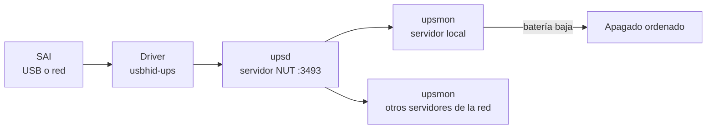
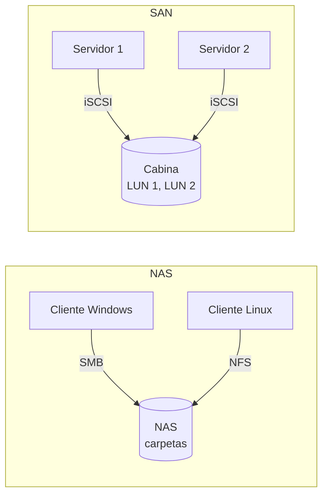

# UD2. Seguridad pasiva: almacenamiento y copias de seguridad

> Medidas que reducen las consecuencias de un incidente y permiten recuperar la información y los servicios: seguridad física, alimentación eléctrica, almacenamiento redundante, copias de seguridad y borrado seguro.

| Datos de la unidad | Información |
| --- | --- |
| Módulo | 0378. Seguridad y Alta Disponibilidad |
| Curso | 2.º ASIR |
| Duración | 12 horas |
| Resultados de aprendizaje | RA1 (a, b) · RA6 (a, b, f, i) |

---

## 1. Introducción

En la UD1 vimos que la **seguridad activa** intenta **evitar** los incidentes. Pero ninguna medida es infalible: los discos se averían, los empleados borran ficheros por error, el *ransomware* consigue entrar y los edificios se inundan. La **seguridad pasiva** parte de una idea realista: **el incidente va a ocurrir**, así que hay que prepararse para que sus consecuencias sean las mínimas posibles y para **recuperarse** cuanto antes.

```text
                    SEGURIDAD
                        │
          ┌─────────────┴─────────────┐
       ACTIVA                       PASIVA
   Prevenir y detectar        Minimizar daños y recuperar
   (antes / durante)          (durante / después)
          │                           │
  Cortafuegos, antivirus,     SAI, RAID, copias de seguridad,
  contraseñas, cifrado, IDS   redundancia, plan de recuperación
```

Un caso real ilustra la diferencia. Una gestoría sufre un ataque de *ransomware*:

| Escenario | Sin seguridad pasiva | Con seguridad pasiva |
| --- | --- | --- |
| Situación | Ficheros cifrados en el servidor y en el disco USB conectado | Ficheros cifrados en el servidor |
| Copias | La única copia estaba en el USB, también cifrada | Copia diaria en un repositorio externo inmutable |
| Resultado | Pagar el rescate (sin garantías) o perder 10 años de expedientes | Restaurar los datos de anoche en 3 horas |

Esta unidad se relaciona directamente con la **disponibilidad** y la **integridad**, y es la base de la UD5 (alta disponibilidad).

## 2. Objetivos

Al finalizar esta unidad serás capaz de:

- Diferenciar seguridad activa y pasiva, física y lógica, y aplicar medidas de seguridad física en un CPD.
- Seleccionar y dimensionar un **SAI** y configurar el apagado automático de un servidor.
- Comparar tecnologías de almacenamiento y **monitorizar** el estado de los discos.
- Explicar los niveles **RAID** e implantar RAID por software con `mdadm`.
- Distinguir almacenamiento **DAS**, **NAS** y **SAN**.
- Diseñar una **política de copias de seguridad** basada en **RPO**, **RTO** y la regla **3-2-1-1-0**.
- Realizar copias **completas**, **incrementales** y **diferenciales** con `tar`, `rsync` y `restic`, automatizarlas y **probar su restauración**.
- Aplicar técnicas de **borrado seguro** según el tipo de soporte.

---

## 3. Seguridad física y centros de proceso de datos

### 3.1. El centro de proceso de datos (CPD)

Un **CPD** (*data center*) es la sala o edificio donde se concentran los servidores, el almacenamiento y la electrónica de red de una organización. Concentrar los equipos tiene ventajas (control de acceso, climatización, mantenimiento) pero también un riesgo: **todo está en el mismo sitio**.

Aspectos a considerar en su diseño:

| Aspecto | Buenas prácticas |
| --- | --- |
| **Ubicación** | Lejos de zonas inundables, sótanos, cocinas, aparcamientos y fachadas. Preferible una planta intermedia sin ventanas. Lejos de fuentes de interferencias electromagnéticas |
| **Control de acceso** | Puerta robusta, tarjeta + PIN o biometría, registro de entradas y salidas, acompañamiento de visitas, videovigilancia |
| **Climatización** | Temperatura de entrada a los equipos entre **18 y 27 °C** (recomendación ASHRAE) y humedad controlada para evitar condensación y electricidad estática |
| **Pasillos frío/caliente** | Los racks se colocan enfrentados: los equipos aspiran aire frío por delante y expulsan aire caliente por detrás, sin que se mezclen |
| **Incendios** | Detección precoz (detectores por aspiración), extinción con **gases limpios** (como el FK-5-1-12) o agua nebulizada; nunca rociadores de agua convencionales sobre los equipos |
| **Agua** | Detectores de inundación bajo el suelo técnico; ninguna tubería por encima de los racks |
| **Suelo técnico y cableado** | Falso suelo o bandejas superiores; cableado ordenado y etiquetado |
| **Alimentación** | SAI, grupo electrógeno, doble acometida, PDU redundantes, fuentes de alimentación duplicadas en los servidores |
| **Comunicaciones** | Dos operadores con rutas físicas diferentes |
| **Monitorización ambiental** | Sensores de temperatura, humedad, humo, agua y apertura de puertas con alertas |

### 3.2. Niveles TIER

El **Uptime Institute** clasifica los CPD en cuatro niveles según su redundancia. La norma europea equivalente es la **EN 50600**.

| Nivel | Redundancia | Disponibilidad orientativa | Parada anual aproximada |
| --- | --- | --- | --- |
| **Tier I** | Básica, sin redundancia (N) | 99,671 % | 28,8 h |
| **Tier II** | Componentes redundantes (N+1) | 99,741 % | 22 h |
| **Tier III** | Mantenible sin parar: varias rutas de alimentación y refrigeración | 99,982 % | 1,6 h |
| **Tier IV** | Tolerante a fallos: todo duplicado (2N) | 99,995 % | 26 min |

`N` es la capacidad necesaria. `N+1` significa que hay un componente de reserva. `2N` significa que todo está duplicado.

### 3.3. Centro de respaldo

Un **centro de respaldo** es una segunda ubicación, a suficiente distancia del CPD principal, donde se pueden recuperar los servicios si una catástrofe afecta a la primera.

| Tipo | Descripción | Tiempo de recuperación | Coste |
| --- | --- | --- | --- |
| **Sala fría** (*cold site*) | Espacio con alimentación y climatización, sin equipos | Días o semanas | Bajo |
| **Sala templada** (*warm site*) | Equipos instalados, datos restaurados desde copia | Horas o días | Medio |
| **Sala caliente** (*hot site*) | Réplica en tiempo casi real, lista para conmutar | Minutos | Alto |
| **Nube** | Recuperación en un proveedor cloud (*Disaster Recovery as a Service*) | Variable | Pago por uso |

### 3.4. Seguridad física de los puestos y soportes

La seguridad física no se limita al CPD:

- **Portátiles**: cifrado de disco, candados Kensington, política de no dejarlos en el coche.
- **Puestos de trabajo**: bloqueo de pantalla automático, política de mesas limpias.
- **Soportes extraíbles**: inventario, cifrado, armarios ignífugos para copias.
- **Papel**: destructoras con nivel de seguridad adecuado (norma DIN 66399).

---

## 4. Alimentación eléctrica y SAI

### 4.1. Problemas de la red eléctrica

| Problema | Descripción | Efecto en los equipos |
| --- | --- | --- |
| **Corte** (*blackout*) | Pérdida total del suministro | Apagado brusco: pérdida de datos no guardados, corrupción de sistemas de ficheros |
| **Microcorte** | Interrupción de milisegundos | Reinicios inesperados |
| **Subtensión** (*brownout*) | Tensión por debajo de lo normal durante un tiempo | Mal funcionamiento, estrés en fuentes |
| **Sobretensión** | Tensión por encima de lo normal | Daño en componentes |
| **Pico** (*spike*) | Sobretensión muy breve e intensa (rayos, conmutaciones) | Destrucción de fuentes y placas |
| **Ruido eléctrico** | Interferencias en la señal | Errores, reinicios |

### 4.2. Sistema de alimentación ininterrumpida (SAI / UPS)

Un **SAI** contiene baterías que alimentan los equipos cuando falla la red. Su objetivo **no** es mantener los servidores encendidos durante horas, sino:

1. Absorber microcortes y filtrar la corriente.
2. Dar tiempo para un **apagado ordenado** si el corte se prolonga, o para que arranque un **grupo electrógeno**.

| Tipo | Funcionamiento | Protección | Uso típico |
| --- | --- | --- | --- |
| ***Off-line* / *standby*** | Los equipos se alimentan de la red; al detectar un corte, conmuta a baterías (unos 5-10 ms) | Básica | Puestos de trabajo |
| **Interactivo** (*line-interactive*) | Como el anterior, pero con un regulador (AVR) que corrige subtensiones y sobretensiones sin usar la batería | Media | Pequeños servidores, electrónica de red |
| ***On-line* de doble conversión** | La corriente se convierte siempre a continua y de nuevo a alterna: los equipos nunca dependen directamente de la red; conmutación de 0 ms | Máxima | Servidores y CPD |

### 4.3. Dimensionar un SAI

La potencia de un SAI se expresa en **VA** (potencia aparente) y en **W** (potencia real). La relación entre ambas es el **factor de potencia** (FP):

```text
W = VA × FP
```

**Ejemplo**: queremos proteger un servidor (450 W), un *switch* (60 W) y un *router* (30 W).

```text
Consumo total             = 450 + 60 + 30 = 540 W
Margen de seguridad (+25 %) = 540 × 1,25 = 675 W
SAI con FP = 0,9           → 675 / 0,9 = 750 VA como mínimo
```

Se elegiría un SAI de **1000 VA / 900 W** o superior, comprobando en la tabla del fabricante que la **autonomía** a 540 W es suficiente para completar el apagado ordenado (por ejemplo, más de 10 minutos).

### 4.4. Monitorización del SAI con NUT

Un SAI solo es útil si el servidor **se entera** de que está funcionando con batería y se apaga correctamente antes de que se agote. **NUT** (*Network UPS Tools*) es el software libre estándar para ello. Se compone de:



- **Driver**: habla con el SAI (por USB, serie o red).
- **upsd**: publica el estado del SAI en el puerto TCP 3493.
- **upsmon**: vigila el estado y ejecuta el apagado cuando el SAI está en batería (`OB`) y con batería baja (`LB`).

Configuración mínima en modo autónomo (`/etc/nut/` en Debian; `/etc/ups/` en AlmaLinux):

```ini
# nut.conf - modo de funcionamiento
MODE=standalone
```

```ini
# ups.conf - definición del SAI conectado por USB
[sai01]
    driver = usbhid-ups
    port = auto
    desc = "SAI del rack principal"
```

```ini
# upsd.users - usuario que usará upsmon para conectarse a upsd
[monuser]
    password = CambiaEstaClave
    upsmon primary
```

```ini
# upsmon.conf - qué SAI vigilar y qué hacer
MONITOR sai01@localhost 1 monuser CambiaEstaClave primary
SHUTDOWNCMD "/sbin/shutdown -h +0"
```

Consulta del estado:

```bash
upsc sai01@localhost
# battery.charge: 100
# battery.runtime: 1260         ← autonomía estimada en segundos
# input.voltage: 230.0
# ups.load: 38                  ← porcentaje de carga
# ups.status: OL                ← OL = en línea; OB = en batería; LB = batería baja
```

> [!NOTE]
> En la práctica 7 se simula un SAI con el driver `dummy-ups`, de modo que se puede probar el apagado automático sin hardware.

---

## 5. Almacenamiento de la información

### 5.1. Tecnologías

| Característica | HDD | SSD SATA | SSD NVMe |
| --- | --- | --- | --- |
| Tecnología | Platos magnéticos y cabezales | Memoria flash NAND | Memoria flash NAND en bus PCIe |
| Velocidad secuencial | 150-280 MB/s | ~550 MB/s | 3.000-14.000 MB/s |
| Latencia | Milisegundos | Microsegundos | Decenas de microsegundos |
| Coste por TB | Bajo | Medio | Medio-alto |
| Fallos típicos | Mecánicos (cabezales, motor), sectores defectuosos | Desgaste de celdas, fallo de controladora | Desgaste, temperatura, controladora |
| Uso típico | Copias de seguridad, archivo, NAS de gran capacidad | Sistemas, servidores | Bases de datos, virtualización |

Indicadores de fiabilidad que aparecen en las hojas de características:

| Indicador | Significado |
| --- | --- |
| **MTBF** (*Mean Time Between Failures*) | Tiempo medio entre fallos, estadístico para una población grande de discos |
| **AFR** (*Annualized Failure Rate*) | Porcentaje de discos que se espera que fallen en un año |
| **TBW** (*Terabytes Written*) | Cantidad total de datos que se pueden escribir en un SSD durante su garantía |
| **DWPD** (*Drive Writes Per Day*) | Cuántas veces al día se puede escribir la capacidad completa del SSD durante la garantía |
| **URE** (*Unrecoverable Read Error*) | Probabilidad de un error de lectura irrecuperable (por ejemplo, 1 por cada 10¹⁵ bits leídos) |

**Ejemplo**: un SSD de 1 TB con 600 TBW. Si el servidor escribe 200 GB al día, ¿cuántos años durará?

```text
600 TBW / 0,2 TB/día = 3.000 días ≈ 8,2 años
```

### 5.2. Tipos de fallo del almacenamiento

| Tipo | Ejemplo | Medida |
| --- | --- | --- |
| **Físico** | Rotura del cabezal, desgaste de la flash | RAID, copias, sustitución preventiva |
| **Lógico** | Sistema de ficheros corrupto tras un apagado brusco | SAI, sistemas de ficheros con *journaling*, `fsck`, copias |
| **Error humano** | `rm -rf` en el directorio equivocado | Copias, *snapshots*, permisos, papelera |
| **Malware** | *Ransomware* que cifra los datos | Copias desconectadas o inmutables |
| **Catástrofe** | Incendio o inundación del CPD | Copias fuera del edificio, centro de respaldo |
| **Corrupción silenciosa** (*bit rot*) | Bits que cambian sin que nadie lo detecte | Sistemas con sumas de comprobación (ZFS, Btrfs), RAID con verificación periódica |

### 5.3. Monitorización con S.M.A.R.T.

**S.M.A.R.T.** (*Self-Monitoring, Analysis and Reporting Technology*) es un sistema de autodiagnóstico de los discos que registra indicadores de salud. El paquete **smartmontools** incluye `smartctl` (consulta) y `smartd` (vigilancia continua).

```bash
sudo apt install -y smartmontools    # Debian/Ubuntu
# sudo dnf install -y smartmontools  # AlmaLinux/Rocky

# Estado global de salud
sudo smartctl -H /dev/sda
# SMART overall-health self-assessment test result: PASSED

# Todos los atributos
sudo smartctl -a /dev/sda

# Lanzar una autoprueba corta (unos 2 minutos) y ver el resultado
sudo smartctl -t short /dev/sda
sudo smartctl -l selftest /dev/sda
```

Atributos más relevantes en un HDD:

| ID | Atributo | Interpretación |
| --- | --- | --- |
| 5 | `Reallocated_Sector_Ct` | Sectores defectuosos reasignados. Si crece, el disco se está degradando |
| 187 | `Reported_Uncorrect` | Errores no corregibles |
| 197 | `Current_Pending_Sector` | Sectores pendientes de reasignar: **mala señal** |
| 198 | `Offline_Uncorrectable` | Sectores ilegibles |
| 194 | `Temperature_Celsius` | Temperatura |
| 9 | `Power_On_Hours` | Horas de funcionamiento |

En un SSD NVMe:

```bash
sudo apt install -y nvme-cli
sudo nvme smart-log /dev/nvme0
# critical_warning      : 0
# temperature           : 38 °C
# percentage_used       : 7%        ← desgaste estimado
# media_errors          : 0
```

Para vigilancia continua, `smartd` puede enviar avisos. Ejemplo de `/etc/smartd.conf`:

```text
# Vigila todos los discos, lanza una prueba corta diaria a las 2:00 y una larga los sábados a las 3:00
DEVICESCAN -a -o on -S on -s (S/../.././02|L/../../6/03) -m admin@empresa.local
```

> [!WARNING]
> Los discos virtuales de VirtualBox **no** admiten S.M.A.R.T. Para practicar, usa `smartctl` en el equipo anfitrión (existe versión para Windows) o en un equipo físico.

---

## 6. Redundancia y RAID

### 6.1. Redundancia

La **redundancia** consiste en duplicar componentes para que, si uno falla, otro ocupe su lugar. Elimina **puntos únicos de fallo** (SPOF, *Single Point Of Failure*), concepto que se desarrolla en la UD5.

| Componente | Redundancia |
| --- | --- |
| Discos | RAID |
| Fuentes de alimentación | Dos fuentes conectadas a dos líneas eléctricas distintas |
| Alimentación | SAI + grupo electrógeno + doble acometida |
| Red | Dos tarjetas de red agregadas (*bonding*), dos *switches* |
| Servidores | Clúster, balanceo de carga (UD5) |
| CPD | Centro de respaldo |

### 6.2. RAID

**RAID** (*Redundant Array of Independent Disks*) combina varios discos físicos en una única unidad lógica para obtener **rendimiento**, **redundancia** o ambos. Se basa en tres técnicas:

| Técnica | Qué hace |
| --- | --- |
| ***Striping*** (división) | Reparte los datos en bloques entre varios discos → más rendimiento |
| ***Mirroring*** (espejo) | Escribe los mismos datos en varios discos → redundancia |
| **Paridad** | Guarda información calculada (XOR) que permite reconstruir un disco perdido → redundancia con menos espacio |

#### Cómo funciona la paridad

La paridad usa la operación lógica **XOR** (⊕), que cumple una propiedad clave: si `P = A ⊕ B`, entonces `A = P ⊕ B`. Es decir, si se pierde un dato, se puede **recalcular** a partir de los demás y de la paridad.

```text
Disco 1 (A):  1 0 1 1 0 0 1 0
Disco 2 (B):  0 1 1 0 1 0 0 1
              ───────────────  XOR
Paridad (P):  1 1 0 1 1 0 1 1

¡Falla el disco 2! Lo reconstruimos:
A ⊕ P      =  1 0 1 1 0 0 1 0  ⊕  1 1 0 1 1 0 1 1  =  0 1 1 0 1 0 0 1  = B ✔
```

Puedes comprobarlo en Python:

```python
A, B = 0b10110010, 0b01101001
P = A ^ B                 # ^ es el operador XOR en Python
print(f"{P:08b}")         # 11011011
print(f"{A ^ P:08b}")     # 01101001  -> es B recuperado
```

### 6.3. Niveles RAID

#### RAID 0 - *Striping*

```text
      Datos: A1 A2 A3 A4 A5 A6
   ┌────────┐   ┌────────┐
   │   A1   │   │   A2   │
   │   A3   │   │   A4   │
   │   A5   │   │   A6   │
   └────────┘   └────────┘
     Disco 1      Disco 2
```

- Mínimo **2** discos. Capacidad: **suma** de todos.
- Rendimiento máximo en lectura y escritura.
- **Sin redundancia**: si falla **un** disco se pierde **todo**. De hecho, es menos fiable que un solo disco.
- Uso: datos temporales, cachés, edición de vídeo con copia aparte.

#### RAID 1 - *Mirroring*

```text
   ┌────────┐   ┌────────┐
   │   A1   │   │   A1   │
   │   A2   │   │   A2   │
   │   A3   │   │   A3   │
   └────────┘   └────────┘
     Disco 1      Disco 2
```

- Mínimo **2** discos. Capacidad: la de **un** disco (50 % de aprovechamiento con 2).
- Tolera el fallo de todos los discos menos uno.
- Lectura rápida (se puede leer de ambos), escritura como un disco.
- Uso: discos del sistema operativo en servidores, pequeños servidores.

#### RAID 5 - *Striping* con paridad distribuida

```text
   ┌────────┐   ┌────────┐   ┌────────┐
   │   A1   │   │   A2   │   │   Ap   │
   │   B1   │   │   Bp   │   │   B2   │
   │   Cp   │   │   C1   │   │   C2   │
   └────────┘   └────────┘   └────────┘
     Disco 1      Disco 2      Disco 3        (p = bloque de paridad)
```

- Mínimo **3** discos. Capacidad: `(n − 1) × tamaño del disco`.
- Tolera el fallo de **1** disco.
- Buena lectura; la escritura es más lenta porque hay que recalcular la paridad (penalización de escritura).
- Riesgo: durante la **reconstrucción** se leen todos los discos restantes; con discos grandes, un error de lectura (URE) o un segundo fallo provocan la pérdida del conjunto. Por eso **no se recomienda con discos de gran capacidad**.

#### RAID 6 - Doble paridad

- Mínimo **4** discos. Capacidad: `(n − 2) × tamaño`.
- Tolera el fallo de **2** discos simultáneos.
- Escritura más lenta que RAID 5. Es la opción habitual para cabinas con discos grandes.

#### RAID 10 (1+0) - Espejos divididos

```text
                 RAID 0
        ┌──────────┴──────────┐
     RAID 1                RAID 1
   ┌────┴────┐          ┌────┴────┐
   │ A1 │ A1 │          │ A2 │ A2 │
   │ A3 │ A3 │          │ A4 │ A4 │
   Disco1 Disco2        Disco3 Disco4
```

- Mínimo **4** discos (número par). Capacidad: 50 %.
- Tolera un fallo por cada espejo (hasta n/2 si son en espejos distintos).
- Excelente rendimiento en escritura y reconstrucción rápida (solo se copia el espejo).
- Uso: bases de datos y máquinas virtuales.

#### Comparativa

| Nivel | Discos mín. | Capacidad útil (n discos de T) | Fallos tolerados | Lectura | Escritura | Uso típico |
| --- | :-: | --- | --- | --- | --- | --- |
| RAID 0 | 2 | n × T | 0 | Muy alta | Muy alta | Temporales |
| RAID 1 | 2 | T | n − 1 | Alta | Normal | Sistema operativo |
| RAID 5 | 3 | (n − 1) × T | 1 | Alta | Media | Ficheros, discos pequeños |
| RAID 6 | 4 | (n − 2) × T | 2 | Alta | Baja-media | Cabinas, NAS grandes |
| RAID 10 | 4 | (n / 2) × T | 1 por espejo | Muy alta | Alta | Bases de datos, VM |

**Ejemplo de cálculo**: 6 discos de 4 TB.

| Nivel | Capacidad útil | Aprovechamiento |
| --- | --- | --- |
| RAID 0 | 24 TB | 100 % |
| RAID 5 | 20 TB | 83 % |
| RAID 6 | 16 TB | 67 % |
| RAID 10 | 12 TB | 50 % |

### 6.4. RAID por hardware, por software y *fake RAID*

| Tipo | Descripción | Ventajas | Inconvenientes |
| --- | --- | --- | --- |
| **Hardware** | Controladora dedicada con procesador y caché (a menudo con batería o condensador) | Independiente del SO, rendimiento, caché protegida | Coste; si se estropea la controladora, se necesita otra compatible |
| **Software** | El sistema operativo gestiona el RAID (`mdadm` en Linux, Espacios de almacenamiento en Windows) | Gratuito, flexible, portable entre equipos | Usa CPU del sistema (hoy poco relevante) |
| ***Fake RAID*** (de la placa base) | La BIOS lo configura, pero el trabajo lo hace un controlador del SO | Ninguna real | Dependencia de la placa; poco recomendable en servidores |

Además existen sistemas de ficheros que integran la gestión de discos y la redundancia: **ZFS** (RAID-Z1, Z2, Z3) y **Btrfs**. Guardan sumas de comprobación de cada bloque y detectan y corrigen la corrupción silenciosa.

### 6.5. RAID por software en Linux con `mdadm`

`mdadm` (*multiple devices admin*) es la herramienta estándar para gestionar RAID por software en Linux. Ejemplo: RAID 5 con tres discos y un **disco de reserva** (*hot spare*), que sustituye automáticamente al disco que falle.

```bash
# Instalar mdadm
sudo apt install -y mdadm         # Debian/Ubuntu
# sudo dnf install -y mdadm       # AlmaLinux/Rocky

# Crear el RAID 5 con /dev/sdb, /dev/sdc, /dev/sdd y /dev/sde como reserva
sudo mdadm --create /dev/md0 --level=5 --raid-devices=3 \
     /dev/sdb /dev/sdc /dev/sdd --spare-devices=1 /dev/sde

# Ver el progreso de la sincronización inicial
cat /proc/mdstat
# md0 : active raid5 sdd[4] sde[3](S) sdc[1] sdb[0]
#       2093056 blocks super 1.2 level 5, 512k chunk, algorithm 2 [3/3] [UUU]
#       [=====>...............]  resync = 27.3% ...
```

Interpretación de `/proc/mdstat`:

- `(S)` indica un disco de reserva (*spare*); `(F)` un disco fallido.
- `[3/3]` → discos necesarios / discos activos.
- `[UUU]` → estado de cada disco: `U` = activo (*up*), `_` = ausente o fallido.

```bash
# Información detallada del RAID
sudo mdadm --detail /dev/md0

# Crear sistema de ficheros y montarlo
sudo mkfs.ext4 -L DATOS /dev/md0
sudo mkdir -p /srv/datos
sudo mount /dev/md0 /srv/datos
```

Para que el RAID se ensamble y monte al arrancar:

```bash
# 1. Guardar la definición del RAID
sudo mdadm --detail --scan | sudo tee -a /etc/mdadm/mdadm.conf   # Debian/Ubuntu
# sudo mdadm --detail --scan | sudo tee -a /etc/mdadm.conf       # AlmaLinux/Rocky

# 2. Regenerar el initramfs para que lo conozca durante el arranque
sudo update-initramfs -u          # Debian/Ubuntu
# sudo dracut -f                  # AlmaLinux/Rocky

# 3. Montaje permanente en /etc/fstab usando el UUID del sistema de ficheros
sudo blkid /dev/md0
echo 'UUID=xxxxxxxx-xxxx-xxxx-xxxx-xxxxxxxxxxxx  /srv/datos  ext4  defaults,nofail  0  2' | sudo tee -a /etc/fstab
sudo findmnt --verify            # comprueba la sintaxis de fstab antes de reiniciar
```

- Se usa el **UUID** porque los nombres `/dev/sdX` pueden cambiar entre arranques.
- `nofail` evita que el sistema se quede bloqueado en el arranque si el RAID no está disponible.
- `findmnt --verify` comprueba `/etc/fstab`: un error en este fichero puede impedir que el sistema arranque.

#### Simular un fallo y reconstruir

```bash
# Marcamos un disco como fallido (simulación)
sudo mdadm /dev/md0 --fail /dev/sdc
cat /proc/mdstat
# md0 : active raid5 sdd[4] sde[3] sdc[1](F) sdb[0]
#       [3/2] [U_U]
#       [==>..................]  recovery = 12.5%    ← el spare entra automáticamente

# Retiramos el disco averiado y añadimos uno nuevo como reserva
sudo mdadm /dev/md0 --remove /dev/sdc
sudo mdadm /dev/md0 --add /dev/sdc       # en la realidad sería un disco nuevo
sudo mdadm --detail /dev/md0
```

#### Vigilar el RAID

El servicio `mdmonitor` (o `mdadm --monitor`) avisa por correo o registra en el diario cuando un disco falla:

```bash
# Dirección para los avisos en mdadm.conf
echo "MAILADDR admin@empresa.local" | sudo tee -a /etc/mdadm/mdadm.conf

# Enviar un aviso de prueba para comprobar que funciona
sudo mdadm --monitor --scan --test --oneshot
```

### 6.6. RAID no es una copia de seguridad

Este es probablemente el concepto más importante de la unidad:

| Situación | ¿Protege el RAID? | ¿Protege una copia? |
| --- | :-: | :-: |
| Falla un disco | ✔ | ✔ |
| Un usuario borra un fichero | ✘ (se borra en todos los discos) | ✔ |
| *Ransomware* cifra los datos | ✘ (se cifra en todos los discos) | ✔ (si está desconectada o es inmutable) |
| Se corrompe el sistema de ficheros | ✘ | ✔ |
| Incendio en el CPD | ✘ | ✔ (si está fuera del edificio) |
| Roban el servidor | ✘ | ✔ |

> [!IMPORTANT]
> El RAID protege la **disponibilidad** frente al fallo de un disco. Las copias de seguridad protegen la **información** frente a casi cualquier otra cosa. Se necesitan **ambos**.

### 6.7. LVM e instantáneas

**LVM** (*Logical Volume Manager*) añade una capa de abstracción sobre los discos:

```text
Discos / RAID     →   Volúmenes físicos (PV)    pvcreate /dev/md0
                  →   Grupo de volúmenes (VG)   vgcreate vg_datos /dev/md0
                  →   Volúmenes lógicos (LV)    lvcreate -L 1G -n lv_web vg_datos
                  →   Sistema de ficheros       mkfs.ext4 /dev/vg_datos/lv_web
```

Ventajas: ampliar volúmenes en caliente y crear **instantáneas** (*snapshots*). Una instantánea LVM congela el estado de un volumen en un instante, lo que permite hacer una **copia coherente** de unos datos que siguen cambiando:

```bash
# Instantánea de 200 MB (espacio para los cambios que ocurran mientras existe)
sudo lvcreate --snapshot --size 200M --name snap_web /dev/vg_datos/lv_web

# Montarla en solo lectura y copiarla con calma
sudo mount -o ro /dev/vg_datos/snap_web /mnt/snap
sudo tar -czf /backup/web_$(date +%F).tar.gz -C /mnt/snap .

# Eliminarla al terminar (si se llena, queda inválida)
sudo umount /mnt/snap
sudo lvremove -y /dev/vg_datos/snap_web
```

> [!WARNING]
> Una instantánea **no es una copia de seguridad**: está en los mismos discos que el original. Sirve para **hacer** copias coherentes o para volver atrás tras un cambio, no para proteger frente a la pérdida del disco.

---

## 7. Almacenamiento en red: DAS, NAS y SAN

| | **DAS** | **NAS** | **SAN** |
| --- | --- | --- | --- |
| Significado | *Direct Attached Storage* | *Network Attached Storage* | *Storage Area Network* |
| Conexión | Directa al servidor (SATA, SAS, USB) | Red Ethernet | Red dedicada (Fibre Channel o iSCSI sobre Ethernet) |
| Qué ofrece | Discos | **Ficheros** (carpetas compartidas) | **Bloques** (discos virtuales, LUN) |
| Protocolos | SATA, SAS, NVMe | **SMB/CIFS**, **NFS** | **iSCSI**, **Fibre Channel**, NVMe-oF |
| Quién gestiona el sistema de ficheros | El servidor | El NAS | El servidor que monta la LUN |
| Ejemplo | Disco externo USB | Synology, QNAP, **TrueNAS** | Cabina para un clúster de virtualización |
| Coste | Bajo | Medio | Alto |



**TrueNAS** (antes FreeNAS) es una distribución libre para construir un NAS basada en **ZFS**. Ofrece RAID-Z, *snapshots* programadas, replicación a otro NAS, compartición SMB/NFS e iSCSI.

> [!TIP]
> Los NAS son un objetivo habitual del *ransomware*. Deben estar actualizados, sin la interfaz de administración expuesta a Internet, con *snapshots* de solo lectura y con una copia adicional fuera del NAS.

---

## 8. Copias de seguridad

### 8.1. Concepto

Una **copia de seguridad** (*backup*) es una copia de los datos almacenada de forma **independiente** de los originales, que permite **restaurarlos** si se pierden o se dañan.

Antes de copiar hay que decidir **qué** copiar:

| Qué copiar | Ejemplos | Frecuencia típica |
| --- | --- | --- |
| Datos de usuario | `/home`, carpetas compartidas | Diaria |
| Bases de datos | Volcado con `mariadb-dump` o `pg_dump` | Diaria o continua |
| Configuración | `/etc`, ficheros de servicios | Tras cada cambio |
| Sistema completo | Imagen del disco, máquina virtual | Semanal o tras cambios importantes |
| Correo, aplicaciones | Buzones, CMS | Diaria |

> [!NOTE]
> Las bases de datos **no** se deben copiar copiando sus ficheros mientras el servicio está en marcha: el resultado puede ser inconsistente. Se usa un volcado lógico (`mariadb-dump --single-transaction`) o una instantánea coherente.

### 8.2. Tipos de copia

| Tipo | Qué copia | Ventajas | Inconvenientes | Para restaurar se necesita |
| --- | --- | --- | --- | --- |
| **Completa** (*full*) | Todo | Restauración sencilla y rápida | Ocupa mucho y tarda | Solo la última completa |
| **Incremental** | Lo que ha cambiado desde la **última copia** (de cualquier tipo) | La más rápida y pequeña | Restauración lenta: hay que aplicar la cadena entera | La completa + **todas** las incrementales |
| **Diferencial** | Lo que ha cambiado desde la **última completa** | Restauración con solo dos copias | Cada día ocupa más | La completa + la **última** diferencial |

**Ejemplo semanal.** Cada día se modifican 2 GB de datos distintos; la copia completa ocupa 100 GB.

| Día | Completa los domingos + incrementales | Completa los domingos + diferenciales |
| --- | --- | --- |
| Domingo | Completa: 100 GB | Completa: 100 GB |
| Lunes | Cambios del lunes: 2 GB | Cambios desde el domingo: 2 GB |
| Martes | Cambios del martes: 2 GB | Cambios desde el domingo: 4 GB |
| Miércoles | Cambios del miércoles: 2 GB | Cambios desde el domingo: 6 GB |
| Jueves | Cambios del jueves: 2 GB | Cambios desde el domingo: 8 GB |
| **Total semanal** | **108 GB** | **120 GB** |
| **Restaurar el jueves** | Completa + L + M + X + J (5 copias) | Completa + diferencial del jueves (2 copias) |

Las herramientas modernas (restic, Borg, Proxmox Backup Server, Veeam…) usan **deduplicación**: cada copia se presenta como completa, pero solo se almacenan los bloques nuevos. Combinan las ventajas de ambos tipos.

### 8.3. Regla 3-2-1-1-0

| Número | Significado | Ejemplo |
| :-: | --- | --- |
| **3** | Al menos **tres** copias de los datos (el original y dos copias) | Servidor + NAS + nube |
| **2** | En al menos **dos** tipos de soporte diferentes | Disco y cinta, o disco local y almacenamiento en la nube |
| **1** | Al menos **una** copia **fuera** de las instalaciones (*off-site*) | Nube o sede remota |
| **1** | Al menos **una** copia **desconectada** (*offline*, *air-gapped*) o **inmutable** | Cinta guardada en caja fuerte o almacenamiento con bloqueo de objetos (WORM) |
| **0** | **Cero** errores al verificar la restauración | Pruebas de restauración periódicas |

### 8.4. Copias de seguridad y *ransomware*

El *ransomware* actual busca y destruye las copias antes de cifrar. Medidas específicas:

- **Copia inmutable**: no se puede modificar ni borrar durante un periodo (S3 Object Lock, *snapshots* de solo lectura, cintas WORM).
- **Copia desconectada**: no accesible desde la red de producción salvo durante la copia.
- **Credenciales separadas**: el servidor de copias no usa las mismas cuentas que el dominio.
- **Modelo *pull***: es el servidor de copias el que se conecta a los equipos para **traer** los datos, no al revés; así un equipo infectado no tiene credenciales para borrar las copias.
- **Cifrado** de las copias: si roban la copia, no pueden leerla.
- **Monitorización**: un aumento repentino del tamaño de las copias incrementales puede indicar cifrado masivo.

### 8.5. RPO y RTO

Son los dos parámetros que determinan **cómo** y **cada cuánto** se copia:

| Parámetro | Pregunta | Determina |
| --- | --- | --- |
| **RPO** (*Recovery Point Objective*) | ¿Cuántos datos (medidos en tiempo) podemos permitirnos **perder**? | La **frecuencia** de las copias |
| **RTO** (*Recovery Time Objective*) | ¿Cuánto tiempo puede estar el servicio **parado**? | La **tecnología** y el procedimiento de recuperación |

```text
  Última copia            INCIDENTE                 Servicio restaurado
       │                      │                              │
───────●──────────────────────✖──────────────────────────────●──────────▶ tiempo
       │◀──────── RPO ───────▶│◀─────────── RTO ────────────▶│
        datos que se pierden     tiempo sin servicio
```

**Ejemplo**: una tienda en línea define RPO = 1 hora y RTO = 4 horas.

- Con copias diarias a las 02:00, un incidente a las 18:00 perdería 16 horas de pedidos → **no cumple** el RPO. Necesita copias cada hora o replicación de la base de datos.
- Si restaurar 500 GB desde la nube con 100 Mbit/s tarda unas 11 horas → **no cumple** el RTO. Necesita una copia local rápida o un servidor en espera.

Cálculo del tiempo de restauración:

```text
500 GB × 8 = 4.000 Gbit
4.000 Gbit / 0,1 Gbit/s = 40.000 s ≈ 11,1 horas (sin contar otros retrasos)
```

Ambos valores se deciden con la dirección mediante un **análisis de impacto en el negocio** (BIA, *Business Impact Analysis*): cuanto menores sean, más cara será la solución.

| Servicio | RPO | RTO | Solución adecuada |
| --- | --- | --- | --- |
| Web informativa | 24 h | 24 h | Copia diaria |
| Ficheros compartidos | 4 h | 8 h | *Snapshots* cada 4 h + copia diaria externa |
| ERP / tienda en línea | 15 min | 2 h | Replicación de la base de datos + copia horaria |
| Sistema de pagos | ≈ 0 | Minutos | Clúster con replicación síncrona (UD5) |

### 8.6. Rotación y retención

La **retención** define cuánto tiempo se conservan las copias. Un esquema clásico es **abuelo-padre-hijo** (GFS, *Grandfather-Father-Son*):

| Nivel | Frecuencia | Se conservan | Ejemplo |
| --- | --- | --- | --- |
| Hijo | Diaria | 7 | Lunes a domingo |
| Padre | Semanal | 4 | Cada domingo del mes |
| Abuelo | Mensual | 12 | Último día de cada mes |

Así se puede volver a cualquier día de la última semana, a cualquier semana del último mes y a cualquier mes del último año. La retención también está condicionada por la ley: el RGPD obliga a **no conservar** datos personales más tiempo del necesario, mientras que la normativa fiscal obliga a conservar ciertos documentos durante años.

### 8.7. Política de copias de seguridad

Una política documenta todas las decisiones. Ejemplo:

```text
POLÍTICA DE COPIAS DE SEGURIDAD - Servidor de ficheros SRV-FICH01

Datos:          /srv/compartido, /etc, volcado de la base de datos de la intranet.
Responsable:    Administración de sistemas (titular y suplente).
RPO / RTO:      4 horas / 8 horas.
Tipo y horario: Copia deduplicada (restic) cada 4 horas en el servidor de copias local.
                Réplica diaria a las 03:00 en almacenamiento en la nube con bloqueo de objetos.
Retención:      6 copias diarias, 4 semanales, 12 mensuales.
Cifrado:        AES-256; claves custodiadas en el gestor de secretos y en sobre en caja fuerte.
Verificación:   Comprobación de integridad semanal (restic check).
                Restauración de prueba mensual de 10 ficheros aleatorios y trimestral completa.
Registro:       Resultado de cada copia en el diario del sistema y alerta por correo si falla.
Revisión:       Anual o tras cambios relevantes en el servicio.
```

---

## 9. Herramientas de copia de seguridad

### 9.1. `tar`: empaquetado y copias incrementales

`tar` (*tape archiver*) empaqueta ficheros y directorios en un único archivo conservando permisos, propietarios y fechas.

```bash
# Copia completa comprimida de /etc
sudo tar -czpf /backup/etc_$(date +%F).tar.gz -C / etc
#   -c crear   -z comprimir con gzip   -p conservar permisos   -f fichero de salida
#   -C / cambia al directorio raíz antes de añadir "etc" (rutas relativas en el archivo)

# Ver el contenido sin extraer
tar -tzvf /backup/etc_2026-10-06.tar.gz | head

# Restaurar un único fichero en un directorio temporal
mkdir -p /tmp/restauracion
tar -xzf /backup/etc_2026-10-06.tar.gz -C /tmp/restauracion etc/hosts
```

**Copias incrementales con `tar`** usando un fichero de instantánea (*snapshot file*) que registra el estado de cada copia:

```bash
# Nivel 0 (completa): el fichero .snar no existe, así que se copia todo
tar --listed-incremental=/backup/datos.snar -czpf /backup/datos_full.tar.gz -C /srv datos

# Nivel 1 (incremental): solo lo que ha cambiado desde la copia anterior
tar --listed-incremental=/backup/datos.snar -czpf /backup/datos_inc1.tar.gz -C /srv datos

# Restauración: se extraen EN ORDEN la completa y todas las incrementales
tar --listed-incremental=/dev/null -xzf /backup/datos_full.tar.gz -C /restaurar
tar --listed-incremental=/dev/null -xzf /backup/datos_inc1.tar.gz -C /restaurar
```

Para hacer **diferenciales**, se guarda una copia del `.snar` tras la completa y se usa una copia de ese fichero original en cada diferencial.

### 9.2. `rsync`: sincronización eficiente

`rsync` copia y sincroniza ficheros transfiriendo **solo las diferencias**. Funciona en local o a través de SSH.

```bash
# Sincronizar /srv/datos con el servidor de copias a través de SSH
rsync -aAXHv --delete /srv/datos/ copias@sad-backup:/backups/sad-cli/datos/
```

| Opción | Significado |
| --- | --- |
| `-a` | Modo archivo: recursivo y conserva permisos, propietarios, fechas y enlaces |
| `-A` / `-X` | Conserva las ACL y los atributos extendidos |
| `-H` | Conserva los enlaces duros |
| `-v` | Detallado |
| `--delete` | Borra en el destino lo que ya no existe en el origen |
| `-n` / `--dry-run` | Simula sin hacer cambios |

> [!WARNING]
> La **barra final** cambia el significado: `rsync datos/ destino/` copia el **contenido** de `datos`; `rsync datos destino/` crea `destino/datos`. Con `--delete`, una ruta equivocada puede borrar datos del destino: prueba primero con `--dry-run`.

Una sincronización con `--delete` **no** es una copia de seguridad con historial: si se borra un fichero en el origen, desaparece del destino en la siguiente ejecución. Para tener historial se usa `--link-dest`, que crea copias diarias que parecen completas pero comparten mediante **enlaces duros** los ficheros que no han cambiado:

```bash
HOY=$(date +%F)
rsync -aAXH --delete \
      --link-dest=/backups/datos/ultima \
      /srv/datos/ /backups/datos/$HOY/
ln -sfn /backups/datos/$HOY /backups/datos/ultima   # «ultima» apunta a la copia más reciente
```

### 9.3. `restic`: copias deduplicadas, cifradas y con historial

**restic** es una herramienta moderna de copias que:

- **Cifra** siempre los datos (AES-256) con una contraseña.
- **Deduplica**: divide los ficheros en fragmentos y no guarda dos veces el mismo.
- Guarda **instantáneas**: cada copia se puede restaurar como si fuera completa.
- Admite repositorios locales, por **SFTP**, en servidores REST y en almacenamiento en la nube (S3 y compatibles).
- Está disponible en Debian (`apt install restic`) y en EPEL (`dnf install restic`).

```bash
# Variables para no escribir la contraseña en la línea de órdenes
export RESTIC_REPOSITORY="sftp:copias@sad-backup:/backups/restic-sad-cli"
export RESTIC_PASSWORD_FILE="/root/.restic-pass"     # fichero con permisos 600

# 1. Inicializar el repositorio (una sola vez)
restic init

# 2. Hacer una copia
restic backup /srv/datos /etc --tag diaria
# Files:         120 new,     0 changed,     0 unmodified
# Added to the repository: 15.312 MiB (5.104 MiB stored)
# snapshot 4b9e7c21 saved

# 3. Listar las instantáneas
restic snapshots
# ID        Time                 Host     Tags    Paths
# 4b9e7c21  2026-10-06 10:00:01  sad-cli  diaria  /etc, /srv/datos

# 4. Restaurar la última copia de un fichero concreto en un directorio temporal
restic restore latest --target /tmp/restauracion --include /srv/datos/informe.odt

# 5. Política de retención y limpieza
restic forget --keep-daily 7 --keep-weekly 4 --keep-monthly 12 --prune

# 6. Verificar la integridad del repositorio
restic check
```

> [!IMPORTANT]
> Si se pierde la contraseña del repositorio de restic, **los datos son irrecuperables**. Guárdala en un gestor de secretos y en una copia física custodiada.

### 9.4. Automatización con temporizadores de systemd

Una copia que depende de que alguien se acuerde de lanzarla, no es una copia. Los **temporizadores** (*timers*) de systemd son la alternativa actual a `cron`: registran cada ejecución en el diario, permiten ejecutar tareas perdidas si el equipo estaba apagado (`Persistent=true`) y se gestionan con `systemctl`.

Script `/usr/local/sbin/backup-restic.sh`:

```bash
#!/usr/bin/env bash
# Copia de seguridad diaria con restic
set -euo pipefail
export RESTIC_REPOSITORY="sftp:copias@sad-backup:/backups/restic-sad-cli"
export RESTIC_PASSWORD_FILE="/root/.restic-pass"

restic backup /srv/datos /etc --tag diaria --exclude-caches
restic forget --keep-daily 7 --keep-weekly 4 --keep-monthly 12 --prune
restic check --read-data-subset=5%       # verifica un 5 % de los datos cada día
```

Servicio `/etc/systemd/system/backup-restic.service`:

```ini
[Unit]
Description=Copia de seguridad con restic
Wants=network-online.target
After=network-online.target

[Service]
Type=oneshot
ExecStart=/usr/local/sbin/backup-restic.sh
```

Temporizador `/etc/systemd/system/backup-restic.timer`:

```ini
[Unit]
Description=Ejecuta la copia de seguridad todos los días a las 02:30

[Timer]
OnCalendar=*-*-* 02:30:00
Persistent=true
RandomizedDelaySec=10min

[Install]
WantedBy=timers.target
```

```bash
sudo systemctl daemon-reload                       # recarga las definiciones de unidades
sudo systemctl enable --now backup-restic.timer    # activa el temporizador
systemctl list-timers backup-restic.timer          # próxima ejecución
sudo systemctl start backup-restic.service         # ejecución manual de prueba
journalctl -u backup-restic.service -n 30          # resultado de la última copia
```

### 9.5. Otras herramientas

| Herramienta | Tipo | Uso |
| --- | --- | --- |
| **BorgBackup** | Copias deduplicadas y cifradas | Alternativa a restic, muy usada en Linux |
| **Bacula / Bareos** | Sistema de copias cliente-servidor | Entornos con muchos equipos y cintas |
| **Proxmox Backup Server** | Copias de máquinas virtuales y contenedores | Entornos Proxmox VE (UD5) |
| **Clonezilla** | Clonado e imágenes de disco | Restaurar un equipo completo («bare metal») |
| **Duplicati** | Copias cifradas con interfaz web | Puestos de trabajo y pequeñas oficinas |
| **Copias de seguridad de Windows Server** (`wbadmin`) | Copias del sistema y de volúmenes | Servidores Windows; usa instantáneas VSS |
| **Veeam** (comercial) | Copias de VM y servidores | Muy extendido en empresas |

Ejemplo en Windows Server con PowerShell (instalando la característica y lanzando una copia del volumen `D:` a un disco `E:`):

```powershell
Install-WindowsFeature Windows-Server-Backup
wbadmin start backup -backupTarget:E: -include:D: -quiet
wbadmin get versions
```

### 9.6. Pruebas de restauración

Una copia que nunca se ha restaurado es solo una **esperanza**. Un procedimiento de prueba:

1. Elegir aleatoriamente varios ficheros y una base de datos.
2. Restaurarlos en un **entorno aislado** (nunca sobre producción).
3. **Verificar** que el contenido es correcto (abrir el documento, comparar hashes, arrancar la aplicación).
4. Medir el **tiempo** empleado y compararlo con el RTO.
5. Registrar el resultado y corregir los problemas detectados.

```bash
# Comparar un fichero restaurado con el original mediante su hash
sha256sum /srv/datos/informe.odt /tmp/restauracion/srv/datos/informe.odt

# Comparar directorios completos (sin salida = idénticos)
diff -r /srv/datos /tmp/restauracion/srv/datos && echo "Restauración verificada"
```

---

## 10. Planes de continuidad y recuperación

| Plan | Objetivo | Ejemplo de contenido |
| --- | --- | --- |
| **Plan de continuidad de negocio** (BCP) | Mantener las funciones críticas de la organización durante una crisis | Trabajar desde casa si el edificio no es accesible |
| **Plan de recuperación ante desastres** (DRP) | Restaurar los sistemas de información tras un desastre | Pasos para levantar los servidores en el centro de respaldo |
| **Plan de contingencia** | Respuesta ante incidentes concretos | Qué hacer si falla el enlace a Internet |

Un DRP debe incluir: inventario de sistemas priorizados, RPO/RTO de cada uno, responsables y contactos, ubicación de copias y claves, procedimientos paso a paso, y un calendario de **simulacros**. La norma de referencia es la **ISO 22301**.

---

## 11. Borrado seguro y ciclo de vida de los soportes

Borrar un fichero con `rm` o vaciar la papelera **no** elimina los datos: solo marca el espacio como libre. Formatear rápidamente tampoco. En la práctica forense de la UD1 recuperamos un fichero borrado de esta forma.

La guía de referencia es **NIST SP 800-88** (*Guidelines for Media Sanitization*), que define tres niveles:

| Nivel | Descripción | Ejemplos |
| --- | --- | --- |
| **Limpiar** (*Clear*) | Sobrescribir con técnicas lógicas; protege frente a recuperación con herramientas normales | Sobrescribir un HDD con ceros |
| **Purgar** (*Purge*) | Técnicas que impiden la recuperación incluso en laboratorio | *Secure Erase* / *Sanitize* del firmware, borrado criptográfico, desmagnetizado |
| **Destruir** (*Destroy*) | El soporte queda inutilizable | Trituración, desintegración, incineración |

El método depende del tipo de soporte:

| Soporte | Método recomendado | Por qué |
| --- | --- | --- |
| **HDD** | Sobrescritura completa (`shred`, `dd`) o desmagnetizado | Los datos están en posiciones fijas que se pueden sobrescribir |
| **SSD / NVMe** | Comando *Sanitize* o *Secure Erase* del firmware, o borrado criptográfico | La controladora reparte las escrituras (*wear leveling*) y reserva celdas ocultas: sobrescribir no garantiza llegar a todas |
| **Disco cifrado** | **Borrado criptográfico**: destruir la clave | Sin la clave, los datos son ruido |
| **Papel, CD/DVD, cintas** | Destrucción física certificada | |

Ejemplos (¡destruyen los datos del dispositivo indicado!):

```bash
# HDD: sobrescribir 1 pasada con datos aleatorios y una final con ceros
sudo shred -v -n 1 -z /dev/sdX

# SSD SATA o NVMe: descartar todos los bloques con borrado seguro, si el dispositivo lo admite
sudo blkdiscard --secure /dev/sdX

# NVMe: borrado mediante el firmware (formato con borrado criptográfico, si lo admite)
sudo nvme format /dev/nvme0n1 --ses=2

# Disco cifrado con LUKS: destruir todas las ranuras de claves (borrado criptográfico)
sudo cryptsetup erase /dev/sdX
```

> [!CAUTION]
> Estos comandos son **irreversibles**. En el laboratorio se practican solo sobre ficheros de imagen o discos virtuales dedicados. Comprueba siempre el dispositivo con `lsblk` antes de ejecutarlos.

`shred` sobre **ficheros** individuales no es fiable en sistemas de ficheros con *journaling*, copia en escritura (Btrfs, ZFS) o en SSD. La mejor estrategia para soportes que contienen información sensible es **cifrarlos desde el principio** (UD3 y UD4): así, al final de su vida, basta con destruir la clave.

En una organización, la **retirada de equipos** debe seguir un procedimiento documentado: inventario, borrado o destrucción según la clasificación de la información, **certificado de destrucción** del proveedor (norma UNE-EN 15713) y actualización del inventario. El RGPD obliga a acreditar que los datos personales se eliminaron de forma segura.

---

## 12. Buenas prácticas

1. Aplicar la regla **3-2-1-1-0** y mantener al menos una copia **inmutable o desconectada**.
2. **Cifrar** las copias y custodiar las claves fuera del sistema copiado.
3. **Automatizar** las copias y **vigilar** su resultado; una copia que falla en silencio es una copia inexistente.
4. **Probar la restauración** periódicamente y medir el tiempo frente al RTO.
5. Usar RAID para la disponibilidad, **nunca** como sustituto de las copias.
6. Vigilar el estado de los discos (S.M.A.R.T., `mdadm --monitor`) y sustituirlos de forma preventiva.
7. Proteger los equipos con SAI y configurar el **apagado ordenado**.
8. Documentar la política de copias y el plan de recuperación, y hacer **simulacros**.
9. Aplicar **borrado seguro** adecuado al soporte antes de reutilizarlo o retirarlo.

## 13. Ejercicios

1. Calcula la capacidad útil y los fallos tolerados de 8 discos de 2 TB en RAID 0, 1, 5, 6 y 10.
2. Con cuatro bloques de datos `1010`, `0110`, `1100` y `0011`, calcula la paridad XOR y demuestra cómo se recupera el segundo bloque si se pierde.
3. Dimensiona un SAI para un servidor de 600 W, un NAS de 80 W y un *switch* de 40 W con un factor de potencia de 0,9 y un margen del 25 %.
4. Un SSD de 2 TB tiene 1.200 TBW. ¿Cuántos años durará si se escriben 500 GB al día?
5. Una empresa hace una copia completa el domingo y diferenciales el resto de días. El jueves por la tarde se borra un fichero modificado el martes. ¿Qué copias necesita para recuperarlo?
6. Una clínica define RPO = 2 horas y RTO = 4 horas para su base de datos de 200 GB. Hace copias diarias a la nube con un enlace de 50 Mbit/s. ¿Cumple ambos objetivos? Propón mejoras.
7. Diseña un esquema de rotación GFS para una gestoría y calcula cuántas copias se conservan simultáneamente.
8. Explica por qué `shred` no es un método fiable para borrar de forma segura un SSD y qué alternativas existen.
9. Clasifica estas medidas como seguridad física o lógica: SAI, RAID por software, cámara en el CPD, `restic`, extintor de gas, cifrado de copias.

{}
**1.** RAID 0: 16 TB, 0 fallos. RAID 1 (8 discos en espejo): 2 TB, 7 fallos. RAID 5: 14 TB, 1 fallo. RAID 6: 12 TB, 2 fallos. RAID 10: 8 TB, 1 por espejo (hasta 4).

**3.** (600 + 80 + 40) × 1,25 = 900 W → 900 / 0,9 = 1000 VA mínimo. Se elegiría un SAI de 1500 VA *on-line* para tener margen de autonomía.

**4.** 1.200 / 0,5 = 2.400 días ≈ 6,6 años.

**5.** La completa del domingo y la diferencial de la noche del miércoles (contiene todo lo cambiado desde el domingo, incluida la modificación del martes).

**6.** RPO: con copias diarias se pueden perder hasta 24 horas → no cumple (necesita copias cada 2 horas o replicación). RTO: 200 GB × 8 / 0,05 Gbit/s = 32.000 s ≈ 8,9 h → no cumple. Mejoras: copia local en un servidor de copias o NAS para restaurar rápido, copias cada hora con deduplicación, réplica de la base de datos en un servidor en espera.
{}

## 14. Resumen

- La **seguridad pasiva** reduce las consecuencias de los incidentes y permite la recuperación.
- La **seguridad física** del CPD protege frente a accesos, fuego, agua, temperatura y fallos eléctricos. El **SAI** debe estar dimensionado y configurado para un **apagado ordenado**.
- Los discos fallan: hay que **monitorizarlos** (S.M.A.R.T.) y usar **RAID** para tolerar sus fallos. RAID 1, 5, 6 y 10 ofrecen distintos equilibrios entre capacidad, rendimiento y tolerancia.
- **RAID no es una copia de seguridad.** Las copias protegen frente a borrados, *malware*, corrupción y catástrofes.
- Las copias pueden ser **completas**, **incrementales** o **diferenciales**; las herramientas modernas usan **deduplicación** y **cifrado**.
- **RPO** marca la frecuencia de las copias y **RTO** el tiempo máximo de recuperación.
- La regla **3-2-1-1-0** y las copias **inmutables** son la defensa principal frente al *ransomware*.
- Las copias deben **automatizarse**, **vigilarse** y **restaurarse** periódicamente.
- El **borrado seguro** depende del soporte; cifrar desde el principio facilita el borrado criptográfico.

## 15. Referencias y documentación oficial

- [Linux RAID Wiki (kernel.org)](https://raid.wiki.kernel.org/) · [Manual de mdadm](https://man7.org/linux/man-pages/man8/mdadm.8.html)
- [smartmontools](https://www.smartmontools.org/)
- [Network UPS Tools (NUT)](https://networkupstools.org/documentation.html)
- [Documentación de restic](https://restic.readthedocs.io/)
- [rsync](https://rsync.samba.org/documentation.html)
- [GNU tar: copias incrementales](https://www.gnu.org/software/tar/manual/html_node/Incremental-Dumps.html)
- [systemd.timer](https://www.freedesktop.org/software/systemd/man/latest/systemd.timer.html)
- [TrueNAS: documentación](https://www.truenas.com/docs/)
- [NIST SP 800-88 Rev. 1: Guidelines for Media Sanitization](https://csrc.nist.gov/pubs/sp/800/88/r1/final)
- [INCIBE: Copias de seguridad, una guía de aproximación para el empresario](https://www.incibe.es/empresas/guias)
- [CCN-CERT: Guía CCN-STIC sobre copias de seguridad y borrado seguro](https://www.ccn-cert.cni.es/es/guias.html)
- [Uptime Institute: Tier Classification System](https://uptimeinstitute.com/tiers)
