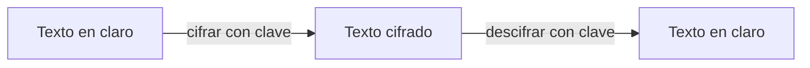
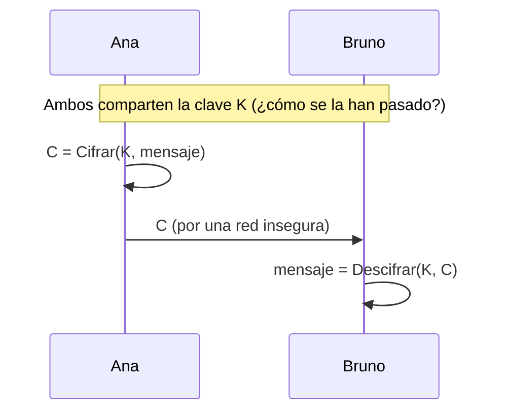
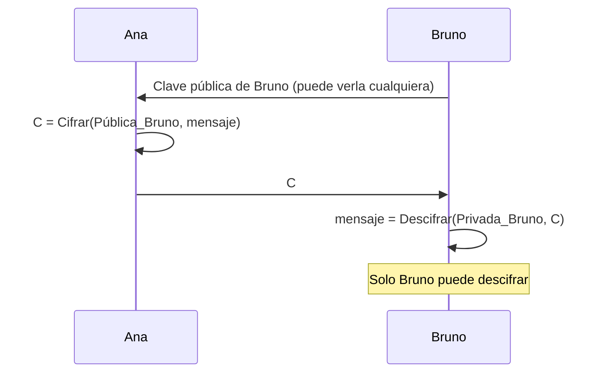
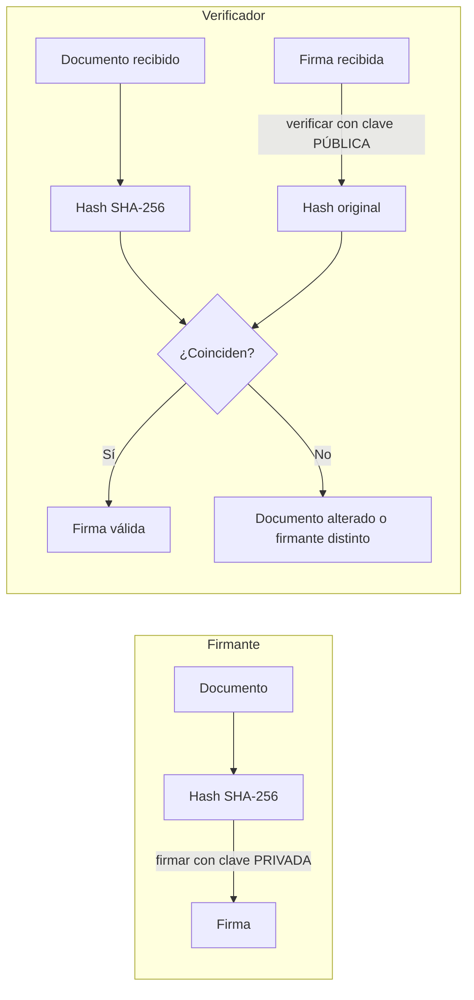
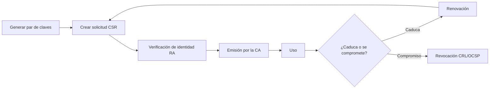
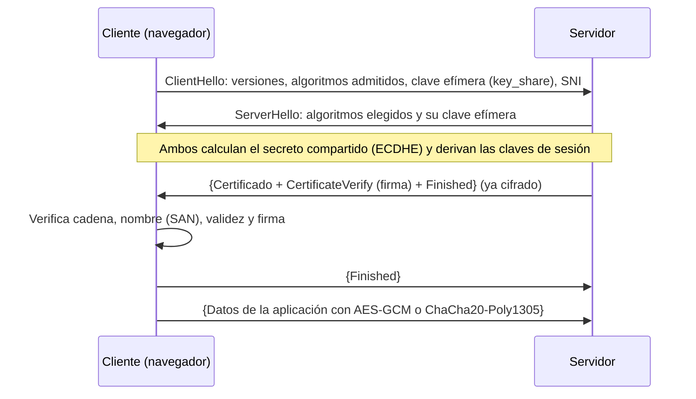
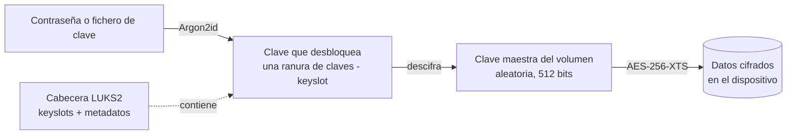

# UD3 · Criptografía y aplicaciones criptográficas

## Resumen del tema

Cada vez que entras en la web de tu banco, te conectas por SSH a un servidor, presentas un trámite con tu certificado digital o descargas una actualización de Debian, la **criptografía** está trabajando. Es la herramienta técnica que permite:

| Necesidad de seguridad | Mecanismo criptográfico | Ejemplo cotidiano |
|---|---|---|
| Que nadie más pueda **leer** la información (confidencialidad) | **Cifrado** | Un portátil robado con el disco cifrado |
| Detectar si la información ha sido **modificada** (integridad) | **Funciones *hash*** y **MAC** | Verificar una ISO descargada |
| Saber **quién** envía o firma la información (autenticidad) | **Firma digital** y **certificados** | Una factura electrónica firmada |
| Que el autor **no pueda negar** lo que firmó (no repudio) | **Firma digital** | Presentar impuestos con certificado |
| **Acordar** una clave secreta por una red insegura | **Intercambio de claves** (Diffie-Hellman) | El inicio de una conexión HTTPS |

Esta unidad conecta con todas las demás: las copias cifradas ([UD2](/ud02-seguridad-pasiva/)), el cifrado de disco y SSH ([UD4](/UD04/)), las VPN y los certificados de cliente ([UD6](/ud06-seguridad-perimetral/)) y el *proxy* inverso con TLS ([UD7](/ud07-alta-disponibilidad/)).



### Planificación de la unidad

| Bloque | Horas |
|---|:-:|
| Teoría (esta página) | 7 h |
| [Prácticas](/ud03-criptografia/ud03-practicas/) (incluye la Tarea del proyecto) | 9 h |
| Evaluación | 2 h |
| **Total** | **18 h** |

| Apartado de la teoría | Horas |
|---|:-:|
| 1. Conceptos fundamentales | 0,5 |
| 2. Criptografía simétrica | 1 |
| 3. Criptografía asimétrica | 1 |
| 4. Funciones *hash*, MAC y contraseñas | 1 |
| 5. Firma digital y marco legal | 0,5 |
| 6. Certificados digitales y PKI | 1 |
| 7. Protocolos seguros: TLS, HTTPS y ACME | 1 |
| 8. Cifrado de datos en reposo y gestión de claves | 0,5 |
| 9. Tendencias: criptografía post-cuántica y cifrado homomórfico | 0,5 |
| **Total teoría** | **7** |

### Objetivos de aprendizaje

Al terminar esta unidad serás capaz de:

- Explicar los conceptos de texto en claro, texto cifrado, clave, algoritmo y criptoanálisis, y el **principio de Kerckhoffs**.
- Diferenciar la criptografía **simétrica**, la **asimétrica** y los sistemas **híbridos**, y decidir cuál usar en cada caso.
- Usar **funciones *hash*** y **HMAC** para verificar la integridad, y explicar cómo se almacenan las contraseñas de forma segura.
- Firmar y verificar documentos, y distinguir **cifrar** de **firmar**.
- Interpretar un **certificado X.509**, explicar el funcionamiento de una **PKI** y montar una autoridad de certificación propia.
- Describir el funcionamiento de **TLS 1.3**, publicar un servicio HTTPS y comprobar su configuración.
- Cifrar un volumen de datos con **LUKS2** y gestionar sus claves.
- Reconocer los algoritmos y protocolos **obsoletos** y explicar la transición a la criptografía **post-cuántica**.
- Describir el marco legal de la **firma electrónica** en España y la UE (eIDAS 2, Ley 6/2020).

---

## 1. Conceptos fundamentales

### 1.1 Vocabulario

| Término | Definición |
|---|---|
| **Criptografía** | Disciplina que estudia las técnicas para proteger la información mediante transformaciones matemáticas |
| **Criptoanálisis** | Disciplina que estudia cómo romper esas protecciones |
| **Texto en claro** (*plaintext*) | Información original, legible |
| **Texto cifrado** (*ciphertext*) | Información transformada, ininteligible sin la clave |
| **Algoritmo de cifrado** (*cipher*) | Procedimiento matemático que convierte el texto en claro en cifrado y viceversa |
| **Clave** | Dato secreto que controla la transformación |
| **Espacio de claves** | Número total de claves posibles (2¹²⁸ para una clave de 128 bits) |



Los objetivos que persigue la criptografía son los de la tabla del resumen: **confidencialidad**, **integridad**, **autenticidad** y **no repudio**. Ningún mecanismo los ofrece todos a la vez: por eso se combinan (apartado 7).

### 1.2 Un ejemplo histórico: el cifrado César

Julio César desplazaba cada letra del alfabeto un número fijo de posiciones. Con desplazamiento 3: A→D, B→E, C→F… La orden `tr` (de *translate*) sustituye unos caracteres por otros y permite reproducirlo:

```bash
echo "ATACAR AL AMANECER" | tr 'A-Z' 'D-ZA-C'
# DWDFDU DO DPDQHFHU
echo "DWDFDU DO DPDQHFHU" | tr 'D-ZA-C' 'A-Z'
# ATACAR AL AMANECER
```

Es inseguro por dos razones:

1. **Espacio de claves minúsculo**: solo hay 25 desplazamientos posibles, y se prueban todos en un instante (**fuerza bruta**).
2. **Conserva las frecuencias**: en castellano la letra más frecuente es la E; en el texto cifrado lo será la H. Es vulnerable al **análisis de frecuencias**.

```bash
# Fuerza bruta: probar los 25 desplazamientos y quedarse con el que da una palabra reconocible
MSG="DWDFDU DO DPDQHFHU"
ABC=ABCDEFGHIJKLMNOPQRSTUVWXYZ
for k in $(seq 1 25); do
  ROT="${ABC:$k}${ABC:0:$k}"                    # alfabeto desplazado k posiciones
  printf '%2d: %s\n' "$k" "$(echo "$MSG" | tr "$ROT" "$ABC")"
done | grep "ATACAR"
```

> [!WARNING]
> **Nunca inventes tu propio algoritmo de cifrado.** Los algoritmos fiables han sido analizados durante años por la comunidad criptográfica; uno casero casi siempre tiene fallos. Usa siempre algoritmos estándar y bibliotecas probadas.

### 1.3 Principio de Kerckhoffs

> «La seguridad de un sistema criptográfico debe depender únicamente del secreto de la **clave**, no del secreto del **algoritmo**.» (Auguste Kerckhoffs, 1883)

Por eso los algoritmos modernos (AES, RSA, SHA-2…) son **públicos** y han sido sometidos a décadas de análisis. Un algoritmo «secreto» (*seguridad por oscuridad*) esconde sus fallos, no los evita. La consecuencia práctica es que **toda la seguridad se concentra en proteger las claves** (apartado 8.4).

### 1.4 ¿Cuándo es seguro un algoritmo?

Un algoritmo moderno se considera seguro cuando el mejor ataque conocido no es mucho más eficiente que la **fuerza bruta** y el espacio de claves es tan grande que resulta inviable recorrerlo:

```text
Clave de 128 bits → 2^128 ≈ 3,4 × 10^38 claves posibles
A 10^12 claves por segundo → ≈ 10^19 años (la edad del universo es ≈ 1,4 × 10^10 años)
```

La seguridad se mide en **bits de seguridad**: un algoritmo con 128 bits de seguridad exige del orden de 2¹²⁸ operaciones para romperlo. Más adelante verás que un mismo nivel de seguridad requiere claves de longitud muy distinta según la familia (AES-128 frente a RSA-3072).

---

## 2. Criptografía simétrica

### 2.1 Concepto

En la criptografía **simétrica** (o de **clave secreta**) se usa **la misma clave** para cifrar y para descifrar.



| Ventajas | Inconvenientes |
|---|---|
| **Muy rápida**: gigabytes por segundo con la aceleración por hardware AES-NI | **Distribución de claves**: ¿cómo se hace llegar la clave al otro extremo de forma segura? |
| Claves cortas (128 o 256 bits) con seguridad muy alta | **Número de claves**: para que `n` personas se comuniquen por parejas hacen falta `n(n−1)/2` claves (1.000 personas → 499.500 claves) |
| Ideal para grandes volúmenes de datos | No ofrece no repudio: ambos extremos tienen la misma clave |

### 2.2 Cifrado en bloque y en flujo

- **Cifrado en bloque**: procesa los datos en bloques de tamaño fijo (AES usa bloques de 128 bits = 16 bytes).
- **Cifrado en flujo**: genera una secuencia pseudoaleatoria (*keystream*) que se combina con los datos byte a byte (ChaCha20).

| Algoritmo | Tipo | Clave | Estado |
|---|---|---|---|
| **AES** (*Advanced Encryption Standard*, FIPS 197) | Bloque (128 bits) | 128, 192 o 256 bits | **Recomendado** |
| **ChaCha20** (RFC 8439) | Flujo | 256 bits | **Recomendado**; muy rápido en equipos sin aceleración AES (móviles, dispositivos de red) |
| DES | Bloque (64 bits) | 56 bits | **Roto**: se rompe por fuerza bruta en horas |
| 3DES | Bloque (64 bits) | 112/168 bits | **Obsoleto**: retirado por el NIST |
| RC4 | Flujo | Variable | **Roto**: prohibido en TLS (RFC 7465) |
| Blowfish | Bloque (64 bits) | Hasta 448 bits | Obsoleto por su tamaño de bloque; sustituido por AES |

### 2.3 Modos de operación

AES cifra bloques de 16 bytes. Para cifrar un fichero de varios megabytes se necesita un **modo de operación** que indique cómo encadenar los bloques:

| Modo | Funcionamiento | ¿Usar? |
|---|---|---|
| **ECB** | Cada bloque se cifra de forma independiente | **Nunca**: bloques iguales producen cifrados iguales y se ven los patrones |
| **CBC** | Cada bloque se combina (XOR) con el cifrado anterior; necesita un vector de inicialización (IV) aleatorio | Aceptable en sistemas existentes, pero **no detecta manipulaciones** |
| **CTR** | Convierte el bloque en un cifrado de flujo con un contador | Rápido, pero **no detecta manipulaciones** |
| **XTS** | Pensado para cifrar discos (sector a sector) | Se usa en LUKS2, BitLocker y VeraCrypt; **no autentica** |
| **GCM** | CTR + etiqueta de autenticación | **Recomendado**: cifrado autenticado |

> [!WARNING]
> **El modo ECB no debe usarse jamás.** Es el famoso «pingüino de ECB»: al cifrar una imagen en modo ECB la silueta sigue siendo visible, porque las zonas del mismo color producen bloques cifrados idénticos. Lo comprobarás en la [práctica 3.2](/ud03-criptografia/ud03-practicas/#práctica-32--cifrado-simétrico-y-autenticado).

### 2.4 Cifrado autenticado (AEAD)

Cifrar **no** garantiza la integridad. Con modos como CBC o CTR, un atacante puede modificar bits del texto cifrado y provocar cambios **predecibles** en el texto descifrado sin que el receptor lo detecte. El **cifrado autenticado con datos asociados** (AEAD, *Authenticated Encryption with Associated Data*) lo resuelve añadiendo una **etiqueta** (*tag*) que se comprueba al descifrar y hace fallar el descifrado si algo ha cambiado:

- **AES-GCM** (AES en modo Galois/Counter).
- **ChaCha20-Poly1305**.

Son los únicos algoritmos de datos que admite TLS 1.3. Ejemplo en Python con la biblioteca `cryptography` (Debian: `sudo apt install python3-cryptography`; AlmaLinux: `sudo dnf install python3-cryptography`):

```python
#!/usr/bin/env python3
"""Cifrado autenticado AES-256-GCM: confidencialidad + integridad."""
import os
from cryptography.hazmat.primitives.ciphers.aead import AESGCM
from cryptography.exceptions import InvalidTag

clave = AESGCM.generate_key(bit_length=256)   # 32 bytes aleatorios
aes = AESGCM(clave)
nonce = os.urandom(12)                        # 96 bits; NUNCA se repite con la misma clave
mensaje = b"Transferir 1500 EUR a la cuenta ES00 1234"
datos_asociados = b"cabecera-v1"              # se autentican pero no se cifran

cifrado = aes.encrypt(nonce, mensaje, datos_asociados)
print("Cifrado (hex):", cifrado.hex())
print("Descifrado:   ", aes.decrypt(nonce, cifrado, datos_asociados).decode())

# Un atacante modifica un solo bit del texto cifrado
manipulado = bytearray(cifrado)
manipulado[5] ^= 0x01
try:
    aes.decrypt(nonce, bytes(manipulado), datos_asociados)
except InvalidTag:
    print("¡Manipulación detectada! La etiqueta de autenticación no coincide.")
```

Salida esperada (el texto cifrado cambia en cada ejecución):

```text
Cifrado (hex): 9e454e855031a96e3b79f83067db3d35f84fed0a2c37faae5dbf15e06c394bfe38ae...
Descifrado:    Transferir 1500 EUR a la cuenta ES00 1234
¡Manipulación detectada! La etiqueta de autenticación no coincide.
```

- El ***nonce*** (*number used once*) debe ser distinto en cada cifrado con la misma clave. **Repetirlo rompe la seguridad de GCM.**
- Los 16 últimos bytes del resultado son la **etiqueta** de autenticación.
- Los **datos asociados** no se cifran pero sí se autentican (cabeceras, identificadores…).

### 2.5 Cifrado simétrico de ficheros desde la terminal

Tres herramientas libres permiten cifrar ficheros con contraseña. Se practican en la [práctica 3.2](/ud03-criptografia/ud03-practicas/#práctica-32--cifrado-simétrico-y-autenticado).

| Herramienta | Qué es | Algoritmo por defecto | ¿Autenticado? |
|---|---|---|---|
| **OpenSSL** (`openssl enc`) | Biblioteca y herramienta criptográfica más extendida en Linux | El que indiques (`-aes-256-cbc`) | **No** (no admite GCM en `enc`) |
| **GnuPG** (`gpg --symmetric`) | Implementación libre del estándar OpenPGP | AES-256 (con `--cipher-algo AES256`) | Sí (paquete MDC/AEAD) |
| **age** | Herramienta moderna y simple, con valores seguros por defecto | ChaCha20-Poly1305 | **Sí** |

```bash
# OpenSSL: AES-256-CBC con clave derivada de la contraseña mediante PBKDF2
openssl enc -aes-256-cbc -pbkdf2 -iter 600000 -salt -in informe.pdf -out informe.pdf.enc
openssl enc -d -aes-256-cbc -pbkdf2 -iter 600000 -in informe.pdf.enc -out informe_descifrado.pdf

# GnuPG: pide una frase de paso y genera informe.pdf.gpg
gpg --symmetric --cipher-algo AES256 informe.pdf
gpg --output informe.pdf --decrypt informe.pdf.gpg

# age: paquete «age» en Debian 13 y en EPEL
age --passphrase --output informe.pdf.age informe.pdf
age --decrypt --output informe.pdf informe.pdf.age
```

| Opción de `openssl enc` | Significado |
|---|---|
| `-aes-256-cbc` | Algoritmo AES con clave de 256 bits en modo CBC |
| `-pbkdf2 -iter 600000` | Deriva la clave con PBKDF2 y 600.000 iteraciones: la fuerza bruta se vuelve muy lenta |
| `-salt` | Añade una **sal** aleatoria: la misma contraseña genera claves distintas |
| `-d` | Descifrar (*decrypt*) |

> [!WARNING]
> `openssl enc` **no autentica** (no detecta manipulaciones) y, sin `-pbkdf2`, usa una derivación de clave débil y obsoleta. Para proteger ficheros es preferible **age** o **GnuPG**, que usan cifrado autenticado. Se incluye aquí porque verás scripts antiguos que lo usan y para entender qué ocurre por debajo.

### 2.6 Derivación de claves a partir de contraseñas

Las personas recuerdan **contraseñas**, pero los algoritmos necesitan **claves** de longitud fija y aleatorias. Una **función de derivación de claves** (KDF, *Key Derivation Function*) convierte una contraseña en una clave añadiendo una **sal** y siendo deliberadamente **lenta** (y, en las modernas, costosa en memoria) para frenar la fuerza bruta:

| KDF | Característica |
|---|---|
| **PBKDF2** | Repite un HMAC miles de veces. Estándar y muy compatible, pero poco resistente a GPU |
| **scrypt** | Además de CPU, consume mucha memoria |
| **Argon2id** (RFC 9106) | Ganador de la *Password Hashing Competition*; resistente a GPU. **Recomendado** |
| **yescrypt** | Basado en scrypt; es el valor por defecto en `/etc/shadow` en Debian |

LUKS2 usa Argon2id para proteger sus claves (apartado 8.1).

---

## 3. Criptografía asimétrica

### 3.1 Concepto

En la criptografía **asimétrica** (o de **clave pública**) cada participante tiene un **par de claves** matemáticamente relacionadas:

| Clave | Quién la conoce | Para qué sirve |
|---|---|---|
| **Pública** | **Todo el mundo** (se publica) | **Cifrar** mensajes para su dueño y **verificar** sus firmas |
| **Privada** | **Solo su propietario** (nunca se comparte) | **Descifrar** los mensajes recibidos y **firmar** |

Lo que se cifra con una clave solo se descifra con la otra, y **es computacionalmente inviable obtener la clave privada a partir de la pública**.



Resuelve los dos problemas de la simétrica: la clave pública puede enviarse por cualquier canal (**distribución**) y `n` personas necesitan solo `n` pares de claves (**escalabilidad**).

| Ventajas | Inconvenientes |
|---|---|
| No hay que compartir secretos | **Lenta**: cientos o miles de veces más que AES |
| Permite **firma digital** y **no repudio** | Claves más largas |
| Escala bien | Hay que garantizar que una clave pública pertenece de verdad a quien dice → **certificados** (apartado 6) |

### 3.2 RSA

**RSA** (Rivest, Shamir y Adleman, 1977) basa su seguridad en la dificultad de **factorizar** el producto de dos números primos muy grandes. Ejemplo con números diminutos (solo didáctico; en la realidad cada primo tiene más de 1.500 bits):

```text
1. Elegimos dos primos:       p = 61, q = 53
2. Módulo:                    n = p × q = 3233
3. Función de Euler:          φ(n) = (p−1)(q−1) = 3120
4. Exponente público:          e = 17         (coprimo con 3120)
5. Exponente privado:          d = 2753       (porque 17 × 2753 mod 3120 = 1)

   Clave pública  = (e, n) = (17, 3233)
   Clave privada  = (d, n) = (2753, 3233)

Cifrar m = 65:      c = m^e mod n = 65^17 mod 3233 = 2790
Descifrar:          m = c^d mod n = 2790^2753 mod 3233 = 65
```

```python
p, q, e = 61, 53, 17
n, phi = p * q, (p - 1) * (q - 1)
d = pow(e, -1, phi)                 # inverso modular: 2753
c = pow(65, e, n)                   # 2790
print(n, d, c, pow(c, d, n))        # 3233 2753 2790 65
```

Para romperlo habría que factorizar `n = 3233` (trivial), pero es inviable con un `n` de 3.072 bits. **Tamaños recomendados**: **3.072 bits** como mínimo en despliegues nuevos; 2.048 bits se acepta aún en sistemas existentes. Para cifrar con RSA se usa el relleno **OAEP**; el antiguo PKCS#1 v1.5 tiene vulnerabilidades conocidas. Para firmar, **RSA-PSS**.

### 3.3 Criptografía de curva elíptica (ECC)

La **criptografía de curva elíptica** ofrece la misma seguridad que RSA con claves mucho más cortas; es más rápida y ocupa menos:

| Seguridad equivalente | RSA | ECC |
|---|---|---|
| 128 bits | 3.072 bits | 256 bits |
| 192 bits | 7.680 bits | 384 bits |
| 256 bits | 15.360 bits | 512 bits |

| Algoritmo | Uso |
|---|---|
| **Ed25519** | Firma digital (claves SSH, GnuPG moderno) |
| **X25519** | Intercambio de claves (TLS 1.3, SSH, WireGuard) |
| **ECDSA P-256 / P-384** | Firma en certificados TLS y en la PKI |

### 3.4 Generar pares de claves con OpenSSL

```bash
# Par de claves RSA de 3072 bits (genpkey es la orden moderna y genérica; sustituye a genrsa)
openssl genpkey -algorithm RSA -pkeyopt rsa_keygen_bits:3072 -out rsa_privada.pem
openssl pkey -in rsa_privada.pem -pubout -out rsa_publica.pem     # extrae la clave pública

# Par de claves Ed25519
openssl genpkey -algorithm ed25519 -out ed_privada.pem
openssl pkey -in ed_privada.pem -pubout -out ed_publica.pem

# La clave privada solo debe poder leerla su propietario
chmod 600 rsa_privada.pem ed_privada.pem
```

Una clave privada puede protegerse además con frase de paso añadiendo `-aes-256-cbc` a `genpkey`. Cifrar con la pública y descifrar con la privada:

```bash
echo "PIN de la caja fuerte: 4821" > secreto.txt
# Cualquiera con la clave pública puede cifrar (OAEP con SHA-256)
openssl pkeyutl -encrypt -pubin -inkey rsa_publica.pem \
        -pkeyopt rsa_padding_mode:oaep -pkeyopt rsa_oaep_md:sha256 \
        -in secreto.txt -out secreto.enc
# Solo el dueño de la clave privada puede descifrar
openssl pkeyutl -decrypt -inkey rsa_privada.pem \
        -pkeyopt rsa_padding_mode:oaep -pkeyopt rsa_oaep_md:sha256 \
        -in secreto.enc
```

> [!NOTE]
> RSA solo puede cifrar directamente datos más pequeños que su clave (unos cientos de bytes). Para ficheros se usa un **sistema híbrido** (apartado 3.6).

### 3.5 Intercambio de claves Diffie-Hellman

El protocolo **Diffie-Hellman** (1976) permite que dos partes **acuerden un secreto compartido** a través de una red pública sin enviarlo nunca. Es la base del establecimiento de claves de TLS, SSH, WireGuard e IPsec. Ejemplo con números pequeños:

```text
Parámetros públicos: primo p = 23, generador g = 5

Ana elige un secreto a = 6     → envía A = g^a mod p = 5^6  mod 23 = 8
Bruno elige un secreto b = 15  → envía B = g^b mod p = 5^15 mod 23 = 19

Ana calcula:    s = B^a mod p = 19^6 mod 23 = 2
Bruno calcula:  s = A^b mod p = 8^15 mod 23 = 2     → ¡el mismo secreto!

Un espía ve p, g, A = 8 y B = 19, pero para obtener s necesita a o b
(problema del logaritmo discreto, inviable con números grandes).
```

Hoy se usa su versión con curvas elípticas, **ECDHE** con **X25519**. La «E» final significa **efímero**: se genera un par nuevo en cada conexión, lo que proporciona **secreto perfecto hacia adelante** (*Perfect Forward Secrecy*, PFS): si en el futuro se roba la clave privada del servidor, las conversaciones grabadas en el pasado siguen protegidas.

> [!IMPORTANT]
> Diffie-Hellman **por sí solo no autentica**: un atacante en medio de la comunicación (*man-in-the-middle*) puede acordar una clave con cada extremo. Por eso TLS y SSH lo combinan con **firmas y certificados**.

### 3.6 Criptografía híbrida

En la práctica se combinan ambas familias para aprovechar sus ventajas:



1. Se genera una **clave de sesión** simétrica aleatoria.
2. Los datos se cifran con esa clave (rápido).
3. La clave de sesión se cifra con la **clave pública** del destinatario (o se acuerda con ECDHE).
4. El destinatario recupera la clave de sesión con su **clave privada** y descifra los datos.

Así funcionan **TLS**, **SSH**, **OpenPGP/GnuPG**, **S/MIME**, **age** y las **VPN**.

> [!TIP]
> **Regla mental:** simétrica = **rápida pero con problema de distribución de claves**; asimétrica = **lenta pero resuelve la distribución**. Casi todo lo que usas combina ambas.

### 3.7 Comparativa

| Característica | Simétrica | Asimétrica |
|---|---|---|
| Claves | Una compartida | Par pública/privada |
| Velocidad | Muy alta | Baja |
| Longitud de clave típica | 128-256 bits | RSA 3.072 bits; ECC 256 bits |
| Distribución de claves | Problema | Resuelta (la pública se publica) |
| Firma y no repudio | No | Sí |
| Uso típico | Cifrar datos | Intercambiar claves, firmar, autenticar |
| Ejemplos | AES, ChaCha20 | RSA, Ed25519, X25519, ECDSA |

{}
**¿Qué usarías para cifrar una copia de seguridad de 500 GB que solo tú vas a abrir? ¿Y para enviar una clave a un compañero al que nunca has visto?**

Copia → simétrica (AES-256-GCM, p. ej. con `age` o `restic`). Enviar una clave a un desconocido → asimétrica (con su clave pública) o intercambio de claves tipo Diffie-Hellman; en la práctica, un sistema híbrido.
{}

---

## 4. Funciones *hash*, MAC y contraseñas

### 4.1 Concepto y propiedades

Una **función *hash* criptográfica** transforma datos de cualquier tamaño en un resumen (***hash*** o ***digest***) de longitud fija. Es una «huella digital» de los datos.

| Propiedad | Significado |
|---|---|
| **Determinista** | La misma entrada produce siempre el mismo *hash* |
| **Longitud fija** | SHA-256 produce siempre 256 bits (64 caracteres hexadecimales), sea la entrada de 1 byte o de 1 TB |
| **Unidireccional** (resistencia a preimagen) | Es inviable obtener la entrada a partir del *hash* |
| **Resistencia a colisiones** | Es inviable encontrar dos entradas distintas con el mismo *hash* |
| **Efecto avalancha** | Un cambio mínimo en la entrada cambia por completo el *hash* |

```bash
printf 'hola'  | sha256sum   # b221d9dbb083a7f33428d7c2a3c3198ae925614d70210e28716ccaa7cd4ddb79
printf 'Hola'  | sha256sum   # e633f4fc79badea1dc5db970cf397c8248bac47cc3acf9915ba60b5d76b0e88f
printf 'hola.' | sha256sum   # 3b952738efe124f6b34181cb9e608432741ab05df195462dc98b26f50f9ef217
```

Cambiar una letra a mayúscula, o añadir un punto, produce un resumen completamente distinto.

> [!NOTE]
> Se usa `printf` en lugar de `echo` porque `echo` añade un salto de línea al final, que también forma parte de los datos y cambiaría el *hash*. Es una causa habitual de «el *hash* no coincide».

### 4.2 Algoritmos

| Algoritmo | Tamaño | Estado |
|---|---|---|
| MD5 | 128 bits | **Roto**: se generan colisiones en segundos. Solo vale para detectar errores accidentales |
| SHA-1 | 160 bits | **Roto**: primera colisión práctica en 2017 (ataque *SHAttered*). Retirado de certificados y firmas |
| **SHA-2** (SHA-256, SHA-384, SHA-512) | 256-512 bits | **Recomendado**; el más utilizado (FIPS 180-4) |
| **SHA-3** (SHA3-256, SHA3-512) | 256-512 bits | **Recomendado**; diseño interno distinto de SHA-2, útil como alternativa de respaldo (FIPS 202) |
| **BLAKE2 / BLAKE3** | Variable | Recomendados; muy rápidos |

```bash
printf 'hola' | md5sum             # 4d186321c1a7f0f354b297e8914ab240   (32 hex = 128 bits) OBSOLETO
printf 'hola' | sha1sum            # 99800b85d3383e3a2fb45eb7d0066a4879a9dad0 (40 hex = 160 bits) OBSOLETO
printf 'hola' | sha256sum          # b221d9db...cd4ddb79                 (64 hex = 256 bits)
printf 'hola' | openssl dgst -sha3-256
printf 'hola' | b2sum              # BLAKE2b-512
```

En Windows, PowerShell incluye `Get-FileHash .\fichero.iso -Algorithm SHA256`.

### 4.3 Usos de las funciones *hash*

| Uso | Ejemplo |
|---|---|
| **Verificar la integridad** de descargas | Comparar el *hash* de una ISO con el publicado |
| Detectar cambios en ficheros | Línea base de integridad (AIDE, Wazuh) en la [UD4](/UD04/) |
| **Almacenar contraseñas** | `/etc/shadow` (con sal y algoritmo lento; apartado 4.5) |
| **Firma digital** | Se firma el *hash* del documento, no el documento entero |
| Cadena de custodia forense | *Hash* de una evidencia ([UD1](/ud01-seguridad-informatica/)) |
| Deduplicación y copias | `restic` identifica fragmentos por su *hash* ([UD2](/ud02-seguridad-pasiva/)) |
| Control de versiones | Git identifica cada *commit* por su *hash* |

**Ejemplo: verificar una ISO de Debian.** Debian publica un fichero `SHA256SUMS` y su firma `SHA256SUMS.sign`. Comprobar solo el *hash* no basta: si un atacante controla la web, puede cambiar la ISO **y** el fichero de *hashes*. La comprobación completa tiene dos pasos (se practica en la [práctica 3.1](/ud03-criptografia/ud03-practicas/#práctica-31--funciones-hash-hmac-e-integridad)):

```bash
# 1. ¿La ISO coincide con el hash publicado?
sha256sum -c --ignore-missing SHA256SUMS
# 2. ¿El fichero de hashes lo ha firmado de verdad el proyecto Debian?
gpg --verify SHA256SUMS.sign SHA256SUMS
```

### 4.4 MAC y HMAC

Un *hash* detecta cambios **accidentales**, pero un atacante que modifica un fichero puede recalcular también su *hash*. Un **MAC** (*Message Authentication Code*) añade una **clave secreta**: solo quien la conoce puede generar el código correcto. Aporta **integridad** y **autenticidad** (entre quienes comparten la clave). **HMAC** (RFC 2104) es la construcción estándar de MAC basada en una función *hash*:

```bash
openssl dgst -sha256 -hmac "ClaveSecretaCompartida" pedido.json
# HMAC-SHA2-256(pedido.json)= 9cafa923cf95...
```

Ejemplo real: los *webhooks* de las pasarelas de pago y de GitHub envían una cabecera con el HMAC del mensaje para que el servidor compruebe que la petición es legítima. Un HMAC **no** ofrece no repudio, porque ambos extremos conocen la clave.

### 4.5 Almacenamiento seguro de contraseñas

Un servidor debe comprobar contraseñas **sin guardarlas en claro**: si se roba la base de datos, no deben poder leerse. El ciclo de este riesgo es el siguiente:

| Fase | Contenido |
|---|---|
| **Amenaza** | Un atacante obtiene el fichero de contraseñas (copia de seguridad robada, inyección SQL, acceso a `/etc/shadow`) |
| **Vulnerabilidad** | Las contraseñas se guardan en claro, con cifrado reversible o con un *hash* rápido y sin sal |
| **Ataque** | Fuerza bruta o diccionario con GPU: miles de millones de intentos por segundo contra un SHA-256 simple; tablas *rainbow* precalculadas si no hay sal |
| **Detección** | Auditoría de robustez de las contraseñas propias en laboratorio (práctica 3.4); alertas ante accesos anómalos |
| **Mitigación** | *Hash* **lento y con sal** (yescrypt, Argon2id), contraseñas largas, segundo factor ([UD4](/UD04/)) |
| **Comprobación** | Medir el coste por intento y comprobar que dos contraseñas iguales dan *hashes* distintos |

| Método | ¿Seguro? | Problema |
|---|:-:|---|
| Texto en claro | No | Robo directo |
| Cifrado reversible | No | Quien obtenga la clave las descifra todas |
| *Hash* rápido (MD5, SHA-256) | No | Una GPU calcula miles de millones por segundo; misma contraseña = mismo *hash* |
| *Hash* rápido con sal | Mejor | Sigue siendo demasiado rápido |
| ***Hash* lento con sal** (yescrypt, Argon2id, bcrypt) | Sí | **Recomendado** |

Una **sal** (*salt*) es un valor aleatorio distinto para cada usuario que se añade a la contraseña antes de calcular el *hash*. Así dos usuarios con la misma contraseña tienen *hashes* distintos y las **tablas *rainbow*** (tablas de contraseñas y *hashes* precalculados) dejan de servir. El **coste** (iteraciones y memoria) hace que cada intento sea lento: si calcular un *hash* tarda 100 ms en vez de 1 µs, un atacante hace 100.000 veces menos intentos por segundo, mientras que el inicio de sesión legítimo apenas se nota.

En Linux los *hashes* están en `/etc/shadow`, legible solo por `root`:

```text
fperez:$y$j9T$Fq1HcMv0...$Vb9w0Tz...:20367:0:99999:7:::
       │ │   │            └── hash
       │ │   └── sal
       │ └── parámetros de coste
       └── algoritmo
```

| Prefijo | Algoritmo |
|---|---|
| `$y$` | **yescrypt** (por defecto en Debian 11 y posteriores, Ubuntu 22.04 y posteriores) |
| `$6$` | SHA-512-crypt (habitual en la familia Red Hat; aceptable pero superado por yescrypt) |
| `$2b$` | bcrypt |
| `$argon2id$` | Argon2id (no es de `/etc/shadow`, pero sí de muchas aplicaciones) |
| `$1$` | MD5-crypt (**obsoleto**) |
| `!` o `*` al principio del campo | Cuenta bloqueada o sin contraseña utilizable |

Los campos numéricos posteriores indican la fecha del último cambio y la política de caducidad (orden `chage`). La política de contraseñas (longitud frente a complejidad forzada, NIST SP 800-63B) se trata en la [UD4](/UD04/).

> [!WARNING]
> **Guardar contraseñas con MD5 o SHA-256 simples es un error grave**, y desarrollar tu propio sistema de contraseñas también. Usa las bibliotecas del sistema o del *framework* con yescrypt, Argon2id o bcrypt.

---

## 5. Firma digital y marco legal

### 5.1 Funcionamiento

La **firma digital** usa la criptografía asimétrica «al revés»: se **firma con la clave privada** y **cualquiera verifica con la clave pública**. No se firma el documento entero sino su *hash*:



| Propiedad | Por qué |
|---|---|
| **Integridad** | Si el documento cambia, su *hash* cambia y la verificación falla |
| **Autenticidad** | Solo el dueño de la clave privada pudo generar la firma |
| **No repudio** | El firmante no puede negar haber firmado (si su clave privada estaba bajo su control exclusivo) |

La firma **no** proporciona confidencialidad: el documento firmado se puede leer. Si hace falta, se **firma y además se cifra**.

| Objetivo | Clave del **emisor** | Clave del **receptor** | Propiedad |
|---|---|---|---|
| **Cifrar** | **Pública del receptor** | **Privada del receptor** | Confidencialidad |
| **Firmar** | **Privada del emisor** | **Pública del emisor** | Integridad, autenticidad, no repudio |

Regla mnemotécnica: **se cifra *para* alguien** (con su clave pública) y **se firma *como* uno mismo** (con la propia clave privada).

### 5.2 Firmar y verificar con OpenSSL y GnuPG

```bash
# Firmar con la clave privada RSA (hash SHA-256 + firma) y verificar con la pública
openssl dgst -sha256 -sign rsa_privada.pem -out contrato.sig contrato.pdf
openssl dgst -sha256 -verify rsa_publica.pem -signature contrato.sig contrato.pdf
# Verified OK    (si cambias un solo byte del PDF: Verification failure)

# Ed25519 calcula su propio resumen: se usa pkeyutl con -rawin
openssl pkeyutl -sign   -inkey ed_privada.pem -rawin -in contrato.pdf -out contrato.ed.sig
openssl pkeyutl -verify -pubin -inkey ed_publica.pem -rawin -in contrato.pdf -sigfile contrato.ed.sig
# Signature Verified Successfully
```

**GnuPG** (*GNU Privacy Guard*) implementa el estándar **OpenPGP** para cifrar y firmar ficheros y correo. Para confiar en una clave, OpenPGP usa tradicionalmente la **red de confianza** (*web of trust*): los usuarios firman las claves de las personas cuya identidad han comprobado, en lugar de depender de autoridades de certificación.

```bash
# GnuPG 2.4: Ed25519 para firmar y Cv25519 para cifrar por defecto; caduca en 1 año
gpg --quick-generate-key "Ana García <ana@mediterranea.internal>" default default 1y
gpg --armor --export ana@mediterranea.internal > ana_publica.asc      # exportar la clave pública
gpg --armor --detach-sign informe.pdf                                  # firma separada: informe.pdf.asc
gpg --verify informe.pdf.asc informe.pdf
gpg --encrypt --sign --armor -r bruno@mediterranea.internal informe.pdf   # cifra para Bruno y firma como Ana
```

> [!NOTE]
> La descripción «cifrar el *hash* con la clave privada» es una simplificación válida para RSA. Ed25519 y ECDSA calculan la firma de otra manera, pero el principio es el mismo: solo la clave privada puede generarla y la pública permite verificarla.

### 5.3 Firma electrónica: marco legal

La firma digital es una técnica; la **firma electrónica** es un concepto jurídico. Su régimen está en el **Reglamento (UE) n.º 910/2014 (eIDAS)**, modificado por el **Reglamento (UE) 2024/1183 (eIDAS 2)**, y en España en la **Ley 6/2020**, reguladora de determinados aspectos de los servicios electrónicos de confianza (que sustituyó a la Ley 59/2003). Distingue tres niveles:

| Tipo | Requisitos | Valor legal | Ejemplo |
|---|---|---|---|
| **Simple** | Datos electrónicos asociados a otros datos para firmar | Admisible como prueba; no se le puede negar efecto por ser electrónica | Marcar una casilla de aceptación |
| **Avanzada** | Vinculada al firmante de forma única, permite identificarlo, creada bajo su control exclusivo y detecta cambios posteriores | Mayor valor probatorio | Firma con un certificado software (como el de la [práctica 3.10](/ud03-criptografia/ud03-practicas/#práctica-310--firma-electrónica-de-un-pdf)) |
| **Cualificada** | Avanzada + **certificado cualificado** + **dispositivo cualificado** de creación de firma | **Equivalente a la firma manuscrita** en toda la UE | Firma con DNIe o con certificado de la FNMT en tarjeta |

Otros conceptos del reglamento:

- **Prestador cualificado de servicios de confianza (PCSC)**: entidad auditada e incluida en las **listas de confianza** de la UE (en España, la sede del Ministerio de Transformación Digital publica la lista). Emite certificados cualificados, sellos de tiempo y servicios de validación.
- **Sello electrónico**: equivalente a la firma pero para una **persona jurídica** (una empresa firma facturas o notificaciones como organización, no una persona).
- **Sello de tiempo** (RFC 3161): prueba que un documento existía en un instante dado; es la base de las firmas longevas (**PAdES-LT/LTA**).
- **Cartera Europea de Identidad Digital** (*EUDI Wallet*): eIDAS 2 obliga a los Estados miembros a ofrecerla a la ciudadanía en torno a finales de 2026 (consulta el calendario vigente en el Reglamento y sus actos de ejecución).

En España los medios habituales son:

| Medio | Qué es |
|---|---|
| **DNI electrónico (DNIe)** | Tarjeta con certificados de autenticación y firma cualificada, protegidos por PIN |
| **FNMT-RCM** | Fábrica Nacional de Moneda y Timbre: emite el certificado de persona física (solicitud en línea y acreditación presencial), de representante y de sello de empresa |
| **Cl@ve** | Sistema de identificación electrónica de las administraciones (identifica; para firmar existe el servicio específico Cl@ve Firma) |
| **AutoFirma** y **VALIDe** | Aplicación del Gobierno para firmar con esos certificados y plataforma para validar firmas |

Formatos de firma de documentos: **PAdES** (PDF), **XAdES** (XML, factura electrónica) y **CAdES** (cualquier fichero). Para un contrato con clientes externos que deba tener plena validez, la firma **cualificada** (o una avanzada con certificado cualificado y política acordada) es lo adecuado; la firma con una CA propia sirve para **uso interno** y no es reconocida por terceros.

---

## 6. Certificados digitales y PKI

### 6.1 El problema de la autenticidad de las claves públicas

Si Ana quiere cifrar un mensaje para Bruno necesita su clave pública. Pero ¿cómo sabe que la clave recibida es **realmente** de Bruno y no de un atacante que se hace pasar por él (*man-in-the-middle*)? La solución es una **tercera parte de confianza**, una **autoridad de certificación** (CA), que certifica con su firma que esa clave pública pertenece a Bruno. Ese documento firmado es un **certificado digital**.

### 6.2 Certificado X.509

Un **certificado digital** es un documento electrónico, firmado por una CA, que **vincula una clave pública con una identidad** (una persona, una organización, un servidor). El formato estándar es **X.509 v3** (RFC 5280).

| Campo | Contenido | Ejemplo |
|---|---|---|
| Versión | Versión de X.509 | 3 |
| Número de serie | Identificador único dentro de la CA | `04:a3:...` |
| Algoritmo de firma | Cómo firmó la CA | `ecdsa-with-SHA384` |
| **Emisor** (*Issuer*) | CA que lo emitió | `C=US, O=Let's Encrypt, CN=E7` |
| **Validez** | Desde / hasta | `Not Before`, `Not After` |
| **Sujeto** (*Subject*) | Titular | `CN=intranet.mediterranea.internal` |
| **Clave pública** | Algoritmo y clave del sujeto | EC P-256 |
| **Extensiones** | **SAN** (nombres alternativos), uso de la clave, restricciones, puntos de distribución de CRL… | `DNS:intranet.mediterranea.internal` |
| **Firma de la CA** | Firma de todo lo anterior | |

Las extensiones más importantes en la práctica:

| Extensión | Para qué sirve |
|---|---|
| **SAN** (*Subject Alternative Name*) | Lista de nombres (DNS, IP, correo) válidos para el certificado. **Los navegadores comprueban el nombre solo aquí**, no en el `CN` |
| `basicConstraints` | `CA:true/false` y, en CA, profundidad máxima de la cadena (`pathlen`) |
| `keyUsage` | Operaciones permitidas con la clave: `digitalSignature`, `keyCertSign`, `cRLSign`… |
| `extendedKeyUsage` | Propósito: `serverAuth` (servidor TLS), `clientAuth`, `emailProtection`, `codeSigning` |
| `crlDistributionPoints` | Dónde descargar la lista de revocación |

```bash
# Ver el certificado de un servidor real
openssl s_client -connect www.boe.es:443 -servername www.boe.es </dev/null 2>/dev/null \
  | openssl x509 -noout -subject -issuer -dates -ext subjectAltName
```

- `s_client` abre una conexión TLS como lo haría un navegador; `-servername` envía el nombre del servidor (SNI), necesario cuando un servidor aloja varios dominios.
- `x509 -noout` muestra campos del certificado sin imprimir el certificado codificado; `-ext` selecciona extensiones.

### 6.3 Autoridades de certificación y cadena de confianza

Las CA se organizan en jerarquía:

- **CA raíz** (*root*): certificado **autofirmado**. Viene preinstalado en el sistema operativo o el navegador (**almacén de confianza**). Su clave privada se guarda **fuera de línea** (*offline*).
- **CA intermedia** (subordinada): firmada por la raíz; es la que emite los certificados del día a día. Si se compromete, se revoca sin tocar la raíz.
- **Certificado final** (*hoja*): el del servidor o la persona.



El cliente **verifica la cadena**: comprueba la firma de cada certificado con la clave pública del superior hasta llegar a una raíz de su almacén de confianza; además revisa fechas, nombre (SAN), usos permitidos y revocación.

```bash
# Cadena completa que envía un servidor
openssl s_client -connect www.boe.es:443 -servername www.boe.es -showcerts </dev/null 2>/dev/null | grep -E "^ *[0-9] s:|i:"
# Almacén de confianza del sistema
ls /etc/ssl/certs | head           # Debian / Ubuntu
trust list | head                  # AlmaLinux / Rocky (p11-kit)
```

### 6.4 Infraestructura de clave pública (PKI)

Una **PKI** es el conjunto de hardware, software, personas, políticas y procedimientos necesarios para crear, gestionar, distribuir, usar, almacenar y revocar certificados.

| Componente | Función |
|---|---|
| **Autoridad de certificación (CA)** | Emite y firma certificados |
| **Autoridad de registro (RA)** | Verifica la identidad del solicitante antes de la emisión (p. ej. la oficina donde acreditas tu identidad para el certificado de la FNMT) |
| **Autoridad de validación (VA)** | Informa del estado de los certificados (OCSP) |
| **Repositorio** | Publica certificados y listas de revocación |
| **CP y CPS** | Política de certificación y Declaración de prácticas: los documentos que describen las reglas de la CA |
| **Titulares y partes confiantes** | Quienes usan y quienes confían en los certificados |



La **CSR** (*Certificate Signing Request*) es una solicitud que contiene la clave pública y los datos del sujeto, firmada con la clave privada correspondiente. **La clave privada nunca sale del equipo del solicitante.**

**¿PKI interna o pública?** Depende de quién debe confiar en el certificado:

| Necesidad | Solución | Motivo |
|---|---|---|
| Servicios **internos** (intranet, aplicación de gestión, VPN) con equipos que administras | **PKI interna** (CA propia) | Control total, sin coste ni dependencia de Internet; hay que distribuir la raíz a los equipos |
| Servicios **públicos** (web de citas en línea) | **CA pública** (Let's Encrypt u otra) | Los navegadores de cualquier persona ya confían en ella |
| Firma de contratos con **terceros** | Certificado **cualificado** de un PCSC | Solo así la firma tiene valor legal reconocido |

**Buenas prácticas de una CA propia**: raíz *offline* y con vida larga; **intermedia** para la emisión diaria; certificados de servidor de corta validez; política de revocación definida; registro de lo emitido.

### 6.5 Tipos de certificados y validez

| Por su uso | Ejemplo |
|---|---|
| Servidor (TLS) | HTTPS, servidor de correo, VPN |
| Cliente / persona física | Certificado FNMT, DNIe |
| Representante / sello de empresa | Firma de facturas por una empresa |
| Firma de código | Instaladores y controladores firmados |
| Correo (S/MIME) | Firma y cifrado de correo |
| CA | Certificado raíz o intermedio |

Por su validación (TLS): **DV** (*Domain Validated*: solo se comprueba el control del dominio, como en Let's Encrypt), **OV** (*Organization Validated*: además, la existencia de la organización) y **EV** (*Extended Validation*: verificación más exhaustiva).

El **CA/Browser Forum**, que fija las reglas de los certificados TLS públicos, ha aprobado reducir la validez máxima: **200 días** desde marzo de 2026, **100 días** desde marzo de 2027 y **47 días** desde marzo de 2029. La conclusión es que la renovación **debe automatizarse** (apartado 7.5).

### 6.6 Formatos de fichero

| Formato | Extensiones | Contenido | Codificación |
|---|---|---|---|
| **PEM** | `.pem`, `.crt`, `.cer`, `.key` | Certificados y/o claves | Texto Base64 entre `-----BEGIN ...-----` y `-----END ...-----` |
| **DER** | `.der`, `.cer` | Un certificado | Binario |
| **PKCS#12** | `.p12`, `.pfx` | Certificado **+ clave privada** + cadena, protegidos con contraseña | Binario |
| **PKCS#7** | `.p7b`, `.p7c` | Certificados y cadenas, **sin** clave privada | Base64 o binario |

```bash
openssl x509 -in servidor.crt -outform DER -out servidor.der                              # PEM → DER
openssl pkcs12 -export -inkey servidor.key -in servidor.crt -certfile ca.crt -out servidor.p12   # certificado + clave → PKCS#12
openssl pkcs12 -in servidor.p12 -info -noout                                              # inspeccionar un PKCS#12
```

> [!WARNING]
> Un fichero `.p12`/`.pfx` contiene la **clave privada**. Quien lo obtenga y adivine su contraseña puede firmar en tu nombre. Guárdalo con contraseña robusta y nunca lo envíes por correo.

{}
**El navegador muestra `NET::ERR_CERT_COMMON_NAME_INVALID`. ¿Qué comprobación ha fallado?**

El nombre al que accedes no coincide con ninguna entrada **SAN** del certificado. La cadena y las fechas pueden estar bien; falla la comprobación de identidad. Solución: emitir el certificado con el SAN correcto.
{}

### 6.7 Revocación

Un certificado se **revoca** antes de su caducidad si se compromete la clave privada, cambian los datos del titular o deja de ser válido. Mecanismos:

| Mecanismo | Funcionamiento |
|---|---|
| **CRL** (*Certificate Revocation List*) | Lista firmada por la CA con los números de serie revocados; el cliente la descarga periódicamente (campo `nextUpdate`) |
| **OCSP** (*Online Certificate Status Protocol*) | El cliente pregunta en tiempo real a la CA por un certificado concreto |
| ***OCSP stapling*** | El servidor adjunta la respuesta OCSP en el saludo TLS, evitando que el cliente consulte a la CA |

La tendencia actual es combinar certificados de **corta duración** con CRL: Let's Encrypt, por ejemplo, dejó de ofrecer OCSP en 2025 y publica CRL. **Un servidor no consulta por sí mismo si su certificado está revocado**: la comprobación la hacen los clientes, de ahí la importancia de distribuir la CRL.

---

## 7. Protocolos seguros: TLS, HTTPS y ACME

### 7.1 TLS

**TLS** (*Transport Layer Security*) protege las comunicaciones sobre TCP. Proporciona **confidencialidad** (cifrado simétrico), **integridad** (AEAD) y **autenticación** del servidor (y opcionalmente del cliente) mediante certificados. **HTTPS** es HTTP sobre TLS (puerto 443).

| Versión | Estado |
|---|---|
| SSL 2.0 / 3.0 | **Prohibidos** (vulnerables: POODLE…) |
| TLS 1.0 / 1.1 | **Obsoletos** desde 2021 (RFC 8996) |
| **TLS 1.2** | Aceptable con conjuntos de cifrado modernos (ECDHE + AES-GCM o ChaCha20-Poly1305) |
| **TLS 1.3** (RFC 8446, 2018) | **Recomendado**: un viaje de ida y vuelta menos, solo algoritmos AEAD y secreto hacia adelante obligatorio |

TLS 1.3 solo define cinco conjuntos de cifrado (por ejemplo `TLS_AES_256_GCM_SHA384` y `TLS_CHACHA20_POLY1305_SHA256`); el intercambio de claves y la autenticación se negocian aparte. En TLS 1.2 el nombre de la suite incluye todo (`ECDHE-ECDSA-AES256-GCM-SHA384` = intercambio ECDHE, certificado ECDSA, cifrado AES-256-GCM, *hash* SHA-384).

### 7.2 Saludo de TLS 1.3 (simplificado)



Todos los elementos de la unidad aparecen aquí: **Diffie-Hellman** (ECDHE) para acordar claves con secreto hacia adelante, **firma digital** y **certificados** para autenticar al servidor, **hash** (HKDF) para derivar claves y **cifrado simétrico autenticado** para los datos. En TLS 1.3 el certificado viaja **cifrado**, por lo que un analizador de red no lo ve en claro (lo comprobarás en la [práctica 3.7](/ud03-criptografia/ud03-practicas/#práctica-37--análisis-de-la-configuración-tls)).

### 7.3 HTTPS en la práctica: comprobaciones y configuración

```bash
# Versión de TLS, suite y verificación del certificado
curl -vI https://www.boe.es 2>&1 | grep -E "SSL connection|subject:|issuer:|expire date|SSL certificate verify"
# Forzar una versión: ¿admite el servidor TLS 1.1? (no debería)
openssl s_client -connect www.boe.es:443 -tls1_1 </dev/null 2>&1 | grep -E "Protocol|alert|error"
```

Buenas prácticas de un servidor HTTPS:

- Solo **TLS 1.2 y 1.3**, con suites AEAD y ECDHE.
- Redirigir HTTP a HTTPS y activar **HSTS** (`Strict-Transport-Security`), que obliga al navegador a usar siempre HTTPS durante un tiempo.
- Certificados con **SAN** correctos, cadena completa y **renovación automática**.
- Comprobar la configuración con herramientas como `testssl.sh` (práctica 3.7) o el analizador de SSL Labs para servidores públicos.
- Partir de una configuración de referencia: el [generador de configuración SSL de Mozilla](https://ssl-config.mozilla.org/).

**Ciclo defensivo de un servicio web sin cifrar**

| Fase | Contenido |
|---|---|
| **Amenaza** | Alguien con acceso a la red (Wi-Fi de la sala de espera, un equipo comprometido) observa o modifica el tráfico |
| **Vulnerabilidad** | La intranet se sirve por HTTP, o por HTTPS con TLS antiguo o certificados que los usuarios aprenden a ignorar |
| **Ataque** | Captura de credenciales y cookies en claro; *man-in-the-middle*; degradación a HTTP |
| **Detección** | Captura de tráfico en laboratorio (se ven las contraseñas en HTTP); `testssl.sh` marca protocolos débiles |
| **Mitigación** | HTTPS con certificado válido de la CA interna, TLS 1.2/1.3, redirección y HSTS |
| **Comprobación** | `curl -v`, `openssl s_client` y `testssl.sh` muestran TLS 1.3, cadena correcta y cabecera HSTS |

### 7.4 Otros protocolos seguros y sus equivalentes inseguros

RA3.c pide identificar los protocolos seguros y sus ámbitos de uso. Estos protocolos se configuran en la [UD4](/UD04/) (SSH) y la [UD6](/ud06-seguridad-perimetral/) (acceso remoto y VPN).

| Inseguro (texto en claro) | Seguro | Ámbito | Puerto seguro |
|---|---|---|---|
| HTTP | **HTTPS** | Web | 443 |
| Telnet, rlogin | **SSH** | Administración remota | 22 |
| FTP | **SFTP** (sobre SSH) o **FTPS** (sobre TLS) | Transferencia de ficheros | 22 / 990 |
| SMTP sin cifrar | **SMTP con STARTTLS** o **SMTPS** | Envío de correo | 587 / 465 |
| POP3 / IMAP | **POP3S** / **IMAPS** | Lectura de correo | 995 / 993 |
| LDAP | **LDAPS** o LDAP con STARTTLS | Directorio | 636 / 389 |
| DNS | **DoT**, **DoH**; **DNSSEC** (integridad) | Resolución de nombres | 853 / 443 |
| SNMP v1/v2c | **SNMPv3** con autenticación y cifrado | Monitorización | 161 |
| VNC sin cifrar, RDP sin NLA | VNC sobre SSH; RDP con TLS/NLA tras una VPN | Escritorio remoto | |
| Wi-Fi WEP/WPA | **WPA3** | Redes inalámbricas | |

**SSH** merece una mención: autentica al servidor con su **clave de máquina** (por eso la primera vez muestra una huella que debes verificar) y al usuario con contraseña o, mejor, con **clave pública Ed25519**; el intercambio de claves es ECDHE (X25519), hoy en versión híbrida post-cuántica (apartado 9).

### 7.5 Let's Encrypt y ACME

**Let's Encrypt** es una CA pública, gratuita y automatizada. El protocolo **ACME** (*Automatic Certificate Management Environment*, RFC 8555) permite que un programa del servidor (por ejemplo **Certbot**) solicite, valide y renueve certificados sin intervención humana. La CA comprueba que controlas el dominio mediante un **desafío**:

| Desafío | Qué demuestras | Cuándo usarlo |
|---|---|---|
| **HTTP-01** | Que controlas el servidor web del dominio (fichero en `/.well-known/acme-challenge/`) | Servidores accesibles desde Internet por el puerto 80 |
| **DNS-01** | Que controlas la zona DNS (registro TXT) | Certificados *wildcard* (`*.dominio.es`) o servidores no accesibles desde fuera |

```bash
# Debian 13: obtener e instalar un certificado para un dominio público con Nginx
sudo apt install -y certbot python3-certbot-nginx
sudo certbot --nginx -d citas.ejemplo.es       # obtiene el certificado y edita la configuración de Nginx
sudo certbot renew --dry-run                   # prueba de renovación automática (no emite nada)
systemctl list-timers | grep certbot           # temporizador systemd que renueva solo
```

Let's Encrypt **no sirve en un laboratorio sin dominio público**, ni para dominios internos como `.internal`: allí se usa una **CA propia** (prácticas 3.5 y 3.6). Si una organización quiere automatización también dentro, puede desplegar una CA interna con soporte ACME (por ejemplo `step-ca`, de Smallstep, software libre): el mismo protocolo, otra autoridad.

---

## 8. Cifrado de datos en reposo y gestión de claves

### 8.1 Cifrado de la información almacenada

El cifrado en tránsito (TLS) no protege un disco robado, un servidor retirado sin borrar o una copia olvidada. El cifrado **en reposo** protege los datos cuando el sistema está apagado o el soporte sale de la organización. Niveles:

| Nivel | Qué cifra | Ejemplos | Protege frente a |
|---|---|---|---|
| **Disco o volumen completo** | Todo el bloque, de forma transparente | **LUKS2** (Linux), **BitLocker** (Windows), FileVault (macOS), **VeraCrypt** (multiplataforma, software libre) | Robo o pérdida del equipo o del disco |
| **Sistema de ficheros o directorio** | Ficheros individuales | `fscrypt`, `eCryptfs` (en desuso) | Acceso de otros usuarios con el equipo en marcha |
| **Fichero** | Un documento concreto | `age`, GnuPG, 7-Zip con AES-256 | Enviar o archivar documentos |
| **Base de datos o aplicación** | Columnas o campos | TDE, cifrado a nivel de aplicación | Acceso al fichero de datos o a la copia |

> [!IMPORTANT]
> El cifrado de disco **no protege con el sistema en marcha y el volumen abierto**: quien consiga entrar en el servidor ya ve los datos descifrados. Es una medida contra el robo del soporte, no contra intrusiones. Tampoco sustituye a los permisos, a las copias ni al control de acceso.

**LUKS2** (*Linux Unified Key Setup*) es el estándar de cifrado de volúmenes en Linux, gestionado con la herramienta `cryptsetup` y el módulo `dm-crypt` del núcleo. Su funcionamiento:



- La **clave maestra** que cifra los datos es aleatoria y está guardada en la **cabecera** del volumen, cifrada con cada **ranura de clave** (*keyslot*). Hay hasta 32 ranuras en LUKS2: cada una se abre con una contraseña o un **fichero de clave** distintos.
- Esto permite **añadir, cambiar o revocar** contraseñas sin recifrar los datos (solo se cambia la ranura), y mantener una contraseña de recuperación guardada en un lugar seguro.
- Algoritmo por defecto: **AES-256 en modo XTS** (`aes-xts-plain64`, clave de 512 bits), con derivación **Argon2id**. XTS **no autentica**: protege la confidencialidad pero no detecta manipulaciones del disco (LUKS2 puede añadir integridad con `dm-integrity`, a costa de rendimiento).
- **Si se destruye o corrompe la cabecera, los datos se pierden para siempre**: hay que hacer una copia de la cabecera (`luksHeaderBackup`) y guardarla aparte.

El **montaje automático** de un volumen cifrado en un servidor exige que la clave esté disponible al arrancar, lo que plantea un compromiso:

| Estrategia de desbloqueo | Ventaja | Riesgo |
|---|---|---|
| Contraseña escrita en cada arranque | Máxima seguridad | Un reinicio inesperado deja el servicio parado hasta que alguien intervenga |
| **Fichero de clave** en el disco del sistema (`/etc/crypttab`) | Arranque desatendido | Si roban **todo** el servidor, la clave está dentro; solo protege si se roba el disco de datos por separado (sustitución, retirada, copia) |
| Clave en **TPM2** o servidor de claves (Clevis/Tang) | Desatendido y ligado al hardware o a la red | Mayor complejidad; fuera del alcance de esta unidad |

En la [práctica 3.9](/ud03-criptografia/ud03-practicas/#práctica-39--cifrado-de-un-volumen-con-luks2) cifras el volumen de los **datos clínicos** de Mediterránea Dental (datos de salud, categoría especial del RGPD): el artículo 32 del RGPD cita expresamente el cifrado como medida técnica apropiada, y el Esquema Nacional de Seguridad lo exige para información sensible en soportes que salen de las instalaciones.

### 8.2 Cifrado y firma de ficheros y correo

| Tecnología | Modelo de confianza | Uso típico |
|---|---|---|
| **OpenPGP / GnuPG** | Red de confianza (claves firmadas por personas) | Ficheros, correo técnico, firma de paquetes y publicaciones |
| **S/MIME** | Certificados X.509 de una CA | Correo corporativo con cliente tipo Thunderbird u Outlook |
| **age** | Claves públicas intercambiadas directamente | Cifrar ficheros y copias de forma sencilla |

`age` genera claves con `age-keygen`, cifra para una clave pública con `age -r age1... fichero` y descifra con `age -d -i clave.txt fichero.age`. Tiene menos funciones que GnuPG a propósito: no firma, no gestiona confianza; hace una cosa bien.

### 8.3 Dónde se aplica cada protocolo y cifrado de la unidad

| Aplicación | Tecnología | Unidad |
|---|---|---|
| Cifrado de volúmenes | LUKS2, BitLocker | UD3 y [UD4](/UD04/) |
| Acceso remoto | SSH con claves Ed25519 | [UD4](/UD04/), [UD6](/ud06-seguridad-perimetral/) |
| Redes privadas virtuales | WireGuard, IPsec, OpenVPN | [UD6](/ud06-seguridad-perimetral/) |
| Copias de seguridad | `restic`, BorgBackup (AES-256, cifradas por defecto) | [UD2](/ud02-seguridad-pasiva/) |
| Paquetes de software | Firmas de repositorios `apt`/`dnf` | [UD4](/UD04/) |
| Arranque | UEFI *Secure Boot* | [UD4](/UD04/) |
| Servicios web y balanceadores | TLS en Nginx, HAProxy | UD3, [UD7](/ud07-alta-disponibilidad/) |

### 8.4 Gestión de claves

> [!IMPORTANT]
> **La seguridad de un sistema criptográfico es la de sus claves.** Una clave privada en un repositorio de Git, en un correo o con permisos `644` equivale a no tener cifrado. Protégelas con permisos `600`, frase de paso y, cuando sea posible, en un módulo *hardware* (HSM, tarjeta inteligente, YubiKey).

| Fase | Buenas prácticas |
|---|---|
| **Generación** | Generador aleatorio criptográfico (`/dev/urandom`, `openssl rand`); longitud adecuada |
| **Almacenamiento** | Permisos `600`; frase de paso; tarjetas inteligentes, **TPM** o **HSM** (módulos *hardware* que nunca dejan salir la clave) |
| **Distribución** | Claves públicas por canales autenticados (comprobando la huella); claves simétricas nunca por correo |
| **Uso** | Una clave para cada propósito (no usar la misma para firmar y para cifrar) |
| **Rotación** | Renovar periódicamente y ante cualquier sospecha |
| **Revocación** | Procedimiento para invalidarlas (CRL, certificado de revocación de GnuPG) |
| **Destrucción** | Borrado seguro de las claves retiradas |
| **Copia de seguridad** | Las claves de cifrado de datos deben tener copia custodiada: **si se pierden, se pierden los datos** |

```bash
openssl rand -base64 32     # 32 bytes aleatorios en Base64 (por ejemplo, una clave AES-256)
openssl rand -base64 15     # contraseña aleatoria de 20 caracteres
```

### 8.5 Algoritmos recomendados (resumen práctico)

| Uso | Recomendado | Evitar |
|---|---|---|
| Cifrado simétrico | **AES-256-GCM**, **ChaCha20-Poly1305**; AES-XTS en disco | DES, 3DES, RC4, AES-ECB |
| *Hash* | **SHA-256**, SHA-384, SHA-3, BLAKE2 | MD5, SHA-1 |
| Contraseñas | **Argon2id**, **yescrypt**, bcrypt, scrypt | MD5-crypt, *hash* sin sal |
| Firma | **Ed25519**, ECDSA P-256/P-384, RSA-PSS ≥ 3072 bits | RSA < 2048 bits, DSA |
| Intercambio de claves | **X25519** (ECDHE) y el híbrido **X25519MLKEM768** | DH < 2048 bits, RSA estático |
| TLS | **1.3** (1.2 con ECDHE + AEAD) | SSL, TLS 1.0 y 1.1 |
| Claves SSH | **Ed25519** | DSA, RSA < 3072 bits |

Fuentes: guías **CCN-STIC** (en especial la de criptología de empleo en el ENS), recomendaciones del NIST y de ENISA. Revisa siempre la versión vigente: las recomendaciones cambian con el tiempo.

---

## 9. Tendencias: criptografía post-cuántica y cifrado homomórfico

### 9.1 La amenaza cuántica

Un **ordenador cuántico** suficientemente grande podría ejecutar:

- El **algoritmo de Shor**, que factoriza números y calcula logaritmos discretos de forma eficiente → **rompería RSA, Diffie-Hellman y ECC**.
- El **algoritmo de Grover**, que acelera la fuerza bruta → reduce a la mitad los bits de seguridad de las claves simétricas y los *hashes*. Se compensa usando **AES-256** y **SHA-384/512**.

| Algoritmo | Impacto cuántico | Medida |
|---|---|---|
| RSA, ECDH, ECDSA, Ed25519 | **Roto** por Shor | Migrar a algoritmos post-cuánticos |
| AES-128 | Debilitado | Usar AES-256 |
| AES-256, SHA-384 | Seguro | Mantener |

Aún no existe un ordenador cuántico capaz de hacerlo, pero hay riesgo de **«almacenar ahora, descifrar después»** (*harvest now, decrypt later*): un adversario graba hoy comunicaciones cifradas para descifrarlas dentro de unos años. Es crítico para información que debe seguir siendo confidencial durante décadas, como los **historiales clínicos**.

### 9.2 Criptografía post-cuántica (PQC)

La **criptografía post-cuántica** usa problemas matemáticos (retículos, *hashes*) que se consideran resistentes a ordenadores clásicos y cuánticos. En agosto de 2024 el NIST publicó los tres primeros estándares:

| Estándar | Algoritmo | Uso |
|---|---|---|
| **FIPS 203** | **ML-KEM** (antes CRYSTALS-Kyber) | Establecimiento de claves |
| **FIPS 204** | **ML-DSA** (antes CRYSTALS-Dilithium) | Firma digital |
| **FIPS 205** | **SLH-DSA** (antes SPHINCS+) | Firma digital basada en *hashes* |

El NIST trabaja además en un estándar para el algoritmo Falcon (**FN-DSA**, FIPS 206) y en un KEM de reserva (HQC), todavía en elaboración: consulta el estado en el [proyecto de criptografía post-cuántica del NIST](https://csrc.nist.gov/projects/post-quantum-cryptography). Su borrador de calendario de transición propone abandonar RSA y ECC de seguridad equivalente a 112 bits hacia 2030 y prohibirlos hacia 2035.

La transición ya ha comenzado con esquemas **híbridos**, que combinan un algoritmo clásico y uno post-cuántico (si uno de los dos falla, el otro sigue protegiendo):

- Los navegadores principales y **OpenSSL 3.5 o posterior** ofrecen por defecto en TLS 1.3 el intercambio híbrido **X25519MLKEM768** (Debian 13 incluye OpenSSL 3.5).
- **OpenSSH 10.0** (2025; Debian 13 incluye la serie 10.0) usa por defecto el intercambio híbrido `mlkem768x25519-sha256`.
- Las **firmas** (certificados) están algo más retrasadas: ML-DSA aún no se usa en la WebPKI pública.

```bash
ssh -Q kex | grep -i mlkem                         # ¿admite tu cliente SSH intercambio de claves post-cuántico?
openssl version                                    # OpenSSL >= 3.5 para ML-KEM
openssl list -kem-algorithms | grep -i ml-kem      # algoritmos KEM disponibles
```

**Agilidad criptográfica**: las organizaciones deben poder cambiar de algoritmo sin rediseñar sus sistemas. En la práctica: **inventariar** dónde se usa criptografía (certificados, VPN, SSH, aplicaciones y copias), mantener el *software* actualizado y priorizar la información de larga vida.

> [!NOTE]
> No hay que confundir la criptografía post-cuántica (algoritmos clásicos resistentes a ordenadores cuánticos) con la **distribución cuántica de claves** (QKD, protocolo BB84), que usa propiedades físicas de los fotones, exige hardware y enlaces dedicados y es hoy una tecnología de nicho.

### 9.3 Ampliación: cifrado homomórfico

El **cifrado homomórfico completo** (FHE, *Fully Homomorphic Encryption*) permite **operar sobre datos cifrados** sin descifrarlos: un servidor en la nube podría calcular estadísticas de datos médicos sin verlos nunca en claro. Es muy costoso computacionalmente, y técnicas como el ***bootstrapping*** (que «limpia» el ruido que se acumula en cada operación para poder seguir calculando) buscan hacerlo práctico. Es un campo de investigación activo.

Material complementario de la unidad (ver también la sección [Recursos de la unidad](#recursos-de-la-unidad)):

- Vídeo: [Cómo el *bootstrapping* limpia datos cifrados sin abrirlos](/recursos/ud03/Cómo_el_Bootstrapping_Limpia_Datos_Cifrados_sin_Abrirlos.mp4) (MP4).
- Presentación: [*Optimized Post-Quantum FHE Bootstrapping*](/recursos/ud03/Optimized_Post-Quantum_FHE_Bootstrapping.pdf) (PDF).
- Imagen: [Optimización de la computación privada](/recursos/ud03/Optimización_de_la_computación_privada.png) (PNG).

---


## Explora: el efecto avalancha



---
