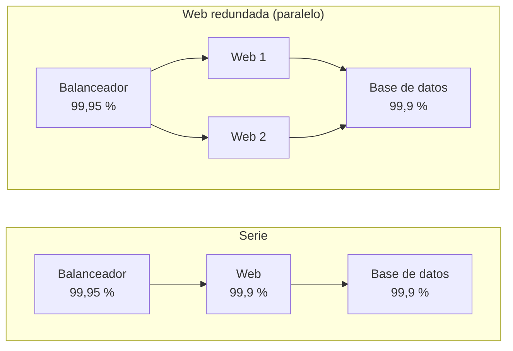
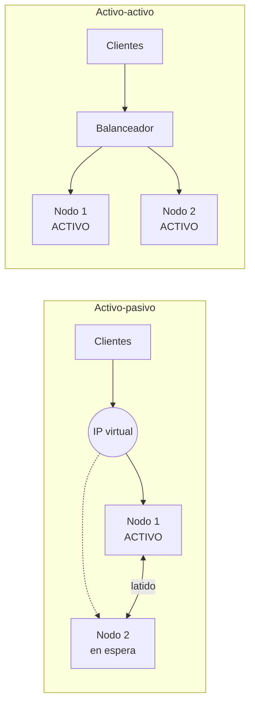
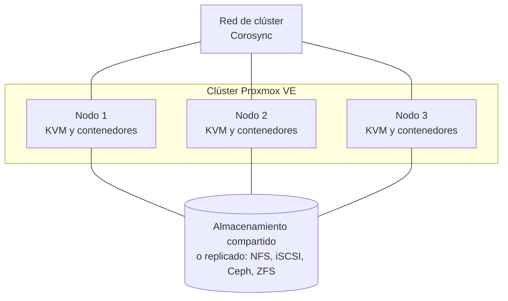

# UD07 · Alta disponibilidad, virtualización y continuidad de negocio

## Resumen del tema

A las 9:00 de un lunes la web de citas de una clínica deja de responder. Cada hora parada supone citas perdidas, pacientes que llaman por teléfono, recepción desbordada y, a veces, sanciones contractuales. Lo grave no es que algo falle (**todo acaba fallando**: discos, fuentes de alimentación, cables, actualizaciones, errores humanos), sino que **un único fallo detenga el servicio completo**.

La **alta disponibilidad** (HA, *High Availability*) es el conjunto de técnicas de diseño que permite que un servicio siga prestándose, con una interrupción mínima o nula, cuando un componente falla. No consiste en evitar los fallos, sino en **diseñar el sistema para que los fallos no se noten** (o se noten muy poco). Cuando el fallo es tan grave que ninguna redundancia local lo absorbe (un incendio, un *ransomware*, la pérdida del centro de datos), entra en juego la **continuidad de negocio**: planes, procedimientos y un centro de respaldo para recuperar la actividad en un plazo asumible.

En esta unidad cierras el círculo del módulo. En la [UD2](/ud02-seguridad-pasiva/ud02-teoria/) viste cómo proteger los datos con RAID y copias de seguridad; en la [UD4](/ud04/ud04-teoria/) cómo fortificar un servidor; en la [UD6](/ud06-seguridad-perimetral/ud06-teoria/) cómo publicar servicios detrás de un cortafuegos y un *proxy* inverso. Aquí aprenderás a que **el servicio sobreviva** cuando un servidor, un disco, una red o un centro de datos entero se caen, y a **demostrarlo con una prueba de fallo**.



### Planificación de la unidad

| Bloque | Horas |
|---|---|
| Teoría | 7 h |
| Prácticas | 9 h |
| Evaluación | 2 h |
| **Total** | **18 h** |

| Apartado de la teoría | Horas |
|---|---|
| 1. Introducción y objetivos | 0,25 |
| 2. Conceptos fundamentales: disponibilidad, SLA, SPOF, RTO y RPO | 0,75 |
| 3. Configuraciones de alta disponibilidad y escalabilidad | 0,5 |
| 4. Redundancia de hardware y de red | 0,5 |
| 5. Virtualización y alta disponibilidad | 0,75 |
| 6. Servidores redundantes y *failover*: VRRP, Keepalived, Pacemaker y Corosync | 1 |
| 7. Balanceo de carga con HAProxy | 0,75 |
| 8. Almacenamiento redundante y replicación de datos | 0,75 |
| 9. Monitorización de la disponibilidad | 0,5 |
| 10. Alta disponibilidad en la nube | 0,25 |
| 11. Continuidad de negocio y recuperación ante desastres | 0,75 |
| 12. Arquitectura de referencia | 0,25 |
| **Total teoría** | **7** |

### Objetivos de aprendizaje

Al terminar esta unidad serás capaz de:

- Calcular la **disponibilidad** de un sistema y traducirla a tiempo de parada anual, distinguiendo SLA, SLO y SLI.
- Identificar **puntos únicos de fallo** (SPOF) en una infraestructura y proponer medidas proporcionadas a su coste e impacto.
- Definir el **RTO** y el **RPO** de un servicio y relacionarlos con la solución técnica elegida.
- Comparar configuraciones **activo-pasivo y activo-activo** y soluciones de **escalado** para una demanda creciente.
- Describir las soluciones **hardware** de continuidad: alimentación, RAID y redundancia de red.
- Valorar la **virtualización** (hipervisores, Proxmox VE, contenedores) como herramienta de alta disponibilidad.
- Implantar un **servidor redundante** con IP virtual (VRRP y Keepalived) y un **balanceador de carga** (HAProxy) con comprobaciones de salud.
- Explicar cómo un *clúster* Pacemaker/Corosync usa el **quórum** y el *fencing* para evitar el cerebro dividido.
- Elegir un sistema de **almacenamiento redundante** (iSCSI, NFS, DRBD, Ceph) y configurar la **replicación** de una base de datos, distinguiéndola de la copia de seguridad.
- **Monitorizar** la disponibilidad y definir alertas útiles.
- Evaluar la alta disponibilidad en la **nube** y elaborar un plan de **continuidad de negocio** (BIA, BCP, DRP).
- Documentar una solución, **provocar el fallo** y comprobar la recuperación midiendo la interrupción.

---

## 1. Introducción y objetivos

### 1.1 El coste de la indisponibilidad

Una parada no cuesta solo lo que se deja de vender. Se suman costes directos (ingresos perdidos, horas de personal que no puede trabajar), costes de recuperación (horas extra, repuestos, consultores), costes contractuales (penalizaciones del SLA) y costes de reputación (pacientes o clientes que no vuelven). Por eso toda decisión de alta disponibilidad empieza con una pregunta de negocio: **¿cuánto cuesta una hora de parada de este servicio?** La respuesta determina cuánto es razonable invertir en evitarla.



### 1.2 Alta disponibilidad, tolerancia a fallos y recuperación ante desastres

Estos tres conceptos se confunden a menudo. Se diferencian por **cuánto dura la interrupción** y **qué fallo absorben**:

| Concepto | Qué garantiza | Interrupción típica | Ejemplo |
|---|---|---|---|
| **Tolerancia a fallos** | El sistema sigue funcionando **sin interrupción perceptible** ante un fallo | Ninguna | RAID 1, fuentes de alimentación dobles |
| **Alta disponibilidad** | El servicio se **recupera automáticamente** en poco tiempo | Segundos o minutos | *Failover* de una IP virtual entre dos balanceadores |
| **Recuperación ante desastres (DR)** | Se **restaura el servicio en otro lugar** tras un fallo grave | Horas o días | Activar el centro de respaldo tras un incendio |
| **Continuidad de negocio (BC)** | La **organización** sigue operando, con o sin los sistemas informáticos | Según el plan | Atender las citas en papel mientras se recupera la aplicación |

La alta disponibilidad es la pieza **técnica** del problema; la continuidad de negocio es la pieza **organizativa** que la incluye (apartado 11).

### 1.3 Lo que no es alta disponibilidad

> [!WARNING]
> Tres confusiones que se pagan caras:
>
> - **RAID no es una copia de seguridad**: protege del fallo de un disco, no del borrado accidental ni del *ransomware* (UD2).
> - **La replicación no es una copia de seguridad**: un `DROP TABLE` o un cifrado malicioso se replican en milisegundos a todas las réplicas.
> - **Una instantánea de la máquina virtual no es una copia de seguridad**: vive en el mismo almacenamiento que la máquina.

---

## 2. Conceptos fundamentales

### 2.1 Disponibilidad, fiabilidad y mantenibilidad

| Concepto | Qué mide | Ejemplo |
|---|---|---|
| **Fiabilidad** | Probabilidad de que un componente funcione sin fallos durante un periodo | Un disco que dura 5 años sin fallar |
| **Disponibilidad** | Porcentaje del tiempo en que el servicio está **operativo** | Una web accesible el 99,95 % del año |
| **Mantenibilidad** | Facilidad y rapidez para reparar | Cambiar un disco en caliente en 10 minutos |

Son cosas distintas: un sistema poco fiable (falla a menudo) puede tener buena disponibilidad si se repara en segundos y está redundado.

### 2.2 MTBF, MTTR y la fórmula de la disponibilidad

- **MTBF** (*Mean Time Between Failures*): tiempo medio **entre** fallos. Mide la fiabilidad.
- **MTTR** (*Mean Time To Repair/Recover*): tiempo medio **de reparación o recuperación**. Mide la rapidez de la respuesta.

$$
D = \frac{MTBF}{MTBF + MTTR}
$$

Para mejorar la disponibilidad hay dos caminos: **aumentar el MTBF** (mejor hardware, redundancia interna, mantenimiento preventivo) o **reducir el MTTR** (automatizar la conmutación, tener repuestos, monitorizar para detectar antes). En la alta disponibilidad moderna casi siempre se actúa sobre el MTTR: una conmutación automática lo reduce de horas a segundos.

> [!NOTE]
> **Ejemplo.** Un servidor con MTBF = 8 760 h (un fallo al año) y MTTR = 4 h: D = 8760 / 8764 = **99,954 %**, unas 4 horas de parada anuales. Si una conmutación automática reduce el MTTR a 30 segundos, la parada anual baja a unos 30 segundos.

### 2.3 Los «nueves»

La disponibilidad se expresa en «nueves». Cada nueve adicional **reduce diez veces** la parada admisible y **multiplica el coste** de la solución:

| Disponibilidad | Parada anual | Parada mensual (aprox.) | Típico de |
|---|---|---|---|
| 99 % («dos nueves») | 3,65 días | 7,2 horas | Servicios internos no críticos |
| 99,9 % («tres nueves») | 8,76 horas | 43,8 minutos | Aplicaciones de empresa |
| 99,99 % («cuatro nueves») | 52,6 minutos | 4,4 minutos | Servicios críticos, comercio electrónico |
| 99,999 % («cinco nueves») | 5,26 minutos | 26 segundos | Telecomunicaciones, sanidad crítica |

> [!TIP]
> **Memoriza tres cifras:** 99 % son 3,65 días de parada al año; 99,9 %, 8,76 horas; 99,99 %, 52,6 minutos. No pidas 99,999 % si el negocio solo necesita 99,9 %: cada nueve más se paga con más servidores, más personal y más complejidad.

### 2.4 SLA, SLO y SLI

| Sigla | Significado | Qué es |
|---|---|---|
| **SLI** (*Service Level Indicator*) | Indicador | La medida real: «el 99,93 % de las peticiones respondieron correctamente en menos de 500 ms» |
| **SLO** (*Service Level Objective*) | Objetivo | La meta interna: «≥ 99,9 % de disponibilidad mensual» |
| **SLA** (*Service Level Agreement*) | Acuerdo | El **contrato** con el cliente, con penalizaciones si no se cumple |

Un SLA bien redactado indica **qué se mide** (por ejemplo, respuesta HTTP 200 a una comprobación desde el exterior), **cómo** y **en qué periodo**, y qué se **excluye** (mantenimientos programados, causas de fuerza mayor). El SLO interno suele ser más exigente que el SLA, para tener margen antes de incumplir el contrato.

### 2.5 Disponibilidad de varios componentes: serie y paralelo

Un servicio depende de varios componentes. La forma de conectarlos determina la disponibilidad total:

- **En serie** (todos son necesarios): $D = D_1 \times D_2 \times \dots \times D_n$. La disponibilidad **empeora** con cada componente añadido.
- **En paralelo** (basta con uno): $D = 1 - (1-D_1)(1-D_2)\cdots(1-D_n)$. La disponibilidad **mejora** con cada réplica.



Un *script* en Python para calcularlo (guárdalo como `disp.py`; solo necesita Python 3, que viene en Debian 13):

```python
#!/usr/bin/env python3
"""Calculadora de disponibilidad (UD7). Requiere solo Python 3 (sin paquetes externos)."""
import argparse

HORAS_ANIO = 8760  # año de 365 días


def disponibilidad(mtbf, mttr):
    """D = MTBF / (MTBF + MTTR); ambos en las mismas unidades (horas)."""
    return mtbf / (mtbf + mttr)


def serie(*ds):
    """Todos los componentes son necesarios: se multiplican."""
    r = 1.0
    for d in ds:
        r *= d
    return r


def paralelo(*ds):
    """Basta con uno: falla solo si fallan todos a la vez."""
    f = 1.0
    for d in ds:
        f *= (1 - d)
    return 1 - f


def parada_anual(d):
    """Minutos de parada al año para una disponibilidad d (entre 0 y 1)."""
    return (1 - d) * HORAS_ANIO * 60


def formato(minutos):
    if minutos >= 60:
        return f"{minutos / 60:.2f} h"
    if minutos >= 1:
        return f"{minutos:.2f} min"
    return f"{minutos * 60:.1f} s"


def informe(titulo, d):
    print(f"{titulo:<28} = {d * 100:.4f} %  ->  {formato(parada_anual(d))} de parada al año")


def demo():
    web, bd, lb = 0.999, 0.999, 0.9995
    informe("Serie (lb, web, bd)", serie(lb, web, bd))
    w2 = paralelo(web, web)
    print(f"{'Dos web en paralelo':<28} = {w2 * 100:.5f} %")
    informe("Cadena con 2 web", serie(lb, w2, bd))


if __name__ == "__main__":
    ap = argparse.ArgumentParser(description="Cálculo de disponibilidad")
    sub = ap.add_subparsers(dest="cmd")
    for nombre, ayuda in (("serie", "componentes en serie"), ("paralelo", "componentes en paralelo")):
        s = sub.add_parser(nombre, help=ayuda)
        s.add_argument("porcentajes", nargs="+", type=float, help="disponibilidad de cada componente, en %%")
    m = sub.add_parser("mtbf", help="D a partir de MTBF y MTTR (en horas)")
    m.add_argument("mtbf", type=float)
    m.add_argument("mttr", type=float)
    a = ap.parse_args()
    if a.cmd in ("serie", "paralelo"):
        ds = [p / 100 for p in a.porcentajes]
        informe(a.cmd.capitalize(), serie(*ds) if a.cmd == "serie" else paralelo(*ds))
    elif a.cmd == "mtbf":
        informe("MTBF/MTTR", disponibilidad(a.mtbf, a.mttr))
    else:
        demo()
```

```bash
python3 disp.py                       # demostración con tres componentes
python3 disp.py serie 99.9 99.9 99.5  # tres componentes en serie (porcentajes)
python3 disp.py paralelo 99.5 99.5    # dos servidores en paralelo
python3 disp.py mtbf 8760 4           # disponibilidad con MTBF y MTTR en horas
```

Salida esperada de la demostración (`python3 disp.py`):

```text
Serie (lb, web, bd)          = 99.7502 %  ->  21.88 h de parada al año
Dos web en paralelo          = 99.99990 %
Cadena con 2 web             = 99.8500 %  ->  13.14 h de parada al año
```

**Lección importante:** duplicar el servidor web mejora solo de 99,75 % a 99,85 %. El **eslabón más débil** (la base de datos y el balanceador, que siguen siendo únicos) limita el resultado. No sirve de nada redundar un componente si otro sigue siendo un SPOF.

> [!WARNING]
> **Disponibilidad en serie = multiplicar.** Si una aplicación depende de 3 componentes con 99,9 % cada uno, la disponibilidad total es 0,999³ ≈ 99,7 %: **peor** que la de cualquiera de ellos. Por eso la redundancia se aplica **en paralelo en cada capa**.

> [!NOTE]
> Estas fórmulas suponen que los fallos son **independientes**. Si dos servidores comparten la misma fuente de alimentación, el mismo *switch* o el mismo anfitrión de virtualización, un único fallo los tumba a la vez y el cálculo en paralelo es demasiado optimista. Esos recursos compartidos se llaman **fallos de causa común**.

{}
**Tienes dos servidores web detrás de un solo balanceador HAProxy. ¿Cuál es el punto único de fallo?**

El balanceador. Si cae, los dos servidores web dejan de ser accesibles aunque estén sanos. Se corrige con un segundo balanceador y una IP virtual (Keepalived/VRRP).
{}

### 2.6 Punto único de fallo (SPOF)

Un **SPOF** (*Single Point of Failure*) es un componente cuyo fallo detiene todo el servicio. Se detectan recorriendo la cadena de dependencias de punta a punta y preguntando en cada eslabón: **«si esto falla, ¿qué ocurre?»**.

| Capa | Posibles SPOF | Medida |
|---|---|---|
| Energía | Una única fuente de alimentación, un único SAI | Doble fuente y dos SAI o generador |
| Red | Un único *switch*, router, cable o proveedor | Doble enlace, *bonding*, VRRP, doble proveedor |
| Servidor | Una única máquina | *Clúster*, balanceo, virtualización con HA |
| Almacenamiento | Un único disco o cabina | RAID, replicación, almacenamiento distribuido |
| Datos | Una sola copia de la base de datos | Replicación y copias de seguridad |
| Aplicación | Un solo balanceador, un solo DNS | Pareja de balanceadores con IP virtual, DNS secundario |
| Personas | Solo un administrador conoce el sistema | Documentación, formación, guardias |
| Ubicación | Un único centro de datos | Sitio secundario (recuperación ante desastres) |

> [!IMPORTANT]
> La redundancia debe aplicarse con **proporcionalidad**: un SPOF solo se elimina si el coste de la parada que provoca supera el coste de la medida. Esa decisión se **documenta**, incluidos los SPOF que se aceptan (criterio RA6.i).

### 2.7 Redundancia: modelos N+1, N+M y 2N

**Redundancia** es disponer de más componentes de los estrictamente necesarios. Los modelos habituales son:

| Modelo | Funcionamiento | Ventaja | Inconveniente |
|---|---|---|---|
| **N+1** | N componentes necesarios más 1 de reserva | Coste moderado | Solo tolera un fallo a la vez |
| **N+M** | M reservas para N componentes | Tolera M fallos | Más coste |
| **2N** | Duplicado completo e independiente | Muy robusto | El doble de coste |

### 2.8 RTO y RPO

Son los dos parámetros que **dimensionan** la solución:

- **RTO** (*Recovery Time Objective*): **cuánto tiempo** puede estar parado el servicio como máximo.
- **RPO** (*Recovery Point Objective*): **cuántos datos** (medidos en tiempo) se pueden perder como máximo.


| Servicio | RPO | RTO | Solución típica |
|---|---|---|---|
| Base de datos de pedidos o citas | ≈ 0 | Minutos | Replicación síncrona o semisíncrona y conmutación automática |
| Web corporativa (contenido estático) | 24 h | 1 h | Copia diaria y servidor de reserva |
| Servidor de ficheros | 4 h | 4 h | Copias frecuentes y restauración |
| Entorno de desarrollo | 7 días | 3 días | Copia semanal |

> [!NOTE]
> Un RPO bajo se consigue **replicando** los datos con frecuencia; un RTO bajo, **automatizando la conmutación**. Cuanto más bajos, más caro. La UD2 (copias de seguridad) y la UD7 (HA) se complementan: la HA protege contra el fallo de un componente; la copia protege contra el borrado, la corrupción o el *ransomware*. Una buena práctica es **medir** el RTO y el RPO reales con una prueba de fallo y compararlos con los objetivos.

---

## 3. Configuraciones de alta disponibilidad y escalabilidad

### 3.1 Activo-pasivo y activo-activo

Existen dos formas de organizar nodos redundantes. En **activo-pasivo** (*active-passive* o *failover*), un nodo presta el servicio y el otro espera; cuando el activo falla, el pasivo toma el relevo. En **activo-activo** (*active-active*), todos los nodos atienden peticiones a la vez y, si uno cae, los demás absorben su carga.



| Criterio | Activo-pasivo | Activo-activo |
|---|---|---|
| Aprovechamiento del hardware | Bajo: el nodo pasivo está ocioso | Alto: todos trabajan |
| Complejidad | Menor: un solo nodo escribe en los datos | Mayor: hay que gestionar el estado compartido o replicado |
| Efecto de un fallo | Corte breve durante la conmutación | Se pierde capacidad, pero el servicio no se corta si los demás aguantan la carga |
| Riesgo de saturación | Ninguno: el pasivo tiene la misma capacidad | **Real**: si cada nodo trabaja al 70 %, al caer uno el otro queda al 140 % |
| Ejemplo | Pacemaker con IP virtual y base de datos | HAProxy delante de dos servidores web |
| Casos típicos | Bases de datos, servicios con estado, balanceadores | Servidores web y de aplicaciones sin estado |

> [!IMPORTANT]
> En activo-activo con **N** nodos, calcula siempre la capacidad **tras** perder uno (N+1): si el sistema necesita 2 servidores para atender la carga pico, despliega 3. Una arquitectura activo-activo sin margen es una caída en cascada esperando a ocurrir.

Dentro del activo-pasivo se distinguen tres niveles de preparación del nodo de reserva: **caliente** (*hot standby*, encendido, sincronizado y listo en segundos), **templado** (*warm standby*, encendido pero con datos algo desfasados) y **frío** (*cold standby*, apagado o sin configurar; hay que arrancarlo y restaurar). A mayor preparación, menor RTO y mayor coste. Los mismos términos se aplican a los centros de respaldo (apartado 11).

Dos conceptos acompañan a la conmutación:

- ***Failover***: el paso del servicio al nodo de reserva cuando el principal falla.
- ***Failback***: la vuelta al nodo original una vez reparado. No siempre conviene hacerlo de forma automática: volver supone un segundo corte y puede reintroducir un nodo con datos desfasados. Muchas soluciones permiten desactivarlo (`nopreempt` en Keepalived, *stickiness* en Pacemaker).

### 3.2 El estado: lo que hace difícil la alta disponibilidad

Redundar un servidor web es fácil porque, bien diseñado, **no guarda nada importante**: el código está en todos los nodos y los datos están en la base de datos. Lo difícil es el **estado**:

- **Sesiones de usuario** guardadas en la memoria del servidor: si el balanceador cambia al usuario de nodo, «pierde el *login*». Se resuelve con persistencia por *cookie* en el balanceador o, mejor, con aplicaciones **sin estado** (*stateless*) que guardan la sesión en un almacén compartido (Redis, base de datos).
- **Ficheros subidos por los usuarios**: hay que guardarlos en almacenamiento compartido (NFS, almacenamiento de objetos) o sincronizarlos.
- **Datos de la base de datos**: requieren replicación (apartado 8).

Por eso las arquitecturas modernas separan **capa de aplicación sin estado** (fácil de multiplicar) y **capa de datos con estado** (difícil de replicar y donde se concentra el riesgo).

### 3.3 Escalado vertical y horizontal: soluciones para una demanda creciente

La alta disponibilidad y la **escalabilidad** (criterio RA6.h) se diseñan juntas, porque ambas se resuelven con más componentes:

| Estrategia | Qué hace | Ventajas | Límites |
|---|---|---|---|
| **Escalado vertical** (*scale up*) | Más CPU, memoria o disco en la **misma** máquina | Sencillo; no cambia la aplicación | Tiene techo, exige parada y sigue siendo un SPOF |
| **Escalado horizontal** (*scale out*) | **Más máquinas** detrás de un balanceador | Sin techo práctico; mejora además la disponibilidad | Exige aplicaciones sin estado y datos replicados |

Ante una demanda creciente, el orden habitual de soluciones es:

1. **Medir** (monitorización y pruebas de carga) para saber dónde está el cuello de botella.
2. **Optimizar** la aplicación y la base de datos (índices, consultas).
3. Añadir **caché** (de página, de objetos con Redis o Memcached, y un *proxy* inverso con caché como el de la UD6).
4. Escalar **horizontalmente** la capa web detrás del balanceador.
5. Separar **lecturas y escrituras** en la base de datos (réplicas de solo lectura, apartado 8.5).
6. Mover contenido estático a una **red de distribución de contenidos** (CDN) o a almacenamiento de objetos.
7. **Particionar** los datos (*sharding*) o dividir la aplicación en servicios, solo cuando lo anterior no basta.
8. En la nube, **autoescalado** según la carga (apartado 10).

### 3.4 Contenedores y escalado horizontal

Los contenedores (Docker, LXC) permiten crear réplicas idénticas en segundos, lo que facilita el escalado horizontal. Un contenedor es un proceso aislado que comparte el núcleo del anfitrión y arranca desde una **imagen** inmutable; por eso sirve para servicios **sin estado**. Los datos persistentes se guardan en volúmenes o servicios externos.

Ejemplo mínimo con **Docker Compose**: tres réplicas de un servidor web detrás de HAProxy (requiere Docker Engine con el plugin `compose`; ver [entorno](/guia/entorno/)). Crea un directorio con estos tres ficheros:

```yaml
# compose.yaml
services:
  web:
    image: nginx:stable-alpine
    volumes:
      - ./index.html:/usr/share/nginx/html/index.html:ro
  lb:
    image: haproxy:lts-alpine
    ports:
      - "8080:80"
    volumes:
      - ./haproxy.cfg:/usr/local/etc/haproxy/haproxy.cfg:ro
    depends_on:
      - web
```

```text
# haproxy.cfg: usa el DNS interno de Docker para descubrir las réplicas
global
    log stdout format raw local0
defaults
    mode http
    timeout connect 5s
    timeout client  30s
    timeout server  30s
resolvers docker
    nameserver dns 127.0.0.11:53
    hold valid 5s
frontend fe
    bind *:80
    default_backend be
backend be
    balance roundrobin
    server-template web 3 web:80 check resolvers docker init-addr none
```

```bash
echo "<h1>Servidor web escalable</h1>" > index.html
docker compose up -d --scale web=3                  # lanza 3 réplicas del servicio web
docker compose ps                                   # deben aparecer 3 contenedores web y el balanceador
curl -s http://localhost:8080/                      # responde alguna de las réplicas
docker stop $(docker compose ps -q web | head -1)   # simula la caída de una réplica
curl -s http://localhost:8080/                      # el servicio sigue respondiendo
docker compose down                                 # limpieza
```

`--scale web=3` crea tres contenedores del servicio `web`; `server-template` genera tres servidores a partir del nombre DNS `web`; `check` activa la comprobación de salud, de modo que HAProxy deja de enviar tráfico a la réplica detenida. Para orquestar contenedores en varios servidores con reinicio automático y autoescalado se usan orquestadores (Kubernetes, Docker Swarm), que quedan fuera de esta unidad.

### 3.5 Pruebas de carga

Antes de afirmar que una solución aguanta, se **mide**. `ab` (*ApacheBench*, paquete `apache2-utils`) es suficiente en clase:

```bash
sudo apt install -y apache2-utils           # Debian/Ubuntu. AlmaLinux: sudo dnf install -y httpd-tools
ab -n 2000 -c 20 http://172.16.10.20/       # 2000 peticiones, 20 simultáneas, contra la IP virtual
```

Fíjate en `Requests per second` (rendimiento), `Time per request` (latencia) y `Failed requests` (errores). Lanza la prueba **mientras** provocas el fallo de un nodo: así mides el efecto real de un fallo bajo carga. `ab` es antiguo y simple; herramientas más modernas como `k6` o `wrk` permiten escenarios más realistas, pero el procedimiento es el mismo.

> [!CAUTION]
> Lanza pruebas de carga **solo contra tus propios servicios** de laboratorio. Una prueba de carga contra un tercero es, a efectos prácticos, un ataque de denegación de servicio.

---

## 4. Redundancia de hardware y de red

El criterio RA6.b pide identificar las **soluciones hardware** que aseguran la continuidad. Las de alimentación, almacenamiento y centro de datos se estudiaron en la [UD2](/ud02-seguridad-pasiva/ud02-teoria/); aquí se resumen desde el punto de vista de la alta disponibilidad y se desarrolla la **redundancia de red**.

### 4.1 Alimentación

- **Fuentes de alimentación redundantes** (en servidores): si una falla, la otra mantiene el equipo. Cada fuente se conecta a un **circuito o regleta distinto**; si ambas cuelgan del mismo enchufe, la redundancia es solo aparente.
- **SAI** (UPS): mantiene la energía unos minutos y permite un apagado ordenado. Se monitoriza con **NUT** (*Network UPS Tools*) para apagar los servidores automáticamente (UD2).
- **Generador** para cortes largos en centros de datos, y doble acometida eléctrica en los más exigentes.

### 4.2 Almacenamiento: RAID y discos de repuesto

**RAID** combina varios discos para ganar rendimiento o tolerancia a fallos de disco. Resumen (detalle en la UD2):

| Nivel | Discos mínimos | Tolera | Capacidad útil | Uso |
|---|---|---|---|---|
| RAID 0 | 2 | **Nada** (solo velocidad) | 100 % | Datos temporales |
| RAID 1 | 2 | 1 disco | 50 % | Sistema, bases de datos pequeñas |
| RAID 5 | 3 | 1 disco | (n−1)/n | Ficheros, equilibrio |
| RAID 6 | 4 | 2 discos | (n−2)/n | Discos grandes, más seguridad |
| RAID 10 | 4 | 1 por pareja | 50 % | Bases de datos, alto rendimiento |

Otras medidas hardware: **discos *hot-spare*** que sustituyen automáticamente al que falla, **discos intercambiables en caliente** (*hot-swap*), controladoras con caché protegida por batería, **doble controladora** en las cabinas de almacenamiento y **doble ruta** (*multipath*) entre servidor y cabina.

> [!WARNING]
> **RAID no es una copia de seguridad.** Protege del fallo de un disco, pero **no** del borrado accidental, de un virus que cifre los ficheros, de la corrupción lógica ni de un incendio: todos esos errores se replican al instante en los discos espejo. Lo comprobarás en la [Práctica 7.1](/ud07-alta-disponibilidad/ud07-practicas/#práctica-71--disponibilidad-spof-y-raid-1).

### 4.3 Redundancia de red: *bonding*

Una máquina con una sola tarjeta de red tiene un SPOF en la tarjeta, el cable y el puerto del *switch*. El **bonding** (agregación de enlaces) une varias interfaces físicas en una **interfaz lógica**:

| Modo | Nombre | Comportamiento | Requiere configurar el *switch* |
|---|---|---|---|
| 1 | `active-backup` | Una interfaz activa, otra en reserva | No |
| 2 | `balance-xor` | Reparto por *hash* | Depende |
| 4 | `802.3ad` (LACP) | Agregación dinámica estándar | **Sí** (LACP) |
| 6 | `balance-alb` | Balanceo adaptativo | No |

Configuración con **systemd-networkd** (ficheros en `/etc/systemd/network/`), válida para un modo `active-backup` en cualquier distribución con systemd. Debian 13 de instalación mínima usa `ifupdown` por defecto: para usar este método, retira de `/etc/network/interfaces` las interfaces implicadas y habilita el servicio con `sudo systemctl enable --now systemd-networkd`.

```ini
# /etc/systemd/network/10-bond0.netdev: define la interfaz lógica
[NetDev]
Name=bond0
Kind=bond

[Bond]
Mode=active-backup
MIIMonitorSec=100ms        # comprueba el estado del enlace cada 100 ms
```

```ini
# /etc/systemd/network/20-eth-bond.network: asocia las dos tarjetas físicas al bond
[Match]
Name=enp0s8 enp0s9

[Network]
Bond=bond0
```

```ini
# /etc/systemd/network/30-bond0.network: direccionamiento de la interfaz lógica
[Match]
Name=bond0

[Network]
Address=172.16.10.55/24
Gateway=172.16.10.1
```

En sistemas con **NetworkManager** (AlmaLinux, Ubuntu de escritorio) es equivalente con `nmcli`:

```bash
sudo nmcli con add type bond con-name bond0 ifname bond0 bond.options "mode=active-backup,miimon=100"
sudo nmcli con add type ethernet slave-type bond con-name bond0-p1 ifname enp0s8 master bond0
sudo nmcli con add type ethernet slave-type bond con-name bond0-p2 ifname enp0s9 master bond0
sudo nmcli con mod bond0 ipv4.method manual ipv4.addresses 172.16.10.55/24
sudo nmcli con up bond0
```

Comprobación y **prueba de fallo**:

```bash
cat /proc/net/bonding/bond0              # modo y "Currently Active Slave" (interfaz activa)
ping -i 0.2 172.16.10.1 &                # tráfico continuo durante la prueba
sudo ip link set enp0s8 down             # simula que se desconecta el cable principal
cat /proc/net/bonding/bond0              # la interfaz activa cambia a enp0s9; el ping apenas pierde paquetes
sudo ip link set enp0s8 up               # restablece el enlace
```

`ip link set ... down` desactiva una interfaz sin tocar el cable, y es la forma habitual de simular el fallo en un laboratorio. La redundancia de red se completa con **dos *switches*** (cada tarjeta del *bond* en uno distinto, lo que exige LACP multichasis o `active-backup`), **dos routers** con VRRP (apartado 6.1) y, en entornos críticos, **dos proveedores de acceso** (*multihoming*).

---

## 5. Virtualización y alta disponibilidad

### 5.1 Por qué ayuda la virtualización

Al virtualizar, el «servidor» deja de ser un equipo físico para ser un **conjunto de ficheros** (los discos y la configuración de la máquina virtual) que cualquier anfitrión compatible puede ejecutar. Eso aporta:

- **Instantáneas** (*snapshots*): volver a un estado anterior en segundos (no sustituyen a la copia de seguridad).
- **Clonado y plantillas**: recrear servidores rápidamente, lo que reduce el MTTR.
- **Migración en vivo**: mover una máquina encendida de un anfitrión a otro sin cortar el servicio, para hacer mantenimiento sin parada.
- **HA de máquinas virtuales**: si cae el anfitrión, otro nodo **arranca la máquina automáticamente**.
- **Consolidación y aislamiento**: varios servicios en un mismo hardware sin interferir.
- **Entornos de prueba**: réplicas del entorno de producción, redes aisladas y *snapshots* permiten **simular fallos** sin riesgo, que es justo lo que haces en las prácticas.

> [!WARNING]
> Virtualizar **concentra** el riesgo: si 20 máquinas viven en un único anfitrión, ese anfitrión es el SPOF de las 20. Dos balanceadores virtuales en el mismo servidor físico no son redundantes frente al fallo de ese servidor. La virtualización exige un *clúster* de anfitriones y almacenamiento compartido o replicado.

### 5.2 Hipervisores de tipo 1 y de tipo 2

| Tipo | Dónde se ejecuta | Ejemplos | Uso |
|---|---|---|---|
| **Tipo 1** (*bare metal*) | Directamente sobre el hardware | Proxmox VE (KVM), VMware ESXi, Hyper-V, Xen | Producción y centros de datos |
| **Tipo 2** (*hosted*) | Como aplicación sobre un sistema operativo | VirtualBox, VMware Workstation | Escritorio y laboratorio |

**KVM** (*Kernel-based Virtual Machine*) es el módulo del núcleo Linux que convierte el sistema en hipervisor; **QEMU** emula el resto del hardware. Juntos son la base de Proxmox VE y de la mayoría de nubes. Es **software libre**, está muy presente en entornos profesionales y permite construir laboratorios completos en el aula, por lo que es la tecnología de referencia de la unidad.

### 5.3 Proxmox VE

**Proxmox VE** (versión 9.x, basada en Debian 13) es una plataforma libre de virtualización que combina **KVM** (máquinas virtuales completas) y **LXC** (contenedores de sistema), con interfaz web, *clúster*, copias de seguridad, almacenamiento Ceph y ZFS y un gestor de alta disponibilidad integrado. Usa **Corosync** para la comunicación entre nodos y el quórum.

| Concepto | Descripción |
|---|---|
| **Nodo** | Servidor físico (o virtual, en laboratorio) con Proxmox VE |
| **Clúster** | Conjunto de nodos que se administran juntos; necesita **quórum** |
| **HA Manager** | Servicio que reinicia en otro nodo los recursos HA si su nodo falla |
| **Reglas de afinidad de HA** | Indican en qué nodos prefiere ejecutarse un recurso (afinidad de nodo) o qué recursos deben estar juntos o separados (afinidad de recursos). En Proxmox VE 9 sustituyen a los antiguos *grupos HA* |
| **Watchdog** | Mecanismo que **reinicia un nodo** que ha perdido el quórum; hace de *fencing* |
| **QDevice** | Tercer voto externo para clústeres de dos nodos |



Para que una máquina pueda arrancar en otro nodo, **sus discos deben ser accesibles desde él**: almacenamiento compartido (NFS, iSCSI, Ceph) o **replicado** (ZFS con replicación periódica, con un RPO de minutos). Los comandos básicos, ejecutados como `root` en un nodo Proxmox:

```bash
pvecm create labsad                      # crea el clúster "labsad" en el primer nodo
pvecm add 10.10.10.101                   # en los otros nodos: se unen indicando la IP del primero
pvecm status                             # nodos, votos y quórum ("Quorate: Yes")
ha-manager add vm:100 --state started    # registra la máquina 100 como recurso de alta disponibilidad
ha-manager status                        # estado del gestor y de los recursos HA
qm migrate 100 pve2 --online             # migración en vivo de la VM 100 al nodo pve2
```

`pvecm` administra el clúster (Proxmox VE Cluster Manager), `ha-manager` el gestor de HA y `qm` las máquinas virtuales. La migración en vivo requiere que el disco esté en almacenamiento compartido (o que se copie con `--with-local-disks`, más lento).

> [!WARNING]
> Con **dos nodos**, un clúster Proxmox pierde el quórum cuando cae uno (queda 1 voto de 2: no hay mayoría) y los recursos HA no se recuperan. Se usan **tres nodos** o un dispositivo de quórum externo (*QDevice*) como tercer voto. El quórum se explica en el apartado 6.4.

**Prueba de fallo de un nodo** (en laboratorio): con la máquina 100 en HA ejecutándose en `pve2`, apaga bruscamente `pve2` (desde VirtualBox, «Apagar la máquina»). Pasados unos minutos, `ha-manager status` mostrará que la máquina se ha reiniciado en `pve1` o `pve3`. El tiempo transcurrido hasta que responde de nuevo es tu **RTO real**; no es instantáneo porque el clúster debe asegurarse de que el nodo ha caído (*fencing*) antes de arrancar la máquina en otro sitio. A diferencia de la migración en vivo (sin corte), esto es un **reinicio** de la máquina en otro nodo.

### 5.4 Contenedores frente a máquinas virtuales

| Característica | Máquina virtual (KVM) | Contenedor (LXC, Docker) |
|---|---|---|
| Aislamiento | Fuerte: núcleo propio | Menor: comparte el núcleo del anfitrión |
| Arranque | Decenas de segundos | Segundos o menos |
| Consumo | Mayor | Mínimo |
| Migración en vivo | Sí (con almacenamiento compartido) | No en LXC: se reinicia en el otro nodo |
| Uso típico | Sistemas operativos completos, Windows | Servicios sin estado, escalado horizontal |

### 5.5 *Clústeres*: tipos y utilidad

El criterio RA6.g pide evaluar la utilidad de los *clústeres*. Un **clúster** es un conjunto de equipos que cooperan y se presentan como uno solo. Según su objetivo:

| Tipo | Objetivo | Ejemplo | Lo estudias en |
|---|---|---|---|
| **Alta disponibilidad** (*failover*) | Que el servicio sobreviva al fallo de un nodo | Pacemaker + Corosync; Proxmox HA | Apartados 5.3 y 6.4 |
| **Balanceo de carga** | Repartir peticiones y absorber más usuarios | HAProxy delante de varios servidores | Apartado 7 |
| **Alto rendimiento** (HPC) | Sumar potencia de cálculo para una tarea | Clústeres de simulación científica | Solo conceptual |
| **Almacenamiento** | Datos distribuidos y replicados | Ceph | Apartado 8.4 |

Un *clúster* aumenta la **fiabilidad** (tolera fallos) y la **productividad** (más capacidad), a cambio de **más complejidad**: más piezas que configurar, vigilar y actualizar, y nuevos modos de fallo como el cerebro dividido. Esa complejidad solo compensa cuando el coste de la parada la supera.

---


## Explora: disponibilidad y puntos únicos de fallo



---
